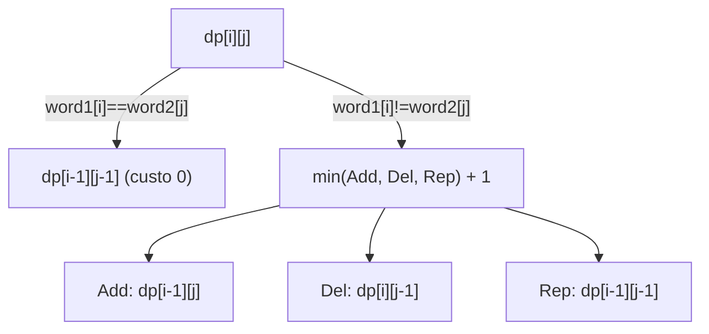
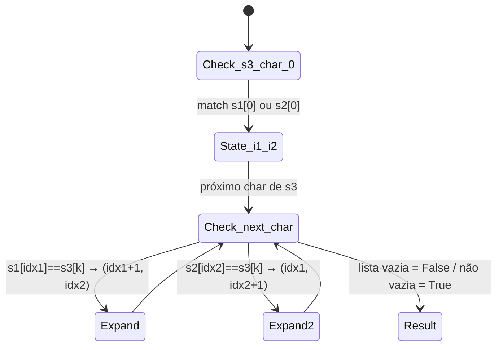
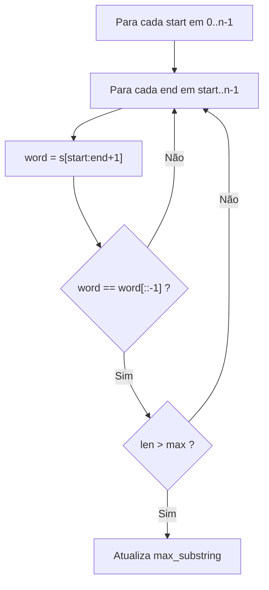
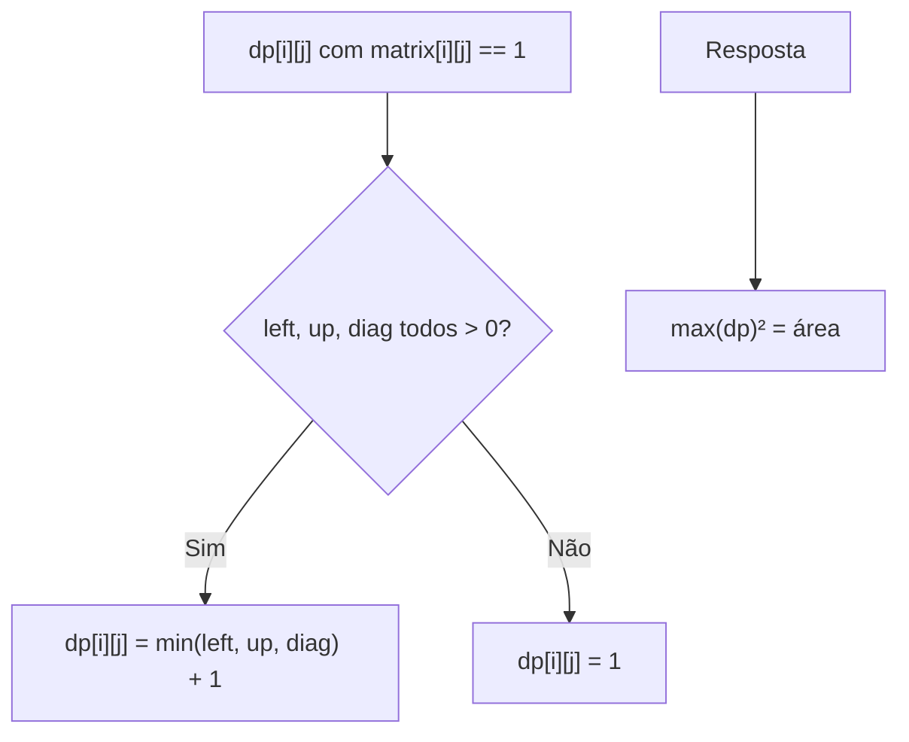
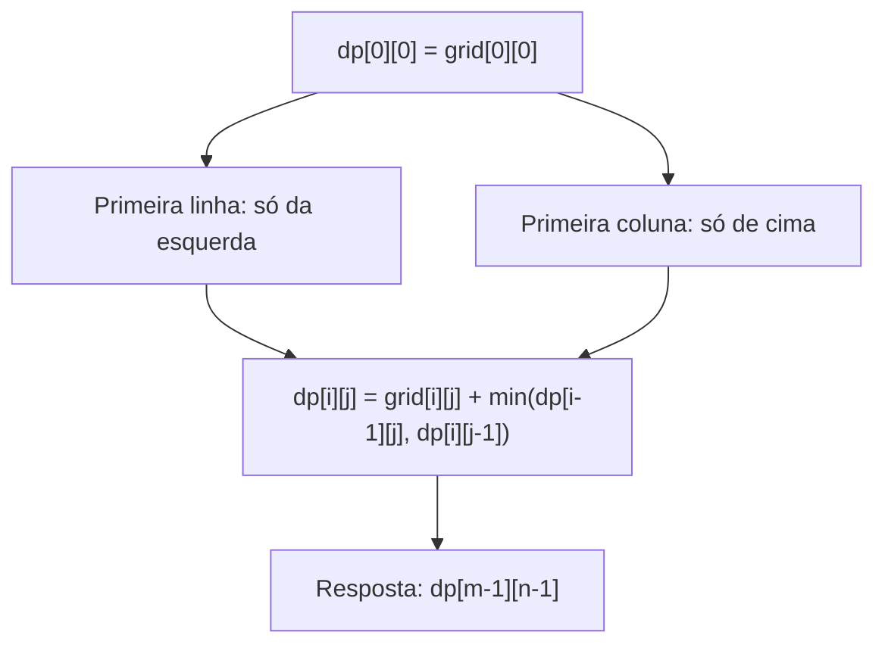
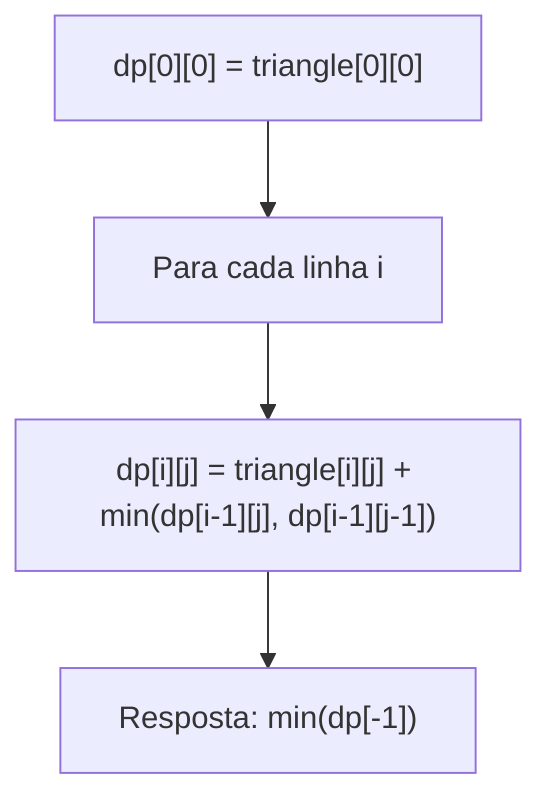
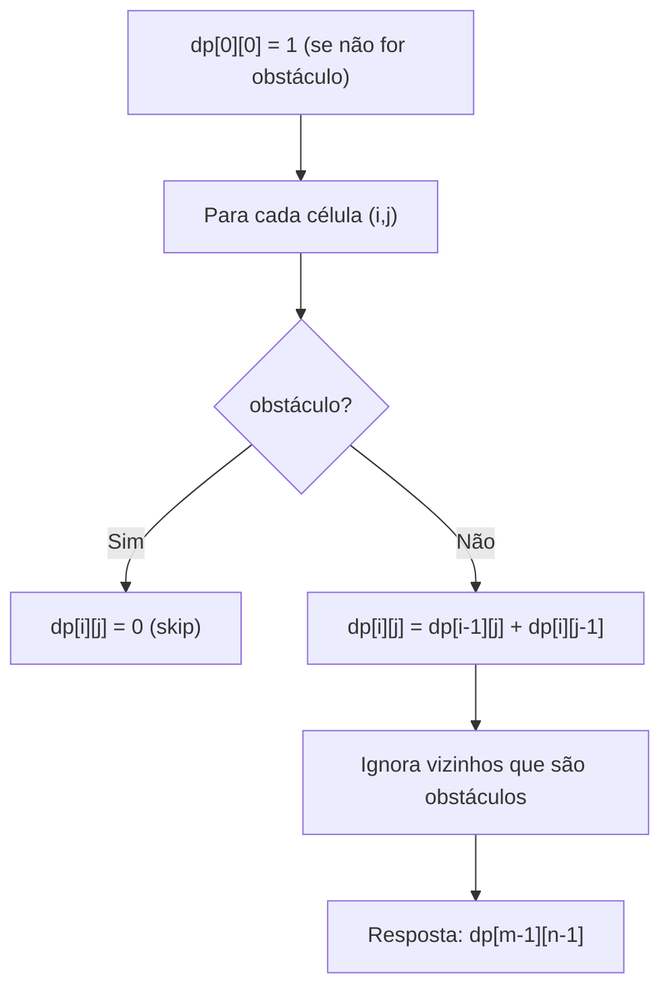

# 🧩 Cheat Sheet — 2D Dynamic Programming

---

### 📌 Edit Distance (`edit-distance.py`) — [LeetCode #72](https://leetcode.com/problems/edit-distance/) | Medium
* **Descrição breve:** Dadas duas strings `word1` e `word2`, retorne o **número mínimo de operações** necessárias para converter `word1` em `word2`. As três operações permitidas em um caractere são:
  1. **Inserir** um caractere.
  2. **Deletar** um caractere.
  3. **Substituir** um caractere por outro.

  Este é o clássico problema de **Edit Distance (Distância de Levenshtein)**, amplamente usado em spell-checkers, diff de textos e bioinformática (alinhamento de sequências de DNA).

  **Exemplo:**
  ```
  Entrada: word1 = "horse", word2 = "ros"
  Saída: 3
  Explicação: horse → rorse (substituir 'h' por 'r')
              rorse → rose  (deletar 'r')
              rose  → ros   (deletar 'e')
  ```
  ```
  Entrada: word1 = "intention", word2 = "execution"
  Saída: 5
  Explicação: intention → inention (remover 't')
              inention  → enention (substituir 'i' por 'e')
              enention  → exention (substituir 'n' por 'x')
              exention  → exection (substituir 'n' por 'c')
              exection  → execution (inserir 'u')
  ```
* **Constraints:**
  - `0 <= word1.length, word2.length <= 500`
  - `word1` e `word2` contêm apenas letras minúsculas do alfabeto inglês.
* **Tags:** `String` · `Dynamic Programming`
* **💡 Sacada (O Pulo do Gato):**
> A DP 2D compara prefixos das duas palavras. Cada célula `dp[i][j]` representa o custo mínimo para alinhar `word1[:i]` com `word2[:j]`. Se as letras são iguais, herda a diagonal (`dp[i-1][j-1]`). Senão, pega o mínimo entre adição (`dp[i-1][j]`), deleção (`dp[i][j-1]`) e substituição (`dp[i-1][j-1]`), e soma 1. A base é: transformar uma string vazia custa o comprimento da outra.
* **🧠 Modelo Mental:**

* **Complexidade esperada:** ⏱️ Tempo $O(m \times n)$ | 💾 Espaço $O(m \times n)$
* **Edge cases (Casos de Borda):** Strings vazias — se `word1` é vazia, retorna `len(word2)` e vice-versa. Strings idênticas resultam em custo 0 (sempre herda a diagonal).
* **Core snippet:**
```python
dp = [[99999 for _ in range(len(word2) + 1)] for _ in range(len(word1) + 1)]
for j in range(len(dp[0])):
    dp[0][j] = j
for i in range(len(dp)):
    dp[i][0] = i
for i in range(1, len(dp)):
    for j in range(1, len(dp[0])):
        if word1[i-1] == word2[j-1]:
            dp[i][j] = dp[i-1][j-1]
        else:
            addition = dp[i-1][j]
            deletion = dp[i][j-1]
            replace = dp[i-1][j-1]
            dp[i][j] = min(addition, deletion, replace) + 1
return dp[-1][-1]
```

---

### 📌 Interleaving String (`interleaving-string.py`) — [LeetCode #97](https://leetcode.com/problems/interleaving-string/) | Medium
* **Descrição breve:** Dadas três strings `s1`, `s2` e `s3`, determine se `s3` pode ser formada pelo **entrelaçamento (interleaving)** de `s1` e `s2`, mantendo a **ordem relativa** dos caracteres de cada uma.

  O interleaving de duas strings `s` e `t` é definido formalmente como: ambas são divididas em `n` e `m` substrings respectivamente, tal que `s = s1 + s2 + ... + sn` e `t = t1 + t2 + ... + tm`, com `|n - m| <= 1`. O interleaving é então `s1 + t1 + s2 + t2 + ...` ou `t1 + s1 + t2 + s2 + ...`. Ou seja, `s3` deve conter todos os caracteres de `s1` e `s2` nas suas posições relativas originais.

  **Exemplo:**
  ```
  Entrada: s1 = "aabcc", s2 = "dbbca", s3 = "aadbbcbcac"
  Saída: true
  Explicação: s3 pode ser formado intercalando s1 e s2:
              aa dbb c bc a c
              s1: a a _ _ _ c _ b c _ c
              s2: _ _ d b b _ a _ _ _
  ```
  ```
  Entrada: s1 = "aabcc", s2 = "dbbca", s3 = "aadbbbaccc"
  Saída: false
  ```
  ```
  Entrada: s1 = "", s2 = "", s3 = ""
  Saída: true
  ```
* **Constraints:**
  - `0 <= s1.length, s2.length <= 100`
  - `0 <= s3.length <= 200`
  - `s1`, `s2` e `s3` contêm apenas letras minúsculas do alfabeto inglês.
* **Tags:** `String` · `Dynamic Programming`
* **Follow-up:** Consegue resolver usando apenas `O(s2.length)` de memória extra?
* **💡 Sacada (O Pulo do Gato):**
> A cada caractere de `s3`, mantém-se uma lista de estados `(idx_1, idx_2)` representando até onde já consumimos de `s1` e `s2`. Para cada estado da camada anterior, verifica-se se o próximo caractere de `s1` ou `s2` bate com `s3[idx_3]`. Se ao final a lista estiver vazia, é impossível; senão, é possível. É um BFS em espaço de estados.
* **🧠 Modelo Mental:**

* **Complexidade esperada:** ⏱️ Tempo $O(k \times m \times n)$ onde $k = len(s3)$ | 💾 Espaço $O(m \times n)$
* **Edge cases (Casos de Borda):** As três strings vazias retorna `True`. Se `len(s3) != len(s1) + len(s2)`, retorna `False` imediatamente (verificação de tamanho). Duplicatas de estado são filtradas para evitar explosão.
* **Core snippet:**
```python
dp = [[]]
if len(s1) > 0 and s1[0] == s3[0]:
    dp[0].append((1, 0))
if len(s2) > 0 and s2[0] == s3[0]:
    dp[0].append((0, 1))
for idx_3 in range(1, len(s3)):
    current_list = []
    for idx_1, idx_2 in dp[-1]:
        if idx_1 < len(s1) and s1[idx_1] == s3[idx_3]:
            if (idx_1 + 1, idx_2) not in current_list:
                current_list.append((idx_1 + 1, idx_2))
        if idx_2 < len(s2) and s2[idx_2] == s3[idx_3]:
            if (idx_1, idx_2 + 1) not in current_list:
                current_list.append((idx_1, idx_2 + 1))
    dp.append(current_list)
return dp[-1] != []
```

---

### 📌 Longest Palindromic Substring (`longest-palindromic-substring.py`) — [LeetCode #5](https://leetcode.com/problems/longest-palindromic-substring/) | Medium
* **Descrição breve:** Dada uma string `s`, retorne a **maior substring palindrômica** contida em `s`. Uma substring é uma sequência contígua **não-vazia** de caracteres dentro da string, e um palíndromo é uma string que se lê da mesma forma da esquerda para a direita e da direita para a esquerda.

  Se houver múltiplas substrings palindrômicas de mesmo tamanho máximo, qualquer uma delas é uma resposta válida.

  **Exemplo:**
  ```
  Entrada: s = "babad"
  Saída: "bab"  ("aba" também é válido)
  ```
  ```
  Entrada: s = "cbbd"
  Saída: "bb"
  ```
* **Constraints:**
  - `1 <= s.length <= 1000`
  - `s` contém apenas dígitos e letras do alfabeto inglês.
* **Tags:** `Two Pointers` · `String` · `Dynamic Programming`
* **💡 Sacada (O Pulo do Gato):**
> Abordagem brute-force com DP implícita: itera sobre todos os pares `(start, end)`, extrai a substring e verifica se é palíndromo comparando com sua reversa. A ideia inicial do autor era montar uma tabela 2D onde `dp[i][j]` indica se `s[i:j+1]` é palíndromo (diagonal principal toda `True`), mas a implementação final faz o check direto.
* **🧠 Modelo Mental:**

* **Complexidade esperada:** ⏱️ Tempo $O(n^3)$ (duas iterações + reversão) | 💾 Espaço $O(n)$
* **Edge cases (Casos de Borda):** String de tamanho 1 é sempre palíndromo. String com todos caracteres iguais (ex: `"aaaa"`) deve retornar a string inteira.
* **Core snippet:**
```python
max_substring_len = 0
max_substring = ''
for start in range(len(s)):
    for end in range(start, len(s)):
        word = s[start:end + 1]
        if word == word[::-1] and end - start + 1 > max_substring_len:
            max_substring_len = end - start + 1
            max_substring = word
return max_substring
```

---

### 📌 Maximal Square (`maximal-square.py`) — [LeetCode #221](https://leetcode.com/problems/maximal-square/) | Medium
* **Descrição breve:** Dada uma matriz binária `m × n` preenchida com `'0'`s e `'1'`s, encontre o **maior quadrado** contendo **apenas `1`s** e retorne sua **área** (lado²).

  O quadrado deve ser formado por `'1'`s contíguos, tanto na horizontal quanto na vertical, formando um bloco sólido. A resposta é a área (número total de `1`s) do maior quadrado possível.

  **Exemplo:**
  ```
  Entrada: matrix = [["1","0","1","0","0"],    Saída: 4
                     ["1","0","1","1","1"],    Explicação: O maior quadrado
                     ["1","1","1","1","1"],    de 1s tem lado 2 (área = 4),
                     ["1","0","0","1","0"]]    nas posições (1,2)→(2,3).
  ```
  ```
  Entrada: matrix = [["0","1"],["1","0"]]       Saída: 1
  ```
  ```
  Entrada: matrix = [["0"]]                     Saída: 0
  ```
* **Constraints:**
  - `m == matrix.length`
  - `n == matrix[i].length`
  - `1 <= m, n <= 300`
  - `matrix[i][j]` é `'0'` ou `'1'`.
* **Tags:** `Array` · `Dynamic Programming` · `Matrix`
* **💡 Sacada (O Pulo do Gato):**
> `dp[i][j]` armazena o tamanho do lado do maior quadrado em que a célula `(i,j)` é o **canto inferior direito**. Se a célula é `1`, o tamanho do quadrado é limitado pelo mínimo entre os vizinhos esquerda, cima e diagonal superior-esquerda, mais 1. A resposta é o maior valor encontrado na tabela, elevado ao quadrado.
* **🧠 Modelo Mental:**

* **Complexidade esperada:** ⏱️ Tempo $O(m \times n)$ | 💾 Espaço $O(m \times n)$
* **Edge cases (Casos de Borda):** Matriz com uma única linha ou coluna — o maior quadrado possível é 1 (se houver `'1'`). Matriz toda de `'0'`s retorna 0. Tratamento explícito de `m == 1` e `n == 1` no código.
* **Core snippet:**
```python
dp = [[0 for _ in range(n)] for _ in range(m)]
for i in range(m):
    for j in range(n):
        if matrix[i][j] == '1':
            dp[i][j] = 1
for i in range(1, m):
    for j in range(1, n):
        if matrix[i][j] == 0:
            continue
        left = dp[i][j-1]
        up = dp[i-1][j]
        diag = dp[i-1][j-1]
        if left and up and diag:
            dp[i][j] = min(left, up, diag) + 1
        else:
            dp[i][j] = 1
return max(max(row) for row in dp) ** 2
```

---

### 📌 Minimum Path Sum (`min_path_sum.py`) — [LeetCode #64](https://leetcode.com/problems/minimum-path-sum/) | Medium
* **Descrição breve:** Dada uma grid `m × n` preenchida com números **não-negativos**, encontre um caminho do **canto superior-esquerdo** `(0,0)` ao **canto inferior-direito** `(m-1, n-1)` que **minimize a soma** de todos os valores ao longo do caminho. Em cada passo, só é permitido mover para **baixo** ou para a **direita**.

  **Exemplo:**
  ```
  Entrada: grid = [[1,3,1],       Saída: 7
                   [1,5,1],       Explicação: Caminho 1→3→1→1→1 = 7
                   [4,2,1]]
  ```
  ```
  Entrada: grid = [[1,2,3],       Saída: 12
                   [4,5,6]]       Explicação: Caminho mínimo:
                                  1→2→3→6 = 12
  ```
* **Constraints:**
  - `m == grid.length`
  - `n == grid[i].length`
  - `1 <= m, n <= 200`
  - `0 <= grid[i][j] <= 200`
* **Tags:** `Array` · `Dynamic Programming` · `Matrix`
* **💡 Sacada (O Pulo do Gato):**
> Problema de otimização que descarta greedy (escolha local boa pode não ser globalmente boa) em favor de DP. `dp[i][j]` acumula o menor custo para chegar em `(i,j)`, vindo de cima ou da esquerda. Para a primeira linha só pode vir da esquerda, para a primeira coluna só de cima.
* **🧠 Modelo Mental:**

* **Complexidade esperada:** ⏱️ Tempo $O(m \times n)$ | 💾 Espaço $O(m \times n)$ (in-place na grid original)
* **Edge cases (Casos de Borda):** Grid `1×1` retorna o próprio valor. Primeira linha e primeira coluna são tratadas separadamente (sem vizinho de cima ou esquerda, respectivamente).
* **Core snippet:**
```python
dp = grid.copy()
for idx_row in range(len(grid)):
    for idx_col in range(len(grid[0])):
        if idx_row > 0 and idx_col > 0:
            dp[idx_row][idx_col] += min(dp[idx_row - 1][idx_col], dp[idx_row][idx_col - 1])
        elif idx_row > 0:
            dp[idx_row][idx_col] += dp[idx_row - 1][idx_col]
        elif idx_col > 0:
            dp[idx_row][idx_col] += dp[idx_row][idx_col - 1]
return dp[-1][-1]
```

---

### 📌 Triangle (`triangle.py`) — [LeetCode #120](https://leetcode.com/problems/triangle/) | Medium
* **Descrição breve:** Dado um `triangle` representado como uma lista de listas (onde a linha `i` tem `i+1` elementos), encontre o **caminho de cima para baixo** com a **menor soma total**. Em cada passo, a partir do elemento na posição `i` da linha atual, pode-se mover para a posição `i` (diretamente abaixo) ou `i+1` (diretamente abaixo à direita) na próxima linha.

  **Exemplo:**
  ```
  Entrada: triangle = [[2],          Saída: 11
                       [3,4],        Explicação: Caminho de soma mínima:
                       [6,5,7],      2 → 3 → 5 → 1 = 11
                       [4,1,8,3]]
  ```
  ```
  Entrada: triangle = [[-10]]        Saída: -10
  ```
* **Constraints:**
  - `1 <= triangle.length <= 200`
  - `triangle[0].length == 1`
  - `triangle[i].length == triangle[i - 1].length + 1`
  - `-10⁴ <= triangle[i][j] <= 10⁴`
* **Tags:** `Array` · `Dynamic Programming`
* **Follow-up:** Consegue resolver usando apenas `O(n)` de espaço extra, onde `n` é o número de linhas do triângulo?
* **💡 Sacada (O Pulo do Gato):**
> Precisa explorar "todas" as opções porque um caminho com número grande intermediário pode ter custo total menor. `dp[i][j]` guarda a menor soma para chegar no elemento `(i,j)`. Cada elemento pode ser alcançado pelo elemento diretamente acima (`dp[i-1][j]`) ou pelo da esquerda acima (`dp[i-1][j-1]`), pegando o mínimo. A resposta é o menor valor na última linha.
* **🧠 Modelo Mental:**

* **Complexidade esperada:** ⏱️ Tempo $O(n^2)$ onde $n$ = número de linhas | 💾 Espaço $O(n^2)$
* **Edge cases (Casos de Borda):** Triângulo com uma única linha — retorna o próprio elemento. Valores negativos no triângulo (ex: `-1`) podem gerar caminhos inesperados. Borda esquerda (`j=0`) e borda direita (`j = len-1`) da linha têm apenas um vizinho acima.
* **Core snippet:**
```python
dp = [[-99999 for _ in range(len(triangle[i]))] for i in range(len(triangle))]
dp[0][0] = triangle[0][0]
for idx_linha in range(1, len(triangle)):
    for idx_coluna in range(len(triangle[idx_linha])):
        value = triangle[idx_linha][idx_coluna]
        max_idx_anterior = len(triangle[idx_linha-1]) - 1
        dp[idx_linha][idx_coluna] = min(
            dp[idx_linha-1][min(max_idx_anterior, idx_coluna)],
            dp[idx_linha-1][max(0, idx_coluna - 1)]
        ) + value
return min(v for v in dp[-1] if v != -99999)
```

---

### 📌 Unique Paths II (`unique-paths-ii.py`) — [LeetCode #63](https://leetcode.com/problems/unique-paths-ii/) | Medium
* **Descrição breve:** Você recebe uma grid `m × n` de inteiros. Um robô está posicionado no **canto superior-esquerdo** (`grid[0][0]`) e tenta alcançar o **canto inferior-direito** (`grid[m-1][n-1]`), movendo-se apenas para **baixo** ou para a **direita** a cada passo. Porém, algumas células da grid contêm **obstáculos** (marcados com `1`), onde o robô **não pode pisar**. Células livres são marcadas com `0`. Um caminho válido não pode incluir nenhuma célula com obstáculo.

  Retorne o **número total de caminhos únicos** que o robô pode seguir para chegar ao destino. Os testes são gerados de forma que a resposta seja `<= 2 * 10⁹`.

  **Exemplo:**
  ```
  Entrada: obstacleGrid = [[0,0,0],    Saída: 2
                           [0,1,0],    Explicação: Há um obstáculo no
                           [0,0,0]]    centro. Os 2 caminhos possíveis:
                                       1. Direita→Direita→Baixo→Baixo
                                       2. Baixo→Baixo→Direita→Direita
  ```
  ```
  Entrada: obstacleGrid = [[0,1],      Saída: 1
                           [0,0]]
  ```
* **Constraints:**
  - `m == obstacleGrid.length`
  - `n == obstacleGrid[i].length`
  - `1 <= m, n <= 100`
  - `obstacleGrid[i][j]` é `0` ou `1`.
* **Tags:** `Array` · `Dynamic Programming` · `Matrix`
* **💡 Sacada (O Pulo do Gato):**
> Extensão clássica de Unique Paths com obstáculos. `dp[i][j]` = número de formas de chegar em `(i,j)`. Se a célula é obstáculo, `dp[i][j] = 0`. Senão, soma os caminhos de cima e da esquerda (se não forem obstáculos). O caso base é `dp[0][0] = 1` (ponto de partida).
* **🧠 Modelo Mental:**

* **Complexidade esperada:** ⏱️ Tempo $O(m \times n)$ | 💾 Espaço $O(m \times n)$
* **Edge cases (Casos de Borda):** Obstáculo no ponto de partida `(0,0)` ou no destino `(m-1,n-1)` — resulta em 0 caminhos. Primeira linha/coluna com obstáculo bloqueia todos os caminhos subsequentes naquela direção.
* **Core snippet:**
```python
dp = [[0 for _ in range(len(obstacleGrid[0]))] for _ in range(len(obstacleGrid))]
for i in range(len(obstacleGrid)):
    for j in range(len(obstacleGrid[0])):
        if obstacleGrid[i][j] == 1:
            continue
        if i > 0 and j > 0:
            if obstacleGrid[i-1][j] == 0 and obstacleGrid[i][j-1] == 0:
                dp[i][j] = dp[i-1][j] + dp[i][j-1]
            elif obstacleGrid[i][j-1] == 0:
                dp[i][j] = dp[i][j-1]
            elif obstacleGrid[i-1][j] == 0:
                dp[i][j] = dp[i-1][j]
        elif i > 0:
            if obstacleGrid[i-1][j] == 0:
                dp[i][j] = dp[i-1][j]
        elif j > 0:
            if obstacleGrid[i][j-1] == 0:
                dp[i][j] = dp[i][j-1]
        else:
            dp[i][j] = 1
return dp[-1][-1]
```
