# 🃏 Cheat Sheet — Array

---

### 📌 Contains Duplicate (`contains_duplicate.py`) — [LeetCode #217](https://leetcode.com/problems/contains-duplicate/) | Easy
* **Descrição breve:** Dado um array de inteiros `nums`, retorne `true` se qualquer valor aparecer **pelo menos duas vezes** no array, e `false` se todos os elementos forem distintos.
* **Exemplo 1:** `nums = [1,2,3,1]` → `true` (o valor 1 aparece duas vezes).
* **Exemplo 2:** `nums = [1,2,3,4]` → `false` (todos distintos).
* **Exemplo 3:** `nums = [1,1,1,3,3,4,3,2,4,2]` → `true`.
* **Constraints:** `1 <= nums.length <= 10⁵` · `-10⁹ <= nums[i] <= 10⁹`.
* **Tags:** Array, Hash Table, Sorting.
* **💡 Sacada (O Pulo do Gato):**
  > Ordene o array. Após a ordenação, duplicatas estarão sempre em posições adjacentes. Basta comparar `nums[i]` com `nums[i+1]`.
* **🧠 Modelo Mental:**
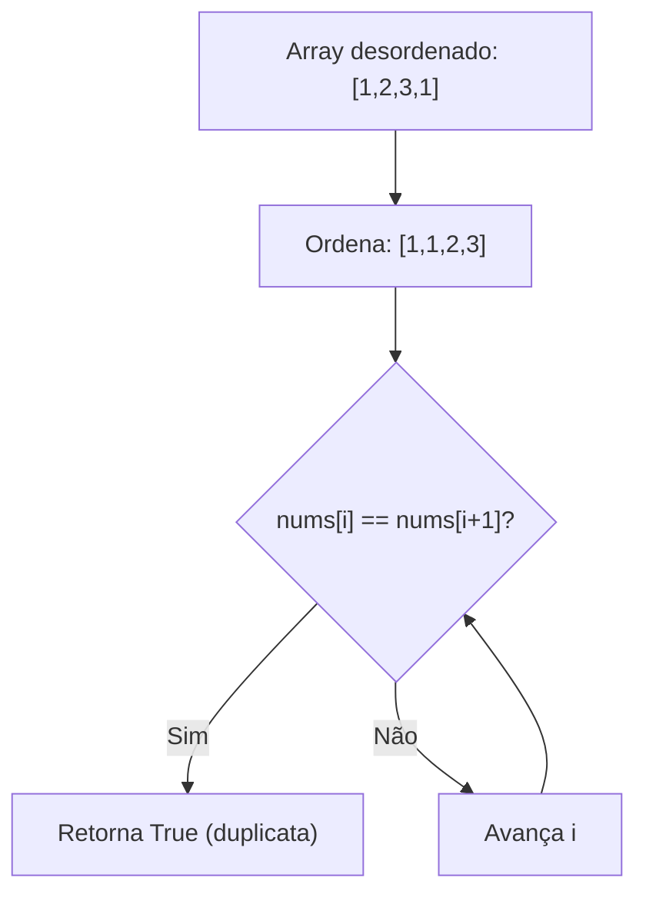
* **Complexidade esperada:** ⏱️ Tempo $O(n \log n)$ | 💾 Espaço $O(1)$ (in-place sort).
* **Edge cases:** Array vazio ou com um único elemento → sem duplicatas. Todos os elementos iguais.
* **Core snippet:**
```python
def containsDuplicate(self, nums: list[int]) -> bool:
    nums.sort()
    for i in range(len(nums)-1):
        if nums[i] == nums[i+1]:
            return True
    return False
```

---

### 📌 Gas Station (`gas_station.py`) — [LeetCode #134](https://leetcode.com/problems/gas-station/) | Medium
* **Descrição breve:** Existem `n` postos de gasolina ao longo de uma rota circular. O posto `i` fornece `gas[i]` unidades de combustível, e o custo para viajar do posto `i` ao posto `(i+1)` é `cost[i]`. Você parte com o tanque vazio em um dos postos e deve completar o circuito inteiro no sentido horário. Retorne o índice do posto de partida que permite completar a volta, ou `-1` se for impossível. Se existir solução, ela é **garantidamente única**.
* **Exemplo 1:** `gas = [1,2,3,4,5]`, `cost = [3,4,5,1,2]` → `3`. Partindo do posto 3: tanque = 0+4=4 → viaja (custo 1) → posto 4: 4-1+5=8 → viaja (custo 2) → posto 0: 8-2+1=7 → ... completa o circuito.
* **Exemplo 2:** `gas = [2,3,4]`, `cost = [3,4,3]` → `-1`. Não há ponto de partida que permita completar a volta.
* **Constraints:** `n == gas.length == cost.length` · `1 <= n <= 10⁵` · `0 <= gas[i], cost[i] <= 10⁴` · A resposta é garantidamente única quando existe.
* **Tags:** Array, Greedy.
* **💡 Sacada (O Pulo do Gato):**
  > Use Kadane-style: mantenha uma `current_sum` de `gas[i] - cost[i]`. Se a soma ficar negativa, resete-a e comece do próximo índice. O início que gerou a maior soma acumulada é o candidato. Valide com uma segunda passada.
* **🧠 Modelo Mental:**
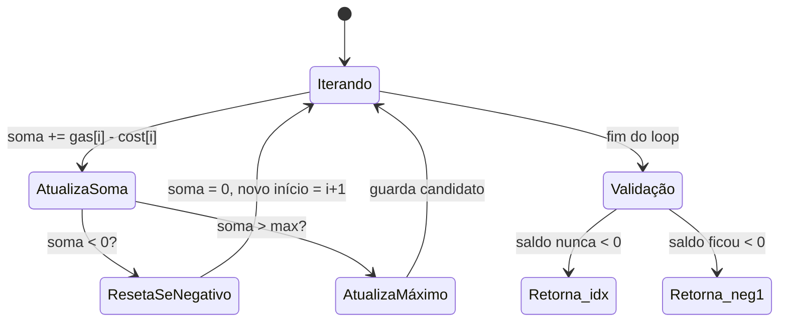
* **Complexidade esperada:** ⏱️ Tempo $O(n)$ | 💾 Espaço $O(1)$.
* **Edge cases:** Soma total de `gas - cost` negativa → impossível completar. Array de tamanho 1.
* **Core snippet:**
```python
def canCompleteCircuit(self, gas, cost):
    size = len(gas)
    max_idx, max_sum = -1, -1
    current_idx, current_sum = 0, 0
    for i in range(2 * size):
        idx = i % size
        current_sum += gas[idx] - cost[idx]
        if current_sum < 0:
            current_sum = 0
            current_idx = idx + 1
        if current_sum > max_sum:
            max_idx = current_idx
            max_sum = current_sum
    saldo = 0
    for i in range(max_idx, size + max_idx):
        idx = i % size
        saldo += gas[idx] - cost[idx]
        if saldo < 0:
            return -1
    return max_idx
```

---

### 📌 H-Index (`h_index.py`) — [LeetCode #274](https://leetcode.com/problems/h-index/) | Medium
* **Descrição breve:** Dado um array de inteiros `citations` onde `citations[i]` é o número de citações que o `i`-ésimo artigo de um pesquisador recebeu, retorne o **H-Index** desse pesquisador. O H-Index é definido como o **maior valor `h`** tal que o pesquisador tenha publicado pelo menos `h` artigos com **pelo menos `h` citações** cada.
* **Exemplo 1:** `citations = [3,0,6,1,5]` → `3`. Há 3 artigos com ≥ 3 citações (3, 6, 5), e os 2 restantes têm ≤ 3 citações.
* **Exemplo 2:** `citations = [1,3,1]` → `1`.
* **Constraints:** `1 <= n <= 5000` · `0 <= citations[i] <= 1000`.
* **Tags:** Array, Sorting, Counting Sort.
* **💡 Sacada (O Pulo do Gato):**
  > Use **Counting Sort** para ordenar em $O(n + k)$. Depois percorra o array ordenado de trás para frente: enquanto `response[idx] >= h+1`, incremente `h`.
* **🧠 Modelo Mental:**
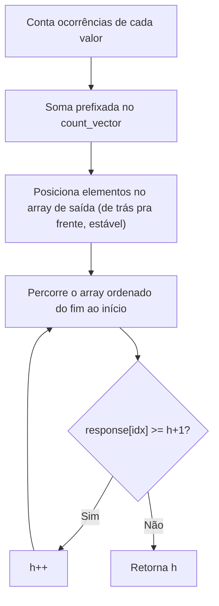
* **Complexidade esperada:** ⏱️ Tempo $O(n + k)$ | 💾 Espaço $O(n + k)$ onde $k$ = valor máximo de citação.
* **Edge cases:** Todas as citações iguais a 0 → h = 0. Array com um único elemento.
* **Core snippet:**
```python
def hIndex(self, citations):
    response = [0] * len(citations)
    max_value = max(citations)
    count_vector = [0] * (max_value + 1)
    for c in citations:
        count_vector[c] += 1
    for idx in range(1, len(count_vector)):
        count_vector[idx] += count_vector[idx - 1]
    for idx in range(len(citations) - 1, -1, -1):
        value = citations[idx]
        position = count_vector[value] - 1
        response[position] = value
        count_vector[value] -= 1
    h = 0
    for idx in range(len(response) - 1, -1, -1):
        if response[idx] < h + 1:
            return h
        h += 1
    return h
```

---

### 📌 Intersection of Two Arrays II (`intersection_two_arrays.py`) — [LeetCode #350](https://leetcode.com/problems/intersection-of-two-arrays-ii/) | Easy
* **Descrição breve:** Dados dois arrays de inteiros `nums1` e `nums2`, retorne um array com a **interseção** entre eles. Diferente da interseção de conjuntos, cada elemento deve aparecer no resultado tantas vezes quanto o **mínimo** de sua frequência em ambos os arrays. A ordem dos elementos no resultado não importa.
* **Exemplo 1:** `nums1 = [1,2,2,1]`, `nums2 = [2,2]` → `[2,2]`.
* **Exemplo 2:** `nums1 = [4,9,5]`, `nums2 = [9,4,9,8,4]` → `[4,9]` (ou `[9,4]`).
* **Constraints:** `1 <= nums1.length, nums2.length <= 1000` · `0 <= nums1[i], nums2[i] <= 1000`.
* **Follow-ups:** (1) E se os arrays já estiverem ordenados? Use dois ponteiros em O(n+m). (2) E se `nums1` for muito menor que `nums2`? Faça hash do menor. (3) E se `nums2` estiver em disco e a memória for limitada? Use ordenação externa + dois ponteiros.
* **Tags:** Array, Hash Table, Two Pointers, Binary Search, Sorting.
* **💡 Sacada (O Pulo do Gato):**
  > Ordene ambos os arrays e use **dois ponteiros**. Se iguais, adicione ao resultado e avance ambos. Se diferentes, avance o ponteiro do menor valor.
* **🧠 Modelo Mental:**
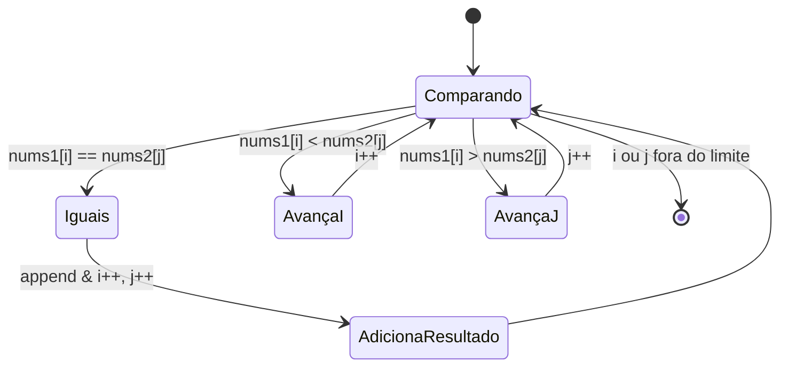
* **Complexidade esperada:** ⏱️ Tempo $O(n \log n + m \log m)$ | 💾 Espaço $O(\min(n,m))$ para o resultado.
* **Edge cases:** Um dos arrays vazio → resultado vazio. Sem elementos em comum. Follow-up: se `nums2` estiver em disco, usar busca linear $O(n \times m)$ removendo elementos já contados.
* **Core snippet:**
```python
def intersect(nums1, nums2):
    nums1.sort()
    nums2.sort()
    i, j, response = 0, 0, []
    while i < len(nums1) and j < len(nums2):
        if nums1[i] == nums2[j]:
            response.append(nums1[i])
            i += 1; j += 1
        elif nums1[i] < nums2[j]:
            i += 1
        else:
            j += 1
    return response
```

---

### 📌 Jump Game (`jump_game.py`) — [LeetCode #55](https://leetcode.com/problems/jump-game/) | Medium
* **Descrição breve:** Você recebe um array de inteiros `nums`. Você começa posicionado no **primeiro índice** do array, e cada elemento `nums[i]` representa o **comprimento máximo do salto para frente** a partir daquela posição. Retorne `true` se for possível alcançar o **último índice**, ou `false` caso contrário.
* **Exemplo 1:** `nums = [2,3,1,1,4]` → `true`. Salte 1 passo do índice 0 ao 1, depois 3 passos até o último índice.
* **Exemplo 2:** `nums = [3,2,1,0,4]` → `false`. Você sempre cairá no índice 3, cujo salto máximo é 0, impossibilitando alcançar o índice 4.
* **Constraints:** `1 <= nums.length <= 10⁴` · `0 <= nums[i] <= 10⁵`.
* **Tags:** Array, Dynamic Programming, Greedy.
* **💡 Sacada (O Pulo do Gato):**
  > Mantenha um `max_idx` (alcance máximo). Se em algum momento `idx > max_idx`, você ficou "ilhado" → retorne `False`. Atualize `max_idx = max(max_idx, idx + nums[idx])` a cada passo.
* **🧠 Modelo Mental:**
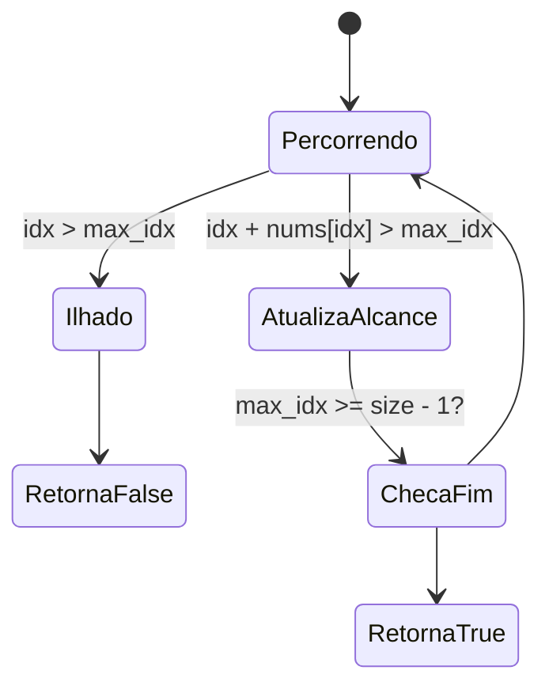
* **Complexidade esperada:** ⏱️ Tempo $O(n)$ | 💾 Espaço $O(1)$.
* **Edge cases:** Array com um único elemento → sempre `True`. Primeiro elemento 0 com tamanho > 1 → `False`. Zeros no meio.
* **Core snippet:**
```python
def canJump(self, nums):
    max_idx = 0
    for idx in range(len(nums)):
        if idx > max_idx:
            return False
        if idx + nums[idx] > max_idx:
            max_idx = idx + nums[idx]
        if max_idx >= len(nums) - 1:
            return True
    return False
```

---

### 📌 Jump Game II (`jump_game_2.py`) — [LeetCode #45](https://leetcode.com/problems/jump-game-ii/) | Medium
* **Descrição breve:** Você recebe um array 0-indexed de inteiros `nums` de tamanho `n`. Cada elemento `nums[i]` representa o **comprimento máximo de um salto para frente** a partir do índice `i` (ou seja, você pode saltar para qualquer `i + j` onde `0 <= j <= nums[i]` e `i + j < n`). Retorne o **número mínimo de saltos** para alcançar `nums[n-1]`. É **garantido** que sempre é possível chegar ao último índice.
* **Exemplo 1:** `nums = [2,3,1,1,4]` → `2`. Salte do índice 0 ao 1 (1 passo), depois do índice 1 ao 4 (3 passos). Total: 2 saltos.
* **Exemplo 2:** `nums = [2,3,0,1,4]` → `2`.
* **Constraints:** `1 <= nums.length <= 10⁴` · `0 <= nums[i] <= 1000`.
* **Tags:** Array, Dynamic Programming, Greedy.
* **💡 Sacada (O Pulo do Gato):**
  > BFS implícito / Greedy: mantenha `max_idx` (limite do salto atual) e `temp_max_idx` (melhor alcance futuro). Quando `idx == max_idx`, você "gasta" um salto e promove `temp_max_idx` para `max_idx`.
* **🧠 Modelo Mental:**
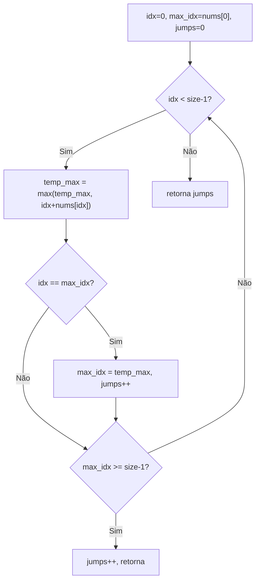
* **Complexidade esperada:** ⏱️ Tempo $O(n)$ | 💾 Espaço $O(1)$.
* **Edge cases:** Array com 1 elemento → 0 saltos. Caso de borda ao atingir o final exatamente no limite do salto atual.
* **Core snippet:**
```python
def jump(self, nums):
    max_idx = nums[0]
    temp_max_idx = nums[0]
    count_jumps = 0
    size = len(nums)
    for idx in range(size - 1):
        if idx + nums[idx] > temp_max_idx:
            temp_max_idx = idx + nums[idx]
        if idx == max_idx:
            max_idx = temp_max_idx
            count_jumps += 1
        if max_idx >= size - 1:
            count_jumps += 1
            return count_jumps
    return count_jumps
```

---

### 📌 Plus One (`plus_one.py`) — [LeetCode #66](https://leetcode.com/problems/plus-one/) | Easy
* **Descrição breve:** Você recebe um inteiro grande representado como um array de dígitos `digits`, onde cada `digits[i]` é um dígito de `0` a `9`. Os dígitos estão ordenados do **mais significativo para o menos significativo** (da esquerda para a direita), e o número **não contém zeros à esquerda**. Incremente o número em 1 e retorne o array resultante.
* **Exemplo 1:** `digits = [1,2,3]` → `[1,2,4]` (123 + 1 = 124).
* **Exemplo 2:** `digits = [4,3,2,1]` → `[4,3,2,2]` (4321 + 1 = 4322).
* **Exemplo 3:** `digits = [9]` → `[1,0]` (9 + 1 = 10).
* **Constraints:** `1 <= digits.length <= 100` · `0 <= digits[i] <= 9` · Sem zeros à esquerda.
* **Tags:** Array, Math.
* **💡 Sacada (O Pulo do Gato):**
  > Percorra de trás para frente. Se `dígito + 1 == 10`, coloque 0 e propague o carry. Se chegar no índice 0 com carry, insira 1 no início.
* **🧠 Modelo Mental:**
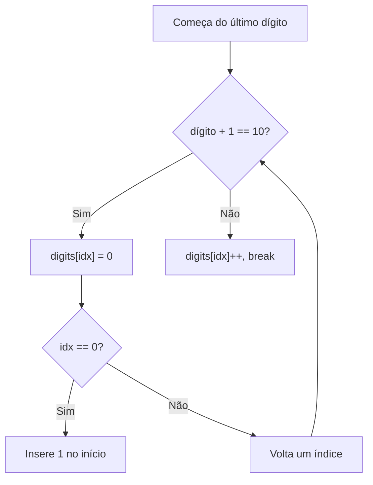
* **Complexidade esperada:** ⏱️ Tempo $O(n)$ | 💾 Espaço $O(1)$ (amortizado, exceto o caso de carry total como 999→1000).
* **Edge cases:** Todos os dígitos 9 (ex: `[9,9,9]` → `[1,0,0,0]`). Dígito único `[0]` → `[1]`.
* **Core snippet:**
```python
def plusOne(self, digits):
    for idx in range(len(digits) - 1, -1, -1):
        if digits[idx] + 1 == 10:
            digits[idx] = 0
            if idx == 0:
                digits.insert(0, 1)
        else:
            digits[idx] += 1
            break
    return digits
```

---

### 📌 Product of Array Except Self (`product_of_array.py`) — [LeetCode #238](https://leetcode.com/problems/product-of-array-except-self/) | Medium
* **Descrição breve:** Dado um array de inteiros `nums`, retorne um array `answer` onde `answer[i]` é igual ao **produto de todos os elementos** de `nums` **exceto** `nums[i]`. A solução deve rodar em tempo **O(n)** e **não é permitido usar a operação de divisão**. O produto de qualquer prefixo ou sufixo de `nums` cabe em um inteiro de 32 bits.
* **Exemplo 1:** `nums = [1,2,3,4]` → `[24,12,8,6]`.
* **Exemplo 2:** `nums = [-1,1,0,-3,3]` → `[0,0,9,0,0]`.
* **Constraints:** `2 <= nums.length <= 10⁵` · `-30 <= nums[i] <= 30` · O produto de qualquer prefixo/sufixo cabe em 32 bits.
* **Follow-up:** Resolva com complexidade de espaço O(1) extra (o array de saída não conta).
* **Tags:** Array, Prefix Sum.
* **💡 Sacada (O Pulo do Gato):**
  > Use **prefixo e sufixo acumulados**. `forward[i]` guarda o produto de tudo à esquerda até `i`. `backward[i]` guarda o produto de tudo à direita. `answer[i] = forward[i-1] * backward[i+1]`.
* **🧠 Modelo Mental:**
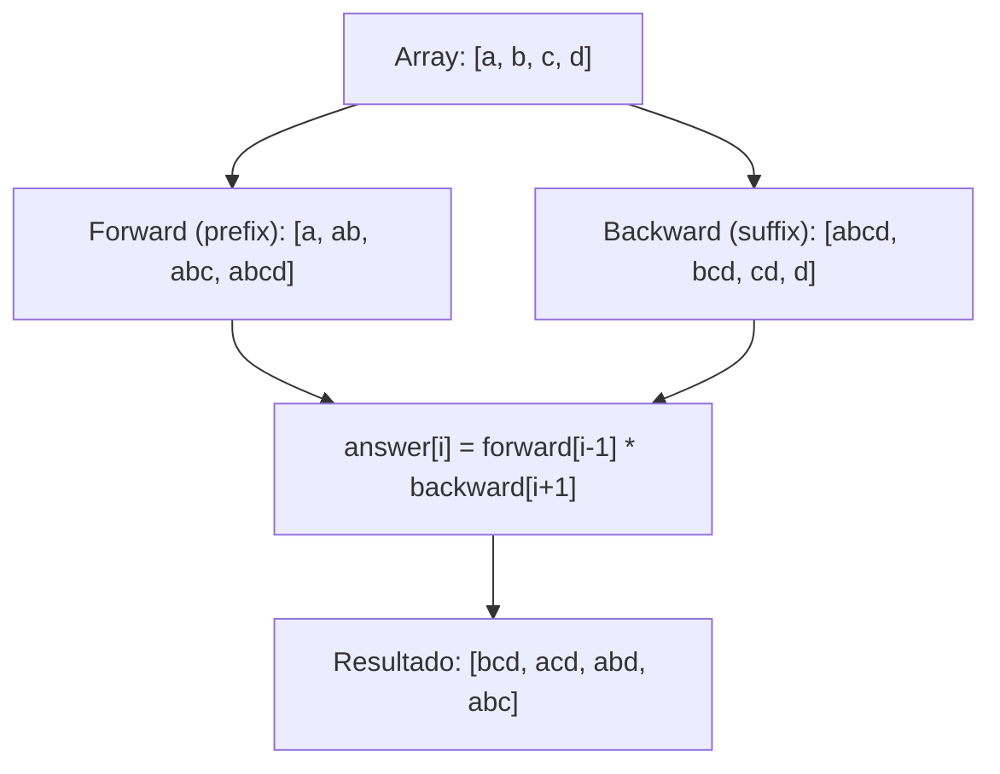
* **Complexidade esperada:** ⏱️ Tempo $O(n)$ | 💾 Espaço $O(n)$.
* **Edge cases:** Array com zero(s) → o produto de todos exceto o zero é o único não-zero. Dois zeros → todos os resultados são 0.
* **Core snippet:**
```python
def productExceptSelf(self, nums):
    size = len(nums)
    foward = list(nums)
    backward = list(nums)
    for idx in range(1, size):
        foward[idx] *= foward[idx - 1]
    for idx in range(size - 2, -1, -1):
        backward[idx] *= backward[idx + 1]
    response = [0] * size
    for idx in range(size):
        f = foward[idx - 1] if idx > 0 else 1
        b = backward[idx + 1] if idx < size - 1 else 1
        response[idx] = f * b
    return response
```

---

### 📌 Remove Duplicates from Sorted Array (`remove_duplicates_from_sorted_array.py`) — [LeetCode #26](https://leetcode.com/problems/remove-duplicates-from-sorted-array/) | Easy
* **Descrição breve:** Dado um array de inteiros `nums` **ordenado em ordem não-decrescente**, remova as duplicatas **in-place** de modo que cada elemento único apareça **apenas uma vez**. A ordem relativa dos elementos deve ser mantida. Retorne `k`, o número de elementos únicos. Os primeiros `k` elementos de `nums` devem conter os valores únicos na ordem original; o que vier depois da posição `k` não importa.
* **Exemplo 1:** `nums = [1,1,2]` → `k = 2`, `nums = [1,2,_]`.
* **Exemplo 2:** `nums = [0,0,1,1,1,2,2,3,3,4]` → `k = 5`, `nums = [0,1,2,3,4,_,_,_,_,_]`.
* **Constraints:** `1 <= nums.length <= 3 × 10⁴` · `-100 <= nums[i] <= 100` · Array ordenado em ordem não-decrescente.
* **Tags:** Array, Two Pointers.
* **💡 Sacada (O Pulo do Gato):**
  > Dois ponteiros: `k` marca onde o próximo valor único deve ser colocado. Sempre que `nums[i] != nums[i+1]`, copie `nums[i+1]` para a posição `k` e avance `k`.
* **🧠 Modelo Mental:**
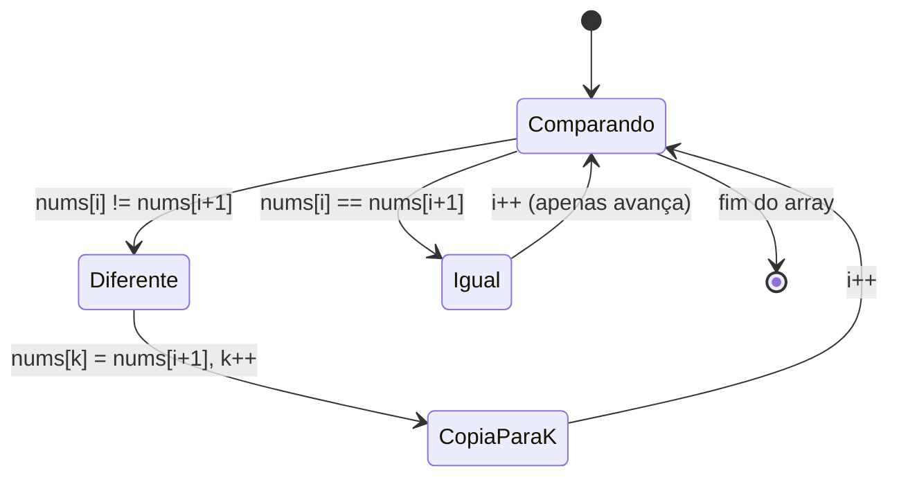
* **Complexidade esperada:** ⏱️ Tempo $O(n)$ | 💾 Espaço $O(1)$.
* **Edge cases:** Array com todos os elementos iguais → k=1. Array já sem duplicatas → k=n.
* **Core snippet:**
```python
def removeDuplicates(nums):
    k = 1
    for i in range(len(nums) - 1):
        if nums[i] != nums[i + 1]:
            nums[k] = nums[i + 1]
            k += 1
    return k
```

---

### 📌 Remove Duplicates from Sorted Array II (`remove_duplicates_from_sorted_array_2.py`) — [LeetCode #80](https://leetcode.com/problems/remove-duplicates-from-sorted-array-ii/) | Medium
* **Descrição breve:** Dado um array de inteiros `nums` **ordenado em ordem não-decrescente**, remova duplicatas **in-place** de modo que cada elemento único apareça **no máximo duas vezes**. A ordem relativa deve ser mantida. Retorne `k`, o número de elementos restantes. Os primeiros `k` posições de `nums` devem conter o resultado final. O que vier depois não importa.
* **Exemplo 1:** `nums = [1,1,1,2,2,3]` → `k = 5`, `nums = [1,1,2,2,3,_]`.
* **Exemplo 2:** `nums = [0,0,1,1,1,1,2,3,3]` → `k = 7`, `nums = [0,0,1,1,2,3,3,_,_]`.
* **Constraints:** `1 <= nums.length <= 3 × 10⁴` · `-10⁴ <= nums[i] <= 10⁴` · Array ordenado em ordem não-decrescente.
* **Tags:** Array, Two Pointers.
* **💡 Sacada (O Pulo do Gato):**
  > O `k` que anda: mantenha um contador de repetições. Sempre copie o valor para `nums[k]`, mas só avance `k` quando `equal_count < 2`. Ao encontrar um valor diferente, resete o contador.
* **🧠 Modelo Mental:**
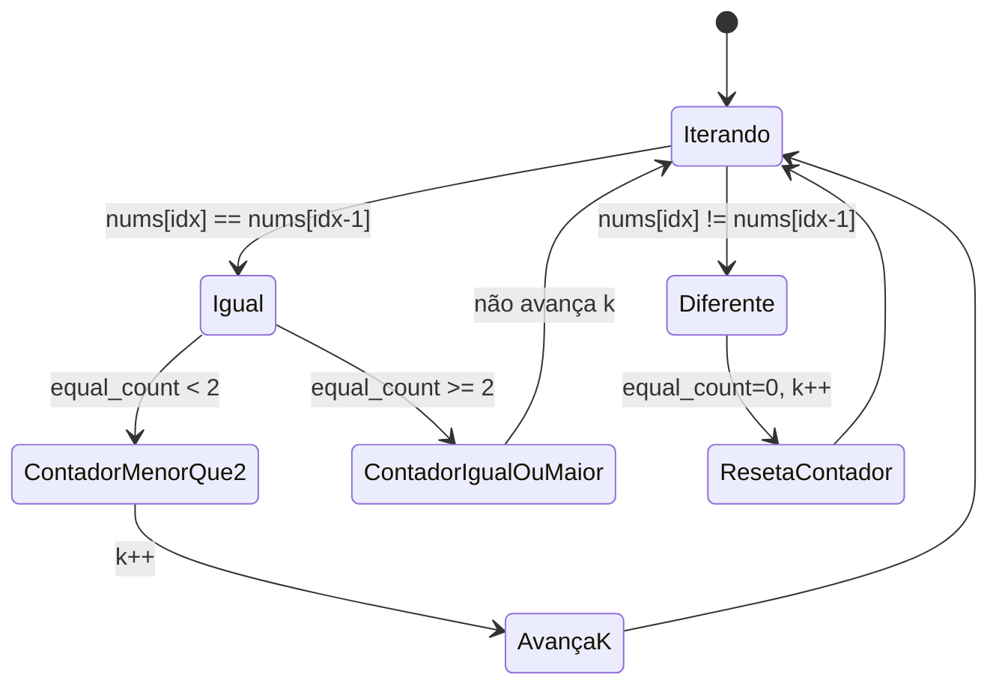
* **Complexidade esperada:** ⏱️ Tempo $O(n)$ | 💾 Espaço $O(1)$.
* **Edge cases:** Todos iguais → k=2. Nenhuma duplicata → k=n. Sequência com exatamente 2 repetições de cada valor.
* **Core snippet:**
```python
def removeDuplicates(self, nums):
    k, equal_count = 1, 0
    for idx in range(1, len(nums)):
        nums[k] = nums[idx]
        if nums[idx] == nums[idx - 1]:
            equal_count += 1
            if equal_count < 2:
                k += 1
        else:
            k += 1
            equal_count = 0
    return k
```

---

### 📌 Reverse Words in a String (`reverse_word.py`) — [LeetCode #151](https://leetcode.com/problems/reverse-words-in-a-string/) | Medium
* **Descrição breve:** Dada uma string `s`, inverta a **ordem das palavras**. Uma "palavra" é uma sequência de caracteres não-espaço. As palavras em `s` são separadas por pelo menos um espaço. Retorne uma string com as palavras em ordem reversa, concatenadas por **um único espaço**, sem espaços extras no início, fim ou entre palavras.
* **Exemplo 1:** `s = "the sky is blue"` → `"blue is sky the"`.
* **Exemplo 2:** `s = "  hello world  "` → `"world hello"`.
* **Exemplo 3:** `s = "a good   example"` → `"example good a"`.
* **Constraints:** `1 <= s.length <= 10⁴` · `s` contém letras inglesas (maiúsculas e minúsculas), dígitos e espaços · Há pelo menos uma palavra em `s`.
* **Follow-up:** Consegue resolver in-place com O(1) de espaço extra?
* **Tags:** Two Pointers, String.
* **💡 Sacada (O Pulo do Gato):**
  > Percorra a string de trás para frente, construindo cada palavra com um `deque` (appendleft). Ao encontrar um espaço e já ter uma palavra acumulada, junte-a ao resultado.
* **🧠 Modelo Mental:**
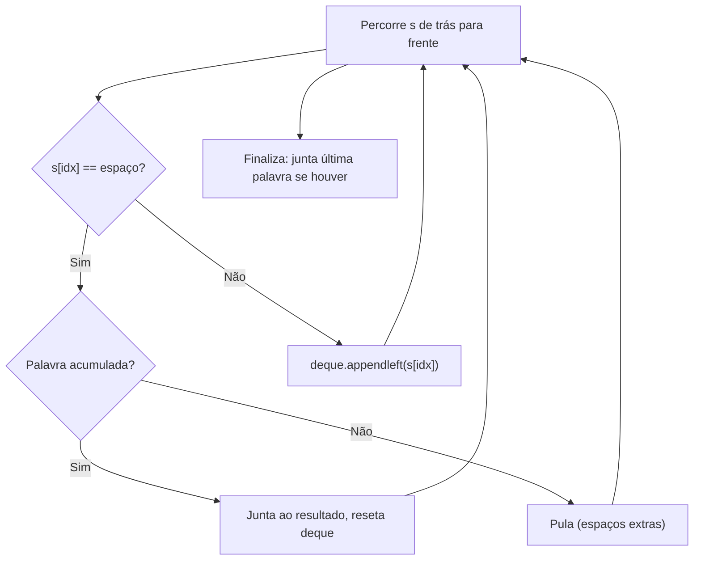
* **Complexidade esperada:** ⏱️ Tempo $O(n)$ | 💾 Espaço $O(n)$.
* **Edge cases:** Espaços no início/fim. Múltiplos espaços entre palavras. String com uma única palavra.
* **Core snippet:**
```python
def reverseWords(self, s):
    reversed_string = ''
    current_word = deque()
    for idx in range(len(s) - 1, -1, -1):
        if s[idx] == ' ':
            if len(current_word) > 0:
                if reversed_string != '':
                    reversed_string += ' '
                reversed_string += ''.join(current_word)
                current_word = deque()
        else:
            current_word.appendleft(s[idx])
    if len(current_word) > 0:
        if reversed_string != '':
            reversed_string += ' '
        reversed_string += ''.join(current_word)
    return reversed_string
```

---

### 📌 Rotate Array (`rotate_array.py`) — [LeetCode #189](https://leetcode.com/problems/rotate-array/) | Medium
* **Descrição breve:** Dado um array de inteiros `nums`, rotacione o array para a **direita** por `k` posições, onde `k` é não-negativo. Os últimos `k` elementos passam para o início, e os demais se deslocam para a direita.
* **Exemplo 1:** `nums = [1,2,3,4,5,6,7]`, `k = 3` → `[5,6,7,1,2,3,4]`.
* **Exemplo 2:** `nums = [-1,-100,3,99]`, `k = 2` → `[3,99,-1,-100]`.
* **Constraints:** `1 <= nums.length <= 10⁵` · `-2³¹ <= nums[i] <= 2³¹ - 1` · `0 <= k <= 10⁵`.
* **Follow-up:** Tente encontrar pelo menos três abordagens diferentes. Consegue resolver in-place com O(1) de espaço extra?
* **Tags:** Array, Math, Two Pointers.
* **💡 Sacada (O Pulo do Gato):**
  > Rotação cíclica direta: comece em `start_index`, mova o valor para `(idx + k) % n`, encadeando as substituições. Se voltar ao `start_index` antes de visitar todos, incremente `start_index` e repita.
* **🧠 Modelo Mental:**
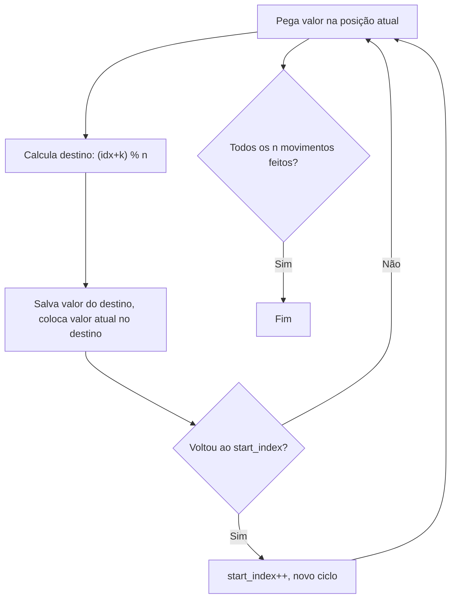
* **Complexidade esperada:** ⏱️ Tempo $O(n)$ | 💾 Espaço $O(1)$.
* **Edge cases:** `k >= n` → `k = k % n`. `k = 0` → sem mudança. Array de tamanho 1.
* **Core snippet:**
```python
def rotate(nums, k):
    n = len(nums)
    start_index = 0
    current_index = start_index
    current_value = nums[current_index]
    next_index = (current_index + k) % n
    next_value = nums[next_index]
    for _ in range(n):
        nums[next_index] = current_value
        current_value = next_value
        current_index = next_index
        next_index = (next_index + k) % n
        next_value = nums[next_index]
        if current_index == start_index and start_index < n - 1:
            start_index += 1
            current_index = start_index
            current_value = nums[current_index]
            next_index = (current_index + k) % n
            next_value = nums[next_index]
    return nums
```

---

### 📌 Rotate Image (`rotate_image.py`) — [LeetCode #48](https://leetcode.com/problems/rotate-image/) | Medium
* **Descrição breve:** Dada uma matriz `n × n` representando uma imagem, rotacione-a **90 graus no sentido horário**, **in-place** — ou seja, modifique a matriz diretamente **sem alocar outra matriz 2D**.
* **Exemplo 1:** `[[1,2,3],[4,5,6],[7,8,9]]` → `[[7,4,1],[8,5,2],[9,6,3]]`.
* **Exemplo 2:** `[[5,1,9,11],[2,4,8,10],[13,3,6,7],[15,14,12,16]]` → `[[15,13,2,5],[14,3,4,1],[12,6,8,9],[16,7,10,11]]`.
* **Constraints:** `n == matrix.length == matrix[i].length` · `1 <= n <= 20` · `-1000 <= matrix[i][j] <= 1000`.
* **Tags:** Array, Math, Matrix.
* **💡 Sacada (O Pulo do Gato):**
  > Decomponha em duas operações: **transposta** (troque `matrix[i][j]` com `matrix[j][i]`) e depois **reversa por linha** (espelhe cada linha horizontalmente).
* **🧠 Modelo Mental:**
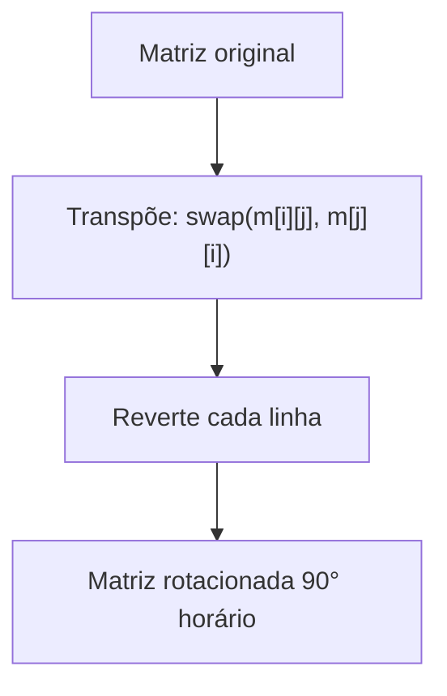
* **Complexidade esperada:** ⏱️ Tempo $O(n^2)$ | 💾 Espaço $O(1)$.
* **Edge cases:** Matriz 1×1 → sem mudança. Matriz 2×2 → caso mínimo funcional.
* **Core snippet:**
```python
def rotate(self, matrix):
    n = len(matrix)
    # Transposta
    for i in range(n):
        for j in range(i, n):
            matrix[i][j], matrix[j][i] = matrix[j][i], matrix[i][j]
    # Reversa por linha
    for i in range(n):
        for j in range(n // 2):
            matrix[i][j], matrix[i][n-j-1] = matrix[i][n-j-1], matrix[i][j]
```

---

### 📌 Single Number (`single_number.py`) — [LeetCode #136](https://leetcode.com/problems/single-number/) | Easy
* **Descrição breve:** Dado um array de inteiros não-vazio `nums`, onde **todo elemento aparece exatamente duas vezes** exceto por um, encontre e retorne esse elemento único. A solução **deve** ter complexidade de tempo **linear O(n)** e usar apenas **espaço constante O(1)**.
* **Exemplo 1:** `nums = [2,2,1]` → `1`.
* **Exemplo 2:** `nums = [4,1,2,1,2]` → `4`.
* **Exemplo 3:** `nums = [1]` → `1`.
* **Constraints:** `1 <= nums.length <= 3 × 10⁴` · `-3 × 10⁴ <= nums[i] <= 3 × 10⁴` · Todo elemento aparece duas vezes, exceto um que aparece uma vez.
* **Tags:** Array, Bit Manipulation.
* **💡 Sacada (O Pulo do Gato):**
  > **XOR** de todos os elementos. Como `a ^ a = 0` e `a ^ 0 = a`, todos os pares se cancelam, restando apenas o número único.
* **🧠 Modelo Mental:**
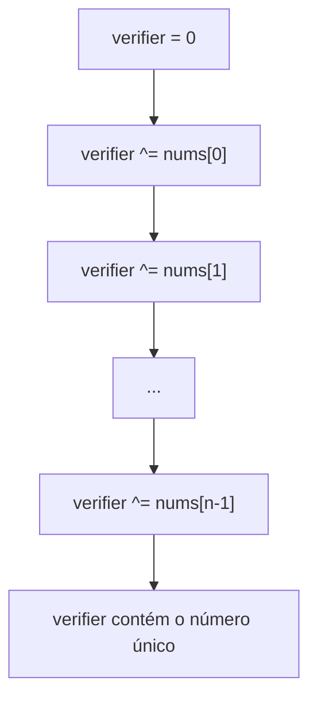
* **Complexidade esperada:** ⏱️ Tempo $O(n)$ | 💾 Espaço $O(1)$.
* **Edge cases:** Array com um único elemento → retorna ele mesmo. Todos os pares cancelados corretamente.
* **Core snippet:**
```python
def singleNumber(self, nums):
    verifier = 0
    for i in nums:
        verifier ^= i
    return verifier
```

---

### 📌 Valid Sudoku (`sudoku.py`) — [LeetCode #36](https://leetcode.com/problems/valid-sudoku/) | Medium
* **Descrição breve:** Determine se um tabuleiro de Sudoku 9×9 é **válido**. Apenas as células **já preenchidas** precisam ser validadas de acordo com as seguintes regras: (1) Cada **linha** deve conter os dígitos 1-9 sem repetição. (2) Cada **coluna** deve conter os dígitos 1-9 sem repetição. (3) Cada uma das nove **sub-caixas 3×3** deve conter os dígitos 1-9 sem repetição. Células vazias são representadas por `'.'`. Um tabuleiro parcialmente preenchido **pode ser válido** mas não precisa ser resolvível.
* **Exemplo 1:** Tabuleiro válido com configuração padrão → `true`.
* **Exemplo 2:** Tabuleiro com dois `8`'s na sub-caixa 3×3 superior esquerda → `false`.
* **Constraints:** `board.length == 9` · `board[i].length == 9` · `board[i][j]` é um dígito `'1'-'9'` ou `'.'`.
* **Tags:** Array, Hash Table, Matrix.
* **💡 Sacada (O Pulo do Gato):**
  > Dividir e conquistar a validação: cheque cada **linha**, cada **coluna** e cada **sub-caixa 3×3** separadamente usando um array booleano de 9 posições para rastrear duplicatas.
* **🧠 Modelo Mental:**
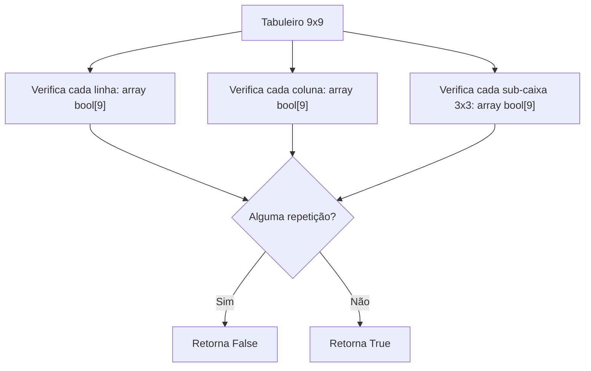
* **Complexidade esperada:** ⏱️ Tempo $O(1)$ (tabuleiro fixo 9×9 = 81 células) | 💾 Espaço $O(1)$.
* **Edge cases:** Células com `.` devem ser ignoradas. Valores fora de 1-9.
* **Core snippet:**
```python
def isValidSudoku(self, board):
    # Verifica linhas
    for row in board:
        seen = [False] * 9
        for cell in row:
            if cell != '.':
                val = int(cell) - 1
                if seen[val]: return False
                seen[val] = True
    # Verifica colunas
    for col in range(9):
        seen = [False] * 9
        for row in range(9):
            cell = board[row][col]
            if cell != '.':
                val = int(cell) - 1
                if seen[val]: return False
                seen[val] = True
    # Verifica sub-caixas 3x3
    for rs in [0, 3, 6]:
        for cs in [0, 3, 6]:
            seen = [False] * 9
            for r in range(rs, rs + 3):
                for c in range(cs, cs + 3):
                    cell = board[r][c]
                    if cell != '.':
                        val = int(cell) - 1
                        if seen[val]: return False
                        seen[val] = True
    return True
```

---

### 📌 Two Sum (`two_sum.py`) — [LeetCode #1](https://leetcode.com/problems/two-sum/) | Easy
* **Descrição breve:** Dado um array de inteiros `nums` e um inteiro `target`, retorne os **índices** dos dois números cuja soma é igual a `target`. É garantido que existe **exatamente uma solução**, e você **não pode usar o mesmo elemento duas vezes**. A resposta pode ser retornada em qualquer ordem.
* **Exemplo 1:** `nums = [2,7,11,15]`, `target = 9` → `[0,1]` (porque `nums[0] + nums[1] == 9`).
* **Exemplo 2:** `nums = [3,2,4]`, `target = 6` → `[1,2]`.
* **Exemplo 3:** `nums = [3,3]`, `target = 6` → `[0,1]`.
* **Constraints:** `2 <= nums.length <= 10⁴` · `-10⁹ <= nums[i] <= 10⁹` · `-10⁹ <= target <= 10⁹` · Exatamente uma solução válida.
* **Follow-up:** Consegue encontrar um algoritmo com complexidade menor que O(n²)?
* **Tags:** Array, Hash Table.
* **💡 Sacada (O Pulo do Gato):**
  > Ordene uma cópia e use **dois ponteiros** (início e fim). Quando encontrar o par de valores, volte ao array original para recuperar os índices originais.
* **🧠 Modelo Mental:**
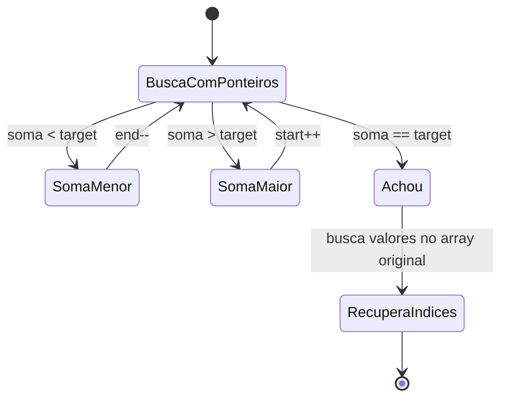
* **Complexidade esperada:** ⏱️ Tempo $O(n \log n)$ | 💾 Espaço $O(n)$.
* **Edge cases:** Dois valores iguais que somam ao target (ex: `[3,3]`, target=6). Solução única garantida.
* **Core snippet:**
```python
def twoSum(nums, target):
    sorted_nums = sorted(nums, reverse=True)
    start_idx, end_idx = 0, len(nums) - 1
    value_a = value_b = -1
    while start_idx < end_idx:
        s = sorted_nums[start_idx] + sorted_nums[end_idx]
        if s < target:
            end_idx -= 1
        elif s > target:
            start_idx += 1
        else:
            value_a, value_b = sorted_nums[start_idx], sorted_nums[end_idx]
            break
    idx_a = idx_b = -1
    for idx, value in enumerate(nums):
        if value == value_a and idx_a == -1:
            idx_a = idx
        elif value == value_b and idx_b == -1:
            idx_b = idx
    return [idx_a, idx_b]
```

---

### 📌 Zigzag Conversion (`zig_zag_conversion.py`) — [LeetCode #6](https://leetcode.com/problems/zigzag-conversion/) | Medium
* **Descrição breve:** Dada uma string `s` e um inteiro `numRows`, escreva os caracteres de `s` em um padrão **zigzag** (descendo verticalmente, depois subindo na diagonal) distribuído em `numRows` linhas. Em seguida, leia o resultado **linha por linha** da esquerda para a direita para obter a string convertida.
* **Exemplo 1:** `s = "PAYPALISHIRING"`, `numRows = 3` → O padrão forma: `P···A···H···N` / `A·P·L·S·I·I·G` / `Y···I···R` → Leitura: `"PAHNAPLSIIGYIR"`.
* **Exemplo 2:** `s = "PAYPALISHIRING"`, `numRows = 4` → `"PINALSIGYAHRPI"`.
* **Exemplo 3:** `s = "A"`, `numRows = 1` → `"A"`.
* **Constraints:** `1 <= s.length <= 1000` · `s` contém letras inglesas (maiúsculas e minúsculas), `','` e `'.'` · `1 <= numRows <= 1000`.
* **Tags:** String.
* **💡 Sacada (O Pulo do Gato):**
  > Simule o preenchimento da matriz zigzag: use um ponteiro de linha `i` que oscila para baixo e para cima. Quando `i == 0`, direção = baixo; quando `i == numRows-1`, direção = cima (e incrementa coluna `j`).
* **🧠 Modelo Mental:**
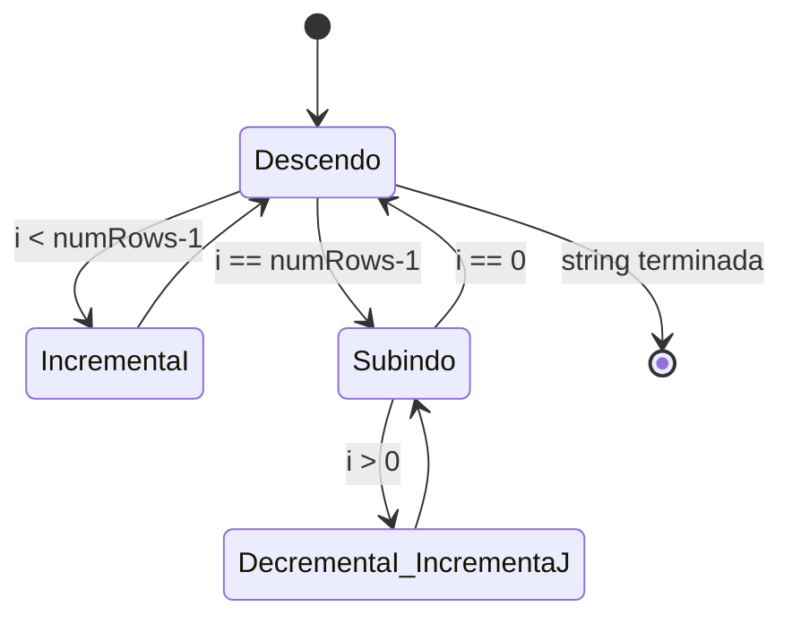
* **Complexidade esperada:** ⏱️ Tempo $O(n)$ para preenchimento + $O(numRows \times n)$ para leitura da matriz | 💾 Espaço $O(numRows \times n)$.
* **Edge cases:** `numRows == 1` → retorna a string original. `numRows >= len(s)` → cada char em uma linha, leitura = string original.
* **Core snippet:**
```python
def convert(self, s, numRows):
    if numRows == 1:
        return s
    matrix = [['' for _ in range(len(s))] for _ in range(numRows)]
    i, j, is_down = 0, 0, True
    for ch in s:
        matrix[i][j] = ch
        if i == 0:
            is_down = True
        elif i == numRows - 1:
            is_down = False
        if is_down:
            i += 1
        else:
            i -= 1
            j += 1
    return ''.join(matrix[r][c] for r in range(numRows) for c in range(len(s)) if matrix[r][c] != '')
```
