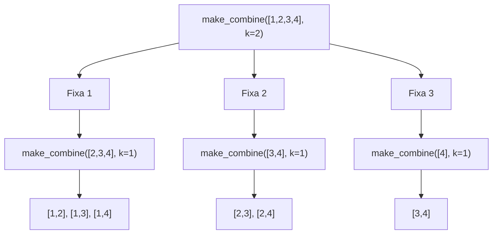
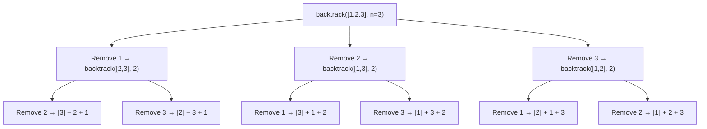
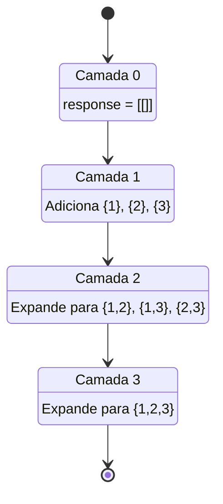
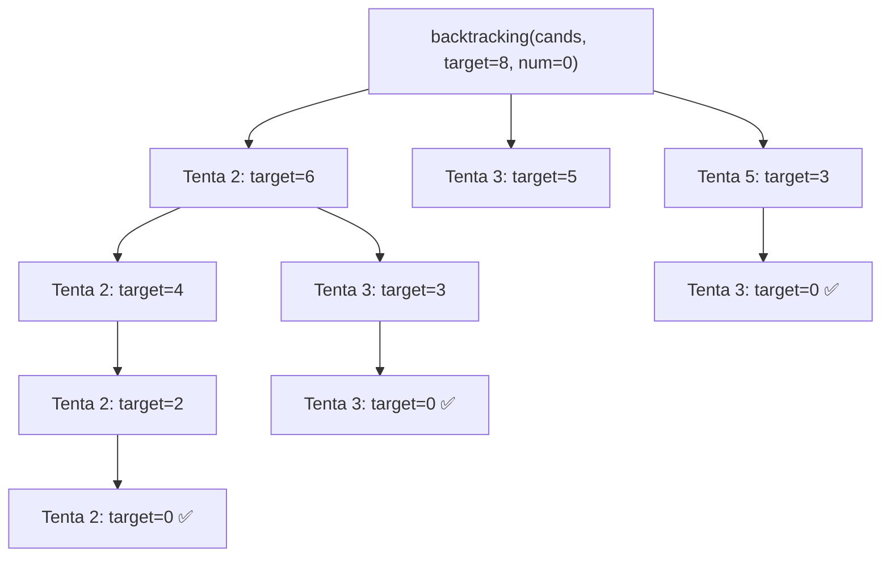

### 📌 Combinations (`combination.py`)
* **Descrição breve:** *(LeetCode 77 – Combinations · Medium)*
  Dados dois inteiros `n` e `k`, retorne **todas** as combinações possíveis de `k` números escolhidos do intervalo `[1, n]`. A resposta pode ser retornada em qualquer ordem. A ordem dos elementos dentro de cada combinação **não importa** — `[1,2]` e `[2,1]` são considerados a mesma combinação.

  **Exemplos:**
  | Input | Output |
  |---|---|
  | `n = 4, k = 2` | `[[1,2],[1,3],[1,4],[2,3],[2,4],[3,4]]` |
  | `n = 1, k = 1` | `[[1]]` |

  **Restrições:** `1 <= n <= 20`, `1 <= k <= n`.
  **Tópicos:** Array, Backtracking.
  **Empresas que cobram:** Adobe, Amazon, Apple, Facebook, Google, Microsoft.
* **💡 Sacada (O Pulo do Gato):**
> Para evitar duplicatas, a cada nível da recursão, só considere elementos **à frente** do índice atual (`array[idx + 1:]`). O caso base é `k == 1`, onde cada elemento vira uma lista unitária. A construção é bottom-up: combina o elemento atual com todas as sub-combinações de tamanho `k-1` do restante do array.
* **🧠 Modelo Mental:**

* **Complexidade esperada:** ⏱️ Tempo $O(C(n,k) \cdot k)$ | 💾 Espaço $O(C(n,k) \cdot k)$
* **Edge cases (Casos de Borda):**
  - `k == 1`: retorna cada número como lista unitária (caso base da recursão).
  - `k == n`: só existe uma combinação possível (todos os elementos).
  - `n == 1, k == 1`: retorna `[[1]]`.
* **Core snippet:**
```python
def make_combine(array, k):
    if k == 1:
        return [[i] for i in array]
    combination = []
    for idx in range(len(array)):
        results = make_combine(array[idx + 1:], k - 1)
        for result in results:
            combination.append([array[idx]] + result)
    return combination
```

---

### 📌 Permutations (`permutations.py`)
* **Descrição breve:** *(LeetCode 46 – Permutations · Medium)*
  Dado um array `nums` de inteiros **distintos**, retorne **todas** as permutações possíveis. A resposta pode ser retornada em qualquer ordem. Uma permutação é um rearranjo completo de todos os elementos do array — para um array de tamanho `n` existem `n!` permutações.

  **Exemplos:**
  | Input | Output |
  |---|---|
  | `nums = [1,2,3]` | `[[1,2,3],[1,3,2],[2,1,3],[2,3,1],[3,1,2],[3,2,1]]` |
  | `nums = [0,1]` | `[[0,1],[1,0]]` |
  | `nums = [1]` | `[[1]]` |

  **Restrições:** `1 <= nums.length <= 6`, `-10 <= nums[i] <= 10`, todos os valores são **únicos**.
  **Tópicos:** Array, Backtracking.
  **Taxa de aceitação:** ~81.6%.
* **💡 Sacada (O Pulo do Gato):**
> Para cada elemento, remova-o do array (`array[:i] + array[i+1:]`) e gere recursivamente todas as permutações do array restante com `n-1` elementos. Na volta da recursão, faça `append` do elemento removido ao final de cada sub-permutação. O caso base (`n == 1`) retorna o array como está.
* **🧠 Modelo Mental:**

* **Complexidade esperada:** ⏱️ Tempo $O(n! \cdot n)$ | 💾 Espaço $O(n! \cdot n)$
* **Edge cases (Casos de Borda):**
  - Array com um único elemento: retorna `[[elemento]]` direto pelo caso base.
  - Todos os elementos são distintos (garantido pelo enunciado), então não há deduplicação.
* **Core snippet:**
```python
def backtrack(array, n):
    if n == 1:
        return [array]
    response = []
    for i in range(len(array)):
        permutations = backtrack(array[:i] + array[i+1:], n - 1)
        for i_permut in range(len(permutations)):
            permutations[i_permut].append(array[i])
            response.append(permutations[i_permut])
    return response
```

---

### 📌 Subsets (`subsets.py`)
* **Descrição breve:** *(LeetCode 78 – Subsets · Medium)*
  Dado um array `nums` de inteiros **únicos**, retorne **todos** os subconjuntos possíveis (o *power set*). A solução **não pode conter subconjuntos duplicados** e pode ser retornada em qualquer ordem. Deve incluir tanto o conjunto vazio `[]` quanto o próprio array completo. Para um array de `n` elementos, existem `2^n` subconjuntos, pois cada elemento pode ser incluído ou excluído.

  **Exemplos:**
  | Input | Output |
  |---|---|
  | `nums = [1,2,3]` | `[[],[1],[2],[1,2],[3],[1,3],[2,3],[1,2,3]]` |
  | `nums = [0]` | `[[],[0]]` |

  **Restrições:** `1 <= nums.length <= 10`, `-10 <= nums[i] <= 10`, todos os elementos são **únicos**.
  **Tópicos:** Array, Backtracking, Bit Manipulation.
  **Taxa de aceitação:** ~81.9%.
  **Abordagens comuns:** Backtracking/DFS (incluir ou excluir cada elemento) ou Enumeração Binária (cada número binário de `n` bits representa um subconjunto).
* **💡 Sacada (O Pulo do Gato):**
> Abordagem iterativa por camadas de tamanho crescente. Começa com `[[]]` (conjunto vazio) e a cada iteração tenta expandir os subconjuntos existentes adicionando novos elementos. Usa `set` para evitar duplicatas e só expande subconjuntos do tamanho da camada atual (`current_max_size`), quebrando o loop interno quando o subset é menor — evitando reprocessamento.
* **🧠 Modelo Mental:**

* **Complexidade esperada:** ⏱️ Tempo $O(n \cdot 2^n)$ | 💾 Espaço $O(2^n \cdot n)$
* **Edge cases (Casos de Borda):**
  - Array vazio: retorna `[[]]` (somente o conjunto vazio).
  - Array com um elemento: retorna `[[], [elemento]]`.
  - Duplicatas no buffer são filtradas com checagem `if current_sub_set not in buffer`.
* **Core snippet:**
```python
def subsets(self, nums):
    response = [[]]
    current_max_size = 0
    current_size = len(nums)
    while current_max_size <= current_size:
        buffer = []
        for i in nums:
            for sub_set_idx in range(len(response)-1, -1, -1):
                current_sub_set = set(response[sub_set_idx].copy())
                if len(current_sub_set) < current_max_size:
                    break
                if i not in current_sub_set:
                    current_sub_set.add(i)
                    if current_sub_set not in buffer:
                        buffer.append(current_sub_set)
        for i in buffer:
            response.append(list(i))
        current_max_size += 1
    return response
```

---

### 📌 Combination Sum (`sum.py`)
* **Descrição breve:** *(LeetCode 39 – Combination Sum · Medium)*
  Dado um array `candidates` de inteiros **positivos e distintos** e um inteiro `target`, retorne uma lista de **todas as combinações únicas** de `candidates` cuja soma seja igual a `target`. O mesmo número pode ser escolhido **ilimitadamente** (repetição permitida). Duas combinações são consideradas únicas se a **frequência** de pelo menos um candidato escolhido for diferente. A solução não pode conter combinações duplicadas e pode ser retornada em qualquer ordem.

  **Exemplos:**
  | Input | Output |
  |---|---|
  | `candidates = [2,3,6,7], target = 7` | `[[2,2,3],[7]]` |
  | `candidates = [2,3,5], target = 8` | `[[2,2,2,2],[2,3,3],[3,5]]` |
  | `candidates = [2], target = 1` | `[]` |

  **Restrições:** `1 <= candidates.length <= 30`, `2 <= candidates[i] <= 40`, todos os elementos de `candidates` são **distintos**, `1 <= target <= 40`.
  **Tópicos:** Array, Backtracking.
  **Nota:** Todos os números (incluindo o `target`) são inteiros positivos.
* **💡 Sacada (O Pulo do Gato):**
> Backtracking clássico com 3 decisões a cada nível: se `target - current_number < 0`, poda (retorna `None`); se `target == current_number`, encontrou uma combinação válida; senão, continua recursivamente subtraindo cada candidato do target restante. A repetição ilimitada de elementos é permitida porque a recursão re-itera todos os candidatos a cada nível.
* **🧠 Modelo Mental:**

* **Complexidade esperada:** ⏱️ Tempo $O(n^{t/m})$ onde `t` = target e `m` = menor candidato | 💾 Espaço $O(t/m)$ (profundidade da recursão)
* **Edge cases (Casos de Borda):**
  - `target == 0`: nenhuma combinação necessária (lista vazia).
  - Candidato maior que `target`: é podado automaticamente pela condição `target - current_number < 0`.
  - Candidatos com valor 1: pode gerar árvore de recursão muito profunda (`target` níveis).
* **Core snippet:**
```python
def backtracking(candidates, target, current_number, current_list):
    if target - current_number < 0:
        return None
    elif target == current_number:
        current_list.append(current_number)
    else:
        for idx in range(len(candidates)):
            current_candidate = candidates[idx]
            result = backtracking(candidates, target - current_candidate,
                                  current_candidate, current_list)
            if result is None:
                continue
            current_list.append(result)
    return current_list
```
