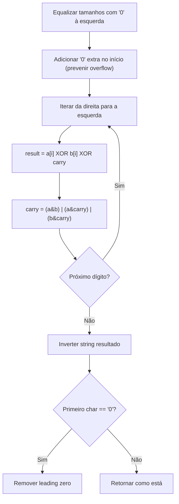
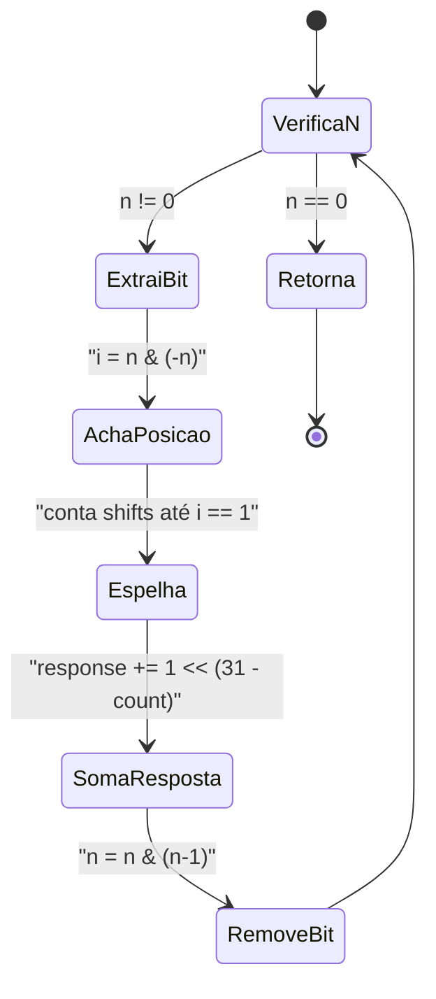
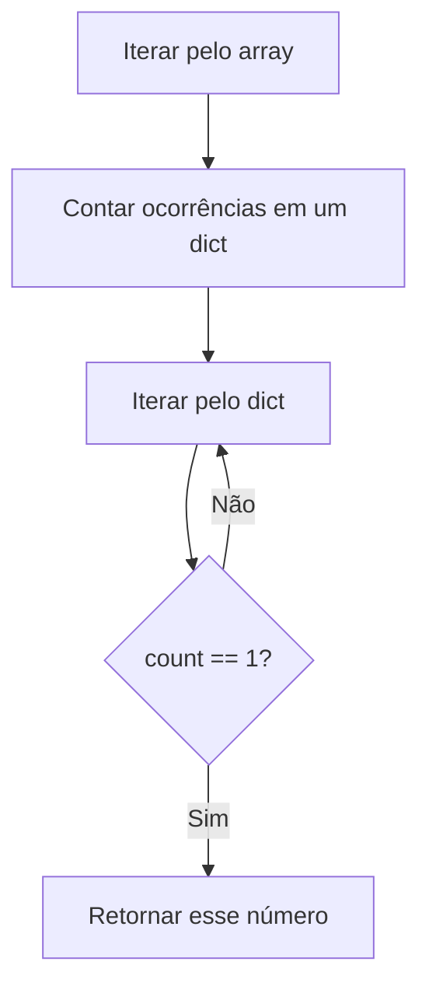

# 🧩 Bit Manipulation — Cheat Sheet de Revisão

---

### 📌 Add Binary (`add_binary.py`) — [LeetCode 67](https://leetcode.com/problems/add-binary/) (Easy)
* **Descrição breve:** Dadas duas strings binárias `a` e `b`, retorne a soma delas também como uma string binária.
* **Enunciado completo:**
> Dadas duas strings binárias `a` e `b`, retorne a soma delas como uma string binária.
>
> **Exemplo 1:** `a = "11"`, `b = "1"` → Saída: `"100"`
> **Exemplo 2:** `a = "1010"`, `b = "1011"` → Saída: `"10101"`
>
> **Constraints:**
> - `1 <= a.length, b.length <= 10⁴`
> - `a` e `b` consistem apenas dos caracteres `'0'` ou `'1'`
> - Cada string não contém zeros à esquerda, exceto o próprio número zero (`"0"`).
* **💡 Sacada (O Pulo do Gato):**
> Simular a soma binária manualmente, dígito a dígito, da direita para a esquerda, usando XOR para calcular o bit resultado e operações AND/OR para calcular o carry. Primeiro, equalizar os tamanhos das strings com zeros à esquerda e adicionar um `'0'` extra para prevenir overflow.
* **🧠 Modelo Mental:**

* **Complexidade esperada:** ⏱️ Tempo $O(n)$ | 💾 Espaço $O(n)$ — onde `n` é o comprimento da maior string.
* **Edge cases (Casos de Borda):**
  - Strings de tamanhos diferentes → tratado pelo padding com zeros.
  - Carry final gerando bit extra (ex: `"1" + "1" = "10"`) → tratado pelo `'0'` prefixado.
* **Core snippet:**
```python
def addBinary(self, a: str, b: str) -> str:
    if len(a) > len(b):
        b = '0' * (len(a) - len(b)) + b
    else:
        a = '0' * (len(b) - len(a)) + a
    a = '0' + a
    b = '0' + b
    response = ''
    carry = 0
    for idx in range(len(a) - 1, -1, -1):
        a_int = int(a[idx])
        b_int = int(b[idx])
        result = a_int ^ b_int ^ carry
        response += str(result)
        carry = (a_int & b_int) | (a_int & carry) | (carry & b_int)
    response = response[::-1]
    return response[1:] if response[0] == '0' else response
```

---

### 📌 Reverse Bits (`reverse_bit.py`) — [LeetCode 190](https://leetcode.com/problems/reverse-bits/) (Easy)
* **Descrição breve:** Dado um inteiro de 32 bits sem sinal, retorne o inteiro obtido ao inverter a ordem de todos os seus bits.
* **Enunciado completo:**
> Inverta os bits de um dado inteiro sem sinal de 32 bits.
>
> **Exemplo 1:**
> Entrada: `n = 43261596` (binário: `00000010100101000001111010011100`)
> Saída: `964176192` (binário: `00111001011110000010100101000000`)
> Explicação: A string de bits `00000010100101000001111010011100` representa o inteiro 43261596. Invertendo, obtemos `00111001011110000010100101000000`, que representa 964176192.
>
> **Exemplo 2:**
> Entrada: `n = 4294967293` (binário: `11111111111111111111111111111101`)
> Saída: `3221225471` (binário: `10111111111111111111111111111111`)
>
> **Constraints:**
> - A entrada é uma string binária de comprimento 32.
>
> **Follow-up:** Se esta função for chamada muitas vezes, como você a otimizaria?
* **💡 Sacada (O Pulo do Gato):**
> Usar manipulação de bits para extrair iterativamente o bit menos significativo ativo (`n & -n`), descobrir sua posição, e colocá-lo na posição "espelhada" dentro dos 32 bits (`size - posição - 1`). Depois, remover esse bit do número original com `n & (n-1)`.
* **🧠 Modelo Mental:**

* **Complexidade esperada:** ⏱️ Tempo $O(k)$ onde `k` é o número de bits setados (no pior caso $O(32)$) | 💾 Espaço $O(1)$.
* **Edge cases (Casos de Borda):**
  - `n = 0` → loop não executa, retorna 0.
  - Todos os 32 bits setados → cada bit é espelhado corretamente.
* **Core snippet:**
```python
def reverseBits(self, n: int) -> int:
    response = 0
    size_n = 32
    while n != 0:
        i = n & (-n)          # valor do bit menos significativo
        count = 0
        while i != 1:         # acha a posição desse bit
            count += 1
            i = i >> 1
        response += 1 << (size_n - count - 1)  # espelha a posição
        n = n & (n - 1)       # remove o bit menos significativo
    return response
```

---

### 📌 Single Number II (`single_number.py`) — [LeetCode 137](https://leetcode.com/problems/single-number-ii/) (Medium)
* **Descrição breve:** Dado um array onde todo elemento aparece três vezes exceto um que aparece apenas uma vez, encontre esse elemento único.
* **Enunciado completo:**
> Dado um array de inteiros `nums` onde cada elemento aparece **três vezes**, exceto um que aparece **exatamente uma vez**. Encontre o elemento único e retorne-o.
>
> Você **deve** implementar uma solução com complexidade de tempo linear e usar apenas espaço extra constante.
>
> **Exemplo 1:** `nums = [2,2,3,2]` → Saída: `3`
> **Exemplo 2:** `nums = [0,1,0,1,0,1,99]` → Saída: `99`
>
> **Constraints:**
> - `1 <= nums.length <= 3 * 10⁴`
> - `-2³¹ <= nums[i] <= 2³¹ - 1`
> - Cada elemento em `nums` aparece exatamente três vezes, exceto um elemento que aparece exatamente uma vez.
>
> **Nota:** O enunciado exige `O(n)` tempo e `O(1)` espaço. A solução ideal usa manipulação de bits com duas variáveis (`ones` e `twos`) para rastrear contagens de bits mod 3. A solução atual com hashmap usa `O(n)` espaço extra.
* **💡 Sacada (O Pulo do Gato):**
> Usar um hashmap (dicionário) para contar as ocorrências de cada número. Em seguida, iterar pelo mapa e retornar o número que possui contagem igual a 1. É a abordagem direta de contagem — simples e eficaz.
* **🧠 Modelo Mental:**

* **Complexidade esperada:** ⏱️ Tempo $O(n)$ | 💾 Espaço $O(n)$.
* **Edge cases (Casos de Borda):**
  - Array com apenas 1 elemento → é o próprio single number.
  - Todos os demais aparecem exatamente 3 vezes → garantido pelo enunciado.
  - Valores negativos → funcionam normalmente com hashmap.
* **Core snippet:**
```python
def singleNumber(self, nums: List[int]) -> int:
    mapping = {}
    for num in nums:
        if num not in mapping:
            mapping[num] = 0
        mapping[num] += 1
    for num, count in mapping.items():
        if count == 1:
            return num
```
