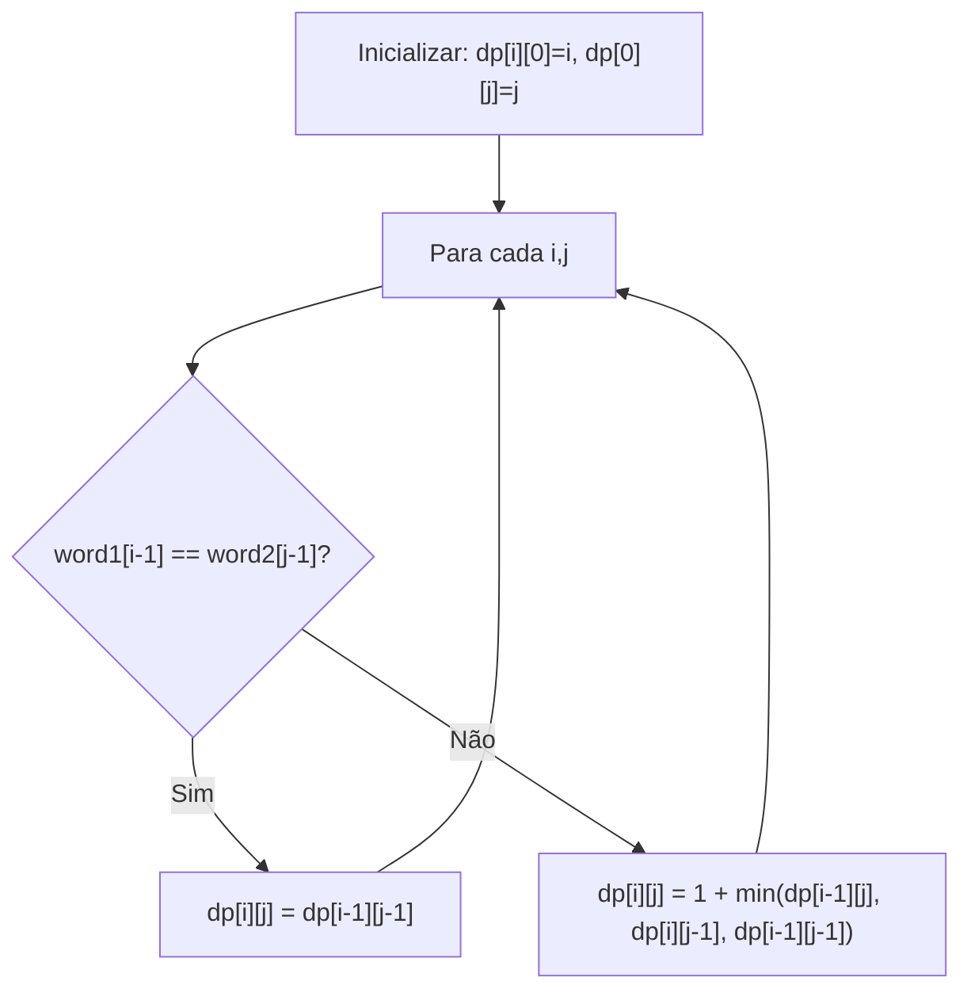
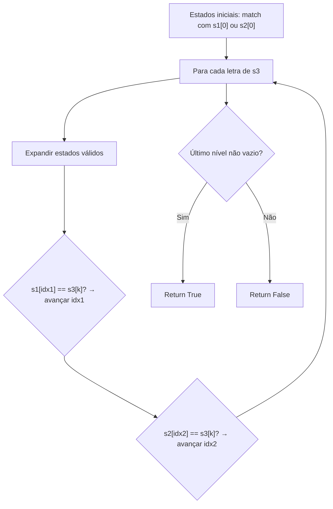
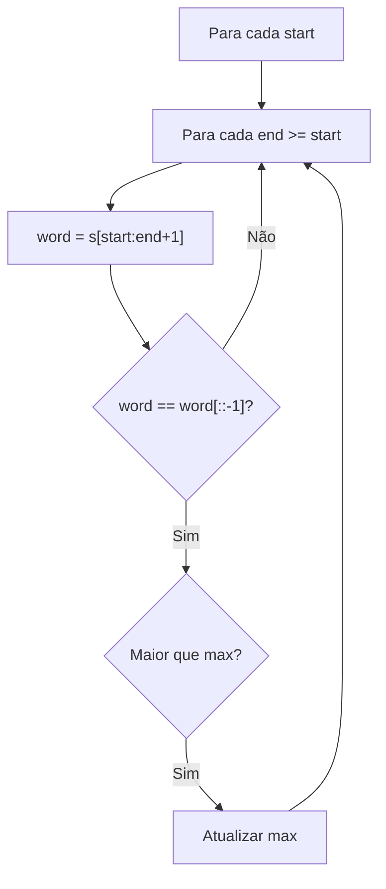
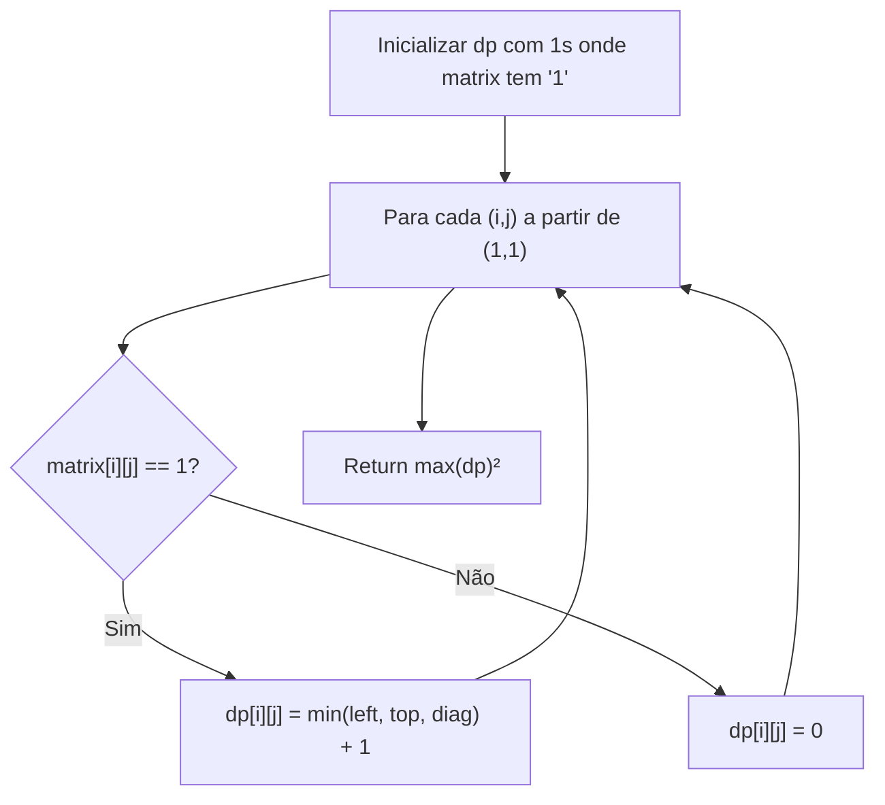
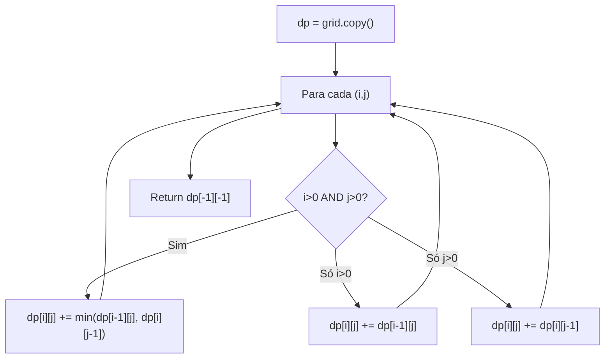
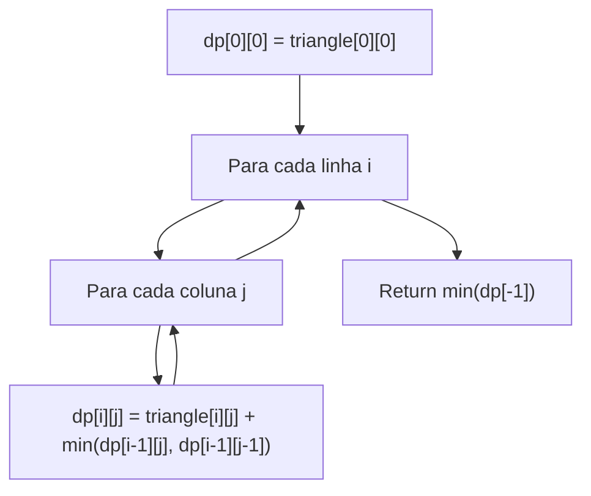
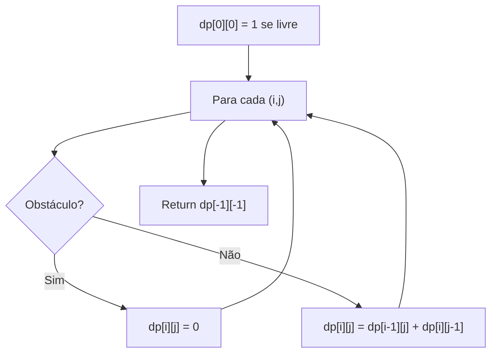

# 2D Dynamic Programming

---

### 📌 Edit Distance (`edit-distance.py`)

* **Descrição breve:** Calcula o número mínimo de operações (inserção, remoção, substituição) para transformar `word1` em `word2`.

* **💡 Sacada (O Pulo do Gato):**

> Matriz DP onde `dp[i][j]` = distância mínima entre `word1[:i]` e `word2[:j]`. Se as letras são iguais, `dp[i][j] = dp[i-1][j-1]`. Senão, é `1 + min(adição, deleção, substituição)`.

* **🧠 Modelo Mental:**



* **Complexidade esperada:** ⏱️ Tempo $O(m \times n)$ | 💾 Espaço $O(m \times n)$

* **Edge cases:** Uma das strings vazia; strings iguais (distância 0).

* **Core snippet:**

```python
def minDistance(word1, word2):
    if not word2: return len(word1)
    if not word1: return len(word2)
    dp = [[99999] * (len(word2)+1) for _ in range(len(word1)+1)]
    for j in range(len(dp[0])): dp[0][j] = j
    for i in range(len(dp)): dp[i][0] = i
    for i in range(1, len(dp)):
        for j in range(1, len(dp[0])):
            if word1[i-1] == word2[j-1]:
                dp[i][j] = dp[i-1][j-1]
            else:
                dp[i][j] = 1 + min(dp[i-1][j], dp[i][j-1], dp[i-1][j-1])
    return dp[-1][-1]
```

---

### 📌 Interleaving String (`interleaving-string.py`)

* **Descrição breve:** Verifica se `s3` é formada pelo entrelaçamento de `s1` e `s2` mantendo a ordem relativa.

* **💡 Sacada (O Pulo do Gato):**

> Para cada letra de `s3`, manter uma lista de estados `(idx1, idx2)` representando até onde consumimos de `s1` e `s2`. Se a letra de `s3` bate com `s1[idx1]` ou `s2[idx2]`, avançar o respectivo índice.

* **🧠 Modelo Mental:**



* **Complexidade esperada:** ⏱️ Tempo $O(m \times n)$ | 💾 Espaço $O(m \times n)$

* **Edge cases:** Strings `s1` ou `s2` vazias; `len(s3) != len(s1) + len(s2)`.

* **Core snippet:**

```python
def isInterleave(s1, s2, s3):
    if len(s3) != len(s1) + len(s2): return False
    if not s1 and not s2 and not s3: return True
    dp = [[]]
    if s1 and s1[0] == s3[0]: dp[0].append((1, 0))
    if s2 and s2[0] == s3[0]: dp[0].append((0, 1))
    for k in range(1, len(s3)):
        current = []
        for idx1, idx2 in dp[-1]:
            if idx1 < len(s1) and s1[idx1] == s3[k]:
                if (idx1+1, idx2) not in current: current.append((idx1+1, idx2))
            if idx2 < len(s2) and s2[idx2] == s3[k]:
                if (idx1, idx2+1) not in current: current.append((idx1, idx2+1))
        dp.append(current)
    return dp[-1] != []
```

---

### 📌 Longest Palindromic Substring (`longest-palindromic-substring.py`)

* **Descrição breve:** Encontra a maior substring palindrómica de uma string.

* **💡 Sacada (O Pulo do Gato):**

> Para cada par `(start, end)`, verificar se `s[start:end+1]` é palíndromo (`word == word[::-1]`). Guardar o maior encontrado. (Solução brute-force O(n³) — existem soluções O(n²) com expand around center.)

* **🧠 Modelo Mental:**



* **Complexidade esperada:** ⏱️ Tempo $O(n^3)$ | 💾 Espaço $O(n)$

* **Edge cases:** String com 1 caractere; string toda palindrómica; sem palíndromos maiores que 1.

* **Core snippet:**

```python
def longestPalindrome(s):
    max_len = 0
    max_sub = ''
    for start in range(len(s)):
        for end in range(start, len(s)):
            word = s[start:end+1]
            if word == word[::-1] and end - start + 1 > max_len:
                max_len = end - start + 1
                max_sub = word
    return max_sub
```

---

### 📌 Maximal Square (`maximal-square.py`)

* **Descrição breve:** Numa matriz binária, encontra o maior quadrado contendo apenas 1s e retorna a sua área.

* **💡 Sacada (O Pulo do Gato):**

> `dp[i][j]` guarda o tamanho máximo do quadrado em que `(i,j)` é a borda inferior direita. Se `matrix[i][j] == 1`, então `dp[i][j] = min(esquerda, cima, diagonal) + 1`. O mínimo dos três vizinhos limita o quadrado.

* **🧠 Modelo Mental:**



* **Complexidade esperada:** ⏱️ Tempo $O(m \times n)$ | 💾 Espaço $O(m \times n)$

* **Edge cases:** Matriz toda de 0s; matriz 1×1; linha ou coluna única.

* **Core snippet:**

```python
def maximalSquare(matrix):
    m, n = len(matrix), len(matrix[0])
    dp = [[0]*n for _ in range(m)]
    for i in range(m):
        for j in range(n):
            if matrix[i][j] == '1': dp[i][j] = 1
    for i in range(1, m):
        for j in range(1, n):
            if int(matrix[i][j]) == 1:
                dp[i][j] = min(dp[i][j-1], dp[i-1][j], dp[i-1][j-1]) + 1
    return max(max(row) for row in dp) ** 2
```

---

### 📌 Minimum Path Sum (`min_path_sum.py`)

* **Descrição breve:** Numa grelha com valores, encontra o caminho do canto superior-esquerdo ao inferior-direito que minimiza a soma (só se move para direita ou baixo).

* **💡 Sacada (O Pulo do Gato):**

> `dp[i][j] = grid[i][j] + min(dp[i-1][j], dp[i][j-1])`. Cada célula só pode ser alcançada vindo de cima ou da esquerda. Na primeira linha/coluna, há apenas um caminho.

* **🧠 Modelo Mental:**



* **Complexidade esperada:** ⏱️ Tempo $O(m \times n)$ | 💾 Espaço $O(1)$ (modifica in-place)

* **Edge cases:** Grelha 1×1; grelha com uma linha ou coluna.

* **Core snippet:**

```python
def minPathSum(grid):
    dp = grid.copy()
    for i in range(len(grid)):
        for j in range(len(grid[0])):
            if i > 0 and j > 0:
                dp[i][j] += min(dp[i-1][j], dp[i][j-1])
            elif i > 0: dp[i][j] += dp[i-1][j]
            elif j > 0: dp[i][j] += dp[i][j-1]
    return dp[-1][-1]
```

---

### 📌 Triangle (`triangle.py`)

* **Descrição breve:** Dado um triângulo de números, encontra o caminho do topo à base com a menor soma.

* **💡 Sacada (O Pulo do Gato):**

> DP bottom-up no triângulo: `dp[i][j]` guarda a menor soma para chegar ao elemento `(i,j)`. Cada posição pode receber do `(i-1, j)` ou `(i-1, j-1)` da linha anterior. Resposta: menor valor da última linha.

* **🧠 Modelo Mental:**



* **Complexidade esperada:** ⏱️ Tempo $O(n^2)$ | 💾 Espaço $O(n^2)$

* **Edge cases:** Triângulo com uma linha; valores negativos.

* **Core snippet:**

```python
def minimumTotal(triangle):
    dp = [[-99999]*len(triangle[i]) for i in range(len(triangle))]
    dp[0][0] = triangle[0][0]
    for i in range(1, len(triangle)):
        for j in range(len(triangle[i])):
            max_prev = len(triangle[i-1]) - 1
            dp[i][j] = min(dp[i-1][min(max_prev, j)],
                           dp[i-1][max(0, j-1)]) + triangle[i][j]
    return min(v for v in dp[-1] if v != -99999)
```

---

### 📌 Unique Paths II (`unique-paths-ii.py`)

* **Descrição breve:** Conta o número de caminhos únicos do canto superior-esquerdo ao inferior-direito, com obstáculos.

* **💡 Sacada (O Pulo do Gato):**

> `dp[i][j]` = número de formas de chegar a `(i,j)`. Se há obstáculo, `dp[i][j] = 0`. Senão, `dp[i][j] = dp[i-1][j] + dp[i][j-1]`. Base: `dp[0][0] = 1` se não tem obstáculo.

* **🧠 Modelo Mental:**



* **Complexidade esperada:** ⏱️ Tempo $O(m \times n)$ | 💾 Espaço $O(m \times n)$

* **Edge cases:** Obstáculo no início ou no destino (return 0); grelha sem obstáculos.

* **Core snippet:**

```python
def uniquePathsWithObstacles(grid):
    dp = [[0]*len(grid[0]) for _ in range(len(grid))]
    for i in range(len(grid)):
        for j in range(len(grid[0])):
            if grid[i][j] == 1: continue
            if i == 0 and j == 0: dp[i][j] = 1
            elif i > 0 and j > 0: dp[i][j] = dp[i-1][j] + dp[i][j-1]
            elif i > 0: dp[i][j] = dp[i-1][j]
            elif j > 0: dp[i][j] = dp[i][j-1]
    return dp[-1][-1]
```

---
