# Array

---

### 📌 Contains Duplicate (`contains_duplicate.py`)

* **Descrição breve:** Verifica se um array contém algum elemento duplicado.

* **💡 Sacada (O Pulo do Gato):**

> Ordenar o array e verificar se dois elementos consecutivos são iguais. Alternativa O(n) com hash set.

* **🧠 Modelo Mental:**

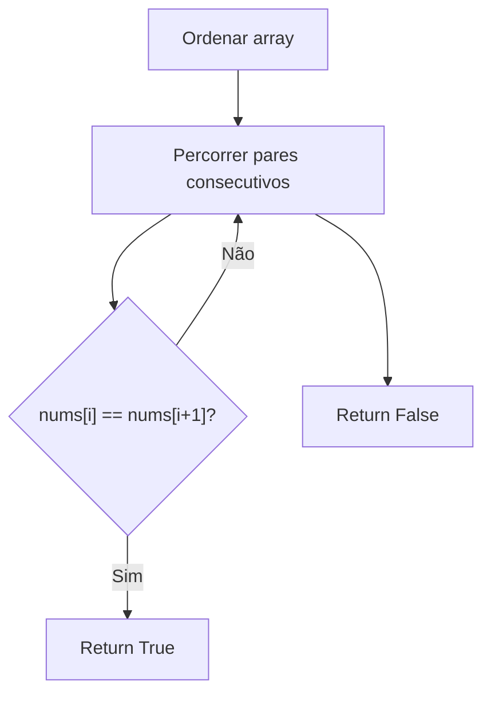
```mermaid
graph TD
    A["Ordenar array"] --> B["Percorrer pares consecutivos"]
    B --> C{"nums[i] == nums[i+1]?"}
    C -- Sim --> D["Return True"]
    C -- Não --> B
    B --> E["Return False"]
```

* **Complexidade esperada:** ⏱️ Tempo $O(n \log n)$ | 💾 Espaço $O(1)$

* **Edge cases:** Array vazio ou com 1 elemento (False).

* **Core snippet:**

```python
def containsDuplicate(nums):
    nums.sort()
    for i in range(len(nums) - 1):
        if nums[i] == nums[i + 1]:
            return True
    return False
```

---

### 📌 Gas Station (`gas_station.py`)

* **Descrição breve:** Postos de gasolina em círculo — encontra o índice de início para completar o circuito.

* **💡 Sacada (O Pulo do Gato):**

> Manter uma soma corrente de `gas[i] - cost[i]`. Se ficar negativa, o próximo índice é o novo candidato. A ideia é que nenhum índice antes do ponto onde a soma fica negativa pode ser um início válido.

* **🧠 Modelo Mental:**

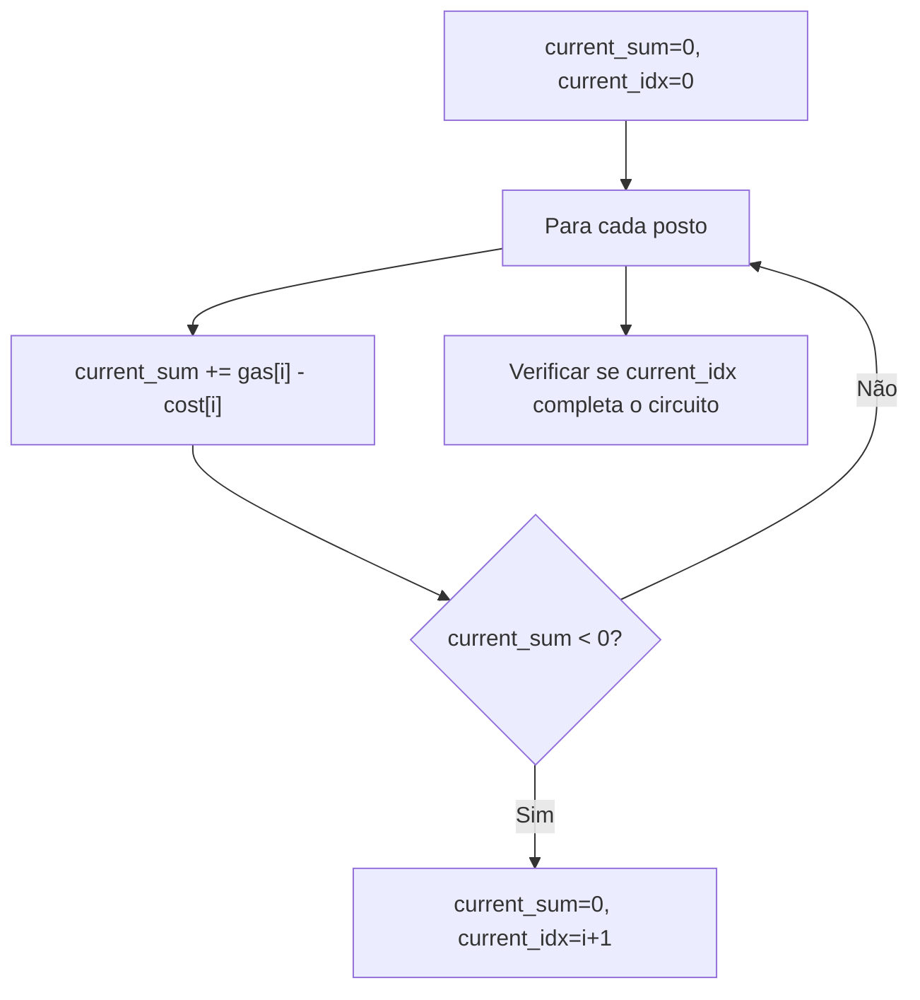
```mermaid
graph TD
    A["current_sum=0, current_idx=0"] --> B["Para cada posto"]
    B --> C["current_sum += gas[i] - cost[i]"]
    C --> D{"current_sum < 0?"}
    D -- Sim --> E["current_sum=0, current_idx=i+1"]
    D -- Não --> B
    B --> F["Verificar se current_idx completa o circuito"]
```

* **Complexidade esperada:** ⏱️ Tempo $O(n)$ | 💾 Espaço $O(1)$

* **Edge cases:** Impossível completar (return -1); múltiplas soluções (garantido ser única).

* **Core snippet:**

```python
def canCompleteCircuit(gas, cost):
    size = len(gas)
    max_idx, current_idx, current_sum = -1, 0, 0
    max_sum = -1
    for i in range(2 * size):
        idx = i % size
        current_sum += gas[idx] - cost[idx]
        if current_sum < 0:
            current_sum = 0
            current_idx = idx + 1
        if current_sum > max_sum:
            max_idx = current_idx
            max_sum = current_sum
    saldo = 0
    for i in range(max_idx, size + max_idx):
        saldo += gas[i % size] - cost[i % size]
        if saldo < 0: return -1
    return max_idx
```

---

### 📌 H-Index (`h_index.py`)

* **Descrição breve:** Calcula o h-index de um investigador: o maior h tal que h artigos têm pelo menos h citações.

* **💡 Sacada (O Pulo do Gato):**

> Usar Count Sort para ordenar as citações. Depois percorrer de trás para frente: se o valor na posição é >= h+1, incrementar h.

* **🧠 Modelo Mental:**

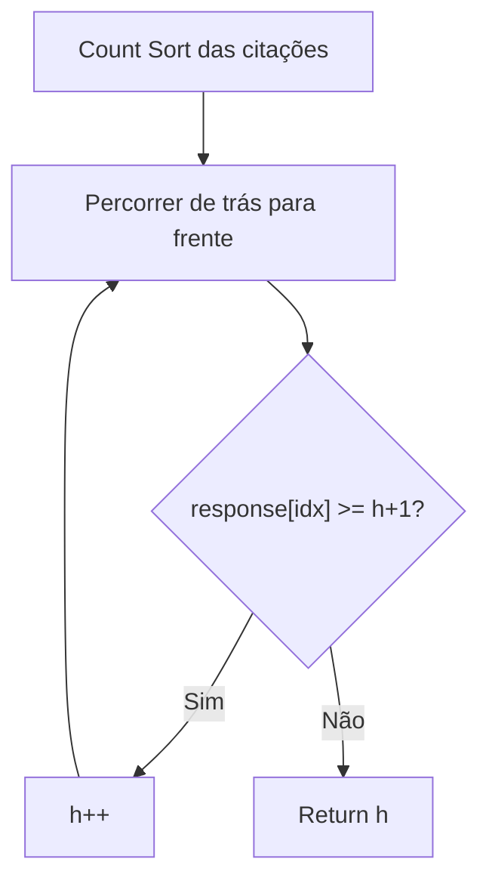
```mermaid
graph TD
    A["Count Sort das citações"] --> B["Percorrer de trás para frente"]
    B --> C{"response[idx] >= h+1?"}
    C -- Sim --> D["h++"]
    C -- Não --> E["Return h"]
    D --> B
```

* **Complexidade esperada:** ⏱️ Tempo $O(n + k)$ onde $k$ é max citação | 💾 Espaço $O(k)$

* **Edge cases:** Todas citações 0; uma única publicação.

* **Core snippet:**

```python
def hIndex(citations):
    max_val = max(citations)
    count = [0] * (max_val + 1)
    for c in citations: count[c] += 1
    for i in range(1, len(count)): count[i] += count[i-1]
    response = [0] * len(citations)
    for i in range(len(citations)-1, -1, -1):
        pos = count[citations[i]] - 1
        response[pos] = citations[i]
        count[citations[i]] -= 1
    h = 0
    for i in range(len(response)-1, -1, -1):
        if response[i] >= h + 1: h += 1
        else: return h
    return h
```

---

### 📌 Intersection of Two Arrays II (`intersection_two_arrays.py`)

* **Descrição breve:** Retorna a interseção de dois arrays (incluindo duplicados).

* **💡 Sacada (O Pulo do Gato):**

> Ordenar ambos os arrays. Dois ponteiros: se iguais, adicionar e avançar ambos. Se um é menor, avançar esse ponteiro.

* **🧠 Modelo Mental:**

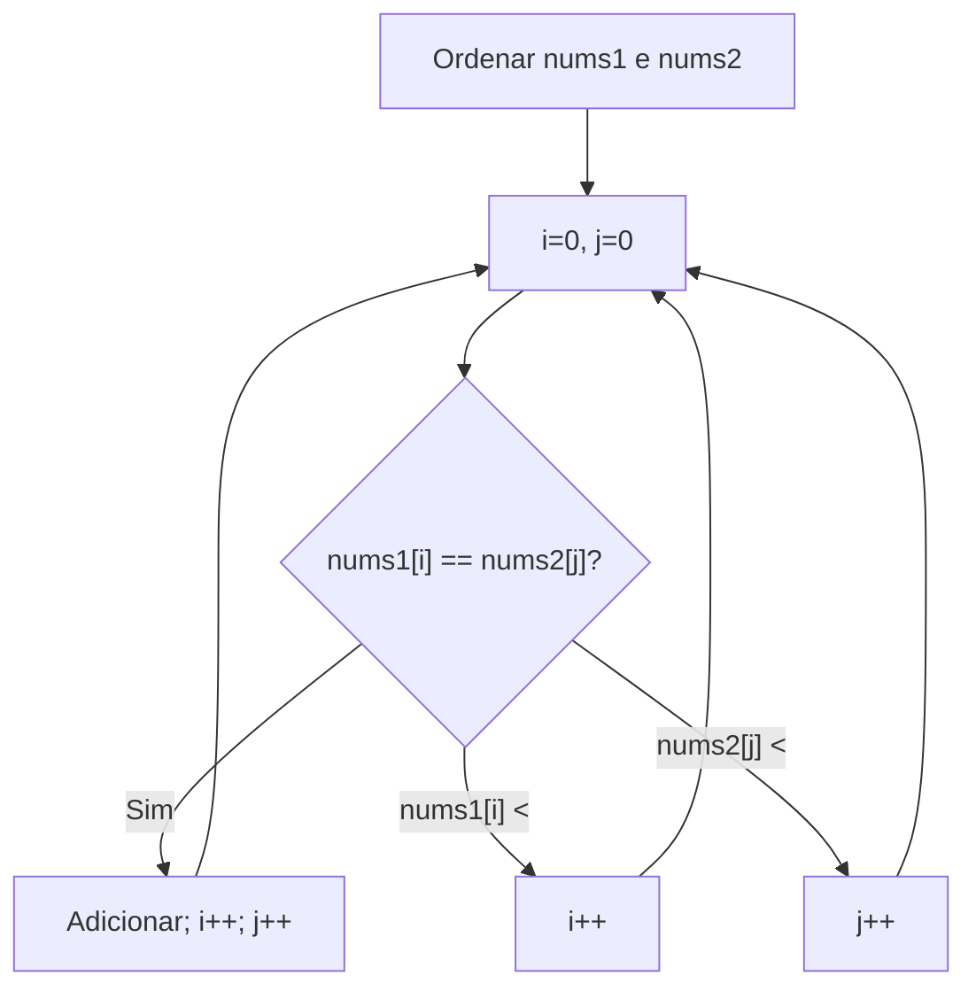
```mermaid
graph TD
    A["Ordenar nums1 e nums2"] --> B["i=0, j=0"]
    B --> C{"nums1[i] == nums2[j]?"}
    C -- Sim --> D["Adicionar; i++; j++"]
    C -- "nums1[i] <" --> E["i++"]
    C -- "nums2[j] <" --> F["j++"]
    D --> B
    E --> B
    F --> B
```

* **Complexidade esperada:** ⏱️ Tempo $O(n \log n + m \log m)$ | 💾 Espaço $O(\min(n,m))$

* **Edge cases:** Arrays sem interseção; arrays idênticos; um array vazio.

* **Core snippet:**

```python
def intersect(nums1, nums2):
    nums1.sort(); nums2.sort()
    i, j, response = 0, 0, []
    while i < len(nums1) and j < len(nums2):
        if nums1[i] == nums2[j]:
            response.append(nums1[i]); i += 1; j += 1
        elif nums1[i] < nums2[j]: i += 1
        else: j += 1
    return response
```

---

### 📌 Jump Game (`jump_game.py`)

* **Descrição breve:** Dado um array onde cada posição indica o salto máximo, verifica se é possível chegar ao fim.

* **💡 Sacada (O Pulo do Gato):**

> Manter um `max_idx` que guarda até onde conseguimos chegar. Se o índice atual ultrapassa `max_idx`, é impossível. Atualizar `max_idx` a cada passo.

* **🧠 Modelo Mental:**

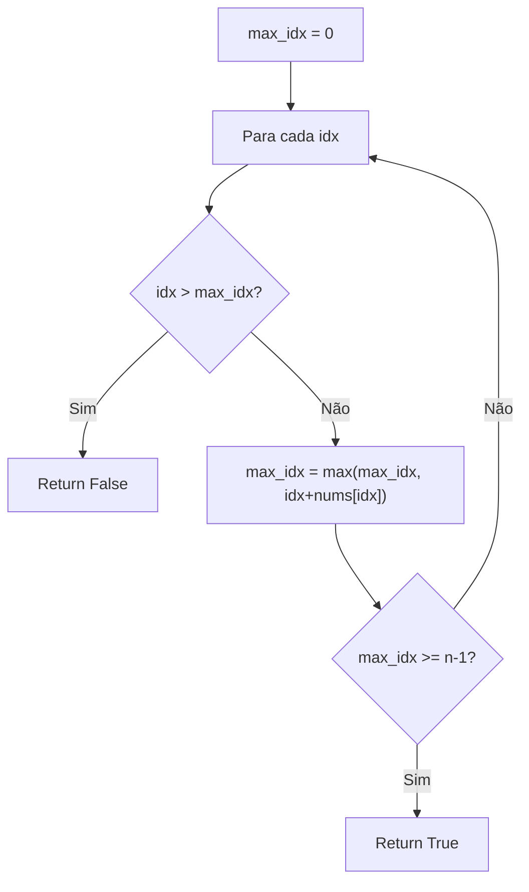
```mermaid
graph TD
    A["max_idx = 0"] --> B["Para cada idx"]
    B --> C{"idx > max_idx?"}
    C -- Sim --> D["Return False"]
    C -- Não --> E["max_idx = max(max_idx, idx+nums[idx])"]
    E --> F{"max_idx >= n-1?"}
    F -- Sim --> G["Return True"]
    F -- Não --> B
```

* **Complexidade esperada:** ⏱️ Tempo $O(n)$ | 💾 Espaço $O(1)$

* **Edge cases:** Array com 1 elemento (True); primeiro elemento é 0 e n > 1 (False).

* **Core snippet:**

```python
def canJump(nums):
    max_idx = 0
    for idx in range(len(nums)):
        if idx > max_idx: return False
        max_idx = max(max_idx, idx + nums[idx])
        if max_idx >= len(nums) - 1: return True
    return False
```

---

### 📌 Jump Game II (`jump_game_2.py`)

* **Descrição breve:** Número mínimo de saltos para chegar ao fim do array.

* **💡 Sacada (O Pulo do Gato):**

> Greedy: manter um `max_idx` corrente e um `temp_max_idx`. Quando atingimos o `max_idx`, contamos um salto e atualizamos com o `temp_max_idx` (o máximo alcançável a partir dos índices visitados).

* **🧠 Modelo Mental:**

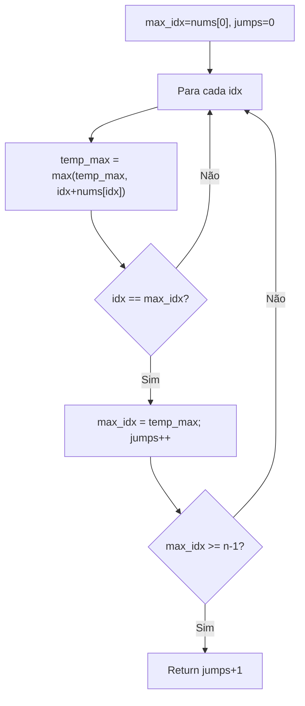
```mermaid
graph TD
    A["max_idx=nums[0], jumps=0"] --> B["Para cada idx"]
    B --> C["temp_max = max(temp_max, idx+nums[idx])"]
    C --> D{"idx == max_idx?"}
    D -- Sim --> E["max_idx = temp_max; jumps++"]
    D -- Não --> B
    E --> F{"max_idx >= n-1?"}
    F -- Sim --> G["Return jumps+1"]
    F -- Não --> B
```

* **Complexidade esperada:** ⏱️ Tempo $O(n)$ | 💾 Espaço $O(1)$

* **Edge cases:** Array com 1 elemento (0 saltos); todos os valores 1.

* **Core snippet:**

```python
def jump(nums):
    max_idx = nums[0]
    temp_max = nums[0]
    jumps = 0
    for idx in range(len(nums) - 1):
        temp_max = max(temp_max, idx + nums[idx])
        if idx == max_idx:
            max_idx = temp_max
            jumps += 1
        if max_idx >= len(nums) - 1:
            return jumps + 1
    return jumps
```

---

### 📌 Plus One (`plus_one.py`)

* **Descrição breve:** Dado um array representando um número, soma 1 e retorna o resultado como array.

* **💡 Sacada (O Pulo do Gato):**

> Percorrer de trás para frente. Se `digit + 1 == 10`, colocar 0 e propagar carry. Se chegar ao início com carry, inserir 1 no início.

* **🧠 Modelo Mental:**

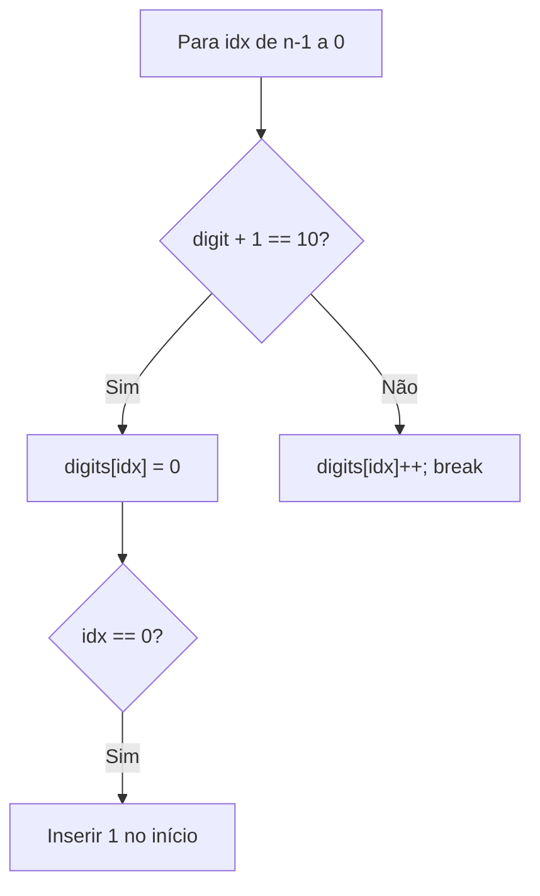
```mermaid
graph TD
    A["Para idx de n-1 a 0"] --> B{"digit + 1 == 10?"}
    B -- Sim --> C["digits[idx] = 0"]
    C --> D{"idx == 0?"}
    D -- Sim --> E["Inserir 1 no início"]
    B -- Não --> F["digits[idx]++; break"]
```

* **Complexidade esperada:** ⏱️ Tempo $O(n)$ | 💾 Espaço $O(1)$

* **Edge cases:** `[9,9,9]` → `[1,0,0,0]`; `[0]` → `[1]`.

* **Core snippet:**

```python
def plusOne(digits):
    for idx in range(len(digits)-1, -1, -1):
        if digits[idx] + 1 == 10:
            digits[idx] = 0
            if idx == 0: digits.insert(0, 1)
        else:
            digits[idx] += 1; break
    return digits
```

---

### 📌 Product of Array Except Self (`product_of_array.py`)

* **Descrição breve:** Para cada posição, retorna o produto de todos os elementos exceto o próprio.

* **💡 Sacada (O Pulo do Gato):**

> Usar dois arrays: prefixo (produto acumulado da esquerda) e sufixo (da direita). Para cada `i`, o resultado é `prefix[i-1] * suffix[i+1]`. Evita divisão.

* **🧠 Modelo Mental:**

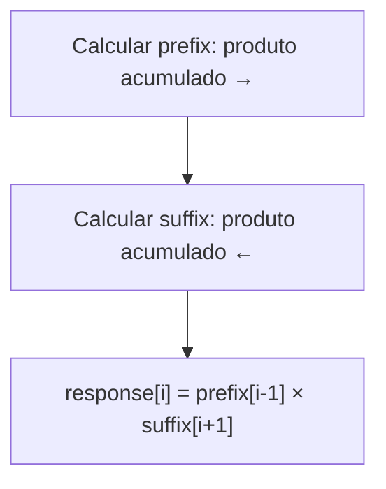
```mermaid
graph TD
    A["Calcular prefix: produto acumulado →"] --> B["Calcular suffix: produto acumulado ←"]
    B --> C["response[i] = prefix[i-1] × suffix[i+1]"]
```

* **Complexidade esperada:** ⏱️ Tempo $O(n)$ | 💾 Espaço $O(n)$

* **Edge cases:** Array com zeros; array com um único zero; array com dois elementos.

* **Core snippet:**

```python
def productExceptSelf(nums):
    n = len(nums)
    forward = nums.copy()
    backward = nums.copy()
    for i in range(1, n): forward[i] *= forward[i-1]
    for i in range(n-2, -1, -1): backward[i] *= backward[i+1]
    response = [0] * n
    for i in range(n):
        f = forward[i-1] if i > 0 else 1
        b = backward[i+1] if i < n-1 else 1
        response[i] = f * b
    return response
```

---

### 📌 Remove Duplicates from Sorted Array (`remove_duplicates_from_sorted_array.py`)

* **Descrição breve:** Remove duplicados in-place de um array ordenado. Retorna o número de elementos únicos.

* **💡 Sacada (O Pulo do Gato):**

> Ponteiro `k` representa a próxima posição para um valor diferente. Quando encontramos um valor diferente do anterior, colocamos em `nums[k]` e incrementamos `k`.

* **🧠 Modelo Mental:**

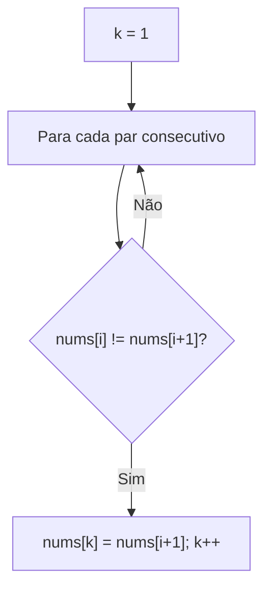
```mermaid
graph TD
    A["k = 1"] --> B["Para cada par consecutivo"]
    B --> C{"nums[i] != nums[i+1]?"}
    C -- Sim --> D["nums[k] = nums[i+1]; k++"]
    C -- Não --> B
```

* **Complexidade esperada:** ⏱️ Tempo $O(n)$ | 💾 Espaço $O(1)$

* **Edge cases:** Array com todos iguais; array já sem duplicados.

* **Core snippet:**

```python
def removeDuplicates(nums):
    k = 1
    for i in range(len(nums) - 1):
        if nums[i] != nums[i + 1]:
            nums[k] = nums[i + 1]
            k += 1
    return k
```

---

### 📌 Remove Duplicates from Sorted Array II (`remove_duplicates_from_sorted_array_2.py`)

* **Descrição breve:** Remove duplicados mantendo no máximo 2 ocorrências de cada valor.

* **💡 Sacada (O Pulo do Gato):**

> Um ponteiro `k` que anda, representando o novo array. Um contador de iguais. Quando o contador chega a 2, paramos de incrementar `k` até que um valor diferente apareça.

* **🧠 Modelo Mental:**

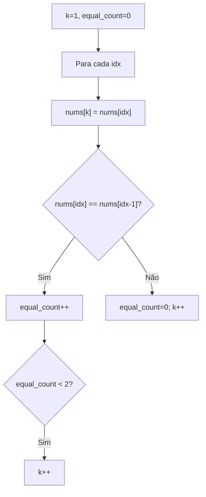
```mermaid
graph TD
    A["k=1, equal_count=0"] --> B["Para cada idx"]
    B --> C["nums[k] = nums[idx]"]
    C --> D{"nums[idx] == nums[idx-1]?"}
    D -- Sim --> E["equal_count++"]
    E --> F{"equal_count < 2?"}
    F -- Sim --> G["k++"]
    D -- Não --> H["equal_count=0; k++"]
```

* **Complexidade esperada:** ⏱️ Tempo $O(n)$ | 💾 Espaço $O(1)$

* **Edge cases:** Todos os valores iguais; nenhum duplicado; array com 1-2 elementos.

* **Core snippet:**

```python
def removeDuplicates(nums):
    k, equal_count = 1, 0
    for idx in range(1, len(nums)):
        nums[k] = nums[idx]
        if nums[idx] == nums[idx - 1]:
            equal_count += 1
            if equal_count < 2: k += 1
        else:
            k += 1; equal_count = 0
    return k
```

---

### 📌 Reverse Words in a String (`reverse_word.py`)

* **Descrição breve:** Inverte a ordem das palavras numa string, removendo espaços extra.

* **💡 Sacada (O Pulo do Gato):**

> Percorrer a string de trás para frente, construindo cada palavra com um deque (appendleft). Quando encontramos espaço, adicionamos a palavra construída à resposta.

* **🧠 Modelo Mental:**

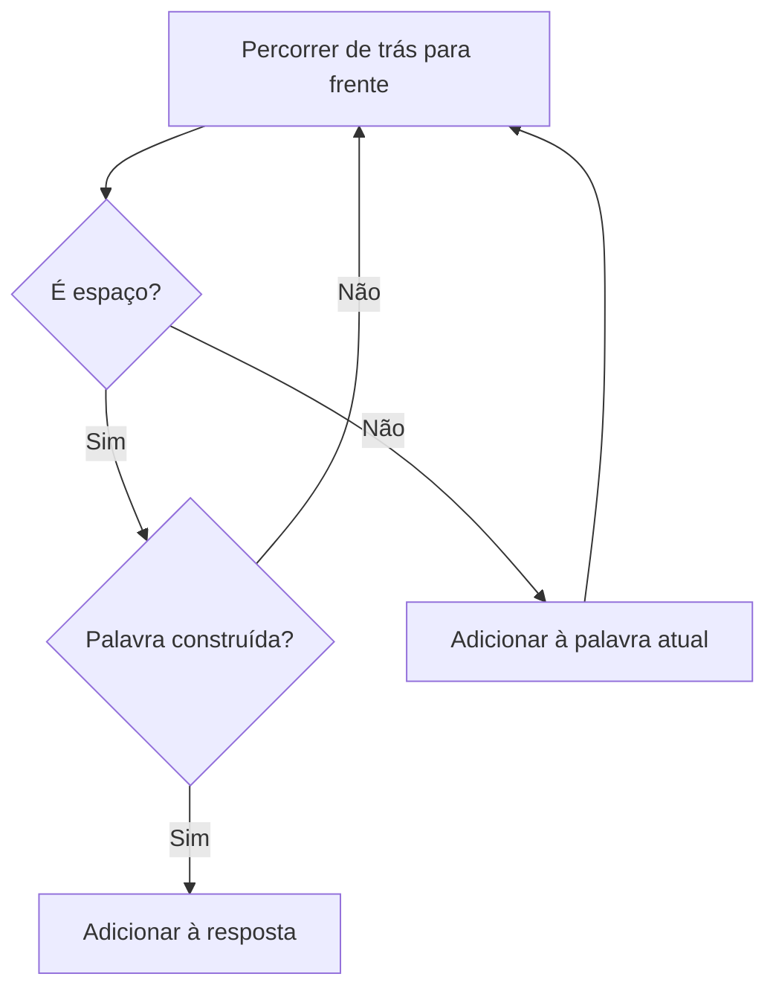
```mermaid
graph TD
    A["Percorrer de trás para frente"] --> B{"É espaço?"}
    B -- Sim --> C{"Palavra construída?"}
    C -- Sim --> D["Adicionar à resposta"]
    C -- Não --> A
    B -- Não --> E["Adicionar à palavra atual"]
    E --> A
```

* **Complexidade esperada:** ⏱️ Tempo $O(n)$ | 💾 Espaço $O(n)$

* **Edge cases:** Múltiplos espaços consecutivos; espaços no início/fim.

* **Core snippet:**

```python
def reverseWords(s):
    reversed_str = ''
    current_word = deque()
    for idx in range(len(s)-1, -1, -1):
        if s[idx] == ' ':
            if current_word:
                if reversed_str: reversed_str += ' '
                reversed_str += ''.join(current_word)
                current_word = deque()
        else:
            current_word.appendleft(s[idx])
    if current_word:
        if reversed_str: reversed_str += ' '
        reversed_str += ''.join(current_word)
    return reversed_str
```

---

### 📌 Rotate Array (`rotate_array.py`)

* **Descrição breve:** Roda um array `k` posições para a direita in-place.

* **💡 Sacada (O Pulo do Gato):**

> Ciclos de permutação: cada elemento vai para `(idx + k) % n`. Quando voltamos ao índice inicial, avançamos 1 para cobrir todos os ciclos.

* **🧠 Modelo Mental:**

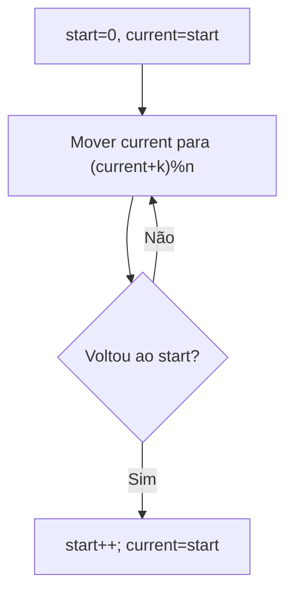
```mermaid
graph TD
    A["start=0, current=start"] --> B["Mover current para (current+k)%n"]
    B --> C{"Voltou ao start?"}
    C -- Sim --> D["start++; current=start"]
    C -- Não --> B
```

* **Complexidade esperada:** ⏱️ Tempo $O(n)$ | 💾 Espaço $O(1)$

* **Edge cases:** `k = 0` ou `k = n` (sem mudança); `k > n`.

* **Core snippet:**

```python
def rotate(nums, k):
    n = len(nums)
    start = 0
    current = start
    current_val = nums[current]
    for _ in range(n):
        next_idx = (current + k) % n
        next_val = nums[next_idx]
        nums[next_idx] = current_val
        current_val = next_val
        current = next_idx
        if current == start and start < n - 1:
            start += 1
            current = start
            current_val = nums[current]
```

---

### 📌 Rotate Image (`rotate_image.py`)

* **Descrição breve:** Roda uma matriz `n×n` 90° no sentido horário in-place.

* **💡 Sacada (O Pulo do Gato):**

> Transpor a matriz (trocar `[i][j]` com `[j][i]`) e depois inverter cada linha. Estas duas operações combinadas dão uma rotação de 90°.

* **🧠 Modelo Mental:**

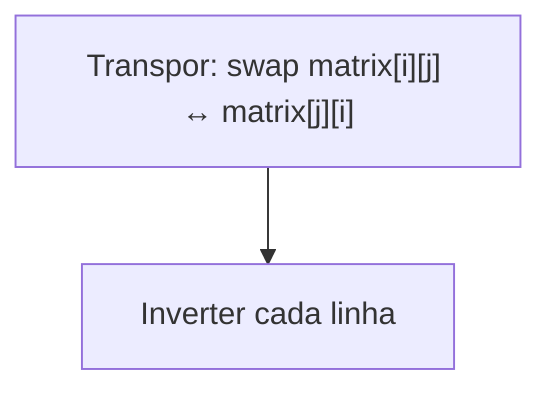
```mermaid
graph TD
    A["Transpor: swap matrix[i][j] ↔ matrix[j][i]"] --> B["Inverter cada linha"]
```

* **Complexidade esperada:** ⏱️ Tempo $O(n^2)$ | 💾 Espaço $O(1)$

* **Edge cases:** Matriz 1×1; matriz 2×2.

* **Core snippet:**

```python
def rotate(matrix):
    n = len(matrix)
    for i in range(n):
        for j in range(i, n):
            matrix[i][j], matrix[j][i] = matrix[j][i], matrix[i][j]
    for i in range(n):
        for j in range(n // 2):
            matrix[i][j], matrix[i][n-j-1] = matrix[i][n-j-1], matrix[i][j]
```

---

### 📌 Single Number (`single_number.py`)

* **Descrição breve:** Num array onde todos aparecem duas vezes exceto um, encontra o único.

* **💡 Sacada (O Pulo do Gato):**

> XOR de todos os elementos: `a ^ a = 0` e `a ^ 0 = a`. Todos os pares cancelam-se, sobrando o único.

* **🧠 Modelo Mental:**

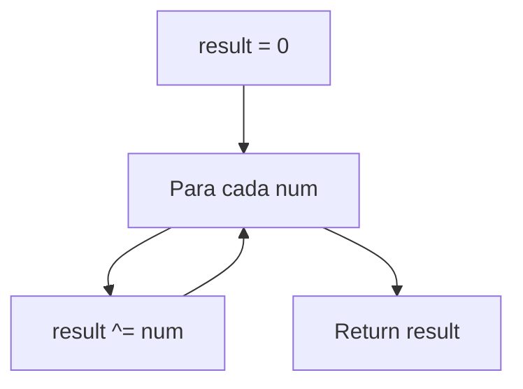
```mermaid
graph TD
    A["result = 0"] --> B["Para cada num"]
    B --> C["result ^= num"]
    C --> B
    B --> D["Return result"]
```

* **Complexidade esperada:** ⏱️ Tempo $O(n)$ | 💾 Espaço $O(1)$

* **Edge cases:** Array com 1 elemento.

* **Core snippet:**

```python
def singleNumber(nums):
    result = 0
    for num in nums:
        result ^= num
    return result
```

---

### 📌 Valid Sudoku (`sudoku.py`)

* **Descrição breve:** Verifica se um tabuleiro de Sudoku 9×9 é válido (sem repetições em linhas, colunas e sub-grids 3×3).

* **💡 Sacada (O Pulo do Gato):**

> Três verificações separadas: linhas, colunas e blocos 3×3. Para cada uma, usar um array de 9 booleans para detetar repetições.

* **🧠 Modelo Mental:**

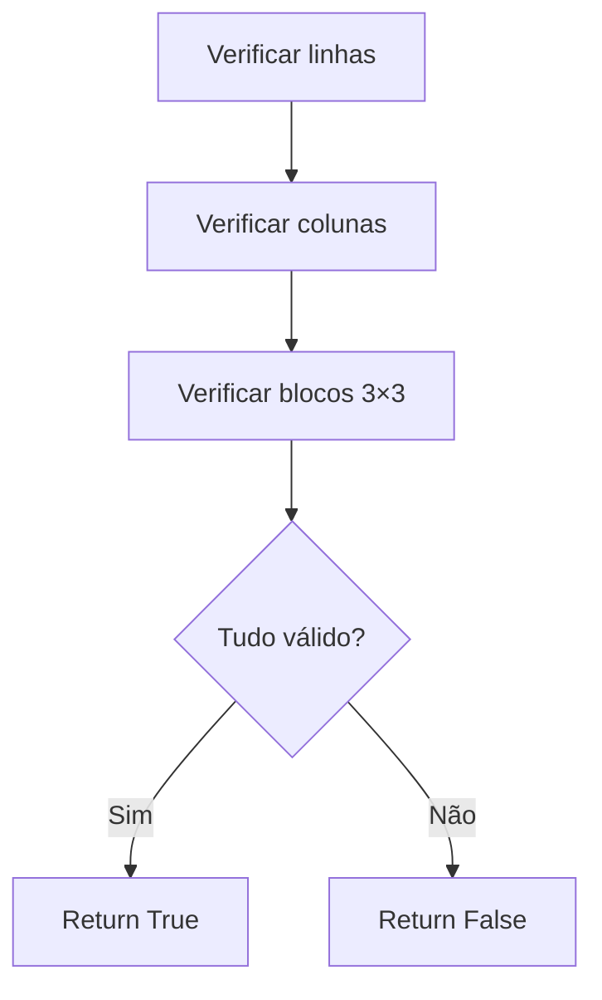
```mermaid
graph TD
    A["Verificar linhas"] --> B["Verificar colunas"]
    B --> C["Verificar blocos 3×3"]
    C --> D{"Tudo válido?"}
    D -- Sim --> E["Return True"]
    D -- Não --> F["Return False"]
```

* **Complexidade esperada:** ⏱️ Tempo $O(1)$ (tabuleiro fixo 9×9) | 💾 Espaço $O(1)$

* **Edge cases:** Tabuleiro quase vazio; número inválido (>9 ou <1).

* **Core snippet:**

```python
def isValidSudoku(board):
    def check_group(cells):
        seen = [False] * 9
        for cell in cells:
            if cell != '.':
                idx = int(cell) - 1
                if seen[idx]: return False
                seen[idx] = True
        return True
    for row in board:
        if not check_group(row): return False
    for j in range(9):
        if not check_group([board[i][j] for i in range(9)]): return False
    for bi in range(0, 9, 3):
        for bj in range(0, 9, 3):
            if not check_group([board[bi+r][bj+c] for r in range(3) for c in range(3)]):
                return False
    return True
```

---

### 📌 Two Sum (`two_sum.py`)

* **Descrição breve:** Encontra dois índices cujos valores somam ao target.

* **💡 Sacada (O Pulo do Gato):**

> Ordenar o array e usar dois ponteiros (início e fim). Ajustar ponteiros consoante a soma ser maior ou menor que o target. Depois, mapear de volta para os índices originais.

* **🧠 Modelo Mental:**

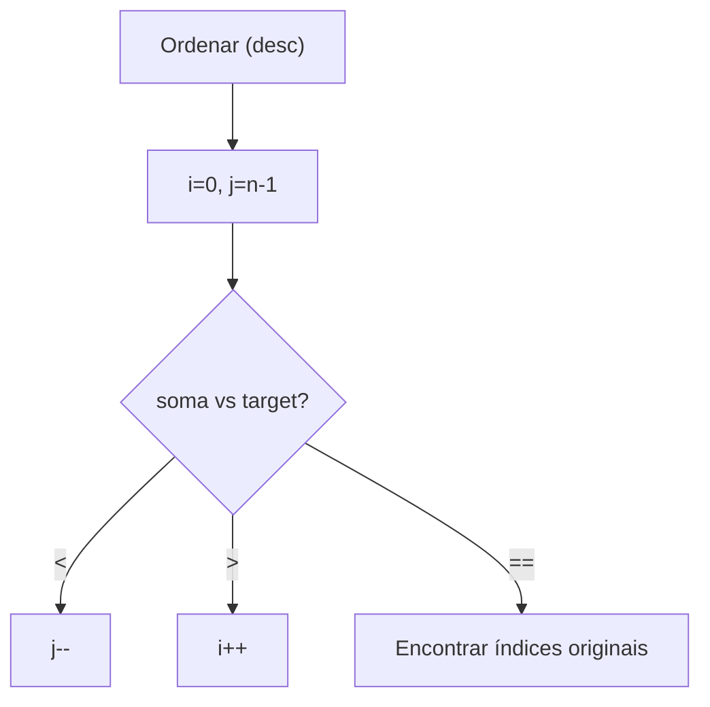
```mermaid
graph TD
    A["Ordenar (desc)"] --> B["i=0, j=n-1"]
    B --> C{"soma vs target?"}
    C -- "<" --> D["j--"]
    C -- ">" --> E["i++"]
    C -- "==" --> F["Encontrar índices originais"]
```

* **Complexidade esperada:** ⏱️ Tempo $O(n \log n)$ | 💾 Espaço $O(n)$

* **Edge cases:** Dois elementos iguais (ex: `[3,3]`, target 6); solução no início e fim.

* **Core snippet:**

```python
def twoSum(nums, target):
    sorted_nums = sorted(nums, reverse=True)
    start, end = 0, len(nums) - 1
    while start < end:
        s = sorted_nums[start] + sorted_nums[end]
        if s < target: end -= 1
        elif s > target: start += 1
        else: break
    val_a, val_b = sorted_nums[start], sorted_nums[end]
    idx_a = idx_b = -1
    for i, v in enumerate(nums):
        if v == val_a and idx_a == -1: idx_a = i
        elif v == val_b and idx_b == -1: idx_b = i
    return [idx_a, idx_b]
```

---

### 📌 Zigzag Conversion (`zig_zag_conversion.py`)

* **Descrição breve:** Escreve uma string em padrão zigzag com `numRows` linhas e lê linha a linha.

* **💡 Sacada (O Pulo do Gato):**

> Simular o zigzag numa matriz: mover para baixo até à última linha, depois para cima e para a direita (diagonal). Ler a matriz linha a linha para formar a resposta.

* **🧠 Modelo Mental:**

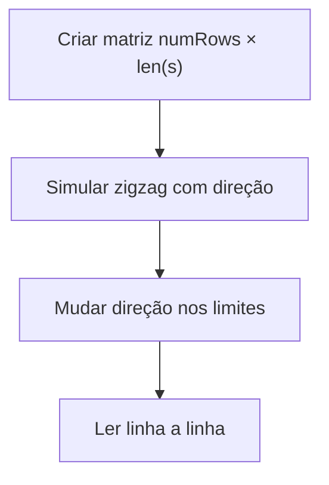
```mermaid
graph TD
    A["Criar matriz numRows × len(s)"] --> B["Simular zigzag com direção"]
    B --> C["Mudar direção nos limites"]
    C --> D["Ler linha a linha"]
```

* **Complexidade esperada:** ⏱️ Tempo $O(n)$ | 💾 Espaço $O(n \times numRows)$

* **Edge cases:** `numRows = 1` (retorna a string original); string menor que numRows.

* **Core snippet:**

```python
def convert(s, numRows):
    if numRows == 1: return s
    matrix = [['' for _ in range(len(s))] for _ in range(numRows)]
    i, j, going_down = 0, 0, True
    for ch in s:
        matrix[i][j] = ch
        if i == 0: going_down = True
        elif i == numRows - 1: going_down = False
        if going_down: i += 1
        else: i -= 1; j += 1
    return ''.join(matrix[r][c] for r in range(numRows) for c in range(len(s)) if matrix[r][c])
```

---
