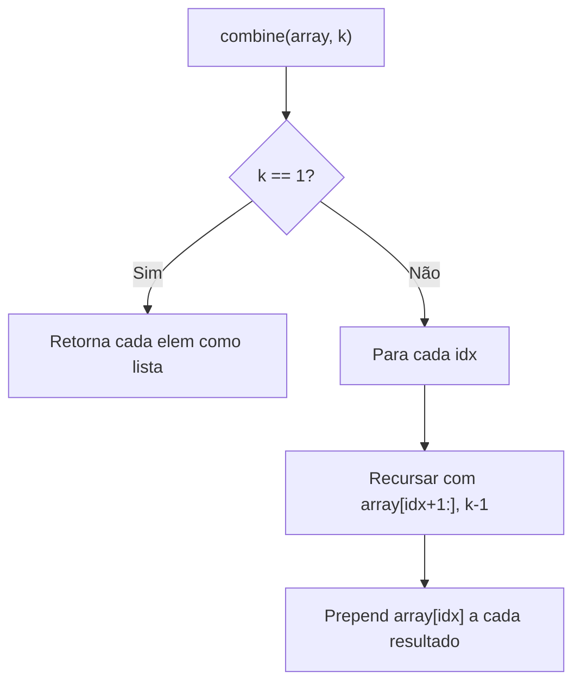
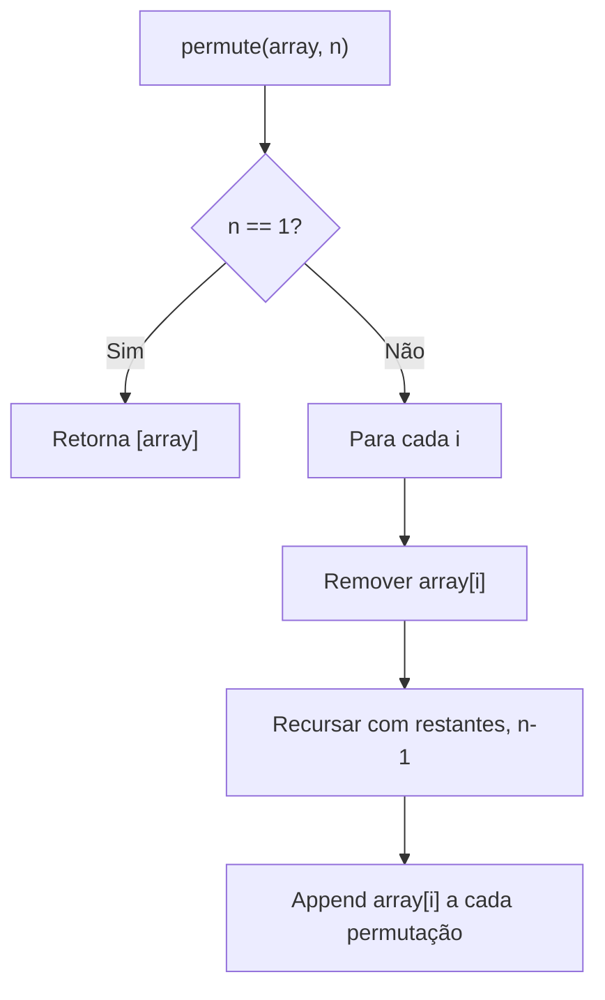
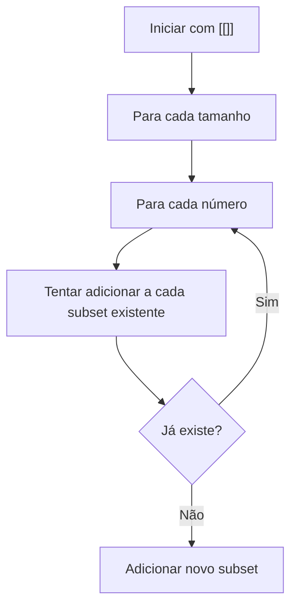
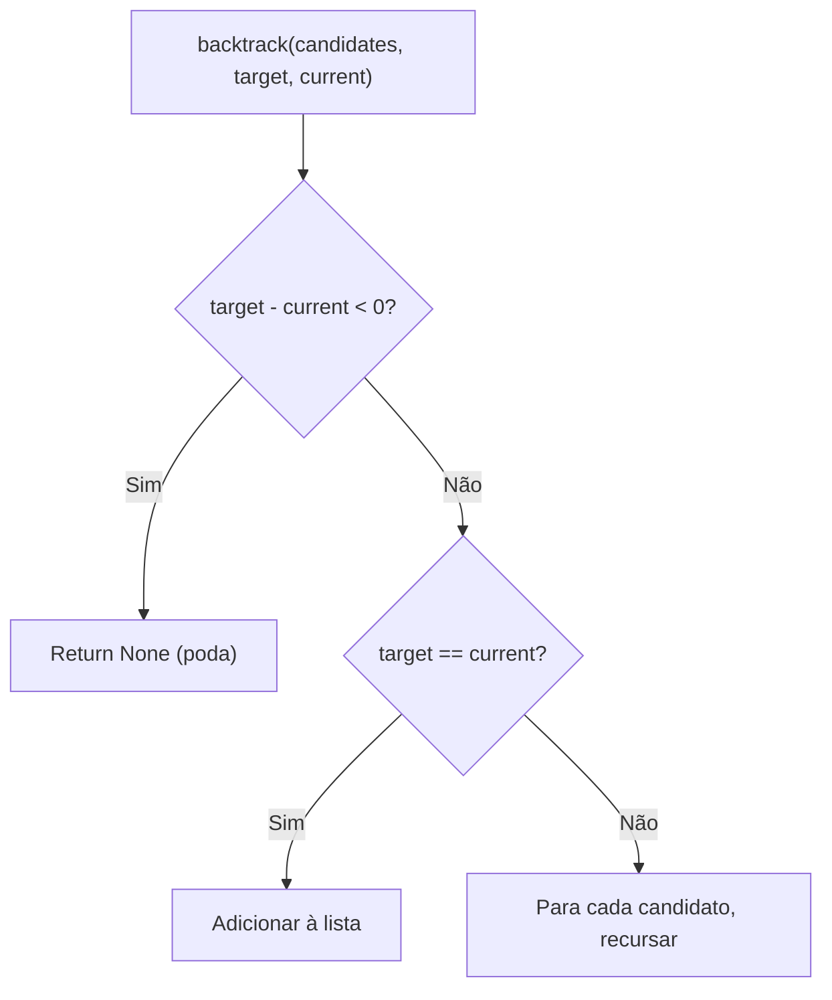

# Backtracking

---

### 📌 Combinations (`combination.py`)

* **Descrição breve:** Dado `n` e `k`, gera todas as combinações possíveis de `k` números de `[1, n]`.

* **💡 Sacada (O Pulo do Gato):**

> Recursão que escolhe um número e passa apenas os números à frente dele (`array[idx+1:]`). Caso base: quando `k == 1`, cada número restante é uma combinação válida.

* **🧠 Modelo Mental:**



* **Complexidade esperada:** ⏱️ Tempo $O(C(n,k) \times k)$ | 💾 Espaço $O(C(n,k) \times k)$

* **Edge cases:** `k = n` (uma única combinação); `k = 1` (n combinações de um elemento).

* **Core snippet:**

```python
def combine(n, k):
    array = [i for i in range(1, n + 1)]
    def make_combine(array, k):
        if k == 1:
            return [[i] for i in array]
        combination = []
        for idx in range(len(array)):
            results = make_combine(array[idx + 1:], k - 1)
            for result in results:
                combination.append([array[idx]] + result)
        return combination
    return make_combine(array, k)
```

---

### 📌 Permutations (`permutations.py`)

* **Descrição breve:** Dado um array de inteiros distintos, retorna todas as permutações possíveis.

* **💡 Sacada (O Pulo do Gato):**

> Para cada elemento, remover do array e recursar com os restantes (`array[:i] + array[i+1:]`). Quando sobra 1 elemento, retorna-o. Depois, faz append do elemento removido.

* **🧠 Modelo Mental:**



* **Complexidade esperada:** ⏱️ Tempo $O(n! \times n)$ | 💾 Espaço $O(n!)$

* **Edge cases:** Array com um único elemento; array vazio.

* **Core snippet:**

```python
def permute(nums):
    def backtrack(array, n):
        if n == 1:
            return [array]
        response = []
        for i in range(len(array)):
            permutations = backtrack(array[:i] + array[i+1:], n - 1)
            for p in permutations:
                p.append(array[i])
                response.append(p)
        return response
    return backtrack(nums, len(nums))
```

---

### 📌 Subsets (`subsets.py`)

* **Descrição breve:** Dado um array de inteiros únicos, retorna todos os subconjuntos possíveis (power set).

* **💡 Sacada (O Pulo do Gato):**

> Iterar por tamanhos crescentes. Para cada número, tentar adicioná-lo a cada subconjunto existente. Não pegar valores menores para não haver duplicidade. Usar sets para verificação.

* **🧠 Modelo Mental:**



* **Complexidade esperada:** ⏱️ Tempo $O(n \times 2^n)$ | 💾 Espaço $O(2^n)$

* **Edge cases:** Array vazio (apenas `[[]]`); array com um elemento.

* **Core snippet:**

```python
def subsets(nums):
    response = [[]]
    current_max_size = 0
    while current_max_size <= len(nums):
        buffer = []
        for i in nums:
            for sub_set_idx in range(len(response)-1, -1, -1):
                current_sub_set = set(response[sub_set_idx].copy())
                if len(current_sub_set) < current_max_size:
                    break
                if i not in current_sub_set:
                    current_sub_set.add(i)
                    if current_sub_set not in buffer:
                        buffer.append(current_sub_set)
        for s in buffer:
            response.append(list(s))
        current_max_size += 1
    return response
```

---

### 📌 Combination Sum (`sum.py`)

* **Descrição breve:** Dado um array de candidatos e um target, encontra todas as combinações únicas cujos elementos somam ao target (pode repetir).

* **💡 Sacada (O Pulo do Gato):**

> Backtracking: para cada candidato, subtrair do target e recursar. Se `target == current_number`, encontrámos uma combinação. Se `target - current_number < 0`, podar essa branch.

* **🧠 Modelo Mental:**



* **Complexidade esperada:** ⏱️ Tempo $O(n^{t/m})$ onde $t$ é target e $m$ é menor candidato | 💾 Espaço $O(t/m)$

* **Edge cases:** Target 0; candidatos maiores que target; um único candidato igual ao target.

* **Core snippet:**

```python
def combinationSum(candidates, target):
    global_list = []
    def backtracking(candidates, target, current_number, current_list):
        if target - current_number < 0:
            return None
        elif target == current_number:
            current_list.append(current_number)
        else:
            for idx in range(len(candidates)):
                result = backtracking(candidates, target - candidates[idx],
                                      candidates[idx], current_list)
                if result is None:
                    continue
                current_list.append(result)
        return current_list
    return backtracking(candidates, target, 0, [])
```

---
