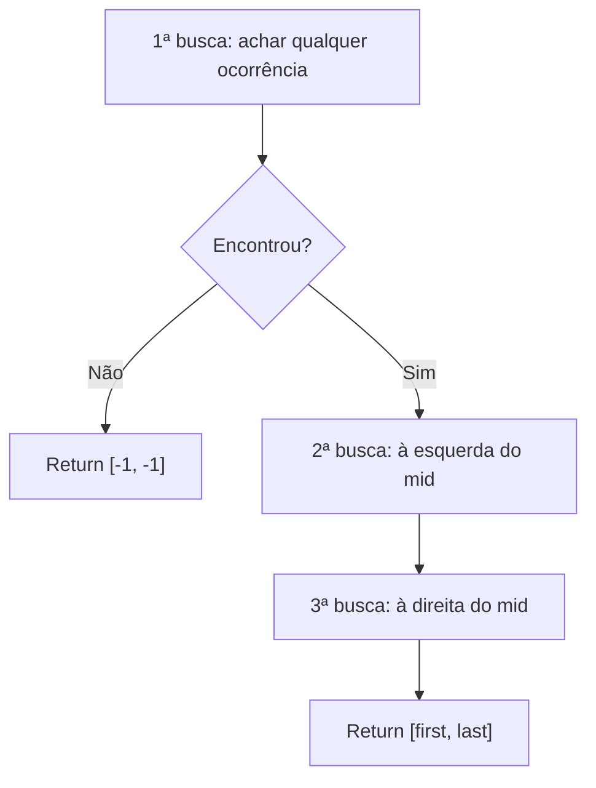
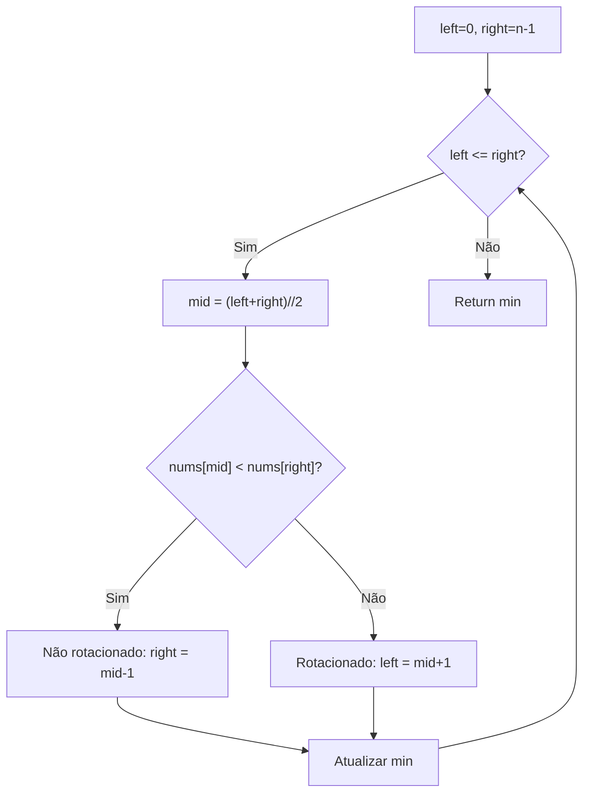
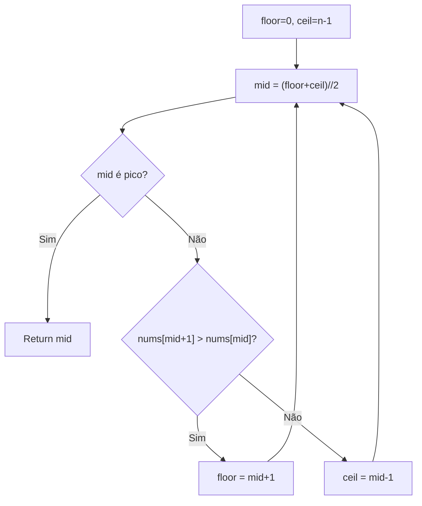
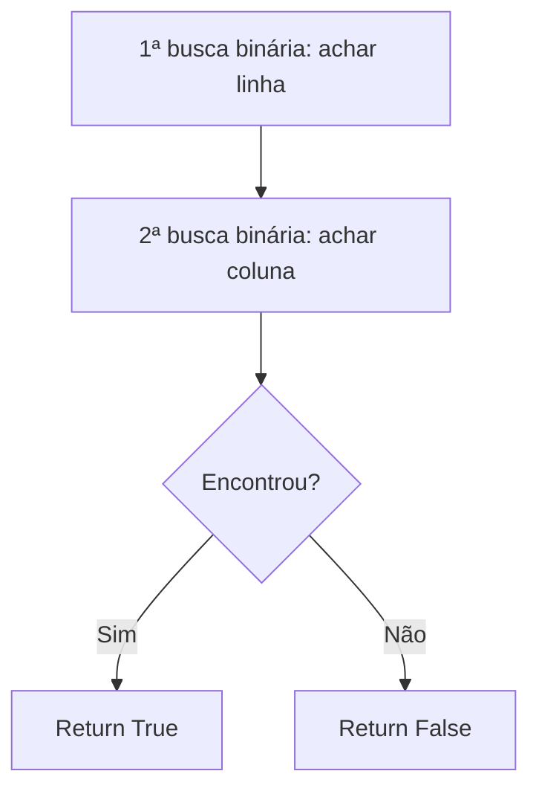
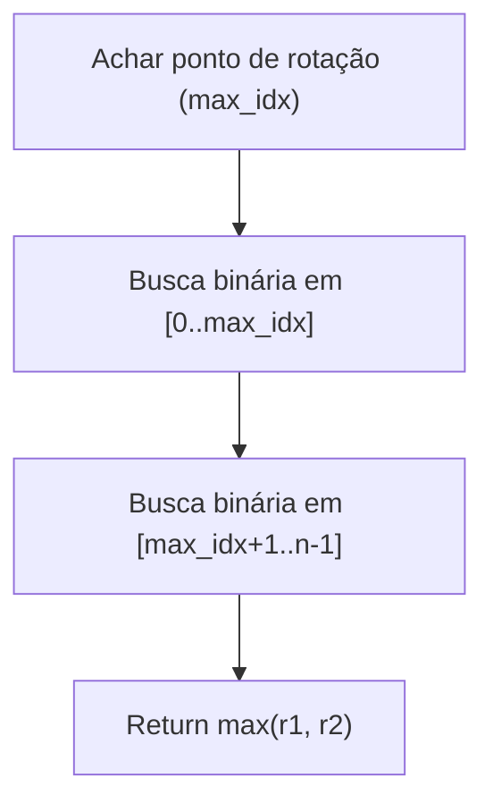
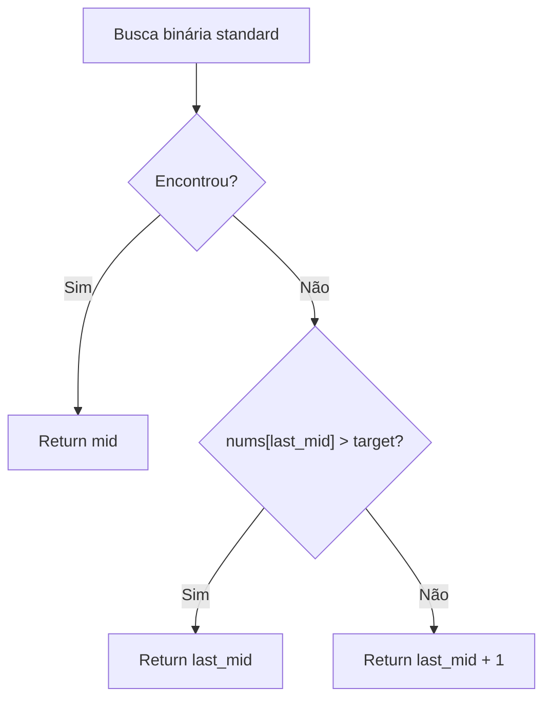

# Binary Search

---

### 📌 Find First and Last Position of Element in Sorted Array (`find-first-and-last-position-of-element-in-sorted-array.py`)

* **Descrição breve:** Num array ordenado, encontra a primeira e a última posição de um valor target.

* **💡 Sacada (O Pulo do Gato):**

> Três buscas binárias: uma para encontrar qualquer ocorrência, uma para encontrar a primeira (buscando à esquerda) e uma para encontrar a última (buscando à direita).

* **🧠 Modelo Mental:**



* **Complexidade esperada:** ⏱️ Tempo $O(\log n)$ | 💾 Espaço $O(1)$

* **Edge cases:** Array vazio; target não existe; target aparece uma vez; todo o array é o target.

* **Core snippet:**

```python
def searchRange(nums, target):
    def find_any():
        bot, top = 0, len(nums) - 1
        while bot <= top:
            mid = (bot + top) // 2
            if target > nums[mid]: bot = mid + 1
            elif target < nums[mid]: top = mid - 1
            else: return mid
        return -1
    idx = find_any()
    if idx == -1: return [-1, -1]
    # Buscar primeiro e último com buscas adicionais
    first = last = idx
    # ... (buscas binárias adicionais à esquerda e direita)
    return [first, last]
```

---

### 📌 Find Minimum in Rotated Sorted Array (`find-minimum-in-rotated-sorted-array.py`)

* **Descrição breve:** Num array ordenado que foi rotacionado, encontra o elemento mínimo.

* **💡 Sacada (O Pulo do Gato):**

> Se `nums[mid] < nums[right]`, estamos na parte não-rotacionada e o mínimo está à esquerda (incluindo mid). Se `nums[mid] > nums[right]`, a rotação está entre mid e right, logo o mínimo está à direita.

* **🧠 Modelo Mental:**



* **Complexidade esperada:** ⏱️ Tempo $O(\log n)$ | 💾 Espaço $O(1)$

* **Edge cases:** Array não rotacionado; array com 1 elemento; rotação completa.

* **Core snippet:**

```python
def findMin(nums):
    left, right = 0, len(nums) - 1
    min_value = float('inf')
    while left <= right:
        mid = (left + right) // 2
        min_value = min(min_value, nums[mid])
        if nums[mid] < nums[right]:
            right = mid - 1
        elif nums[mid] > nums[right]:
            left = mid + 1
        else:
            break
    return min_value
```

---

### 📌 Find Peak Element (`find_peak_element.py`)

* **Descrição breve:** Encontra um elemento cujos vizinhos são menores que ele. Pode retornar qualquer pico.

* **💡 Sacada (O Pulo do Gato):**

> Busca binária guiada pelo lado que tem um vizinho maior. Se o vizinho da direita é maior, o pico está à direita. Se o da esquerda é maior, o pico está à esquerda. Eventualmente, convergimos num pico.

* **🧠 Modelo Mental:**



* **Complexidade esperada:** ⏱️ Tempo $O(\log n)$ | 💾 Espaço $O(1)$

* **Edge cases:** Array com 1 elemento; array estritamente crescente (pico no fim); estritamente decrescente (pico no início).

* **Core snippet:**

```python
def findPeakElement(nums):
    floor, ceil = 0, len(nums) - 1
    while floor <= ceil:
        mid = (floor + ceil) // 2
        left_ok = mid == 0 or nums[mid - 1] < nums[mid]
        right_ok = mid == len(nums) - 1 or nums[mid + 1] < nums[mid]
        if left_ok and right_ok:
            return mid
        elif nums[mid + 1] > nums[mid]:
            floor = mid + 1
        else:
            ceil = mid - 1
    return mid
```

---

### 📌 Search a 2D Matrix (`search-a-2d-matrix.py`)

* **Descrição breve:** Procura um target numa matriz onde cada linha é ordenada e o primeiro elemento de cada linha é maior que o último da anterior.

* **💡 Sacada (O Pulo do Gato):**

> Duas buscas binárias: primeiro encontrar a linha correta (o maior `matrix[mid][0]` que é `<= target`), depois buscar o target dentro dessa linha.

* **🧠 Modelo Mental:**



* **Complexidade esperada:** ⏱️ Tempo $O(\log m + \log n)$ | 💾 Espaço $O(1)$

* **Edge cases:** Matriz 1×1; target menor que todos os elementos; target maior que todos.

* **Core snippet:**

```python
def searchMatrix(matrix, target):
    m, n = len(matrix), len(matrix[0])
    # Achar linha
    floor, ceil = 0, m - 1
    row = 0
    while floor <= ceil:
        mid = (floor + ceil) // 2
        if matrix[mid][0] > target: ceil = mid - 1
        else: row = mid; floor = mid + 1
    # Achar coluna
    floor, ceil = 0, n - 1
    while floor <= ceil:
        mid = (floor + ceil) // 2
        if matrix[row][mid] > target: ceil = mid - 1
        elif matrix[row][mid] < target: floor = mid + 1
        else: return True
    return False
```

---

### 📌 Search in Rotated Sorted Array (`search-in-rotated-sorted-array.py`)

* **Descrição breve:** Num array ordenado e rotacionado, encontra o índice de um target em $O(\log n)$.

* **💡 Sacada (O Pulo do Gato):**

> Primeiro encontrar o ponto de rotação (índice do maior valor) com busca binária. Depois, fazer duas buscas binárias nas duas metades ordenadas.

* **🧠 Modelo Mental:**



* **Complexidade esperada:** ⏱️ Tempo $O(\log n)$ | 💾 Espaço $O(1)$

* **Edge cases:** Array com 1 elemento; target não existe; array não rotacionado.

* **Core snippet:**

```python
def search(nums, target):
    # Achar ponto de rotação
    floor, ceil = 0, len(nums) - 1
    max_idx, max_val = -1, -float('inf')
    while floor <= ceil:
        mid = (floor + ceil) // 2
        if nums[ceil] < nums[mid]:
            if nums[mid] > max_val: max_idx, max_val = mid, nums[mid]
            floor = mid + 1
        else:
            if nums[ceil] > max_val: max_idx, max_val = ceil, nums[ceil]
            ceil = mid - 1

    def bs(arr, target):
        lo, hi = 0, len(arr) - 1
        while lo <= hi:
            mid = (lo + hi) // 2
            if arr[mid] < target: lo = mid + 1
            elif arr[mid] > target: hi = mid - 1
            else: return mid
        return -1

    r1 = bs(nums[:max_idx+1], target)
    r2 = bs(nums[max_idx+1:], target)
    if r2 != -1: r2 += max_idx + 1
    return max(r1, r2)
```

---

### 📌 Search Insert Position (`search_insert_position.py`)

* **Descrição breve:** Num array ordenado, encontra o índice do target ou a posição onde deveria ser inserido.

* **💡 Sacada (O Pulo do Gato):**

> Busca binária padrão. Se encontrar, retorna o índice. Se não encontrar, a posição de inserção é determinada pelo último `mid` visitado: se `nums[mid] > target`, inserir em `mid`, senão em `mid + 1`.

* **🧠 Modelo Mental:**



* **Complexidade esperada:** ⏱️ Tempo $O(\log n)$ | 💾 Espaço $O(1)$

* **Edge cases:** Target menor que todos; target maior que todos; array com 1 elemento.

* **Core snippet:**

```python
def searchInsert(nums, target):
    floor, ceil = 0, len(nums) - 1
    last_mid = 0
    while floor <= ceil:
        mid = (floor + ceil) // 2
        if nums[mid] == target: return mid
        elif nums[mid] > target: ceil = mid - 1
        else: floor = mid + 1
        last_mid = mid
    return last_mid if nums[last_mid] > target else last_mid + 1
```

---
