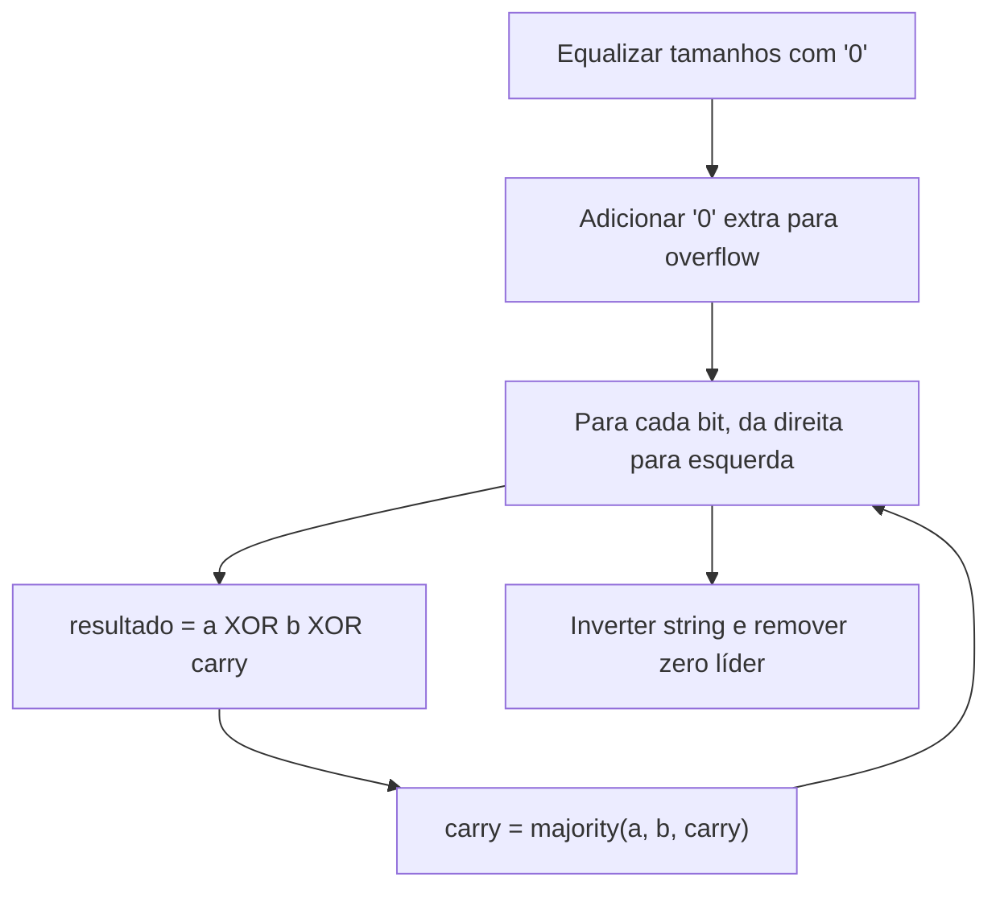
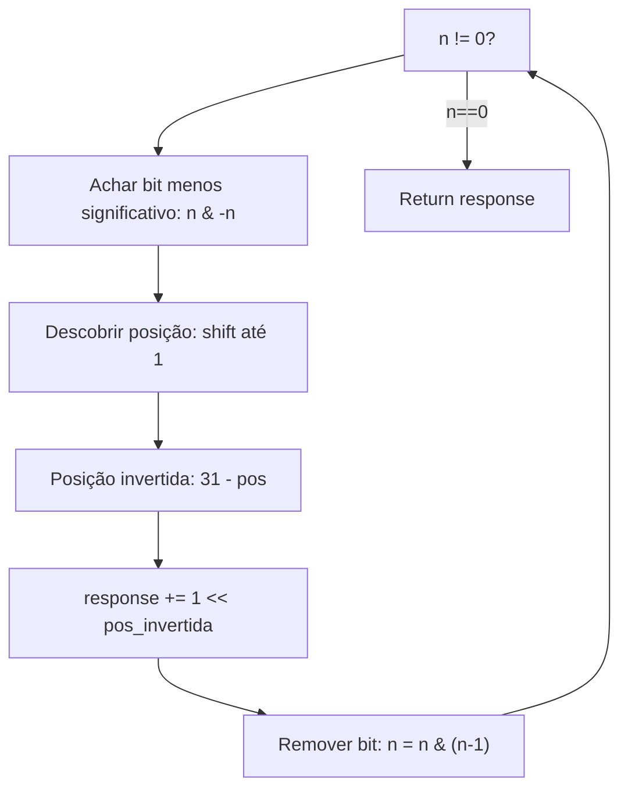
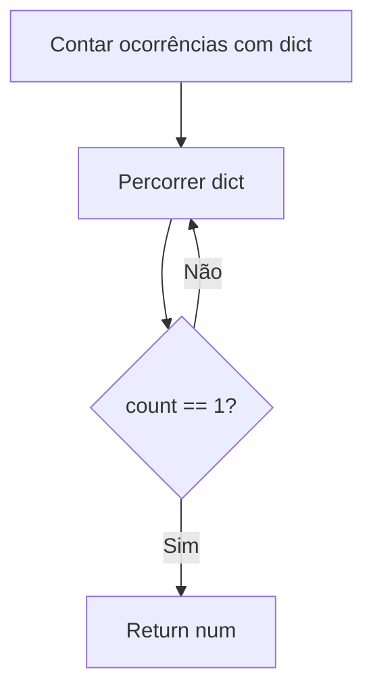

# Bit Manipulation

---

### 📌 Add Binary (`add_binary.py`)

* **Descrição breve:** Dadas duas strings binárias `a` e `b`, retorna a sua soma como string binária.

* **💡 Sacada (O Pulo do Gato):**

> Usar operações bit-a-bit (XOR para soma, AND/OR para carry) em vez de conversão direta. Equalizar tamanhos com zeros à esquerda e adicionar um `'0'` extra para prevenir overflow.

* **🧠 Modelo Mental:**



* **Complexidade esperada:** ⏱️ Tempo $O(n)$ | 💾 Espaço $O(n)$

* **Edge cases:** Strings de tamanhos diferentes; resultado com carry final (ex: `"1" + "1" = "10"`).

* **Core snippet:**

```python
def addBinary(a, b):
    if len(a) > len(b):
        b = '0' * (len(a) - len(b)) + b
    else:
        a = '0' * (len(b) - len(a)) + a
    a = '0' + a
    b = '0' + b
    response = ''
    carry = 0
    for idx in range(len(a) - 1, -1, -1):
        a_int = int(a[idx])
        b_int = int(b[idx])
        result = a_int ^ b_int ^ carry
        response += str(result)
        carry = (a_int & b_int) | (a_int & carry) | (carry & b_int)
    response = response[::-1]
    return response[1:] if response[0] == '0' else response
```

---

### 📌 Reverse Bits (`reverse_bit.py`)

* **Descrição breve:** Inverte os bits de um inteiro de 32 bits sem sinal.

* **💡 Sacada (O Pulo do Gato):**

> Encontrar a posição de cada bit ativo usando `n & (-n)` (bit menos significativo), calcular a posição invertida como `31 - pos`, e somar `1 << pos_invertida` na resposta. Remover o bit processado com `n & (n-1)`.

* **🧠 Modelo Mental:**



* **Complexidade esperada:** ⏱️ Tempo $O(k)$ onde $k$ é número de bits ativos | 💾 Espaço $O(1)$

* **Edge cases:** `n = 0`; todos os 32 bits ativos.

* **Core snippet:**

```python
def reverseBits(n):
    response = 0
    size_n = 32
    while n != 0:
        i = n & (-n)
        count = 0
        while i != 1:
            count += 1
            i = i >> 1
        response += 1 << (size_n - count - 1)
        n = n & (n - 1)
    return response
```

---

### 📌 Single Number (`single_number.py`)

* **Descrição breve:** Num array onde todos os elementos aparecem N vezes exceto um, encontra o elemento único.

* **💡 Sacada (O Pulo do Gato):**

> Usar um dicionário (hash map) para contar ocorrências de cada número. O número com contagem 1 é a resposta. (Alternativa clássica: XOR para pares.)

* **🧠 Modelo Mental:**



* **Complexidade esperada:** ⏱️ Tempo $O(n)$ | 💾 Espaço $O(n)$

* **Edge cases:** Array com um único elemento; números negativos.

* **Core snippet:**

```python
def singleNumber(nums):
    mapping = {}
    for num in nums:
        if num not in mapping:
            mapping[num] = 0
        mapping[num] += 1
    for num, count in mapping.items():
        if count == 1:
            return num
```

---
