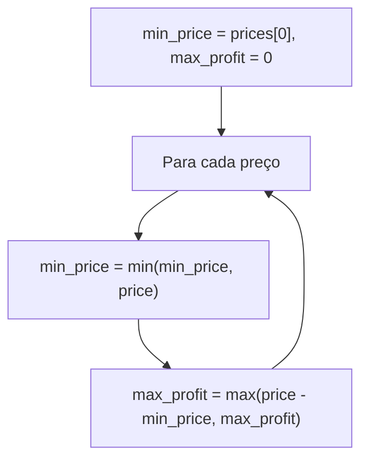
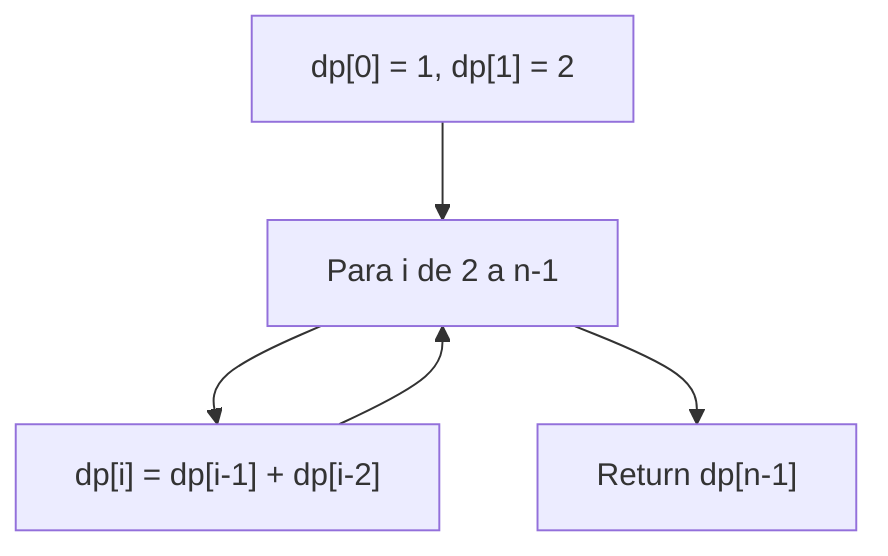
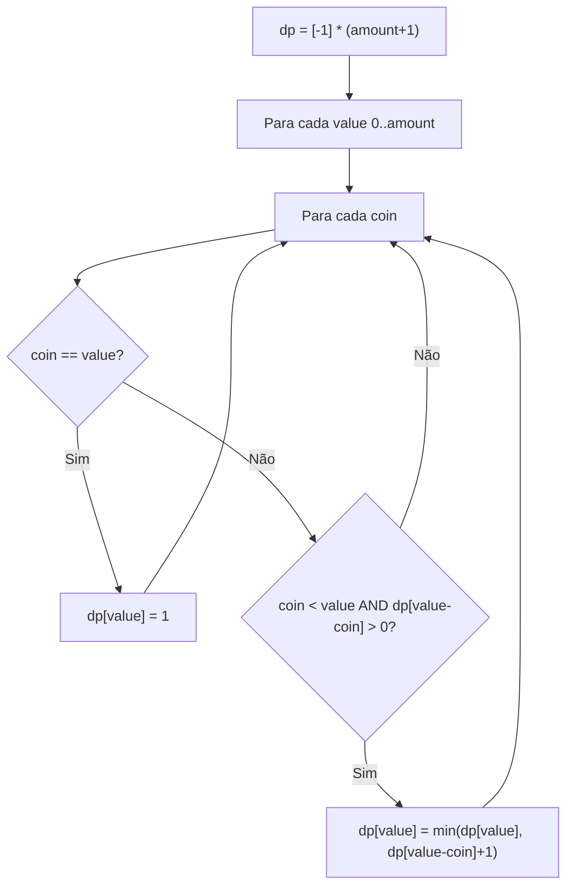
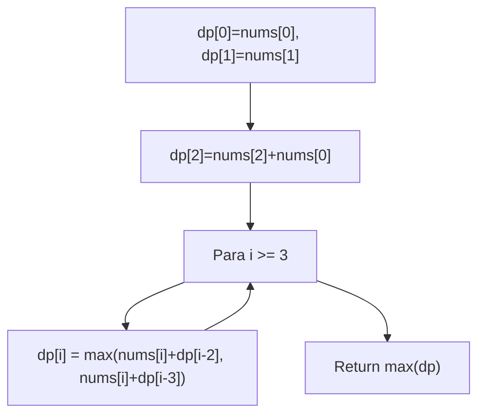
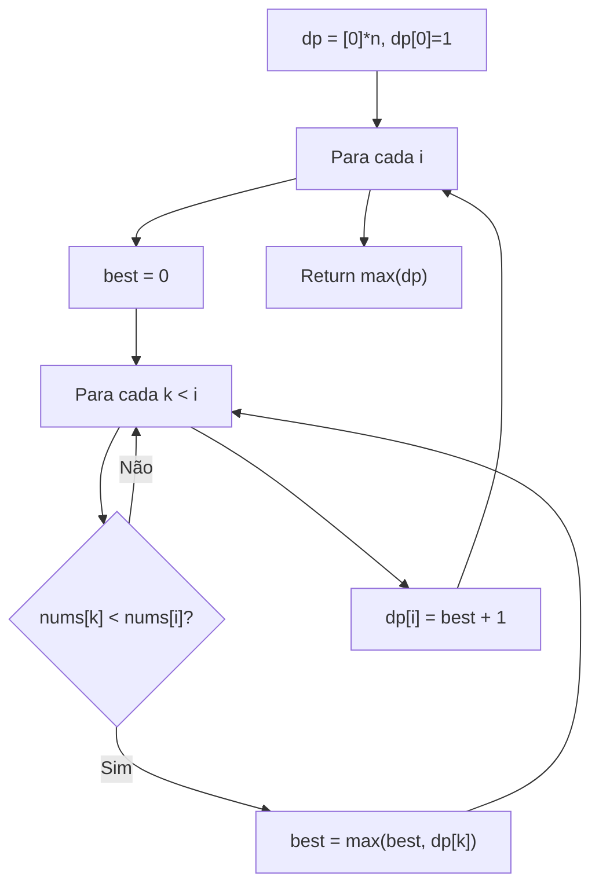
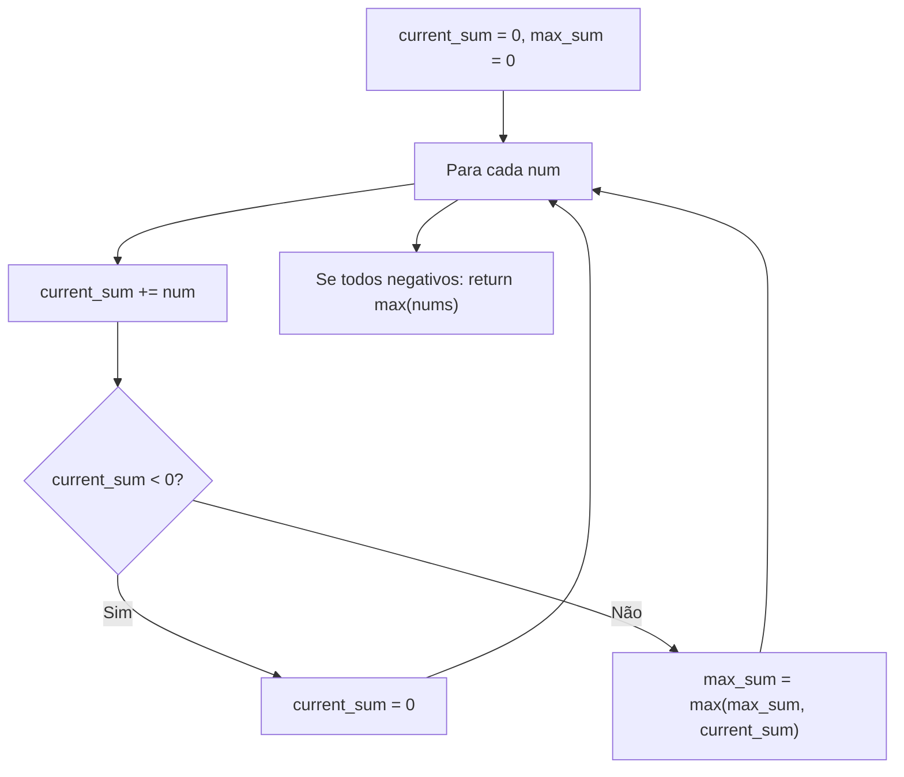
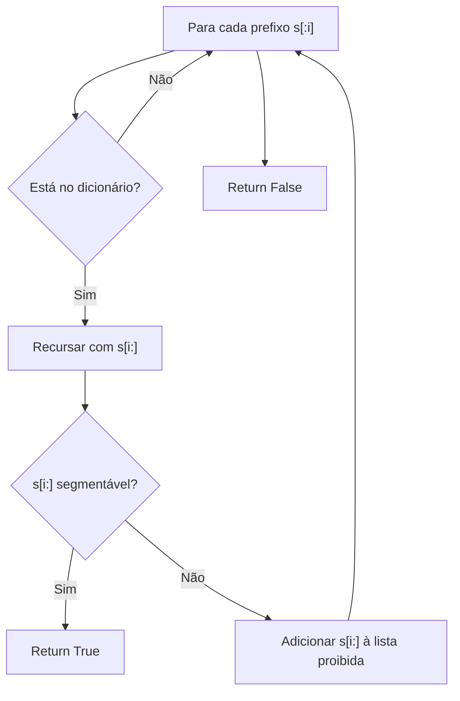

# Dynamic Programming

---

### 📌 Best Time to Buy and Sell Stock (`best_time_buy_sell_stock.py`)

* **Descrição breve:** Dado um array de preços diários, encontra o lucro máximo comprando e vendendo uma única vez.

* **💡 Sacada (O Pulo do Gato):**

> Manter uma variável de preço mínimo e ir atualizando o lucro máximo como `price - min_price`. Não é preciso olhar para trás — basta lembrar o menor preço visto até agora.

* **🧠 Modelo Mental:**



* **Complexidade esperada:** ⏱️ Tempo $O(n)$ | 💾 Espaço $O(1)$

* **Edge cases:** Preços estritamente decrescentes (lucro 0); array com 1 elemento.

* **Core snippet:**

```python
def maxProfit(prices):
    max_profit = 0
    min_price = prices[0]
    for price in prices:
        min_price = min(min_price, price)
        max_profit = max(price - min_price, max_profit)
    return max_profit
```

---

### 📌 Climbing Stairs (`climbing_stairs.py`)

* **Descrição breve:** De quantas formas se pode subir `n` degraus, podendo subir 1 ou 2 de cada vez?

* **💡 Sacada (O Pulo do Gato):**

> Para chegar ao degrau `i`, podes vir do degrau `i-1` (+1) ou do `i-2` (+2). Logo `dp[i] = dp[i-1] + dp[i-2]` — é essencialmente Fibonacci!

* **🧠 Modelo Mental:**



* **Complexidade esperada:** ⏱️ Tempo $O(n)$ | 💾 Espaço $O(n)$

* **Edge cases:** `n = 1` (1 forma); `n = 2` (2 formas).

* **Core snippet:**

```python
def climbStairs(n):
    response = []
    for i in range(n):
        if i == 0: response.append(1)
        elif i == 1: response.append(2)
        else: response.append(response[i-1] + response[i-2])
    return response[-1]
```

---

### 📌 Coin Change (`coin-change.py`)

* **Descrição breve:** Dado um conjunto de moedas e um montante, encontra o número mínimo de moedas para atingir esse montante.

* **💡 Sacada (O Pulo do Gato):**

> `dp[i]` guarda a quantidade mínima de moedas para chegar no valor `i`. Para cada valor, testar todas as moedas: se `coin <= value` e `dp[value - coin]` é válido, então `dp[value] = min(dp[value], dp[value - coin] + 1)`. Usar `-1` quando não há solução.

* **🧠 Modelo Mental:**



* **Complexidade esperada:** ⏱️ Tempo $O(amount \times |coins|)$ | 💾 Espaço $O(amount)$

* **Edge cases:** `amount = 0` (return 0); nenhuma combinação possível (return -1).

* **Core snippet:**

```python
def coinChange(coins, amount):
    if amount == 0: return 0
    dp = [-1] * (amount + 1)
    for value in range(amount + 1):
        for coin in coins:
            if coin > value: continue
            elif coin == value: dp[value] = 1
            elif dp[value - coin] > 0:
                if dp[value] == -1: dp[value] = 1 + dp[value - coin]
                else: dp[value] = min(dp[value], dp[value - coin] + 1)
    return dp[-1]
```

---

### 📌 House Robber (`house_robbing.py`)

* **Descrição breve:** Casas em linha com valores — não podes roubar duas adjacentes. Qual o máximo que se consegue roubar?

* **💡 Sacada (O Pulo do Gato):**

> Para cada casa `i`, o máximo é `max(nums[i] + dp[i-2], nums[i] + dp[i-3])`. Não faz sentido roubar 4 casas para trás, porque seria melhor roubar 2+2.

* **🧠 Modelo Mental:**



* **Complexidade esperada:** ⏱️ Tempo $O(n)$ | 💾 Espaço $O(n)$

* **Edge cases:** Uma única casa; duas casas (escolher a maior).

* **Core snippet:**

```python
def rob(nums):
    n = len(nums)
    dp = [0] * n
    dp[0] = nums[0]
    if n > 1: dp[1] = nums[1]
    if n > 2: dp[2] = nums[2] + nums[0]
    max_val = max(dp[:min(n,3)])
    for i in range(3, n):
        dp[i] = max(nums[i] + dp[i-2], nums[i] + dp[i-3])
        max_val = max(max_val, dp[i])
    return max_val
```

---

### 📌 Longest Increasing Subsequence (`longest-increasing-subsequence.py`)

* **Descrição breve:** Encontra o comprimento da maior subsequência estritamente crescente.

* **💡 Sacada (O Pulo do Gato):**

> `dp[i]` = comprimento da melhor subsequência terminando em `i`. Para cada `i`, verificar todos os `k < i`: se `nums[k] < nums[i]`, então `dp[i] = max(dp[i], dp[k] + 1)`. (Alternativa O(n log n) com bisect.)

* **🧠 Modelo Mental:**



* **Complexidade esperada:** ⏱️ Tempo $O(n^2)$ | 💾 Espaço $O(n)$

* **Edge cases:** Array com todos iguais (LIS = 1); array estritamente crescente (LIS = n).

* **Core snippet:**

```python
def lengthOfLIS(nums):
    dp = [0] * len(nums)
    dp[0] = 1
    for i in range(1, len(nums)):
        best_dp = 0
        for k in range(i):
            if nums[k] < nums[i]:
                best_dp = max(best_dp, dp[k])
        dp[i] = best_dp + 1
    return max(dp)
```

---

### 📌 Maximum Subarray (`maximum_subarray.py`)

* **Descrição breve:** Encontra o subarray contíguo com a maior soma (algoritmo de Kadane).

* **💡 Sacada (O Pulo do Gato):**

> Manter uma soma corrente. Se ficar negativa, descartar e recomeçar do zero. O máximo global é atualizado a cada passo. Caso especial: se todos forem negativos, a resposta é o maior valor.

* **🧠 Modelo Mental:**



* **Complexidade esperada:** ⏱️ Tempo $O(n)$ | 💾 Espaço $O(1)$

* **Edge cases:** Todos os valores negativos; array com 1 elemento.

* **Core snippet:**

```python
def maxSubArray(nums):
    current_sum = 0
    response_sum = 0
    for num in nums:
        current_sum += num
        if current_sum < 0:
            current_sum = 0
        response_sum = max(response_sum, current_sum)
    max_value = max(nums)
    return max_value if max_value < 0 else response_sum
```

---

### 📌 Word Break (`word-break.py`)

* **Descrição breve:** Dada uma string `s` e um dicionário, verifica se `s` pode ser segmentada em palavras do dicionário.

* **💡 Sacada (O Pulo do Gato):**

> Backtracking com memoização: para cada prefixo que está no dicionário, verificar recursivamente se o sufixo restante também pode ser segmentado. Guardar sufixos que não funcionam numa lista "proibida" para não revisitar.

* **🧠 Modelo Mental:**



* **Complexidade esperada:** ⏱️ Tempo $O(n^2 \times m)$ com memoização | 💾 Espaço $O(n)$

* **Edge cases:** String vazia (True); nenhuma palavra do dicionário presente; palavras sobrepostas.

* **Core snippet:**

```python
def wordBreak(s, wordDict):
    dictionary = set(wordDict)
    dont_exist = []
    def verify(s):
        if s == "": return True
        for i in range(1, len(s) + 1):
            if s[:i] in dictionary:
                if s[i:] not in dont_exist:
                    if verify(s[i:]): return True
                    else: dont_exist.append(s[i:])
        return False
    return verify(s)
```

---
