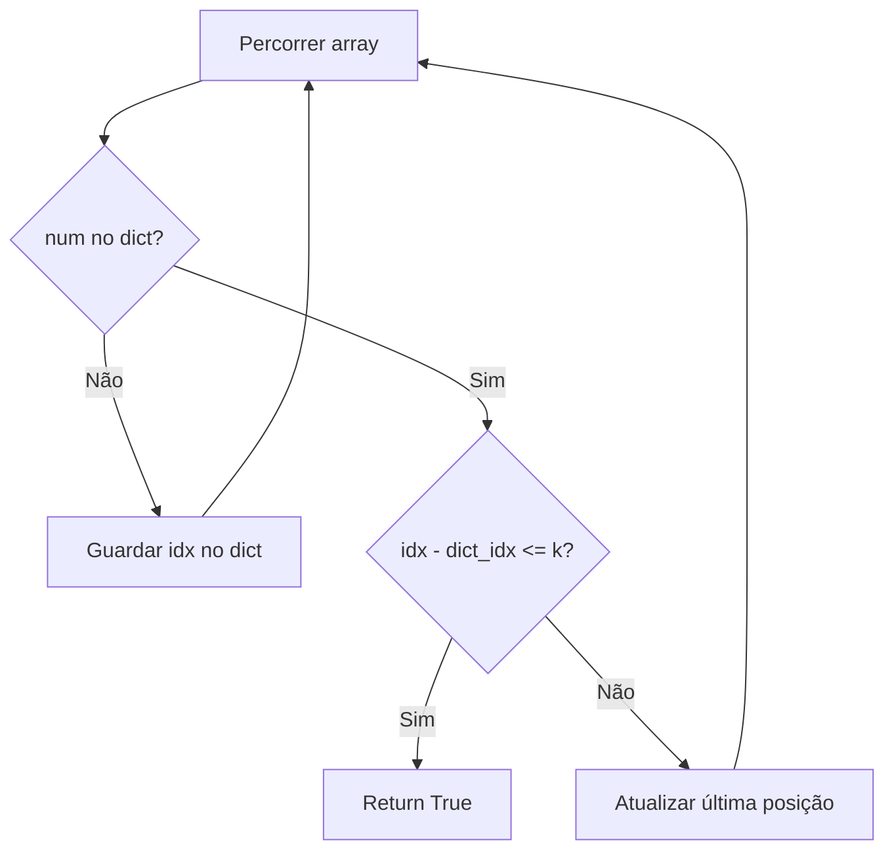
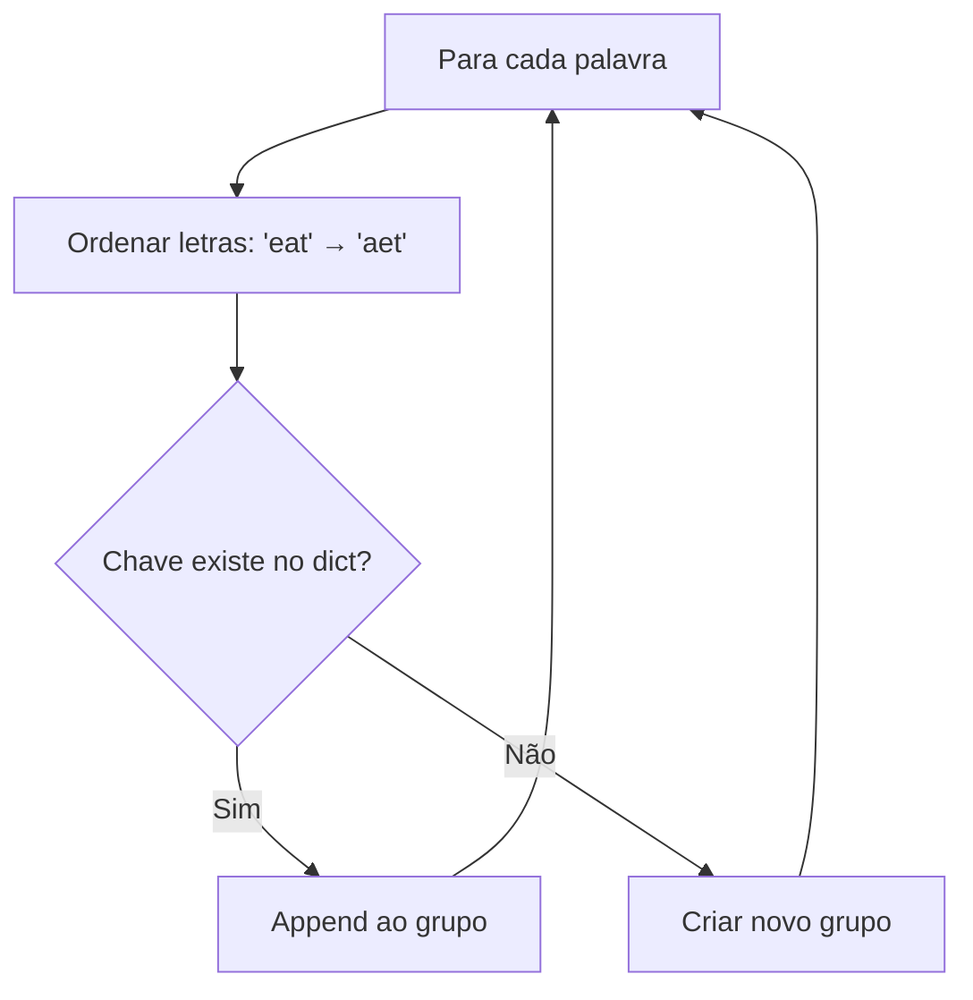

# Hash Table

---

### 📌 Contains Duplicate II (`contains_duplicate.py`)

* **Descrição breve:** Dado um array de inteiros e um inteiro `k`, verifica se existem dois índices distintos `i` e `j` tal que `nums[i] == nums[j]` e `|i - j| <= k`.

* **💡 Sacada (O Pulo do Gato):**

> Basta comparar o índice atual com o anterior guardado no dicionário. Se a diferença for menor ou igual a `k`, retornamos `True`. Caso contrário, atualizamos a última posição.

* **🧠 Modelo Mental:**



* **Complexidade esperada:** ⏱️ Tempo $O(n)$ | 💾 Espaço $O(n)$

* **Edge cases:** Array vazio ou com um único elemento; `k = 0` (índices têm que ser iguais, impossível).

* **Core snippet:**

```python
def containsNearbyDuplicate(nums, k):
    dict_compare = {}
    for idx, num in enumerate(nums):
        if num not in dict_compare:
            dict_compare[num] = idx
        else:
            diff = idx - dict_compare[num]
            if diff <= k:
                return True
            else:
                dict_compare[num] = idx
    return False
```

---

### 📌 Group Anagrams (`group_anagrams.py`)

* **Descrição breve:** Dada uma lista de strings, agrupa as palavras que são anagramas entre si.

* **💡 Sacada (O Pulo do Gato):**

> Ordenar cada palavra alfabeticamente cria uma chave única para todos os anagramas. Palavras com a mesma versão ordenada pertencem ao mesmo grupo.

* **🧠 Modelo Mental:**



* **Complexidade esperada:** ⏱️ Tempo $O(n \cdot k \log k)$ onde $k$ é o tamanho máximo da palavra | 💾 Espaço $O(n \cdot k)$

* **Edge cases:** Strings vazias (são anagramas entre si); lista com uma única string.

* **Core snippet:**

```python
def groupAnagrams(strs):
    response = {}
    for word in strs:
        sorted_word = ''.join(sorted(word))
        if sorted_word not in response:
            response[sorted_word] = []
        response[sorted_word].append(word)
    return list(response.values())
```

---
