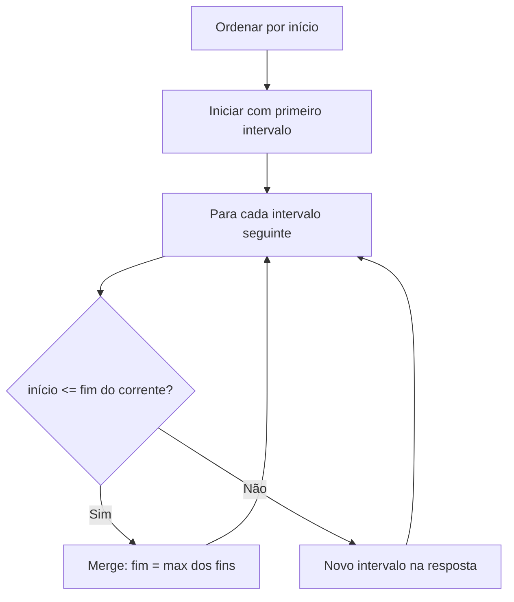
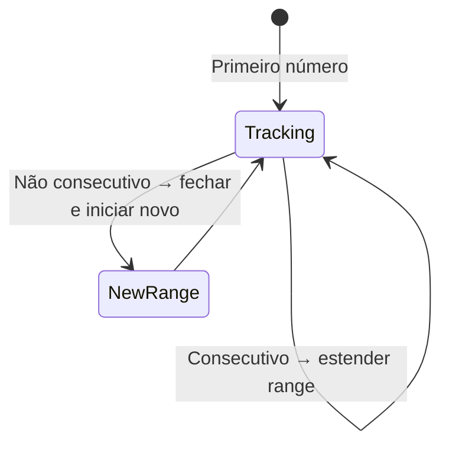

# Intervals

---

### 📌 Merge Intervals (`merge_intervals.py`)

* **Descrição breve:** Dado um array de intervalos, funde todos os intervalos que se sobrepõem e retorna os intervalos resultantes.

* **💡 Sacada (O Pulo do Gato):**

> Ordenar os intervalos pelo início. Se o início do intervalo atual for menor ou igual ao fim do intervalo corrente, fazemos merge atualizando o fim com o maior valor. Como está ordenado, se não se sobrepõe, nenhum intervalo futuro se sobreporá.

* **🧠 Modelo Mental:**



* **Complexidade esperada:** ⏱️ Tempo $O(n \log n)$ | 💾 Espaço $O(n)$

* **Edge cases:** Intervalos completamente contidos noutros (ex: `[1,10]` e `[2,3]`); um único intervalo.

* **Core snippet:**

```python
def merge(intervals):
    intervals = sorted(intervals, key=lambda x: x[0])
    response = [intervals[0]]
    for idx in range(1, len(intervals)):
        if intervals[idx][0] <= response[-1][1]:
            response[-1][1] = max(intervals[idx][1], response[-1][1])
        else:
            response.append(intervals[idx])
    return response
```

---

### 📌 Summary Ranges (`summary_ranges.py`)

* **Descrição breve:** Dado um array ordenado sem duplicados, retorna os intervalos contínuos no formato `"a->b"` ou `"a"`.

* **💡 Sacada (O Pulo do Gato):**

> Manter uma string do range atual. Se o próximo número é consecutivo (`nums[i] - nums[i-1] == 1`), estender o range. Caso contrário, fechar o range e iniciar um novo.

* **🧠 Modelo Mental:**



* **Complexidade esperada:** ⏱️ Tempo $O(n)$ | 💾 Espaço $O(n)$

* **Edge cases:** Array vazio; array com um único elemento; todos os números consecutivos.

* **Core snippet:**

```python
def summaryRanges(nums):
    if len(nums) == 0:
        return []
    response = []
    current_range = f"{nums[0]}"
    for idx in range(1, len(nums)):
        if nums[idx] - nums[idx-1] == 1:
            if '>' in current_range:
                range_list = current_range.split('->')
                range_list[-1] = str(nums[idx])
                current_range = '->'.join(range_list)
            else:
                current_range += f"->{str(nums[idx])}"
        else:
            response.append(current_range)
            current_range = f"{nums[idx]}"
    response.append(current_range)
    return response
```

---
