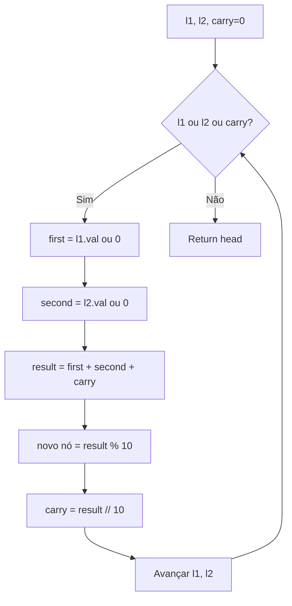
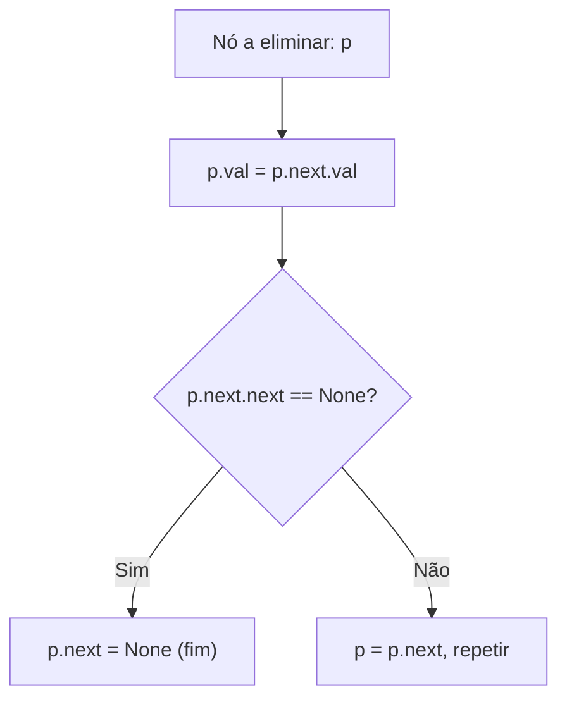
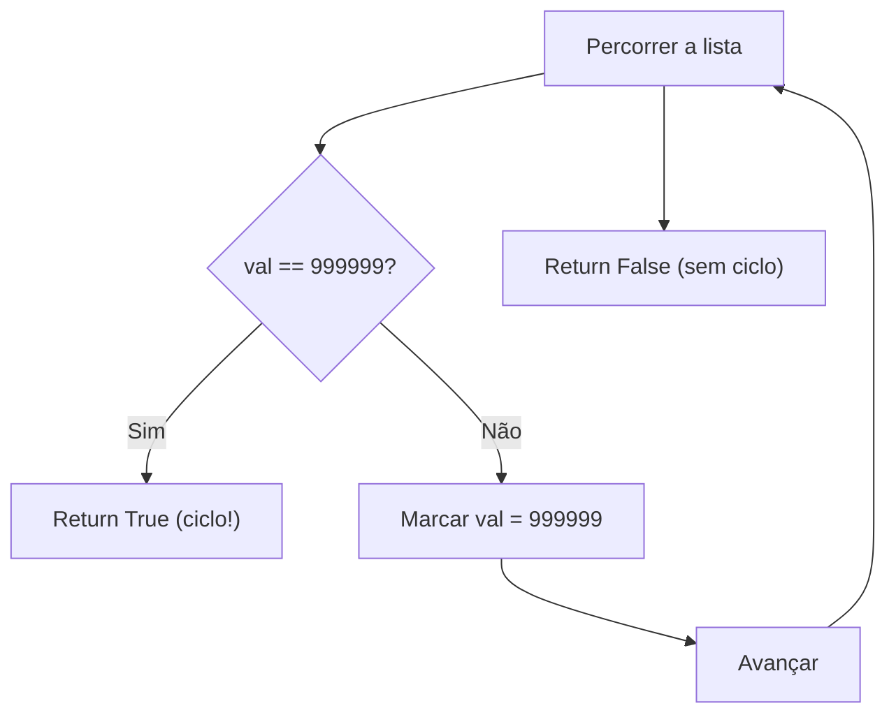
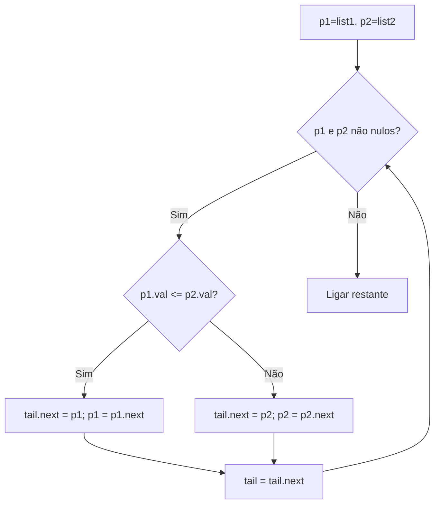
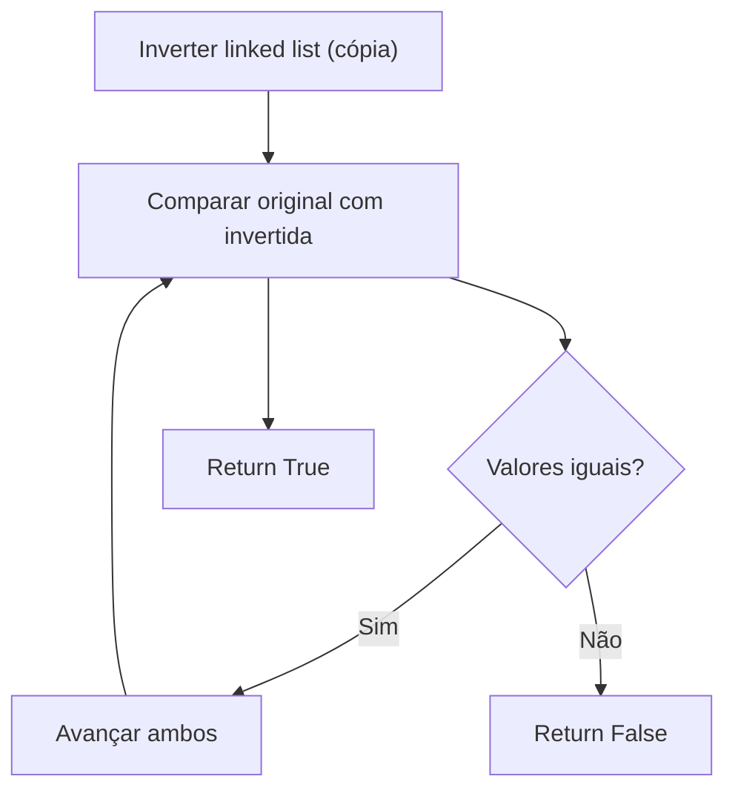
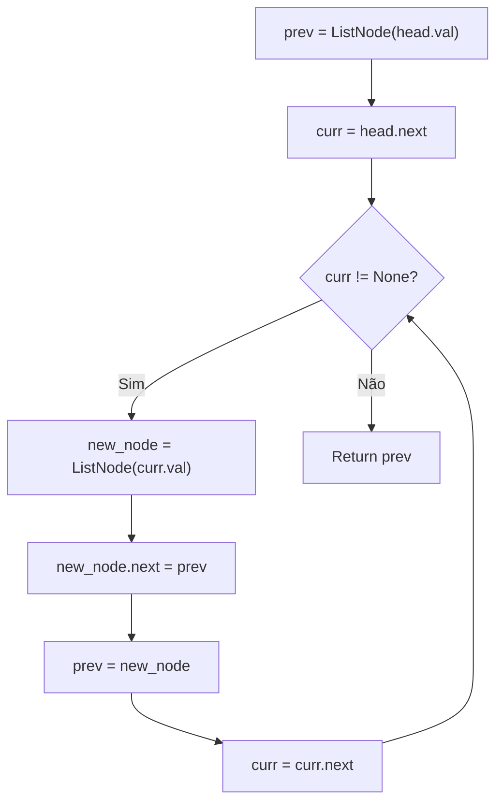

# Linked List

---

### 📌 Add Two Numbers (`add_two_numbers.py`)

* **Descrição breve:** Dadas duas linked lists representando números invertidos, retorna a soma como uma nova linked list.

* **💡 Sacada (O Pulo do Gato):**

> Percorrer as duas listas em paralelo, somando dígito a dígito com carry. Criar novos nós com `result % 10` e propagar `result // 10` como carry. Continuar enquanto houver nós ou carry.

* **🧠 Modelo Mental:**



* **Complexidade esperada:** ⏱️ Tempo $O(\max(m, n))$ | 💾 Espaço $O(\max(m, n))$

* **Edge cases:** Listas de tamanhos diferentes; carry no final (ex: 999 + 1 = 1000).

* **Core snippet:**

```python
def addTwoNumbers(l1, l2):
    carry = 0
    head = ListNode()
    prev = head
    while l1 or l2 or carry > 0:
        first = l1.val if l1 else 0
        second = l2.val if l2 else 0
        result = carry + first + second
        carry = result // 10
        prev.next = ListNode(result % 10)
        prev = prev.next
        l1 = l1.next if l1 else None
        l2 = l2.next if l2 else None
    return head.next
```

---

### 📌 Delete Node in a Linked List (`delete_node_linked_list.py`)

* **Descrição breve:** Elimina um nó de uma linked list sem acesso ao nó anterior — recebe apenas o nó a eliminar.

* **💡 Sacada (O Pulo do Gato):**

> Copiar o valor do próximo nó para o nó atual, e apontar o `next` para o nó depois do próximo. Essencialmente, "fingimos" que o nó é o próximo e apagamos o verdadeiro próximo.

* **🧠 Modelo Mental:**



* **Complexidade esperada:** ⏱️ Tempo $O(n)$ | 💾 Espaço $O(1)$

* **Edge cases:** Nó é o penúltimo; linked list com dois nós.

* **Core snippet:**

```python
def deleteNode(node):
    p = node
    while p.next is not None:
        p.val = p.next.val
        if p.next.next is None:
            p.next = None
            break
        p = p.next
```

---

### 📌 Linked List Cycle (`linked_list_cycle.py`)

* **Descrição breve:** Determina se uma linked list tem um ciclo.

* **💡 Sacada (O Pulo do Gato):**

> Abordagem simples: marcar cada nó visitado com um valor sentinela (999999). Se encontrarmos esse valor novamente, existe ciclo. (Alternativa clássica: Floyd's tortoise and hare.)

* **🧠 Modelo Mental:**



* **Complexidade esperada:** ⏱️ Tempo $O(n)$ | 💾 Espaço $O(1)$ (modifica in-place)

* **Edge cases:** Lista vazia; lista com um nó; ciclo no primeiro nó.

* **Core snippet:**

```python
def hasCycle(head):
    work_pointer = head
    while work_pointer is not None:
        if work_pointer.val == 999999:
            return True
        work_pointer.val = 999999
        work_pointer = work_pointer.next
    return False
```

---

### 📌 Merge Two Sorted Lists (`merge_two_sorted_lists.py`)

* **Descrição breve:** Funde duas linked lists ordenadas numa única lista ordenada.

* **💡 Sacada (O Pulo do Gato):**

> Dois ponteiros `p1` e `p2`. Escolher o menor valor, avançar o ponteiro correspondente e ligar ao `tail` da nova lista. No final, ligar o restante da lista não terminada.

* **🧠 Modelo Mental:**



* **Complexidade esperada:** ⏱️ Tempo $O(m + n)$ | 💾 Espaço $O(1)$

* **Edge cases:** Uma ou ambas as listas vazias; listas de tamanhos muito diferentes.

* **Core snippet:**

```python
def mergeTwoLists(list1, list2):
    if not list1: return list2
    if not list2: return list1
    head = list1 if list1.val <= list2.val else list2
    p1 = list1.next if head == list1 else list1
    p2 = list2.next if head == list2 else list2
    tail = head
    while p1 and p2:
        if p1.val <= p2.val:
            tail.next = p1; p1 = p1.next
        else:
            tail.next = p2; p2 = p2.next
        tail = tail.next
    tail.next = p1 if p1 else p2
    return head
```

---

### 📌 Palindrome Linked List (`palindrome_linked_list.py`)

* **Descrição breve:** Verifica se uma linked list é um palíndromo.

* **💡 Sacada (O Pulo do Gato):**

> Inverter a linked list criando uma cópia invertida. Depois, comparar nó a nó com a original. Se todos os valores forem iguais, é palíndromo.

* **🧠 Modelo Mental:**



* **Complexidade esperada:** ⏱️ Tempo $O(n)$ | 💾 Espaço $O(n)$

* **Edge cases:** Lista com um nó (palíndromo); lista com dois nós iguais/diferentes.

* **Core snippet:**

```python
def isPalindrome(head):
    def reverseList(head):
        if not head: return None
        prev = ListNode(head.val)
        curr = head.next
        while curr:
            new_node = ListNode(curr.val)
            new_node.next = prev
            prev = new_node
            curr = curr.next
        return prev

    reversed_head = reverseList(head)
    while head:
        if reversed_head.val != head.val:
            return False
        reversed_head = reversed_head.next
        head = head.next
    return True
```

---

### 📌 Reverse Linked List (`reverse_linked_list.py`)

* **Descrição breve:** Inverte uma linked list iterativamente.

* **💡 Sacada (O Pulo do Gato):**

> Criar novos nós iterativamente: para cada nó atual, criar um novo nó cujo `next` aponta para o `previous`. Assim, a lista vai sendo construída ao contrário.

* **🧠 Modelo Mental:**



* **Complexidade esperada:** ⏱️ Tempo $O(n)$ | 💾 Espaço $O(n)$ (cria novos nós)

* **Edge cases:** Lista vazia; lista com um nó; lista com dois nós.

* **Core snippet:**

```python
def reverseList(head):
    if not head: return None
    prev = ListNode(head.val)
    curr = head.next
    while curr:
        new_node = ListNode(curr.val)
        new_node.next = prev
        prev = new_node
        curr = curr.next
    return prev
```

---
