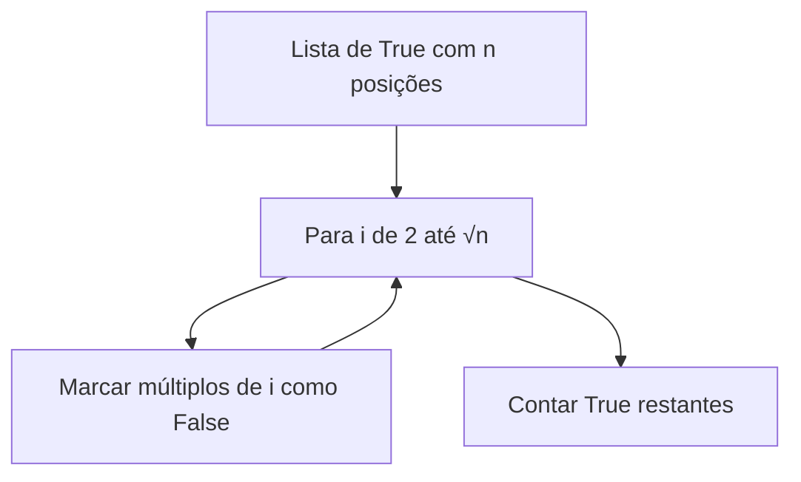
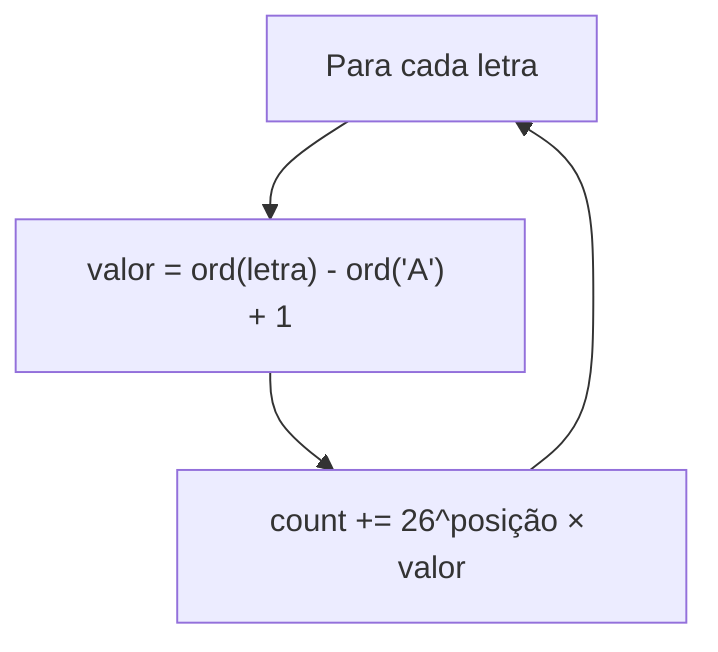
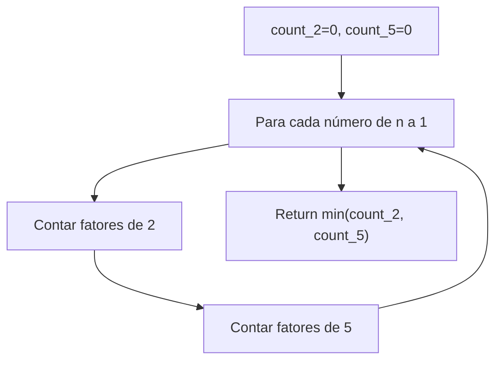
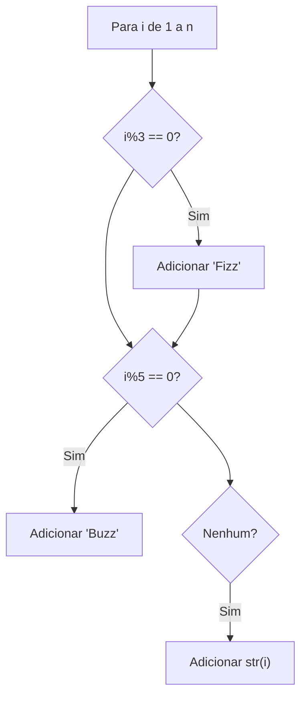
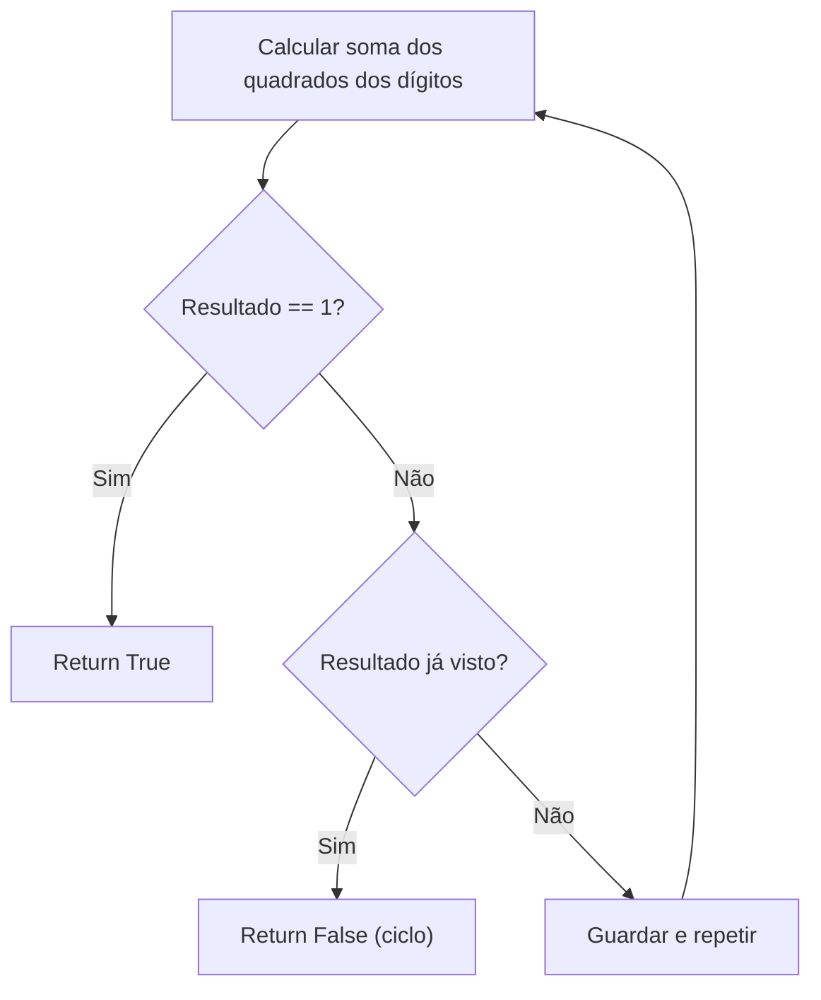
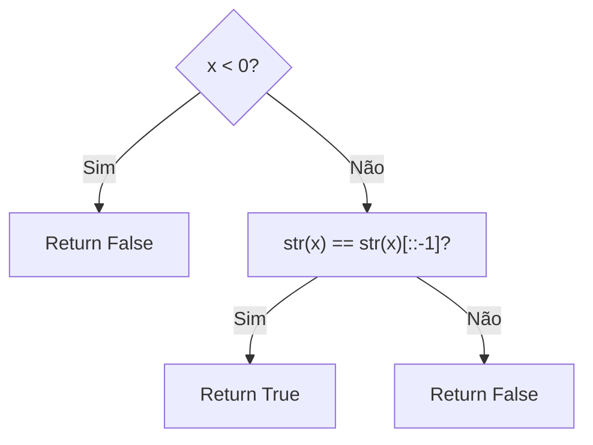
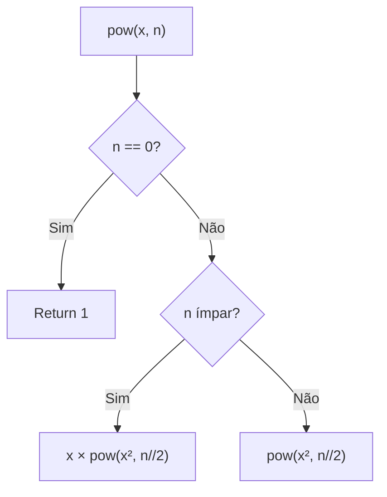
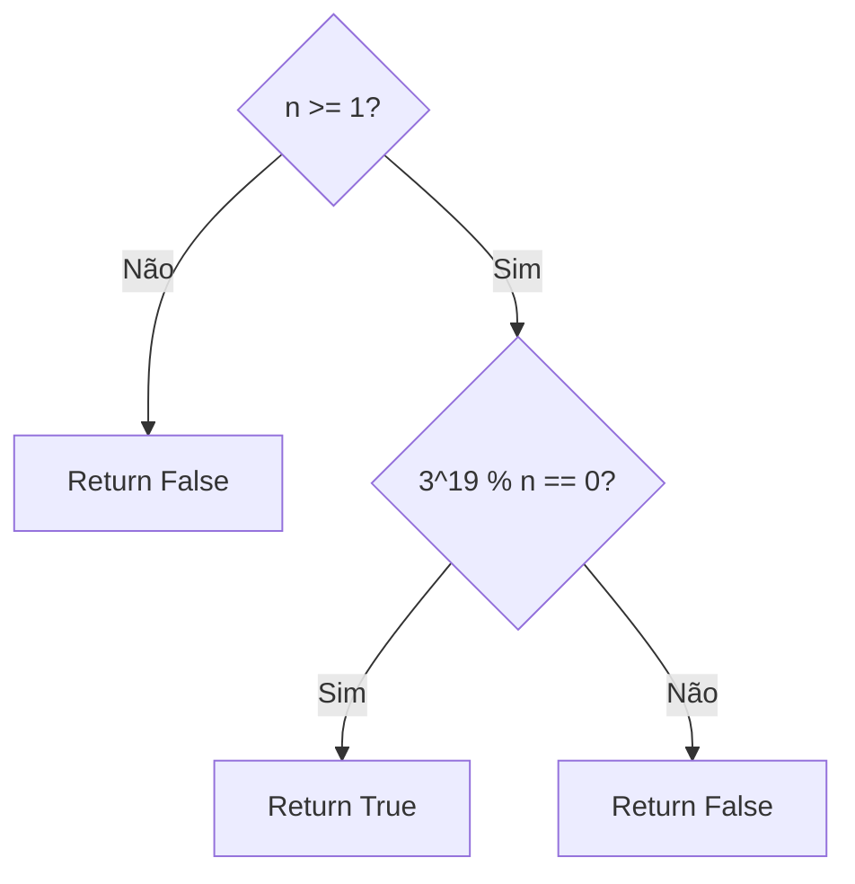
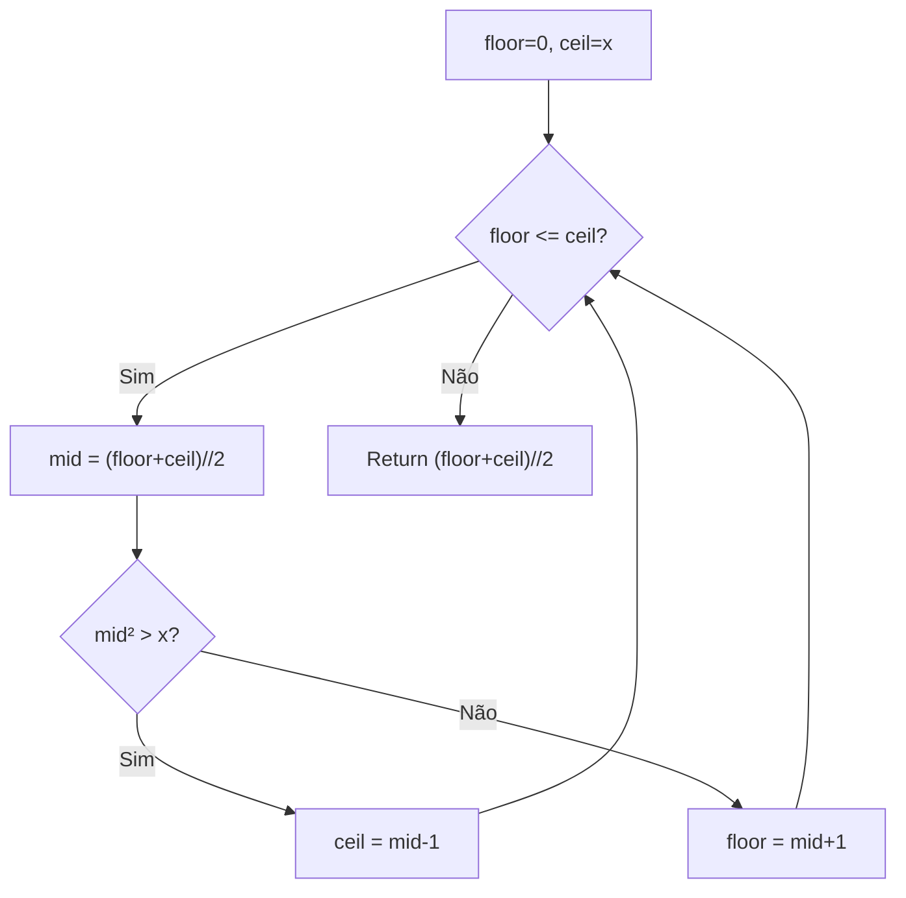

# Math

---

### 📌 Count Primes (`count_primes.py`)

* **Descrição breve:** Conta a quantidade de números primos menores que `n`.

* **💡 Sacada (O Pulo do Gato):**

> Crivo de Eratóstenes: iniciar todos como primos, depois para cada primo `i` até `√n`, marcar todos os múltiplos como não-primos. Só precisamos testar até a raiz quadrada porque se não encontramos nenhum fator até lá, não vamos encontrar.

* **🧠 Modelo Mental:**



* **Complexidade esperada:** ⏱️ Tempo $O(n \log \log n)$ | 💾 Espaço $O(n)$

* **Edge cases:** `n <= 2` (return 0).

* **Core snippet:**

```python
def countPrimes(n):
    n = max(n, 2)
    prime_list = [True] * n
    prime_list[0] = prime_list[1] = False
    for i in range(2, int(n**0.5) + 1):
        for k in range(2*i, n, i):
            prime_list[k] = False
    return sum(prime_list)
```

---

### 📌 Excel Sheet Column Number (`excel_sheet_column.py`)

* **Descrição breve:** Converte um título de coluna Excel (ex: "AB") para o número correspondente.

* **💡 Sacada (O Pulo do Gato):**

> É uma conversão de base 26 onde A=1, B=2, ..., Z=26. Para cada letra, multiplicar por `26^posição` e somar o valor da letra.

* **🧠 Modelo Mental:**



* **Complexidade esperada:** ⏱️ Tempo $O(n)$ | 💾 Espaço $O(1)$

* **Edge cases:** Coluna "A" (= 1); "Z" (= 26); "AA" (= 27).

* **Core snippet:**

```python
def titleToNumber(columnTitle):
    count = 0
    size = len(columnTitle)
    for idx in range(size):
        power = size - idx - 1
        letter_value = ord(columnTitle[idx]) - ord('A') + 1
        count += 26**power * letter_value
    return count
```

---

### 📌 Factorial Trailing Zeroes (`factorial-trailing-zeroes.py`)

* **Descrição breve:** Conta quantos zeros à direita tem `n!`.

* **💡 Sacada (O Pulo do Gato):**

> Zeros à direita vêm de fatores de 10 = 2×5. Como há sempre mais fatores de 2, basta contar quantos fatores de 5 existem na fatoração de n!.

* **🧠 Modelo Mental:**



* **Complexidade esperada:** ⏱️ Tempo $O(n \log n)$ | 💾 Espaço $O(1)$

* **Edge cases:** `n = 0` (return 0); `n = 5` (return 1); `n = 25` (return 6, por causa de 25=5×5).

* **Core snippet:**

```python
def trailingZeroes(n):
    count_2, count_5 = 0, 0
    for num in range(n, 0, -1):
        temp = num
        while temp % 2 == 0:
            temp //= 2; count_2 += 1
        while temp % 5 == 0:
            temp //= 5; count_5 += 1
    return min(count_2, count_5)
```

---

### 📌 Fizz Buzz (`FizzBuzz.py`)

* **Descrição breve:** Para cada número de 1 a n, retorna "Fizz" se divisível por 3, "Buzz" se por 5, "FizzBuzz" se por ambos, ou o número como string.

* **💡 Sacada (O Pulo do Gato):**

> Concatenar strings: verificar módulo de 3 para adicionar "Fizz", módulo de 5 para "Buzz". Se nenhum, usar o número. A concatenação garante "FizzBuzz" automaticamente.

* **🧠 Modelo Mental:**



* **Complexidade esperada:** ⏱️ Tempo $O(n)$ | 💾 Espaço $O(n)$

* **Edge cases:** `n = 1`; número divisível por 15.

* **Core snippet:**

```python
def fizzBuzz(n):
    response = [""] * n
    for i in range(1, n + 1):
        if i % 3 == 0: response[i-1] += "Fizz"
        if i % 5 == 0: response[i-1] += "Buzz"
        if i % 5 != 0 and i % 3 != 0: response[i-1] = str(i)
    return response
```

---

### 📌 Happy Number (`happy_number.py`)

* **Descrição breve:** Determina se um número é "feliz": repete-se a soma dos quadrados dos seus dígitos até chegar a 1.

* **💡 Sacada (O Pulo do Gato):**

> Se a soma dos quadrados se repetir (ciclo), o número nunca chegará a 1. Usar um dicionário para detetar ciclos.

* **🧠 Modelo Mental:**



* **Complexidade esperada:** ⏱️ Tempo $O(k)$ iterações até detetar ciclo | 💾 Espaço $O(k)$

* **Edge cases:** `n = 1` (True); `n = 2` (False).

* **Core snippet:**

```python
def isHappy(n):
    results = {}
    while n != 1:
        result = 0
        temp = n
        while temp != 0:
            result += (temp % 10) ** 2
            temp //= 10
        if result in results: return False
        results[result] = 0
        n = result
    return True
```

---

### 📌 Palindrome Number (`palindrome_number.py`)

* **Descrição breve:** Verifica se um inteiro é palíndromo sem converter para string (mas esta solução usa string).

* **💡 Sacada (O Pulo do Gato):**

> Negativos nunca são palíndromos. Converter para string e comparar com a versão invertida.

* **🧠 Modelo Mental:**



* **Complexidade esperada:** ⏱️ Tempo $O(d)$ onde $d$ é número de dígitos | 💾 Espaço $O(d)$

* **Edge cases:** `x = 0` (True); números negativos (False); número de um dígito (True).

* **Core snippet:**

```python
def isPalindrome(x):
    if x < 0: return False
    return str(x) == str(x)[::-1]
```

---

### 📌 Pow(x, n) (`pow.py`)

* **Descrição breve:** Calcula `x` elevado à potência `n` de forma eficiente.

* **💡 Sacada (O Pulo do Gato):**

> Exponenciação rápida (fast exponentiation): `x^n = (x²)^(n/2)` se n é par, ou `x × (x²)^(n/2)` se n é ímpar. Reduz a complexidade de $O(n)$ para $O(\log n)$.

* **🧠 Modelo Mental:**



* **Complexidade esperada:** ⏱️ Tempo $O(\log n)$ | 💾 Espaço $O(\log n)$ (recursão)

* **Edge cases:** `n = 0` (return 1); `n < 0` (usar `1/x`); `x = 0`.

* **Core snippet:**

```python
def myPow(x, n):
    def pow_helper(x, n):
        if n == 0: return 1
        odd = n % 2 == 1
        n = n // 2
        result = pow_helper(x * x, n)
        return result * x if odd else result
    if n == 0: return 1
    return pow_helper(x, n) if n > 0 else pow_helper(1/x, abs(n))
```

---

### 📌 Power of Three (`power_of_three.py`)

* **Descrição breve:** Verifica se um número é uma potência de 3.

* **💡 Sacada (O Pulo do Gato):**

> O maior inteiro que é potência de 3 (dentro de 32 bits) é `3^19 = 1162261467`. Se `n > 0` e esse número máximo é divisível por `n`, então `n` é potência de 3.

* **🧠 Modelo Mental:**



* **Complexidade esperada:** ⏱️ Tempo $O(1)$ | 💾 Espaço $O(1)$

* **Edge cases:** `n = 0` (False); `n = 1` (True, pois $3^0 = 1$); números negativos.

* **Core snippet:**

```python
def isPowerOfThree(n):
    if n < 1: return False
    return 3486784401 % n == 0
```

---

### 📌 Sqrt(x) (`sqrt.py`)

* **Descrição breve:** Calcula a raiz quadrada inteira de `x` sem usar funções de biblioteca.

* **💡 Sacada (O Pulo do Gato):**

> Busca binária: se `mid² > x`, o teto desce. Senão, o piso sobe. O valor final é a raiz inteira truncada.

* **🧠 Modelo Mental:**



* **Complexidade esperada:** ⏱️ Tempo $O(\log x)$ | 💾 Espaço $O(1)$

* **Edge cases:** `x = 0` (return 0); `x = 1` (return 1); números grandes.

* **Core snippet:**

```python
def mySqrt(x):
    ceil, floor = x, 0
    while floor <= ceil:
        value = (ceil + floor) // 2
        if value * value > x: ceil = value - 1
        else: floor = value + 1
    return (ceil + floor) // 2
```

---
