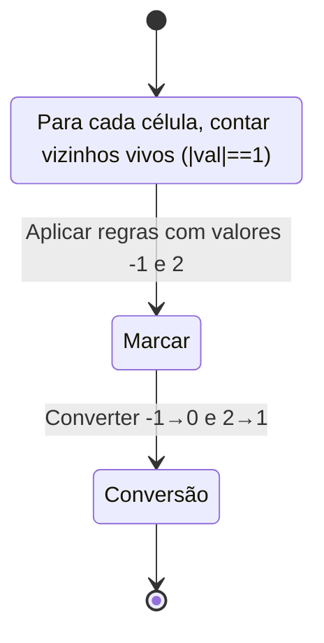
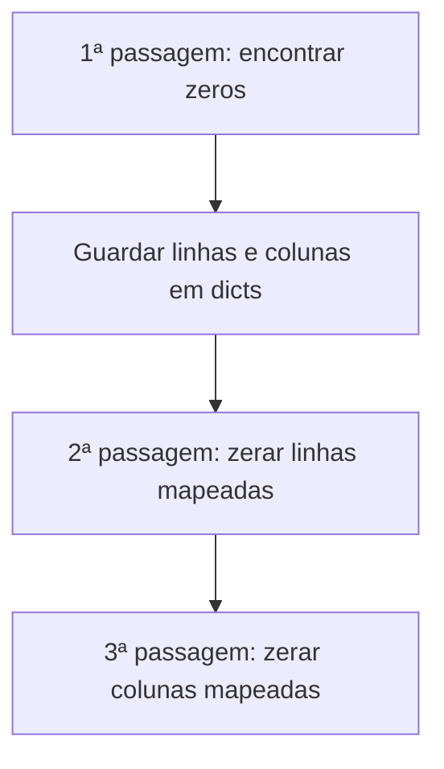
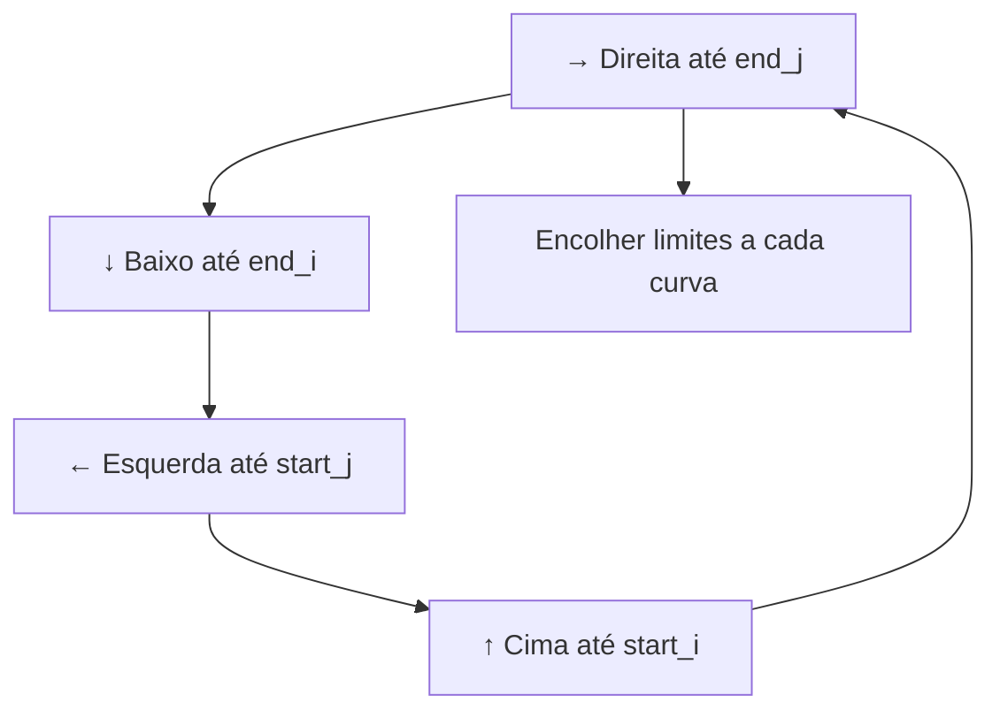

# Matrix

---

### 📌 Game of Life (`game_of_life.py`)

* **Descrição breve:** Implementa o "Jogo da Vida" de Conway: dada uma grelha binária, calcula o próximo estado segundo as regras de vizinhança.

* **💡 Sacada (O Pulo do Gato):**

> Atribuir `-1` a uma célula viva que morreu e `2` a uma célula morta que viveu. Assim guardamos duas informações ao mesmo tempo: o estado original (para contar vizinhos) e o próximo estado. No final, convertemos `-1→0` e `2→1`.

* **🧠 Modelo Mental:**



* **Complexidade esperada:** ⏱️ Tempo $O(m \times n)$ | 💾 Espaço $O(1)$ (in-place)

* **Edge cases:** Grelha 1×1; todas as células mortas; todas as células vivas.

* **Core snippet:**

```python
def gameOfLife(board):
    m, n = len(board), len(board[0])
    def count_cells(i, j):
        counter = 0
        for row in range(max(0, i-1), min(m, i+2)):
            for col in range(max(0, j-1), min(n, j+2)):
                if i == row and j == col:
                    continue
                if abs(board[row][col]) == 1:
                    counter += 1
        return counter

    for i in range(m):
        for j in range(n):
            cnt = count_cells(i, j)
            if board[i][j] == 1 and (cnt < 2 or cnt > 3):
                board[i][j] = -1
            elif board[i][j] == 0 and cnt == 3:
                board[i][j] = 2
    for i in range(m):
        for j in range(n):
            if board[i][j] == 2: board[i][j] = 1
            elif board[i][j] == -1: board[i][j] = 0
```

---

### 📌 Set Matrix Zeroes (`set_matrix_zeroes.py`)

* **Descrição breve:** Dada uma matriz, se um elemento é `0`, coloca toda a sua linha e coluna a zero.

* **💡 Sacada (O Pulo do Gato):**

> Primeiro passar pela matriz e mapear quais linhas e colunas contêm zeros (com dicionários). Depois, numa segunda passagem, zerar as linhas e colunas mapeadas.

* **🧠 Modelo Mental:**



* **Complexidade esperada:** ⏱️ Tempo $O(m \times n)$ | 💾 Espaço $O(m + n)$

* **Edge cases:** Matriz sem zeros; matriz toda com zeros; zeros na primeira linha/coluna.

* **Core snippet:**

```python
def setZeroes(matrix):
    map_i, map_j = {}, {}
    for i in range(len(matrix)):
        for j in range(len(matrix[0])):
            if matrix[i][j] == 0:
                map_i[i] = True
                map_j[j] = True
    for row_idx in map_i:
        for col in range(len(matrix[0])):
            matrix[row_idx][col] = 0
    for col_idx in map_j:
        for row in range(len(matrix)):
            matrix[row][col_idx] = 0
```

---

### 📌 Spiral Matrix (`spiral_matrix.py`)

* **Descrição breve:** Dada uma matriz `m×n`, retorna todos os seus elementos em ordem espiral (sentido horário).

* **💡 Sacada (O Pulo do Gato):**

> Manter quatro limites (`start_i`, `end_i`, `start_j`, `end_j`) e duas variáveis de direção (`x_direction`, `y_direction`). Quando atingimos um limite, mudamos de direção e encolhemos o limite correspondente.

* **🧠 Modelo Mental:**



* **Complexidade esperada:** ⏱️ Tempo $O(m \times n)$ | 💾 Espaço $O(m \times n)$

* **Edge cases:** Matriz 1×1; matriz com uma única linha ou coluna.

* **Core snippet:**

```python
def spiralOrder(matrix):
    start_i, end_i = 0, len(matrix) - 1
    start_j, end_j = 0, len(matrix[0]) - 1
    i, j = 0, 0
    response = []
    x_dir, y_dir = 1, 0
    while start_i <= end_i and start_j <= end_j:
        response.append(matrix[i][j])
        if x_dir == 1 and j == end_j:
            x_dir, y_dir = 0, 1; start_i += 1
        elif y_dir == 1 and i == end_i:
            x_dir, y_dir = -1, 0; end_j -= 1
        elif x_dir == -1 and j == start_j:
            x_dir, y_dir = 0, -1; end_i -= 1
        elif y_dir == -1 and i == start_i:
            x_dir, y_dir = 1, 0; start_j += 1
        i, j = i + y_dir, j + x_dir
    return response
```

---
