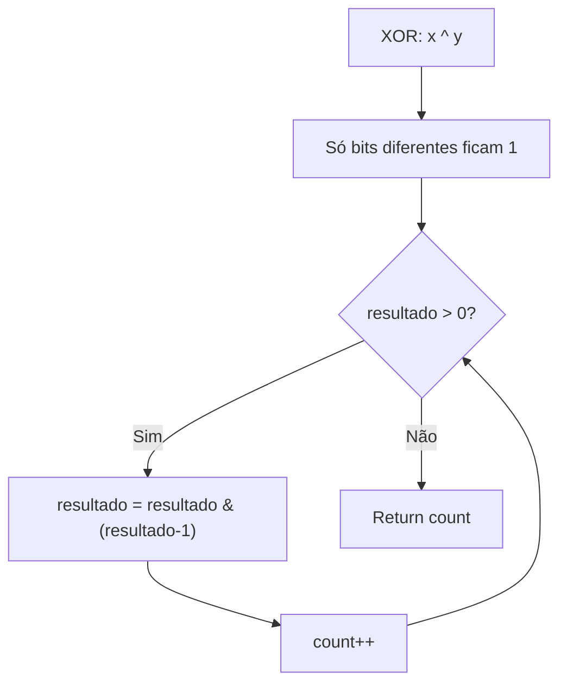
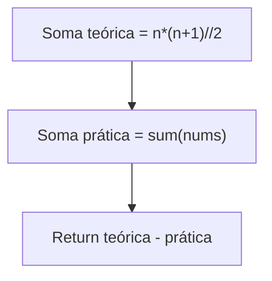
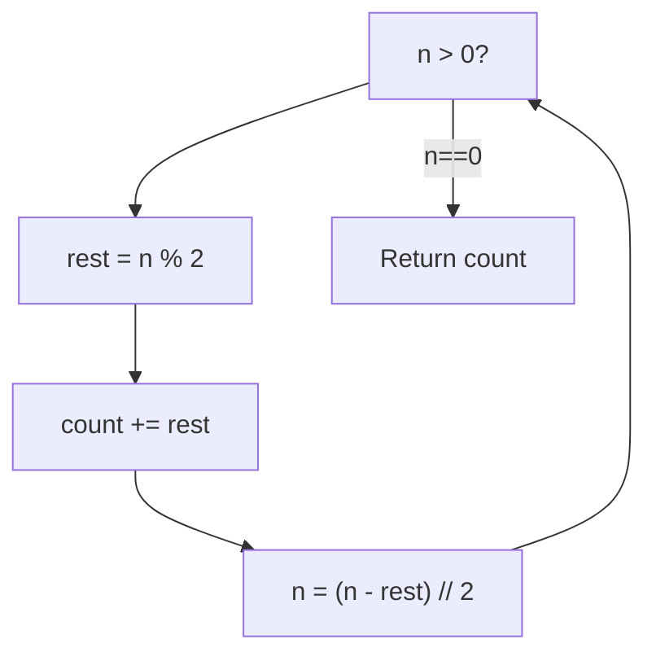
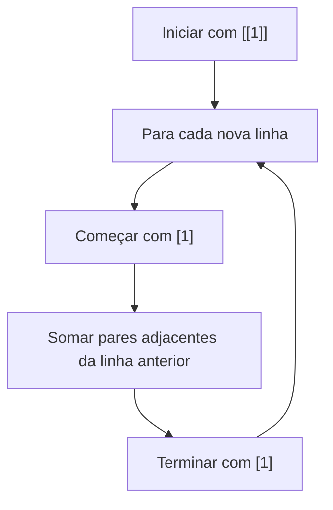
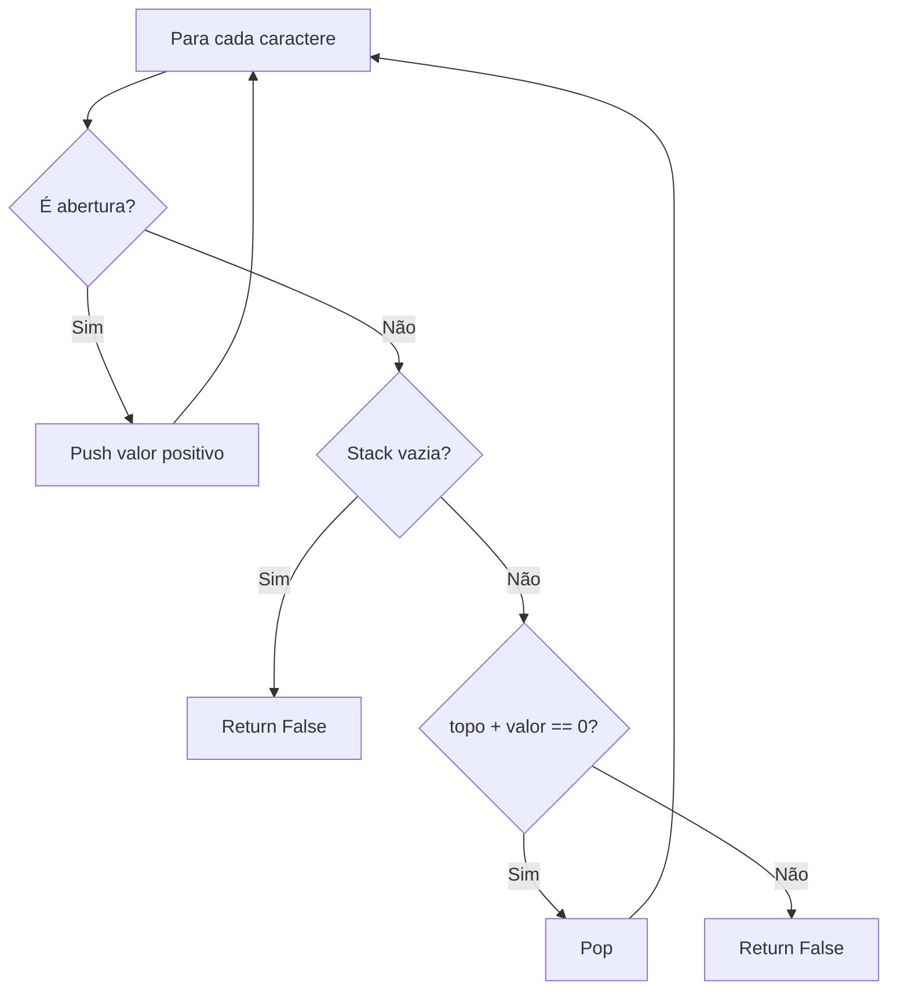

# Others

---

### 📌 Hamming Distance (`hamming_Distance.py`)

* **Descrição breve:** Calcula a distância de Hamming entre dois inteiros (número de bits diferentes).

* **💡 Sacada (O Pulo do Gato):**

> Fazer XOR entre os dois números — só sobram os bits que são diferentes. Depois, contar quantos bits estão ativos usando `n & (n-1)` que remove o último bit ativo a cada iteração.

* **🧠 Modelo Mental:**



* **Complexidade esperada:** ⏱️ Tempo $O(k)$ onde $k$ é o nº de bits diferentes | 💾 Espaço $O(1)$

* **Edge cases:** Números iguais (distância 0); um dos números é 0.

* **Core snippet:**

```python
def hammingDistance(x, y):
    xor_response = x ^ y
    count = 0
    while xor_response > 0:
        xor_response = xor_response & (xor_response - 1)
        count += 1
    return count
```

---

### 📌 Missing Number (`missing_number.py`)

* **Descrição breve:** Dado um array de `n` números distintos no intervalo `[0, n]`, encontra o número que falta.

* **💡 Sacada (O Pulo do Gato):**

> Como sabemos qual a soma teórica dos números de 0 a n (`n*(n+1)/2`), basta subtrair a soma prática do array. A diferença é o número que falta.

* **🧠 Modelo Mental:**



* **Complexidade esperada:** ⏱️ Tempo $O(n)$ | 💾 Espaço $O(1)$

* **Edge cases:** Número que falta é 0; número que falta é n (último).

* **Core snippet:**

```python
def missingNumber(nums):
    n = len(nums)
    theorical_sum = n * (n + 1) // 2
    practical_sum = sum(nums)
    return theorical_sum - practical_sum
```

---

### 📌 Number of 1 Bits (`number_of_one_bits.py`)

* **Descrição breve:** Conta o número de bits '1' (Hamming weight) de um inteiro sem sinal.

* **💡 Sacada (O Pulo do Gato):**

> Divisões sucessivas por 2: o resto indica se o bit atual é 1. Somar o resto e dividir o número até chegar a 0.

* **🧠 Modelo Mental:**



* **Complexidade esperada:** ⏱️ Tempo $O(\log n)$ | 💾 Espaço $O(1)$

* **Edge cases:** `n = 0`; número com todos os bits ativos.

* **Core snippet:**

```python
def hammingWeight(n):
    count = 0
    while n > 0:
        rest = n % 2
        count += rest
        n -= rest
        n = n // 2
    return count
```

---

### 📌 Pascal's Triangle (`pascal_triangule.py`)

* **Descrição breve:** Gera as primeiras `numRows` linhas do Triângulo de Pascal.

* **💡 Sacada (O Pulo do Gato):**

> Cada nova linha começa e termina com 1. Os valores do meio são a soma de dois elementos consecutivos da linha anterior (`row[idx] + row[idx+1]`).

* **🧠 Modelo Mental:**



* **Complexidade esperada:** ⏱️ Tempo $O(n^2)$ | 💾 Espaço $O(n^2)$

* **Edge cases:** `numRows = 1` (apenas `[[1]]`).

* **Core snippet:**

```python
def generate(numRows):
    response = [[1]]
    for _ in range(numRows - 1):
        row = response[-1]
        new_row = [1]
        for idx in range(len(row) - 1):
            new_row.append(row[idx] + row[idx + 1])
        new_row.append(1)
        response.append(new_row)
    return response
```

---

### 📌 Valid Parentheses (`valid_parentheses.py`)

* **Descrição breve:** Dada uma string com parênteses `()[]{}`, determina se a string é válida (cada abertura tem o fecho correspondente na ordem correta).

* **💡 Sacada (O Pulo do Gato):**

> Usar uma pilha com valores numéricos: `(=1, [=2, {=3` e `)=-1, ]=-2, }=-3`. Para fechar, o topo da pilha + valor atual deve somar 0. Assim verificamos o matching.

* **🧠 Modelo Mental:**



* **Complexidade esperada:** ⏱️ Tempo $O(n)$ | 💾 Espaço $O(n)$

* **Edge cases:** String vazia (válida); apenas aberturas; `"([)]"` (cruzado, inválido).

* **Core snippet:**

```python
def isValid(s):
    stack = []
    for value in s:
        match value:
            case '(': control = 1
            case '[': control = 2
            case '{': control = 3
            case ')': control = -1
            case ']': control = -2
            case '}': control = -3
        if control > 0:
            stack.append(control)
        elif control < 0:
            if not stack or stack[-1] + control != 0:
                return False
            stack.pop()
    return len(stack) == 0
```

---
