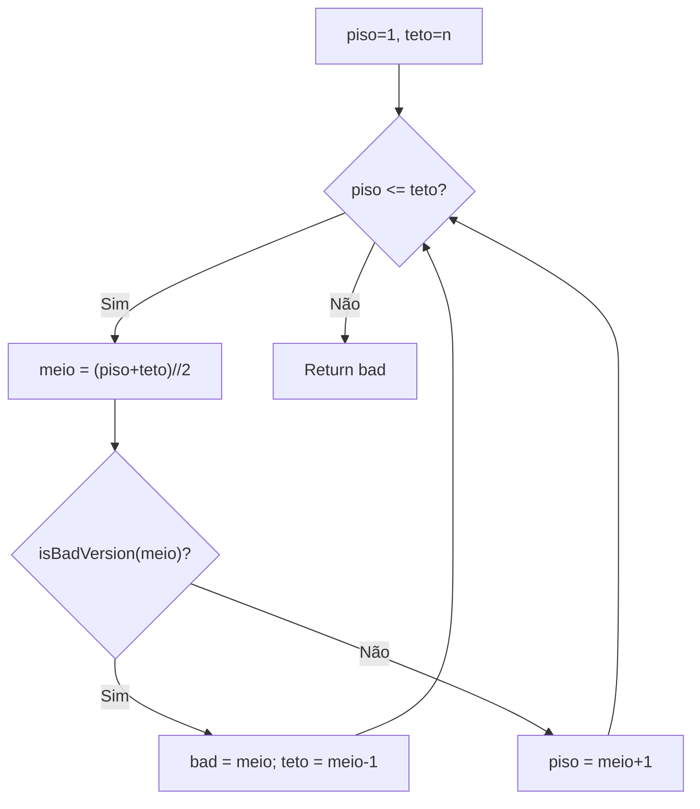
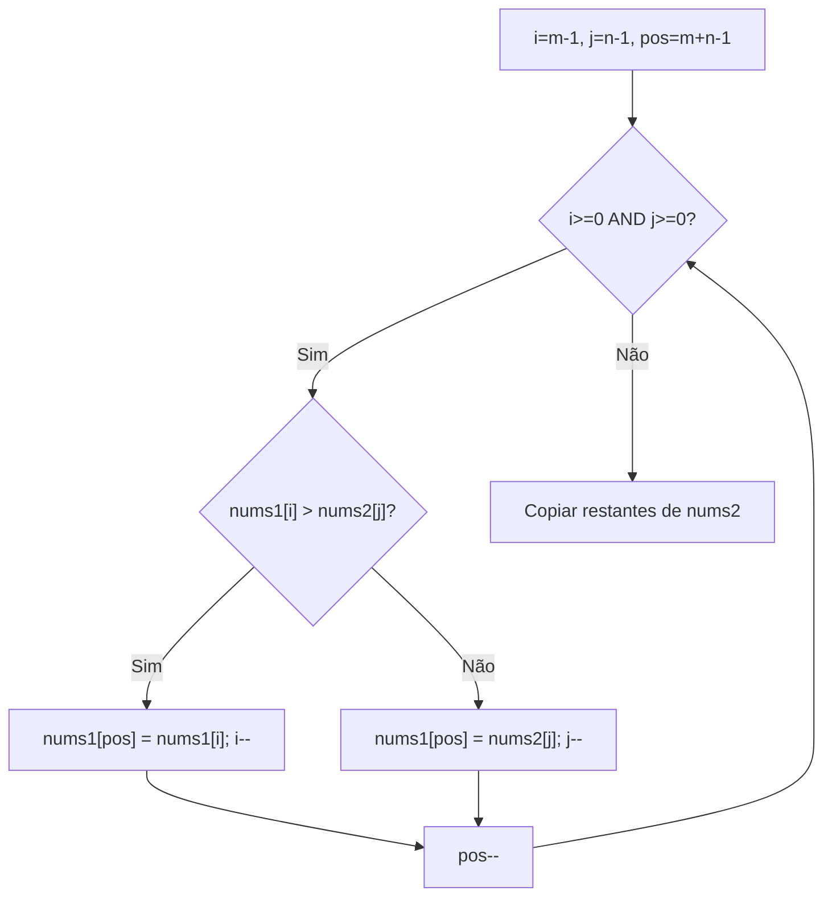

# Sorting & Searching

---

### 📌 First Bad Version (`is_bad_version.py`)

* **Descrição breve:** Dadas `n` versões `[1, 2, ..., n]`, encontra a primeira versão defeituosa usando uma API `isBadVersion(version)`.

* **💡 Sacada (O Pulo do Gato):**

> Busca binária clássica: se o meio é bad, o teto desce e guardamos esse meio como candidato. Se não é bad, o piso sobe. O candidato final é a primeira versão defeituosa.

* **🧠 Modelo Mental:**



* **Complexidade esperada:** ⏱️ Tempo $O(\log n)$ | 💾 Espaço $O(1)$

* **Edge cases:** `n = 1` (a única versão é a bad); todas as versões são bad.

* **Core snippet:**

```python
def firstBadVersion(n):
    teto = n
    piso = 1
    bad_version = teto
    while teto >= piso:
        meio = (teto + piso) // 2
        if isBadVersion(meio):
            teto = meio - 1
            bad_version = meio
        else:
            piso = meio + 1
    return bad_version
```

---

### 📌 Merge Sorted Array (`merge_sorted_array.py`)

* **Descrição breve:** Dados dois arrays ordenados `nums1` (com espaço extra) e `nums2`, faz merge in-place em `nums1`.

* **💡 Sacada (O Pulo do Gato):**

> Preencher de trás para frente. Começar pelos maiores valores evita sobrescrever elementos ainda não processados. Dois ponteiros `i` e `j` nas posições finais dos arrays.

* **🧠 Modelo Mental:**



* **Complexidade esperada:** ⏱️ Tempo $O(m + n)$ | 💾 Espaço $O(1)$

* **Edge cases:** `nums2` vazio (`n=0`); `nums1` vazio (`m=0`); um array completamente menor que o outro.

* **Core snippet:**

```python
def merge(nums1, m, nums2, n):
    i = m - 1
    j = n - 1
    next_pos = len(nums1) - 1
    while i >= 0 and j >= 0:
        if nums1[i] <= nums2[j]:
            nums1[next_pos] = nums2[j]
            next_pos -= 1
            j -= 1
        else:
            nums1[next_pos] = nums1[i]
            next_pos -= 1
            i -= 1
    if i <= 0:
        for k in range(j + 1):
            nums1[k] = nums2[k]
```

---
