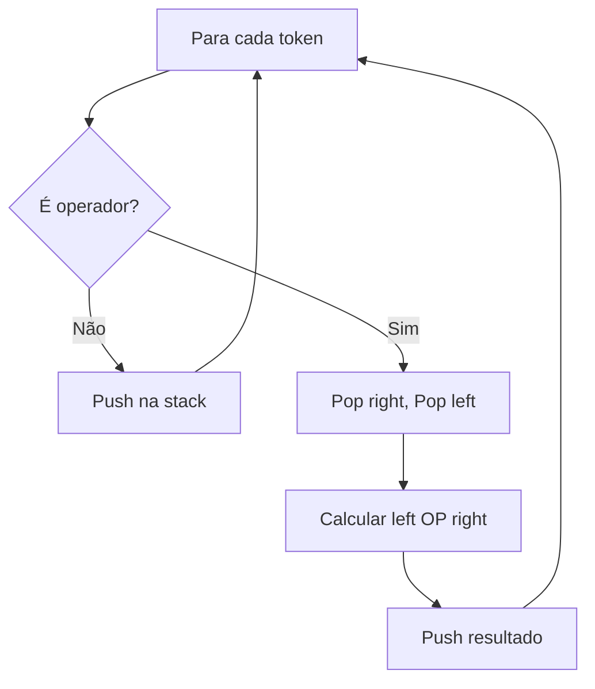
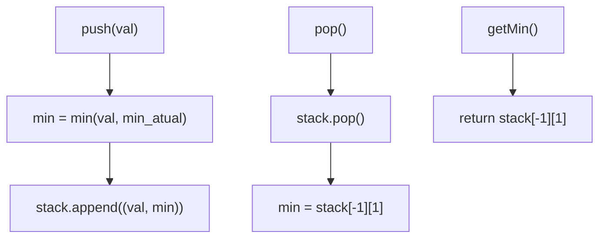
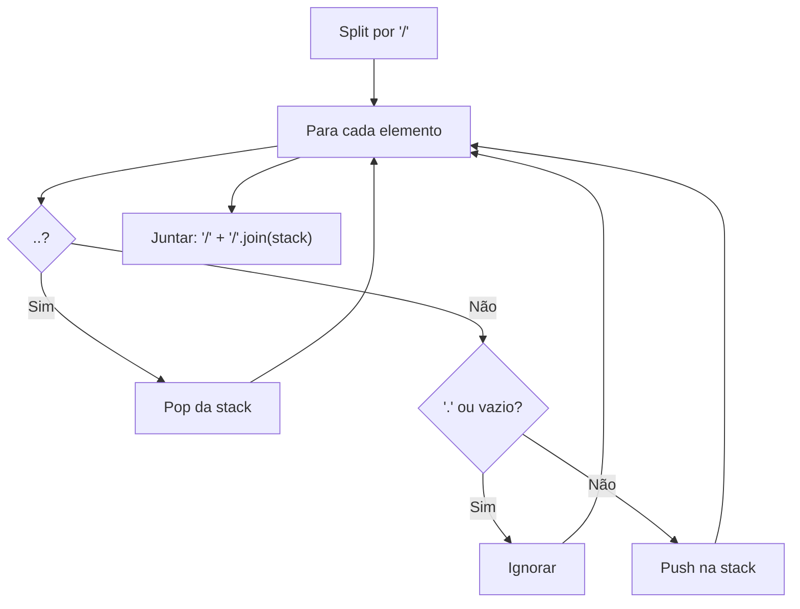

# Stack

---

### 📌 Evaluate Reverse Polish Notation (`evaluate-reverse-polish-notation.py`)

* **Descrição breve:** Avalia uma expressão aritmética em notação polonesa reversa (pós-fixada).

* **💡 Sacada (O Pulo do Gato):**

> Usar uma pilha: números são empilhados, operadores desempilham dois operandos, calculam e empilham o resultado. Cuidado especial com a divisão inteira de negativos (truncar para zero, não para -∞).

* **🧠 Modelo Mental:**



* **Complexidade esperada:** ⏱️ Tempo $O(n)$ | 💾 Espaço $O(n)$

* **Edge cases:** Divisão por número negativo (truncar para zero); expressão com um único número.

* **Core snippet:**

```python
def evalRPN(tokens):
    stack = []
    for token in tokens:
        if token in ('+', '-', '*', '/'):
            right = int(stack.pop())
            left = int(stack.pop())
            if token == '+': stack.append(left + right)
            elif token == '-': stack.append(left - right)
            elif token == '*': stack.append(left * right)
            elif token == '/':
                stack.append(left // right)
                if stack[-1] < 0 and left % right != 0:
                    stack[-1] += 1
        else:
            stack.append(token)
    return int(stack[-1])
```

---

### 📌 Min Stack (`min_stack.py`)

* **Descrição breve:** Implementar uma stack que suporte `push`, `pop`, `top` e `getMin` em $O(1)$.

* **💡 Sacada (O Pulo do Gato):**

> Guardar em cada posição da stack uma tupla `(valor, mínimo_até_aqui)`. Assim, ao fazer pop, o novo mínimo é automaticamente o da tupla anterior.

* **🧠 Modelo Mental:**



* **Complexidade esperada:** ⏱️ Tempo $O(1)$ por operação | 💾 Espaço $O(n)$

* **Edge cases:** Pop quando a stack fica vazia; push de valores iguais ao mínimo.

* **Core snippet:**

```python
class MinStack:
    def __init__(self):
        self.stack = []
        self.min_value = None

    def push(self, val):
        if self.min_value is None:
            self.min_value = val
        elif val < self.min_value:
            self.min_value = val
        self.stack.append((val, self.min_value))

    def getMin(self):
        return self.stack[-1][1]

    def pop(self):
        self.stack.pop()
        self.min_value = self.getMin() if self.stack else None

    def top(self):
        return self.stack[-1][0]
```

---

### 📌 Simplify Path (`simplify_path.py`)

* **Descrição breve:** Dado um caminho Unix absoluto, simplifica-o removendo `.`, `..` e barras duplicadas.

* **💡 Sacada (O Pulo do Gato):**

> Uma lista em Python é uma pilha! Fazer split por `/`, ignorar `.` e strings vazias, desempilhar com `..`, e empilhar diretórios normais. No final, juntar com `/`.

* **🧠 Modelo Mental:**



* **Complexidade esperada:** ⏱️ Tempo $O(n)$ | 💾 Espaço $O(n)$

* **Edge cases:** Caminho raiz `"/"`; múltiplos `..` seguidos; barras duplicadas.

* **Core snippet:**

```python
def simplifyPath(path):
    path = path.split('/')
    stack = []
    for element in path:
        if element == '..':
            if stack:
                stack.pop()
        elif element == '.' or element == '':
            continue
        else:
            stack.append(element)
    return '/' + '/'.join(stack)
```

---
