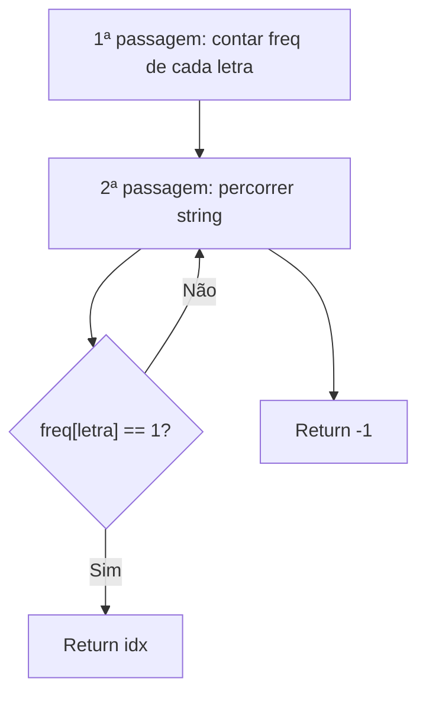
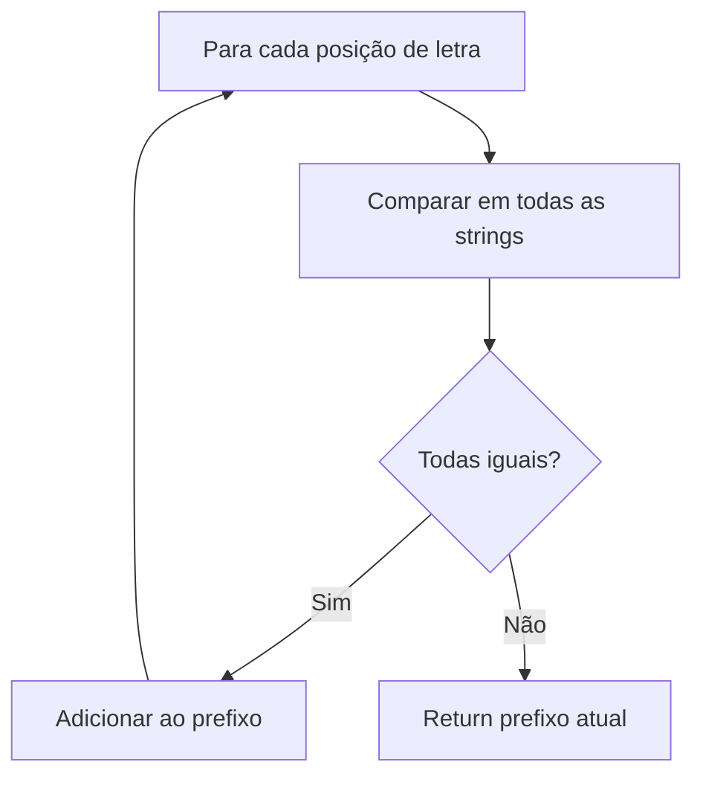
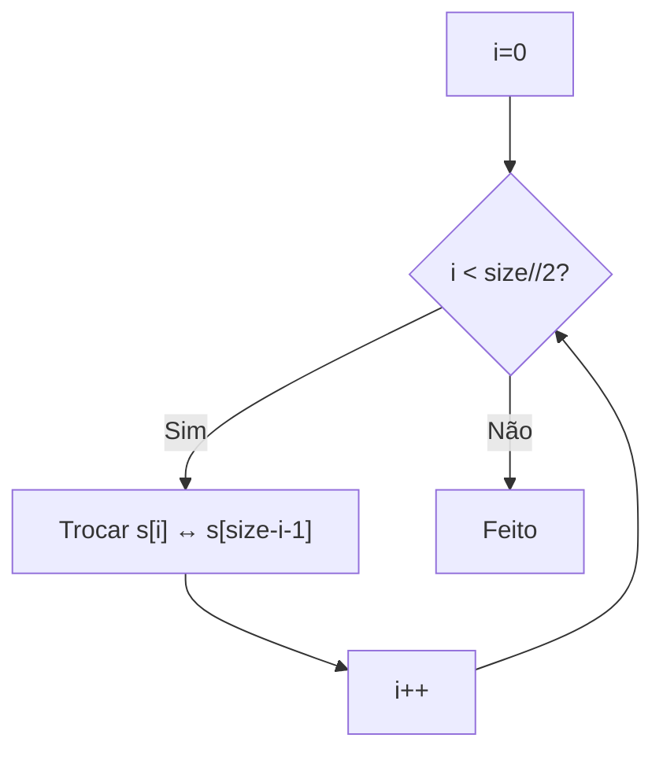
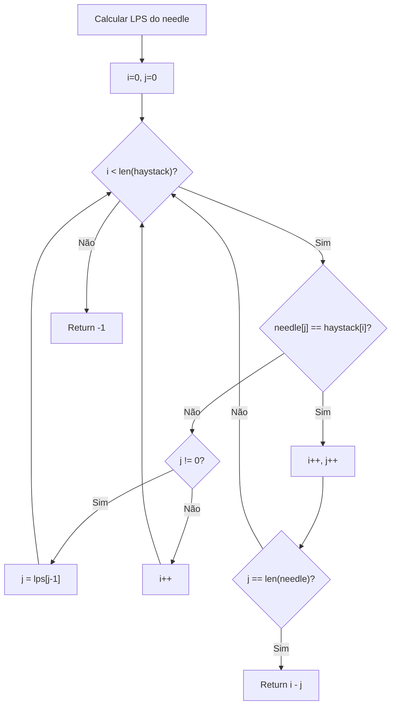
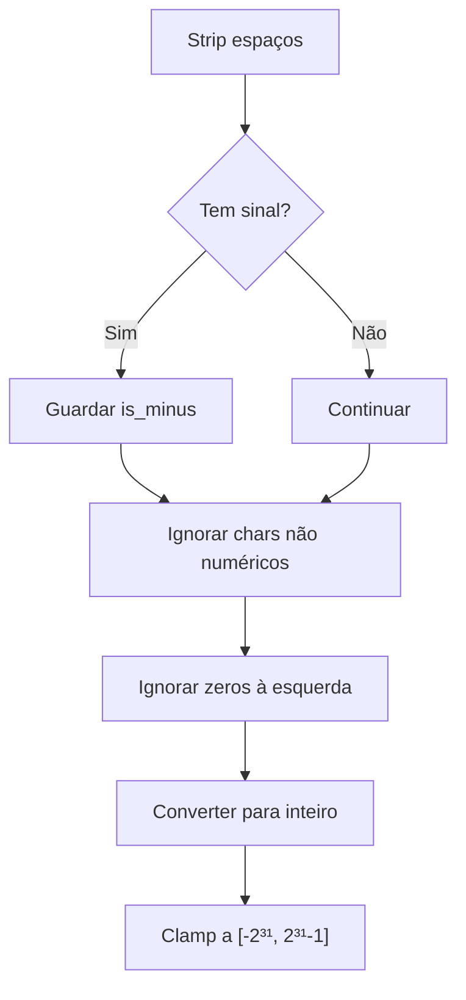
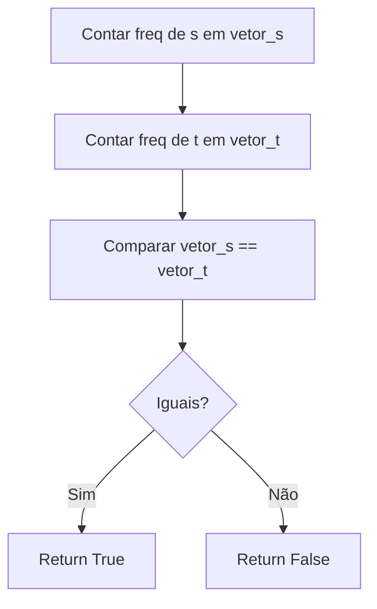

# Strings

---

### 📌 First Unique Character in a String (`first_unique_char.py`)

* **Descrição breve:** Dada uma string, encontra o índice do primeiro caractere que não se repete.

* **💡 Sacada (O Pulo do Gato):**

> Usar um vetor de 26 posições para contar ocorrências de cada letra. Depois, percorrer a string novamente e retornar o índice da primeira letra com contagem 1.

* **🧠 Modelo Mental:**



* **Complexidade esperada:** ⏱️ Tempo $O(n)$ | 💾 Espaço $O(1)$ (vetor fixo de 26)

* **Edge cases:** Todos os caracteres repetidos; string com um único caractere.

* **Core snippet:**

```python
def firstUniqChar(s):
    memory = [0] * 26
    for letter in s:
        memory[ord(letter) - ord('a')] += 1
    for idx, letter in enumerate(s):
        if memory[ord(letter) - ord('a')] == 1:
            return idx
    return -1
```

---

### 📌 Longest Common Prefix (`longest_common_prefix.py`)

* **Descrição breve:** Encontra o maior prefixo comum entre um array de strings.

* **💡 Sacada (O Pulo do Gato):**

> Comparar letra a letra na mesma posição em todas as strings. Se alguma diferir, parar. O comprimento mínimo das strings limita a busca.

* **🧠 Modelo Mental:**



* **Complexidade esperada:** ⏱️ Tempo $O(n \times m)$ onde $m$ é tamanho do menor string | 💾 Espaço $O(m)$

* **Edge cases:** Array com string vazia; todas as strings iguais; nenhum prefixo comum.

* **Core snippet:**

```python
def longestCommonPrefix(strs):
    response = ""
    min_word_size = min(map(lambda x: len(x), strs))
    for idx_letter in range(min_word_size):
        for idx_word in range(len(strs) - 1):
            if strs[idx_word][idx_letter] != strs[idx_word + 1][idx_letter]:
                return response
        response += strs[0][idx_letter]
    return response
```

---

### 📌 Reverse String (`reverse_string.py`)

* **Descrição breve:** Inverte um array de caracteres in-place.

* **💡 Sacada (O Pulo do Gato):**

> Dois ponteiros que se movem de fora para dentro, trocando `s[i]` com `s[n-i-1]` até ao meio.

* **🧠 Modelo Mental:**



* **Complexidade esperada:** ⏱️ Tempo $O(n)$ | 💾 Espaço $O(1)$

* **Edge cases:** String vazia; string com um caractere; string palíndroma.

* **Core snippet:**

```python
def reverseString(s):
    size = len(s)
    for idx in range(size // 2):
        s[idx], s[size - idx - 1] = s[size - idx - 1], s[idx]
```

---

### 📌 Implement strStr() / KMP (`str_str.py`)

* **Descrição breve:** Encontra a primeira ocorrência de `needle` em `haystack` (Find Index of First Occurrence).

* **💡 Sacada (O Pulo do Gato):**

> Algoritmo KMP: pré-calcular a tabela LPS (Longest Prefix Suffix). Quando há mismatch, voltar para a posição do último maior prefixo que também é sufixo — aproveitando que até `j-1` já encaixava até `i-1`.

* **🧠 Modelo Mental:**



* **Complexidade esperada:** ⏱️ Tempo $O(n + m)$ | 💾 Espaço $O(m)$

* **Edge cases:** `needle` vazio (return 0); `needle` maior que `haystack`; nenhuma ocorrência.

* **Core snippet:**

```python
def get_lps(pattern):
    n = len(pattern)
    lps = [0] * n
    j, i = 0, 1
    while i < n:
        if pattern[i] == pattern[j]:
            j += 1; lps[i] = j; i += 1
        elif j != 0:
            j = lps[j - 1]
        else:
            lps[i] = 0; i += 1
    return lps

def strStr(haystack, needle):
    lps = get_lps(needle)
    i, j = 0, 0
    while i < len(haystack):
        if needle[j] == haystack[i]:
            i += 1; j += 1
        if j == len(needle):
            return i - j
        elif i < len(haystack) and needle[j] != haystack[i]:
            j = lps[j - 1] if j != 0 else 0
            if j == 0 and needle[0] != haystack[i]: i += 1
    return -1
```

---

### 📌 String to Integer (atoi) (`string_to_integer.py`)

* **Descrição breve:** Converte uma string para inteiro de 32 bits, tratando espaços, sinais, overflow e caracteres inválidos.

* **💡 Sacada (O Pulo do Gato):**

> Tratar os edge cases sequencialmente: strip de espaços, verificar sinal, ignorar caracteres não numéricos, ignorar zeros à esquerda, e clamp ao intervalo `[-2³¹, 2³¹-1]`.

* **🧠 Modelo Mental:**



* **Complexidade esperada:** ⏱️ Tempo $O(n)$ | 💾 Espaço $O(n)$

* **Edge cases:** `"+1"`, `"-42a"`, `"+-1"`, `"-"`, `""`, `"000003"`, `"abc"`, `"123 abc"`.

* **Core snippet:**

```python
def myAtoi(s):
    s = s.strip()
    if not s: return 0
    is_minus = s[0] == '-' and len(s) > 1 and s[1].isdigit()
    has_plus = s[0] == '+' and len(s) > 1 and s[1].isdigit()
    if is_minus or has_plus: s = s[1:]
    # Filtrar apenas dígitos iniciais
    num_str = ''
    for c in s:
        if c.isdigit(): num_str += c
        else: break
    if not num_str: return 0
    result = int(num_str) * (-1 if is_minus else 1)
    return max(-2**31, min(2**31 - 1, result))
```

---

### 📌 Valid Anagram (`valid_anagram.py`)

* **Descrição breve:** Verifica se duas strings são anagramas uma da outra.

* **💡 Sacada (O Pulo do Gato):**

> Contar a frequência de cada letra em dois vetores de 26 posições e comparar. Se forem iguais, é anagrama.

* **🧠 Modelo Mental:**



* **Complexidade esperada:** ⏱️ Tempo $O(n)$ | 💾 Espaço $O(1)$ (vetor fixo de 26)

* **Edge cases:** Strings de tamanhos diferentes (não é anagrama); strings vazias (anagrama).

* **Core snippet:**

```python
def isAnagram(s, t):
    s_count = [0] * 26
    t_count = [0] * 26
    for c in s: s_count[ord(c) - ord('a')] += 1
    for c in t: t_count[ord(c) - ord('a')] += 1
    return s_count == t_count
```

---
