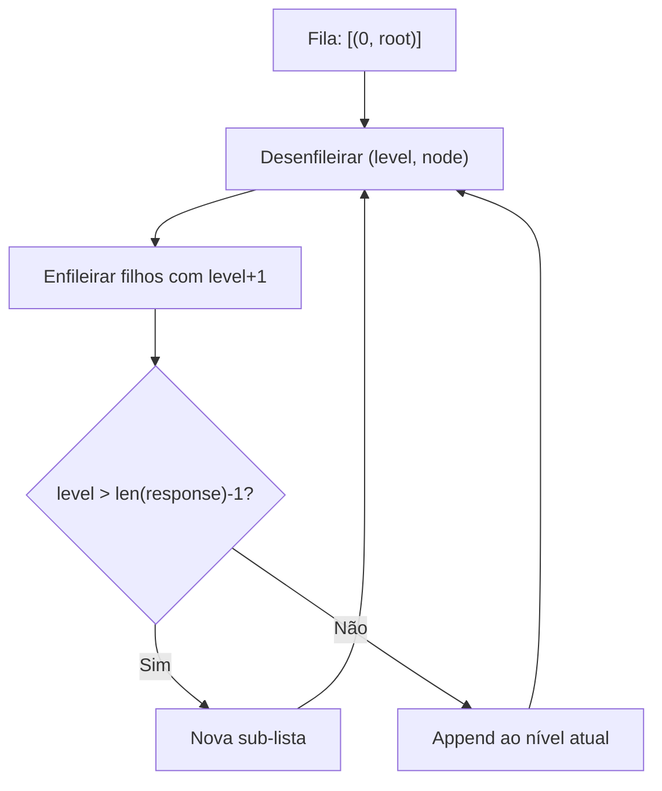
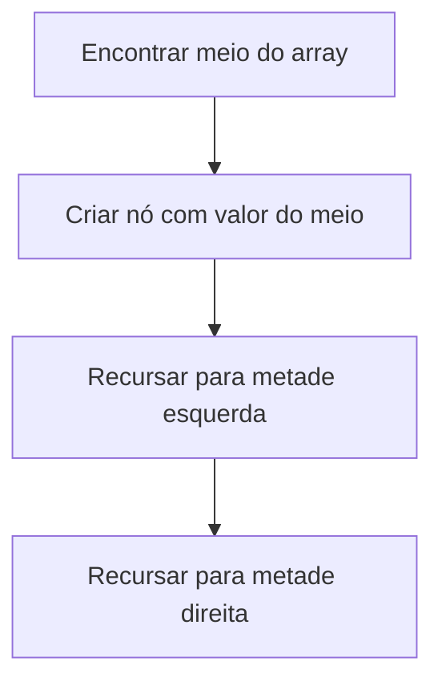
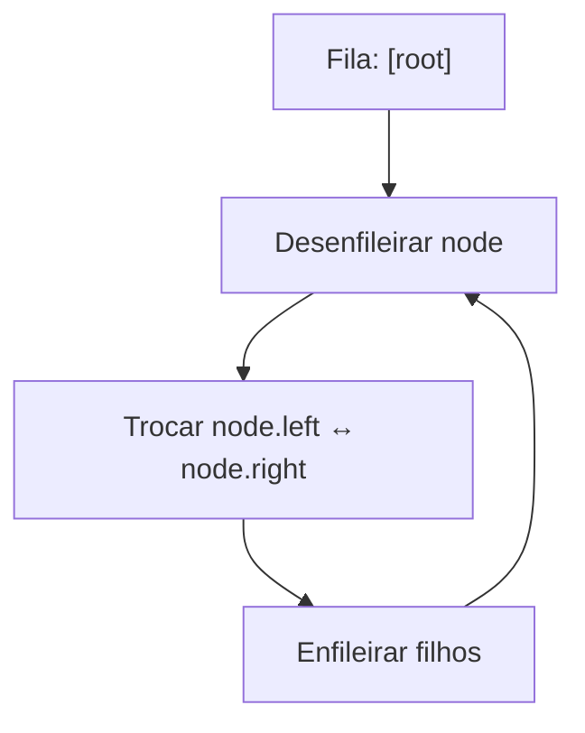
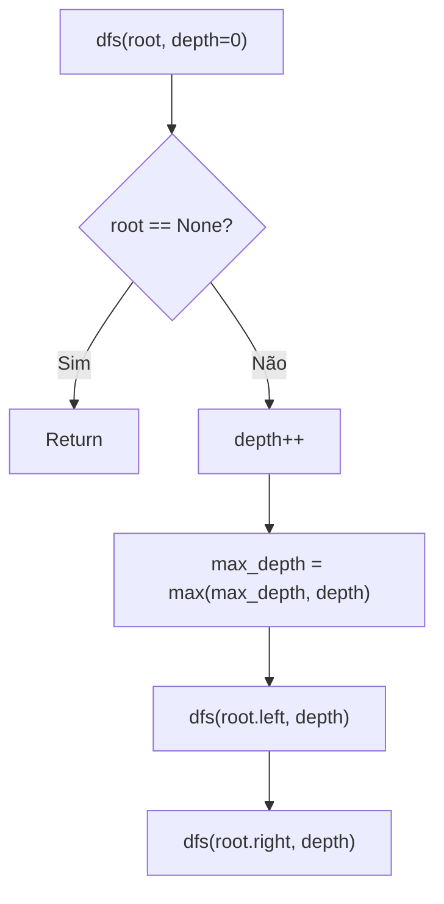
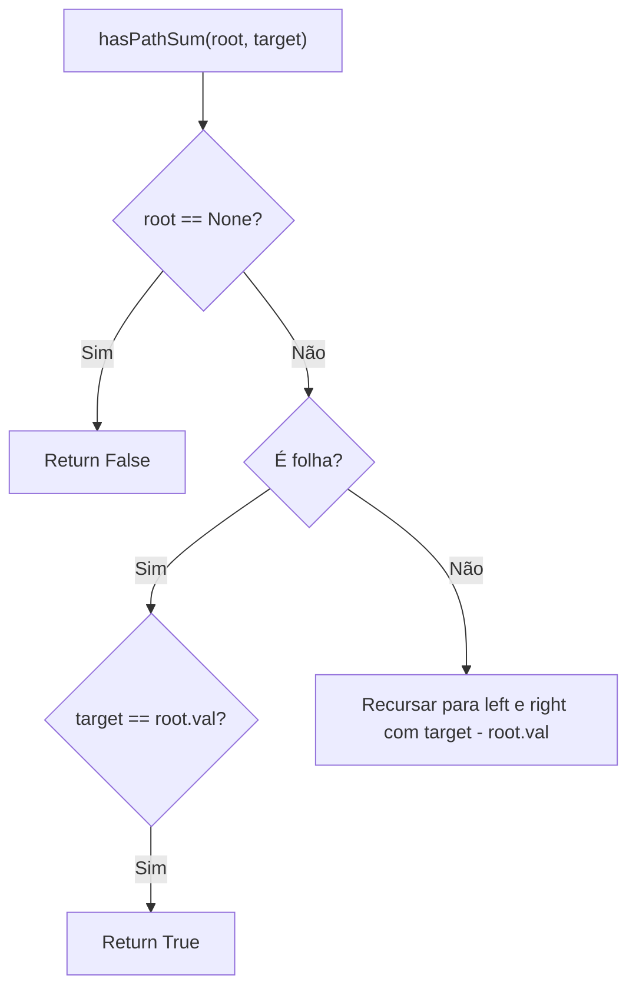
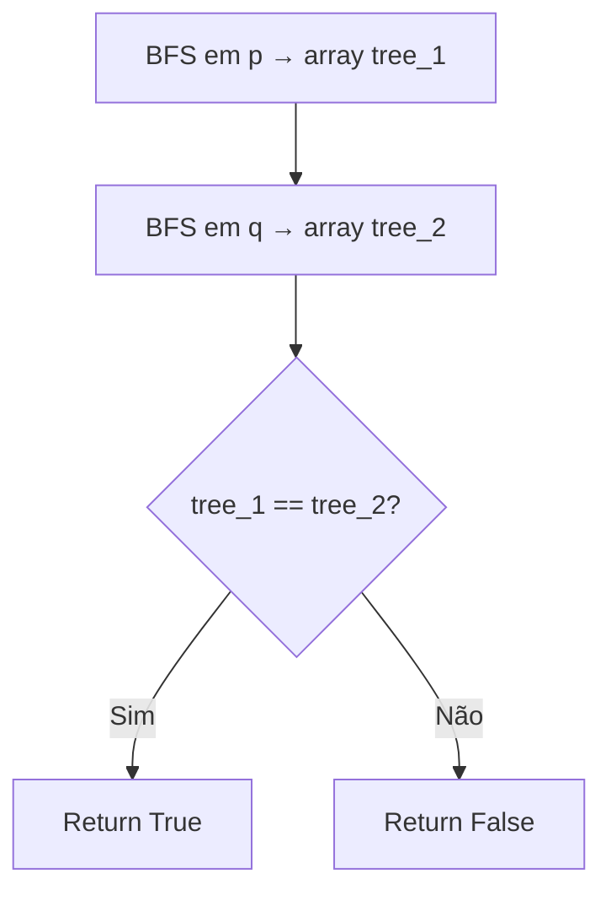
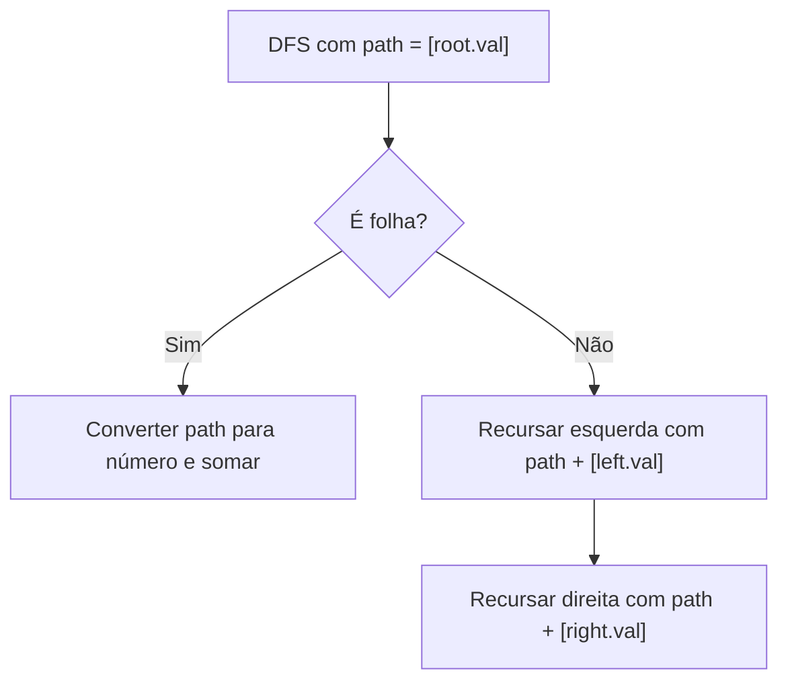
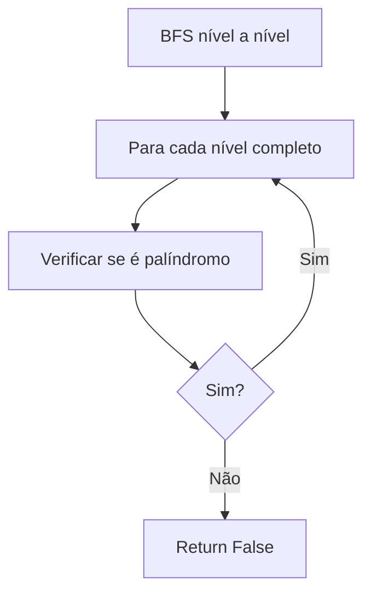
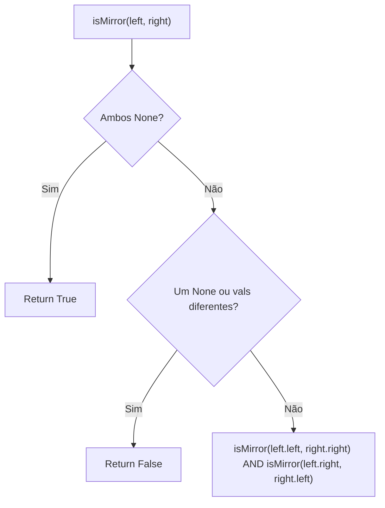
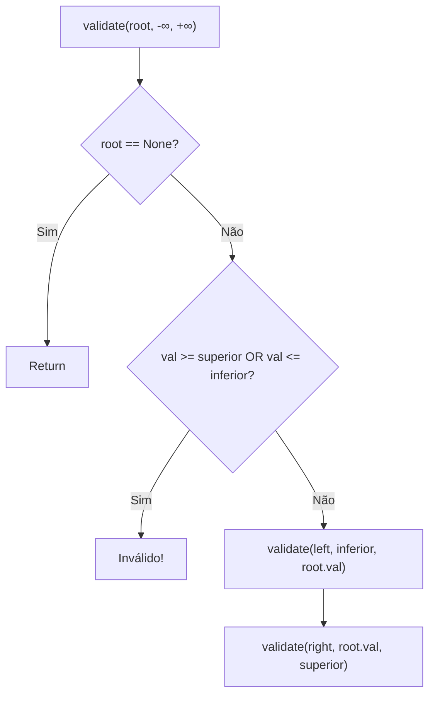

# Trees

---

### 📌 Binary Tree Level Order Traversal (`Binary_Tree_Level_Order_Traversal.py`)

* **Descrição breve:** Retorna os valores de uma árvore binária nível a nível (BFS).

* **💡 Sacada (O Pulo do Gato):**

> Usar uma fila (deque) com tuplas `(level, node)`. Quando o nível muda, criar uma nova sub-lista na resposta. Senão, fazer append no nível atual.

* **🧠 Modelo Mental:**



* **Complexidade esperada:** ⏱️ Tempo $O(n)$ | 💾 Espaço $O(n)$

* **Edge cases:** Árvore vazia; árvore com um nó; árvore completamente à esquerda.

* **Core snippet:**

```python
def levelOrder(root):
    if not root: return []
    response = []
    queue = deque([(0, root)])
    while queue:
        level, node = queue.popleft()
        if node.left: queue.append((level+1, node.left))
        if node.right: queue.append((level+1, node.right))
        if len(response) == level: response.append([node.val])
        else: response[-1].append(node.val)
    return response
```

---

### 📌 Convert Sorted Array to Binary Search Tree (`convert_sorted_array.py`)

* **Descrição breve:** Converte um array ordenado numa BST balanceada.

* **💡 Sacada (O Pulo do Gato):**

> Escolher o elemento do meio como raiz. Recursar para a metade esquerda (subárvore esquerda) e metade direita (subárvore direita). Isto garante balanceamento.

* **🧠 Modelo Mental:**



* **Complexidade esperada:** ⏱️ Tempo $O(n)$ | 💾 Espaço $O(\log n)$ (recursão)

* **Edge cases:** Array vazio; array com 1 elemento.

* **Core snippet:**

```python
def sortedArrayToBST(nums):
    if not nums: return None
    if len(nums) == 1: return TreeNode(nums[0])
    mid = len(nums) // 2
    node = TreeNode(nums[mid])
    node.left = sortedArrayToBST(nums[:mid])
    node.right = sortedArrayToBST(nums[mid+1:])
    return node
```

---

### 📌 Invert Binary Tree (`invert_binary_tree.py`)

* **Descrição breve:** Inverte uma árvore binária (espelhar esquerda/direita).

* **💡 Sacada (O Pulo do Gato):**

> Usar BFS com uma fila. Para cada nó, trocar os filhos (`left, right = right, left`). Enfileirar os filhos para processar recursivamente.

* **🧠 Modelo Mental:**



* **Complexidade esperada:** ⏱️ Tempo $O(n)$ | 💾 Espaço $O(n)$

* **Edge cases:** Árvore vazia; árvore com um nó; árvore já simétrica.

* **Core snippet:**

```python
def invertTree(root):
    queue = deque([root])
    while queue:
        node = queue.popleft()
        if node is None: continue
        node.left, node.right = node.right, node.left
        queue.append(node.left)
        queue.append(node.right)
    return root
```

---

### 📌 Maximum Depth of Binary Tree (`max_binary_tree.py`)

* **Descrição breve:** Retorna a profundidade máxima de uma árvore binária.

* **💡 Sacada (O Pulo do Gato):**

> DFS recursiva: para cada nó, incrementar a profundidade atual. Quando chegar a um nó nulo, parar. Manter uma variável global com a profundidade máxima encontrada.

* **🧠 Modelo Mental:**



* **Complexidade esperada:** ⏱️ Tempo $O(n)$ | 💾 Espaço $O(h)$ onde $h$ é a altura

* **Edge cases:** Árvore vazia (profundidade 0); árvore degenerada (lista encadeada).

* **Core snippet:**

```python
def maxDepth(root):
    max_d = 0
    def dfs(node, depth):
        nonlocal max_d
        if not node: return
        depth += 1
        max_d = max(max_d, depth)
        dfs(node.left, depth)
        dfs(node.right, depth)
    dfs(root, 0)
    return max_d
```

---

### 📌 Path Sum (`path_sum.py`)

* **Descrição breve:** Verifica se existe um caminho da raiz a uma folha cuja soma dos valores é igual ao `targetSum`.

* **💡 Sacada (O Pulo do Gato):**

> Recursão: subtrair o valor do nó atual do target e recursar para os filhos. Quando chegar a uma folha, verificar se `targetSum == node.val`.

* **🧠 Modelo Mental:**



* **Complexidade esperada:** ⏱️ Tempo $O(n)$ | 💾 Espaço $O(h)$

* **Edge cases:** Árvore vazia; folha com valor igual ao target; target negativo.

* **Core snippet:**

```python
def hasPathSum(root, targetSum):
    if not root: return False
    if not root.left and not root.right:
        return targetSum == root.val
    return (hasPathSum(root.left, targetSum - root.val) or
            hasPathSum(root.right, targetSum - root.val))
```

---

### 📌 Same Tree (`same_tree.py`)

* **Descrição breve:** Verifica se duas árvores binárias são estruturalmente idênticas e com os mesmos valores.

* **💡 Sacada (O Pulo do Gato):**

> Serializar ambas as árvores em arrays usando BFS (incluindo Nones para posições vazias). Comparar os arrays resultantes.

* **🧠 Modelo Mental:**



* **Complexidade esperada:** ⏱️ Tempo $O(n)$ | 💾 Espaço $O(n)$

* **Edge cases:** Ambas vazias (True); uma vazia e outra não (False); mesma estrutura, valores diferentes.

* **Core snippet:**

```python
def isSameTree(p, q):
    def serialize(root):
        result, queue = [], deque([root])
        while queue:
            node = queue.popleft()
            if node is None: result.append(None); continue
            result.append(node.val)
            queue.append(node.left)
            queue.append(node.right)
        return result
    return serialize(p) == serialize(q)
```

---

### 📌 Sum Root to Leaf Numbers (`sum_root_leaf_numbers.py`)

* **Descrição breve:** Cada caminho raiz→folha forma um número. Retorna a soma de todos esses números.

* **💡 Sacada (O Pulo do Gato):**

> DFS passando o caminho como lista. Quando chegar a uma folha, converter a lista de dígitos para número e somar ao total global.

* **🧠 Modelo Mental:**



* **Complexidade esperada:** ⏱️ Tempo $O(n)$ | 💾 Espaço $O(h)$

* **Edge cases:** Árvore com um nó (retorna o próprio valor); árvore degenerada.

* **Core snippet:**

```python
def sumNumbers(root):
    total = 0
    def dfs(node, path):
        nonlocal total
        if not node.left and not node.right:
            num = 0
            for i, d in enumerate(reversed(path)):
                num += d * 10**i
            total += num
            return
        if node.left: dfs(node.left, path + [node.left.val])
        if node.right: dfs(node.right, path + [node.right.val])
    dfs(root, [root.val])
    return total
```

---

### 📌 Symmetric Tree — Iterativa (`symetric_Tree_iterative.py`)

* **Descrição breve:** Verifica se uma árvore binária é simétrica (espelho de si mesma), usando BFS.

* **💡 Sacada (O Pulo do Gato):**

> BFS nível a nível. Para cada nível completo, verificar se é palíndromo (primeiro == último, segundo == penúltimo, etc.). Incluir Nones para manter as posições.

* **🧠 Modelo Mental:**



* **Complexidade esperada:** ⏱️ Tempo $O(n)$ | 💾 Espaço $O(n)$

* **Edge cases:** Árvore vazia (simétrica); árvore com um nó; estrutura simétrica mas valores diferentes.

* **Core snippet:**

```python
def isSymmetric(root):
    if not root: return True
    response = []
    queue = deque([(0, root)])
    while queue:
        level, node = queue.popleft()
        val = node.val if node else None
        if node:
            queue.append((level+1, node.left))
            queue.append((level+1, node.right))
        if len(response) == level:
            if response:
                i, j = 0, len(response[-1])-1
                while i < j:
                    if response[-1][i] != response[-1][j]: return False
                    i += 1; j -= 1
            response.append([val])
        else:
            response[-1].append(val)
    return True
```

---

### 📌 Symmetric Tree — Recursiva (`symetric_tree_recursive.py`)

* **Descrição breve:** Verifica se uma árvore é simétrica usando recursão.

* **💡 Sacada (O Pulo do Gato):**

> Criar uma função `isMirror(left, right)`: se ambos None, True. Se um None, False. Se valores diferentes, False. Depois verificar `isMirror(left.left, right.right)` e `isMirror(left.right, right.left)`.

* **🧠 Modelo Mental:**



* **Complexidade esperada:** ⏱️ Tempo $O(n)$ | 💾 Espaço $O(h)$

* **Edge cases:** Árvore vazia; árvore com um nó.

* **Core snippet:**

```python
def isSymmetric(root):
    def isMirror(left, right):
        if not left and not right: return True
        if not left or not right or left.val != right.val: return False
        return isMirror(left.left, right.right) and isMirror(left.right, right.left)
    return True if not root else isMirror(root.left, root.right)
```

---

### 📌 Validate Binary Search Tree (`validate_binary_search_tree.py`)

* **Descrição breve:** Verifica se uma árvore binária é uma BST válida.

* **💡 Sacada (O Pulo do Gato):**

> Ao ir para a esquerda, o limite superior é o valor atual e o inferior permanece. Ao ir para a direita, o limite inferior é o valor atual e o superior permanece. Verificar os limites em cada nó.

* **🧠 Modelo Mental:**



* **Complexidade esperada:** ⏱️ Tempo $O(n)$ | 💾 Espaço $O(h)$

* **Edge cases:** Árvore vazia (válida); nós com valores iguais (inválido para BST estrita); árvore degenerada.

* **Core snippet:**

```python
def isValidBST(root):
    valid = True
    def check(node, lo, hi):
        nonlocal valid
        if not node: return
        if (hi is not None and node.val >= hi) or \
           (lo is not None and node.val <= lo):
            valid = False
        check(node.left, lo, node.val)
        check(node.right, node.val, hi)
    check(root, None, None)
    return valid
```

---
