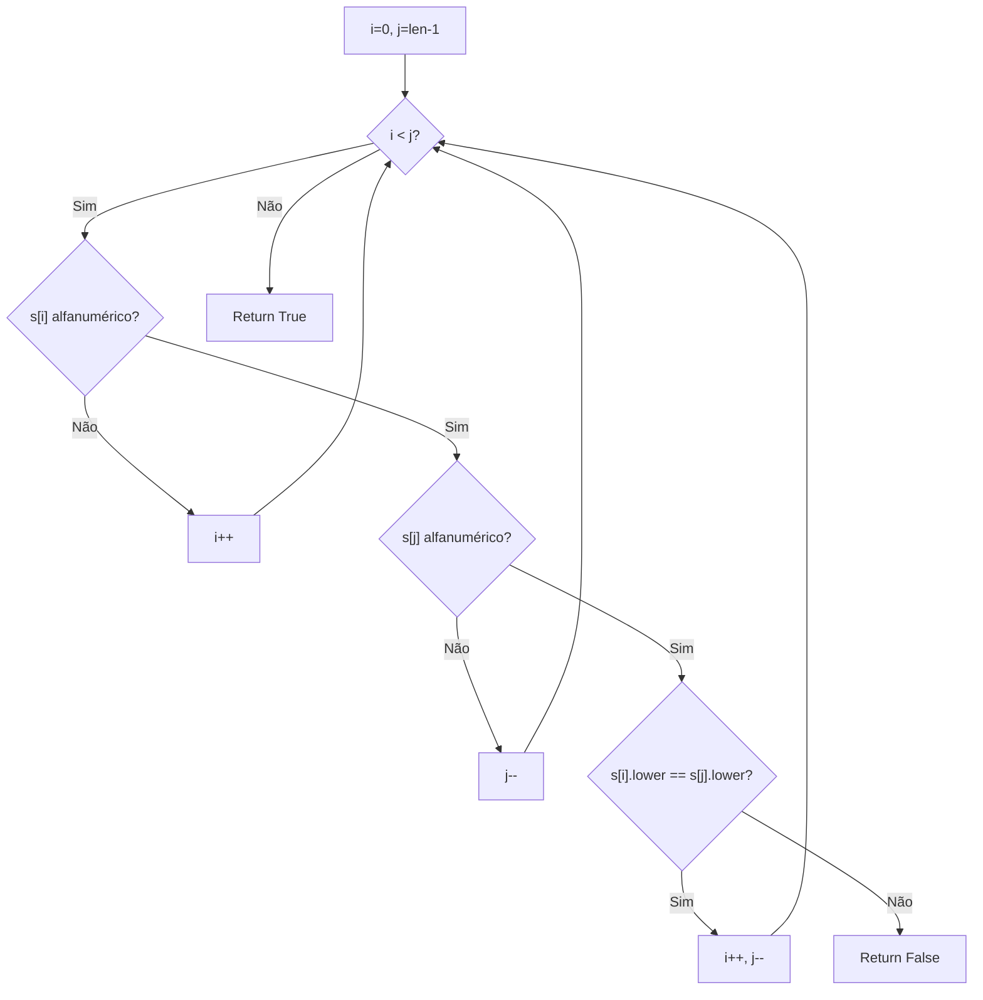
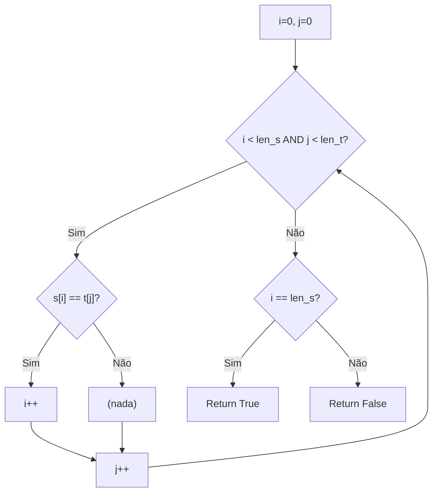
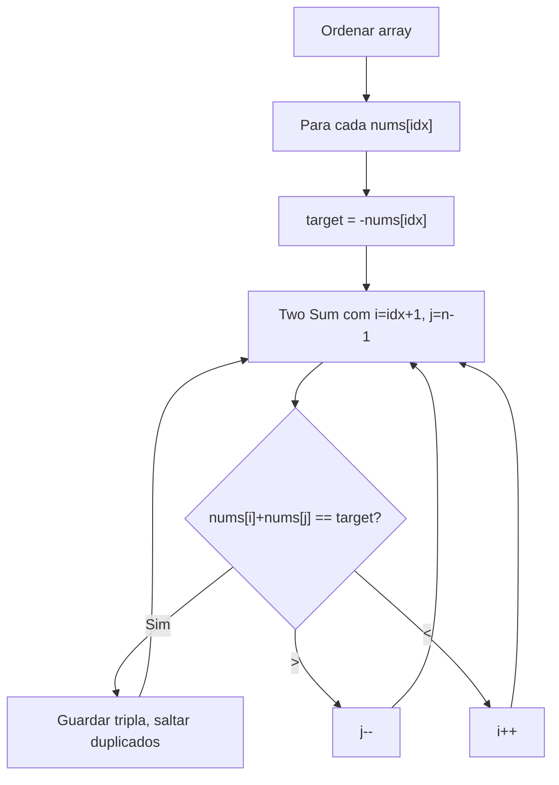
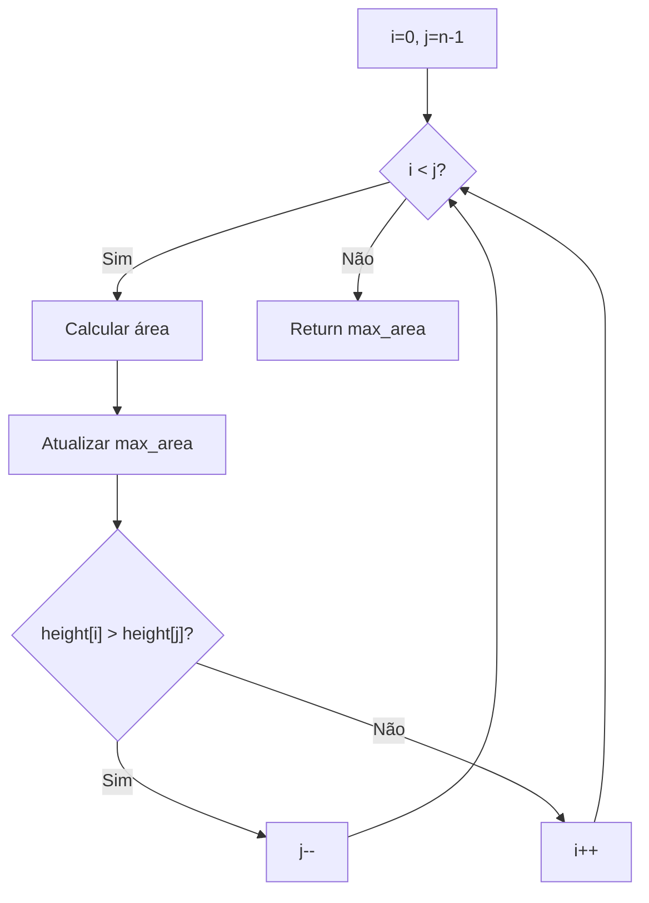
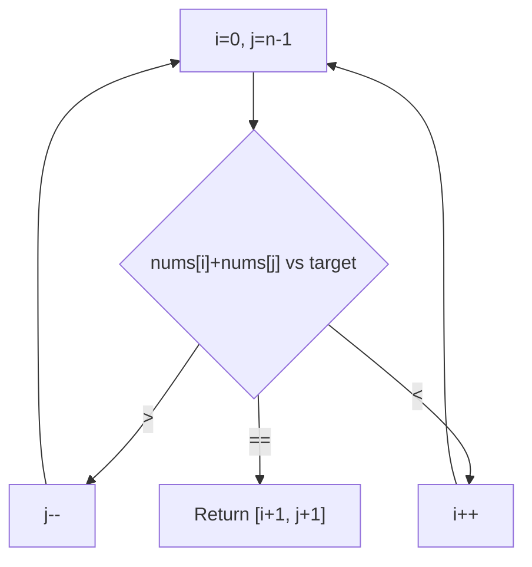

# Two Pointers

---

### 📌 Valid Palindrome (`is_palindrome.py`)

* **Descrição breve:** Verifica se uma string é um palíndromo considerando apenas caracteres alfanuméricos e ignorando maiúsculas.

* **💡 Sacada (O Pulo do Gato):**

> Dois ponteiros `i` (início) e `j` (fim). Saltar caracteres não alfanuméricos. Comparar `s[i].lower()` com `s[j].lower()`. Se algum par não bater, não é palíndromo.

* **🧠 Modelo Mental:**



* **Complexidade esperada:** ⏱️ Tempo $O(n)$ | 💾 Espaço $O(1)$

* **Edge cases:** String vazia (palíndromo); strings com apenas caracteres especiais; "0P".

* **Core snippet:**

```python
def isPalindrome(s):
    i, j = 0, len(s) - 1
    while i < j:
        if not s[i].isalnum():
            i += 1; continue
        if not s[j].isalnum():
            j -= 1; continue
        if s[i].lower() != s[j].lower():
            return False
        i += 1; j -= 1
    return True
```

---

### 📌 Is Subsequence (`is_subsequence.py`)

* **Descrição breve:** Verifica se a string `s` é uma subsequência da string `t`.

* **💡 Sacada (O Pulo do Gato):**

> Dois ponteiros: `i` para `s`, `j` para `t`. Quando `s[i] == t[j]`, avançar `i`. Sempre avançar `j`. Se `i` chegar ao fim de `s`, é subsequência.

* **🧠 Modelo Mental:**



* **Complexidade esperada:** ⏱️ Tempo $O(n)$ onde $n = |t|$ | 💾 Espaço $O(1)$

* **Edge cases:** `s` vazia (sempre True); `t` menor que `s` (sempre False).

* **Core snippet:**

```python
def isSubsequence(s, t):
    i, j = 0, 0
    while i < len(s) and j < len(t):
        if s[i] == t[j]:
            i += 1
        j += 1
    return i == len(s)
```

---

### 📌 3Sum (`three_sum.py`)

* **Descrição breve:** Encontra todos os tripletos `[a, b, c]` num array tal que `a + b + c = 0`, sem duplicados.

* **💡 Sacada (O Pulo do Gato):**

> Ordenar o array. Para cada valor, aplicar Two Sum com dois ponteiros nos números à frente. Não precisamos olhar para trás, porque se um número atrás formasse uma tripla, já teria sido apanhado antes. Para evitar duplicatas, saltar valores repetidos.

* **🧠 Modelo Mental:**



* **Complexidade esperada:** ⏱️ Tempo $O(n^2)$ | 💾 Espaço $O(n)$

* **Edge cases:** Array com menos de 3 elementos; todos os valores iguais (ex: `[0,0,0]`); sem solução.

* **Core snippet:**

```python
def threeSum(nums):
    nums.sort()
    response, hash_nums = [], dict()
    for idx in range(len(nums) - 1):
        if idx > 0 and nums[idx] == nums[idx - 1]:
            continue
        i, j = idx + 1, len(nums) - 1
        target = -nums[idx]
        while i < j:
            if nums[i] + nums[j] == target:
                triplet = sorted([nums[i], nums[j], -target])
                key = tuple(triplet)
                if key not in hash_nums:
                    response.append(triplet)
                    hash_nums[key] = 0
                i += 1
                while i < j and nums[i] == nums[i - 1]: i += 1
                j -= 1
                while i < j and nums[j] == nums[j + 1]: j -= 1
            elif nums[i] + nums[j] > target: j -= 1
            else: i += 1
    return response
```

---

### 📌 Container With Most Water (`two_containers.py`)

* **Descrição breve:** Dado um array de alturas, encontra duas linhas que formam o container com mais água.

* **💡 Sacada (O Pulo do Gato):**

> Dois ponteiros nas extremidades. A área é `min(h[i], h[j]) * (j - i)`. Mover o ponteiro do lado mais curto, porque mover o mais alto nunca aumenta a área (a altura mínima não muda e a largura diminui).

* **🧠 Modelo Mental:**



* **Complexidade esperada:** ⏱️ Tempo $O(n)$ | 💾 Espaço $O(1)$

* **Edge cases:** Duas barras apenas; todas as barras com a mesma altura.

* **Core snippet:**

```python
def maxArea(height):
    max_area = 0
    i, j = 0, len(height) - 1
    while i < j:
        w = j - i
        h = min(height[i], height[j])
        max_area = max(w * h, max_area)
        if height[i] > height[j]: j -= 1
        else: i += 1
    return max_area
```

---

### 📌 Two Sum II - Input Array Is Sorted (`two_sum_already_sorted.py`)

* **Descrição breve:** Dado um array ordenado, encontra dois números cuja soma é igual ao target. Retorna índices 1-indexed.

* **💡 Sacada (O Pulo do Gato):**

> Dois ponteiros nas extremidades do array ordenado. Se a soma é maior que o target, mover o ponteiro direito para baixo. Se menor, mover o esquerdo para cima.

* **🧠 Modelo Mental:**



* **Complexidade esperada:** ⏱️ Tempo $O(n)$ | 💾 Espaço $O(1)$

* **Edge cases:** Exatamente dois elementos; todos os valores iguais.

* **Core snippet:**

```python
def twoSum(numbers, target):
    i, j = 0, len(numbers) - 1
    while i < j:
        if numbers[i] + numbers[j] > target: j -= 1
        elif numbers[i] + numbers[j] < target: i += 1
        else: return [1 + i, 1 + j]
```

---
