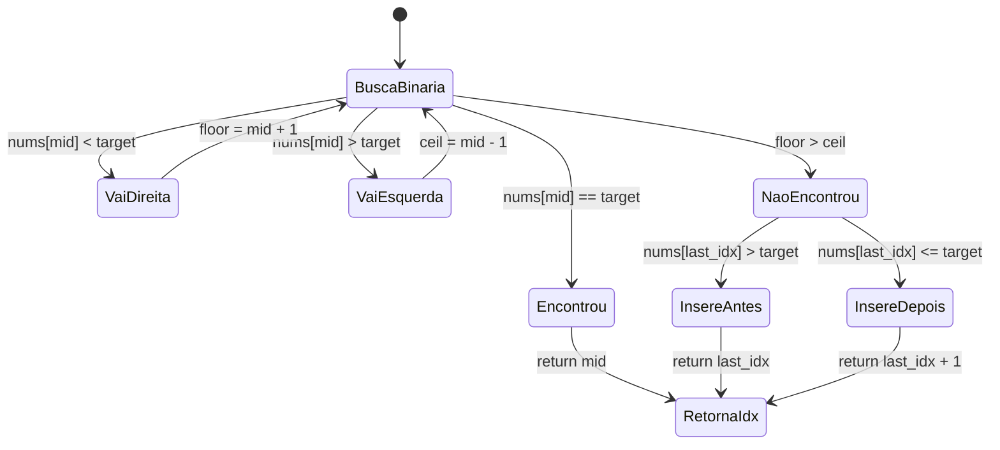
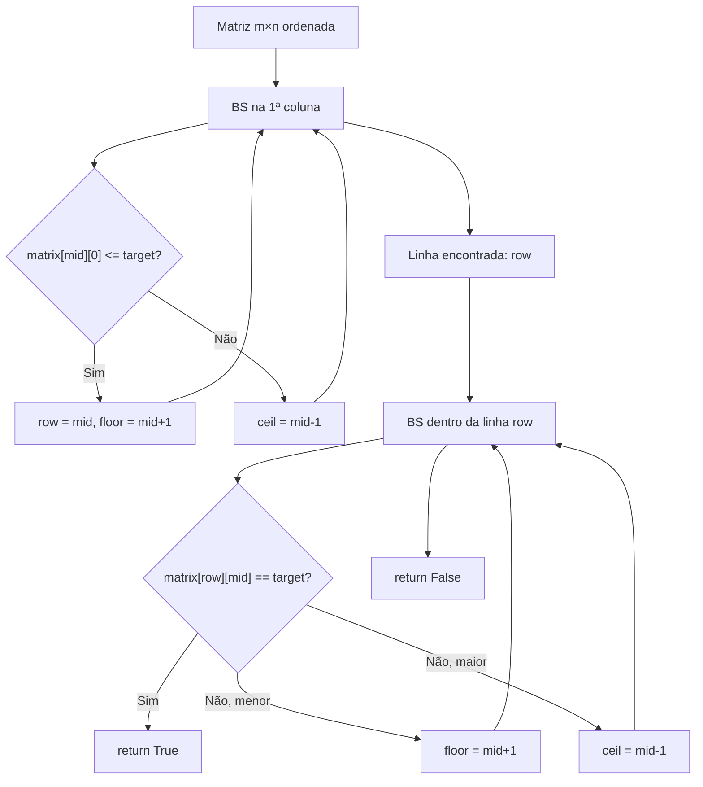
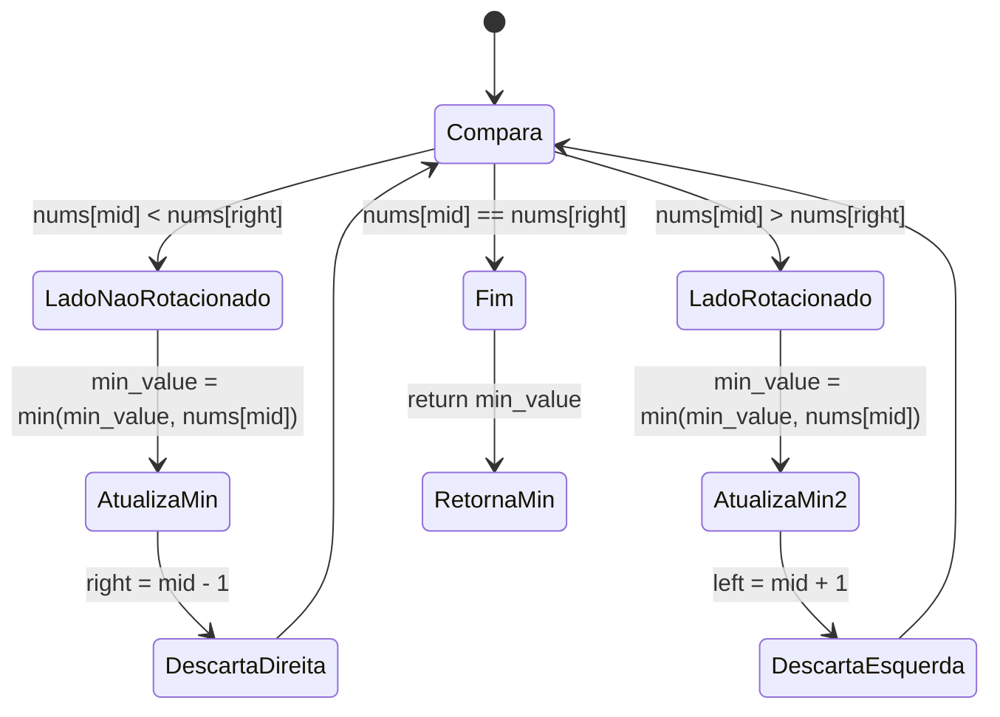
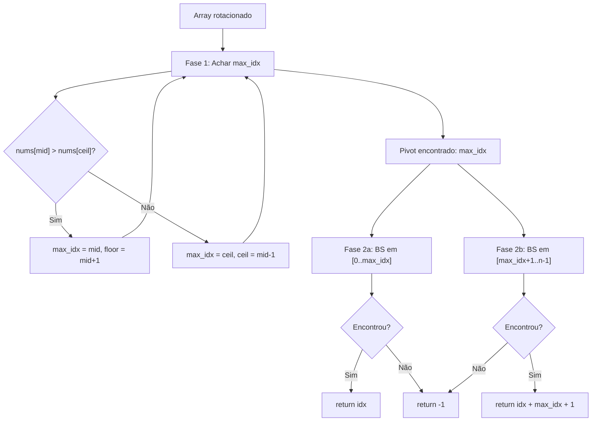
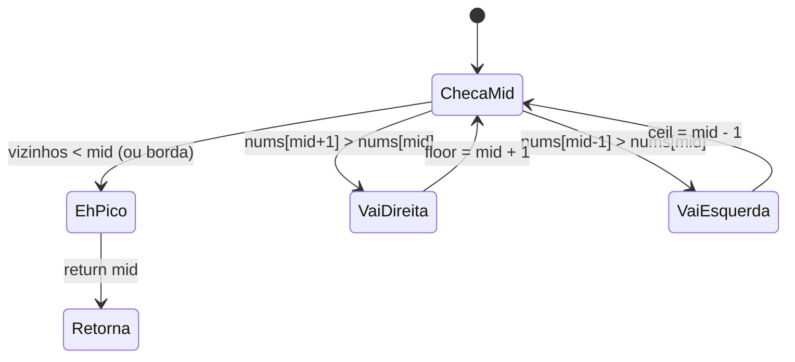
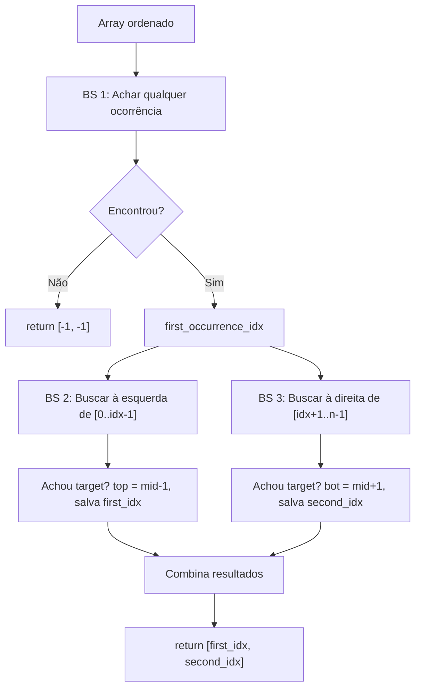

# 🔍 Binary Search — Cheat Sheet de Flashcards

---

### 📌 Search Insert Position (`search_insert_position.py`) — [LC 35](https://leetcode.com/problems/search-insert-position/) | Easy
* **Descrição breve:** Dado um array de inteiros **distintos** ordenado em ordem crescente e um valor `target`, retorne o índice do `target` se ele for encontrado. Caso contrário, retorne o índice onde ele seria inserido para manter a ordem. O algoritmo deve obrigatoriamente rodar em $O(\log n)$.
* **Enunciado oficial (LeetCode):**
  > Given a sorted array of distinct integers and a target value, return the index if the target is found. If not, return the index where it would be if it were inserted in order. You must write an algorithm with `O(log n)` runtime complexity.
* **Constraints:**
  - `1 <= nums.length <= 10⁴`
  - `-10⁴ <= nums[i] <= 10⁴`
  - `nums` contém valores **distintos** ordenados em ordem crescente
  - `-10⁴ <= target <= 10⁴`
* **Exemplos oficiais:**
  - `nums = [1,3,5,6]`, `target = 5` → **Output: 2**
  - `nums = [1,3,5,6]`, `target = 2` → **Output: 1** (posição onde o 2 seria inserido entre 1 e 3)
  - `nums = [1,3,5,6]`, `target = 7` → **Output: 4** (inserido no final)
  - `nums = [1,3,5,6]`, `target = 0` → **Output: 0** (inserido no início)
* **Por que é interessante:** O array não contém duplicatas, o que simplifica a busca binária padrão — o desafio real é determinar corretamente a posição de inserção quando o target não existe no array.
* **💡 Sacada (O Pulo do Gato):**
> Busca binária clássica com um detalhe no final: quando o target não é encontrado, o `last_idx` guarda a última posição visitada. Se o valor nessa posição é maior que o target, o target entra ali; senão, entra na posição seguinte.
* **🧠 Modelo Mental:**

* **Complexidade esperada:** ⏱️ Tempo $O(\log n)$ | 💾 Espaço $O(1)$.
* **Edge cases (Casos de Borda):**
  - Target menor que todos os elementos → retorna 0.
  - Target maior que todos os elementos → retorna `len(nums)`.
  - Array de tamanho 1 → funciona pois `floor <= ceil` é checado.
* **Core snippet:**
```python
def searchInsert(self, nums, target):
    idx_ceil = len(nums) - 1
    idx_floor = 0
    idx_mid = (idx_ceil + idx_floor) // 2
    last_idx = idx_mid
    while idx_floor <= idx_ceil:
        if nums[idx_mid] == target:
            return idx_mid
        if nums[idx_mid] > target:
            idx_ceil = idx_mid - 1
        else:
            idx_floor = idx_mid + 1
        last_idx = idx_mid
        idx_mid = (idx_ceil + idx_floor) // 2
    if nums[last_idx] > target:
        return last_idx
    else:
        return last_idx + 1
```

---

### 📌 Search a 2D Matrix (`search-a-2d-matrix.py`) — [LC 74](https://leetcode.com/problems/search-a-2d-matrix/) | Medium
* **Descrição breve:** Dada uma matriz `m × n` de inteiros onde **cada linha é ordenada em ordem não-decrescente** e o **primeiro inteiro de cada linha é maior que o último inteiro da linha anterior**, determine eficientemente se um valor `target` existe na matriz. Retorne `true` se existir e `false` caso contrário.
* **Enunciado oficial (LeetCode):**
  > You are given an `m x n` integer matrix with the following two properties: each row is sorted in non-decreasing order; the first integer of each row is greater than the last integer of the previous row. Given an integer `target`, return `true` if `target` is in `matrix` or `false` otherwise. You must write a solution in `O(log(m * n))` time complexity.
* **Constraints:**
  - `m == matrix.length`, `n == matrix[i].length`
  - `1 <= m, n <= 100`
  - `-10⁴ <= matrix[i][j], target <= 10⁴`
* **Exemplos oficiais:**
  - `matrix = [[1,3,5,7],[10,11,16,20],[23,30,34,60]]`, `target = 3` → **Output: true**
  - `matrix = [[1,3,5,7],[10,11,16,20],[23,30,34,60]]`, `target = 13` → **Output: false**
* **Por que é interessante:** Essa propriedade especial faz com que a matriz inteira, se lida linearmente (linha a linha), forme um array totalmente ordenado — o que permite tratar o problema como uma busca binária em um array 1D virtual de tamanho `m * n` (mapeando `row = mid // n`, `col = mid % n`), ou, alternativamente, fazer duas buscas binárias: uma para localizar a linha correta e outra para buscar o target dentro dela. A complexidade exigida é $O(\log(m \cdot n))$.
* **💡 Sacada (O Pulo do Gato):**
> Duas buscas binárias em sequência: primeiro na primeira coluna para achar a **linha correta** (a última cujo primeiro elemento é ≤ target), depois dentro dessa linha para encontrar o target. A condição `matrix[mid][0] <= target` com `row = mid` garante que guardamos sempre a melhor linha candidata.
* **🧠 Modelo Mental:**

* **Complexidade esperada:** ⏱️ Tempo $O(\log m + \log n)$ | 💾 Espaço $O(1)$.
* **Edge cases (Casos de Borda):**
  - Matriz 1×1 → funciona normalmente com a busca binária.
  - Target menor que `matrix[0][0]` → `row` fica 0, busca na linha falha → `False`.
  - Lembrar: condição de parada é `floor <= ceil` e não `floor < ceil` (dá problema em tamanho 1).
* **Core snippet:**
```python
def searchMatrix(self, matrix, target):
    m, n = len(matrix), len(matrix[0])
    floor, ceil = 0, m - 1
    mid = m // 2
    row = 0
    while floor <= ceil:
        if matrix[mid][0] > target:
            ceil = mid - 1
        elif matrix[mid][0] <= target:
            row = mid
            floor = mid + 1
        mid = (floor + ceil) // 2
    floor, ceil = 0, n - 1
    mid = n // 2
    while floor <= ceil:
        if matrix[row][mid] > target:
            ceil = mid - 1
        elif matrix[row][mid] < target:
            floor = mid + 1
        else:
            return True
        mid = (floor + ceil) // 2
    return False
```

---

### 📌 Find Minimum in Rotated Sorted Array (`find-minimum-in-rotated-sorted-array.py`) — [LC 153](https://leetcode.com/problems/find-minimum-in-rotated-sorted-array/) | Medium
* **Descrição breve:** Dado um array de inteiros **únicos** que estava originalmente ordenado em ordem crescente e foi **rotacionado** entre 1 e `n` vezes, encontre o **elemento mínimo**. O algoritmo deve rodar em $O(\log n)$.
* **Enunciado oficial (LeetCode):**
  > Suppose an array of length `n` sorted in ascending order is rotated between `1` and `n` times. For example, the array `nums = [0,1,2,4,5,6,7]` might become `[4,5,6,7,0,1,2]` if it was rotated 4 times, or `[0,1,2,4,5,6,7]` if it was rotated 7 times. Notice that rotating an array `[a[0], a[1], ..., a[n-1]]` 1 time results in `[a[n-1], a[0], a[1], ..., a[n-2]]`. Given the sorted rotated array `nums` of **unique** elements, return the minimum element. You must write an algorithm that runs in `O(log n)` time.
* **Constraints:**
  - `n == nums.length`
  - `1 <= n <= 5000`
  - `-5000 <= nums[i] <= 5000`
  - Todos os inteiros de `nums` são **únicos**
  - `nums` está ordenado e rotacionado entre 1 e `n` vezes
* **Exemplos oficiais:**
  - `nums = [3,4,5,1,2]` → **Output: 1** (array original `[1,2,3,4,5]` rotacionado 3 vezes)
  - `nums = [4,5,6,7,0,1,2]` → **Output: 0** (array original `[0,1,2,4,5,6,7]` rotacionado 4 vezes)
  - `nums = [11,13,15,17]` → **Output: 11** (rotacionado 4 vezes = volta ao original)
* **Por que é interessante:** A rotação cria exatamente dois sub-arrays ordenados dentro do array: um com valores maiores e outro com valores menores. O ponto de transição entre eles contém o mínimo. O desafio é usar busca binária para identificar em qual metade o mínimo se encontra, comparando `nums[mid]` com `nums[right]` para decidir a direção.
* **💡 Sacada (O Pulo do Gato):**
> Compare `nums[mid]` com `nums[right]`. Se `mid < right`, você está na parte **não-rotacionada** (o mínimo está à esquerda ou é o próprio mid), então descarta a direita. Se `mid > right`, você está na parte **rotacionada** e o mínimo está à direita, então descarta a esquerda. A cada passo, guarda `min(min_value, nums[mid])`.
* **🧠 Modelo Mental:**

* **Complexidade esperada:** ⏱️ Tempo $O(\log n)$ | 💾 Espaço $O(1)$.
* **Edge cases (Casos de Borda):**
  - Array não-rotacionado (já ordenado) → o mínimo é o primeiro elemento, a busca converge para a esquerda.
  - Array de tamanho 1 → `min_value` captura `nums[mid]` na primeira iteração.
  - Rotação em posições extremas.
* **Core snippet:**
```python
def findMin(self, nums):
    left, right = 0, len(nums) - 1
    mid = (left + right) // 2
    min_value = 99999
    while left <= right:
        min_value = min(min_value, nums[mid])
        if nums[mid] < nums[right]:
            right = mid - 1
        elif nums[mid] > nums[right]:
            left = mid + 1
        else:
            break
        mid = (left + right) // 2
    return min_value
```

---

### 📌 Search in Rotated Sorted Array (`search-in-rotated-sorted-array.py`) — [LC 33](https://leetcode.com/problems/search-in-rotated-sorted-array/) | Medium
* **Descrição breve:** Dado um array de inteiros **distintos** que estava ordenado em ordem crescente e foi possivelmente **rotacionado à esquerda** em um índice `k` desconhecido, e dado um `target`, retorne o **índice** do target ou `-1` se ele não existir. O algoritmo deve obrigatoriamente ter complexidade $O(\log n)$.
* **Enunciado oficial (LeetCode):**
  > There is an integer array `nums` sorted in ascending order (with **distinct** values). Prior to being passed to your function, `nums` is possibly left rotated at an unknown index `k` (`1 <= k < nums.length`) such that the resulting array is `[nums[k], nums[k+1], ..., nums[n-1], nums[0], nums[1], ..., nums[k-1]]` (0-indexed). For example, `[0,1,2,4,5,6,7]` might be left rotated by 3 indices and become `[4,5,6,7,0,1,2]`. Given the array `nums` after the possible rotation and an integer `target`, return the index of `target` if it is in `nums`, or `-1` if it is not in `nums`. You must write an algorithm with `O(log n)` runtime complexity.
* **Constraints:**
  - `1 <= nums.length <= 5000`
  - `-10⁴ <= nums[i] <= 10⁴`
  - Todos os valores de `nums` são **únicos**
  - `nums` é um array ascendente que foi possivelmente rotacionado
  - `-10⁴ <= target <= 10⁴`
* **Exemplos oficiais:**
  - `nums = [4,5,6,7,0,1,2]`, `target = 0` → **Output: 4**
  - `nums = [4,5,6,7,0,1,2]`, `target = 3` → **Output: -1**
  - `nums = [1]`, `target = 0` → **Output: -1**
* **Por que é interessante:** Diferente do problema "Find Minimum" (LC 153), aqui o objetivo não é achar o ponto de rotação em si, mas sim **buscar um valor específico** nesse array partido. A estratégia adotada é dividir em duas fases: primeiro encontrar o ponto de rotação (índice do maior elemento) via busca binária, e depois executar uma busca binária clássica em cada uma das duas metades ordenadas. Não existem duplicatas no array.
* **💡 Sacada (O Pulo do Gato):**
> Divida em dois passos: (1) ache o **ponto de rotação** (índice do maior valor) comparando `nums[mid]` com `nums[ceil]` — se `mid > ceil`, o pivot está à direita; (2) execute duas buscas binárias clássicas nos dois sub-arrays resultantes `[0..max_idx]` e `[max_idx+1..n-1]`.
* **🧠 Modelo Mental:**

* **Complexidade esperada:** ⏱️ Tempo $O(\log n)$ | 💾 Espaço $O(n)$ (por conta do slice do array; pode ser $O(1)$ passando índices).
* **Edge cases (Casos de Borda):**
  - Array de tamanho 1 → pivot é o próprio elemento, busca funciona.
  - Target não existe → ambas as buscas retornam -1.
  - Array sem rotação → `max_idx` será o último índice, segunda busca roda em array vazio.
* **Core snippet:**
```python
def search(self, nums, target):
    floor, ceil = 0, len(nums) - 1
    mid = (floor + ceil) // 2
    max_value, max_idx = -9999999, -1
    while floor <= ceil:
        if nums[ceil] < nums[mid]:
            if max_value < nums[mid]:
                max_idx, max_value = mid, nums[mid]
            floor = mid + 1
        else:
            if max_value < nums[ceil]:
                max_idx, max_value = ceil, nums[ceil]
            ceil = mid - 1
        mid = (floor + ceil) // 2

    def binary_search(array, target):
        floor, ceil = 0, len(array) - 1
        mid = (floor + ceil) // 2
        while floor <= ceil:
            if array[mid] < target:
                floor = mid + 1
            elif array[mid] > target:
                ceil = mid - 1
            else:
                return mid
            mid = (floor + ceil) // 2
        return -1

    r1 = binary_search(nums[0:max_idx + 1], target)
    r2 = binary_search(nums[max_idx + 1:len(nums)], target)
    if r2 != -1:
        r2 += max_idx + 1
    return max(r1, r2)
```

---

### 📌 Find Peak Element (`find_peak_element.py`) — [LC 162](https://leetcode.com/problems/find-peak-element/) | Medium
* **Descrição breve:** Um **elemento pico** é um elemento que é **estritamente maior** que seus vizinhos. Dado um array 0-indexed de inteiros `nums`, encontre **qualquer** pico e retorne seu índice. O array pode ser tratado como se `nums[-1] = nums[n] = -∞`. O algoritmo deve rodar em $O(\log n)$.
* **Enunciado oficial (LeetCode):**
  > A peak element is an element that is strictly greater than its neighbors. Given a **0-indexed** integer array `nums`, find a peak element, and return its index. If the array contains multiple peaks, return the index to **any of the peaks**. You may imagine that `nums[-1] = nums[n] = -∞`. In other words, an element is always considered to be strictly greater than a neighbor that is outside the array. You must write an algorithm that runs in `O(log n)` time.
* **Constraints:**
  - `1 <= nums.length <= 1000`
  - `-2³¹ <= nums[i] <= 2³¹ - 1`
  - `nums[i] != nums[i + 1]` para todo `i` válido (sem elementos consecutivos iguais)
* **Exemplos oficiais:**
  - `nums = [1,2,3,1]` → **Output: 2** (3 é um pico no índice 2)
  - `nums = [1,2,1,3,5,6,4]` → **Output: 5** (ou 1) — 6 é pico no índice 5, ou 2 é pico no índice 1; qualquer um é aceito
* **Por que é interessante:** A restrição `nums[i] != nums[i+1]` garante que não há platôs. A chave é perceber que, se `nums[mid] < nums[mid+1]`, então há **garantidamente** um pico à direita (pois a sequência está subindo e eventualmente cai em `-∞`), e vice-versa. Isso permite usar busca binária mesmo sem o array estar ordenado.
* **💡 Sacada (O Pulo do Gato):**
> Busca binária onde o motivador da direção é o **vizinho maior**. Se `nums[mid+1] > nums[mid]`, existe um pico à direita, então `floor = mid+1`. Se `nums[mid-1] > nums[mid]`, existe um pico à esquerda, então `ceil = mid-1`. Quando ambos os vizinhos são menores (ou estamos nas bordas), achamos o pico.
* **🧠 Modelo Mental:**

* **Complexidade esperada:** ⏱️ Tempo $O(\log n)$ | 💾 Espaço $O(1)$.
* **Edge cases (Casos de Borda):**
  - Array de tamanho 1 → `mid == 0` e `mid == size-1` são ambos verdadeiros, retorna imediatamente.
  - Pico no início ou final do array → condições de borda (`mid == 0` ou `mid == size-1`) tratam isso.
  - Array estritamente crescente → pico é o último elemento.
* **Core snippet:**
```python
def findPeakElement(self, nums):
    size = len(nums)
    floor, ceil = 0, size - 1
    mid = (floor + ceil) // 2
    while floor <= ceil:
        if (mid == size-1 or nums[mid+1] < nums[mid]) and \
           (mid == 0 or nums[mid-1] < nums[mid]):
            return mid
        elif nums[mid+1] > nums[mid]:
            floor = mid + 1
        elif nums[mid-1] > nums[mid]:
            ceil = mid - 1
        mid = (floor + ceil) // 2
    return mid
```

---

### 📌 Find First and Last Position of Element in Sorted Array (`find-first-and-last-position-of-element-in-sorted-array.py`) — [LC 34](https://leetcode.com/problems/find-first-and-last-position-of-element-in-sorted-array/) | Medium
* **Descrição breve:** Dado um array de inteiros `nums` ordenado em ordem **não-decrescente** (pode haver duplicatas), encontre a **posição inicial e final** (índices) de um dado `target`. Retorne `[-1, -1]` se o target não existir no array. O algoritmo deve ter complexidade $O(\log n)$.
* **Enunciado oficial (LeetCode):**
  > Given an array of integers `nums` sorted in non-decreasing order, find the starting and ending position of a given `target` value. If `target` is not found in the array, return `[-1, -1]`. You must write an algorithm with `O(log n)` runtime complexity.
* **Constraints:**
  - `0 <= nums.length <= 10⁵`
  - `-10⁹ <= nums[i] <= 10⁹`
  - `nums` é um array **não-decrescente** (permite duplicatas)
  - `-10⁹ <= target <= 10⁹`
* **Exemplos oficiais:**
  - `nums = [5,7,7,8,8,10]`, `target = 8` → **Output: [3, 4]**
  - `nums = [5,7,7,8,8,10]`, `target = 6` → **Output: [-1, -1]**
  - `nums = []`, `target = 0` → **Output: [-1, -1]**
* **Por que é interessante:** O desafio principal é que a busca binária clássica encontra **uma** ocorrência qualquer, mas não necessariamente a primeira ou a última. A solução usa múltiplas buscas binárias: uma para localizar qualquer ocorrência e depois duas adicionais que continuam buscando nas metades esquerda e direita para expandir o range encontrado.
* **💡 Sacada (O Pulo do Gato):**
> Três buscas binárias encadeadas: (1) acha **qualquer** ocorrência do target; (2) busca à **esquerda** dessa ocorrência para achar a primeira — quando encontra o target, continua descartando à direita (`top = mid-1`); (3) busca à **direita** para achar a última — quando encontra o target, continua descartando à esquerda (`bot = mid+1`).
* **🧠 Modelo Mental:**

* **Complexidade esperada:** ⏱️ Tempo $O(\log n)$ | 💾 Espaço $O(1)$.
* **Edge cases (Casos de Borda):**
  - Array vazio → retorna `[-1, -1]` imediatamente.
  - Target aparece uma única vez → `first_idx` e `second_idx` ficam -1, retorna `[first_occurrence_idx, first_occurrence_idx]`.
  - Target ocupa o array inteiro → as buscas laterais encontram as extremidades.
  - Target na borda do array.
* **Core snippet:**
```python
def searchRange(self, nums, target):
    bot, top = 0, len(nums) - 1
    mid = (bot + top) // 2
    first_ocurrence_idx = -1
    while bot <= top:
        if target > nums[mid]:
            bot = mid + 1
        elif target < nums[mid]:
            top = mid - 1
        else:
            first_ocurrence_idx = mid
            break
        mid = (bot + top) // 2

    if first_ocurrence_idx == -1:
        return [-1, -1]

    bot, top = 0, first_ocurrence_idx - 1
    mid = (bot + top) // 2
    first_idx = -1
    while bot <= top:
        if target > nums[mid]:
            bot = mid + 1
        elif target == nums[mid]:
            top = mid - 1
            first_idx = mid
        mid = (bot + top) // 2

    bot, top = first_ocurrence_idx + 1, len(nums) - 1
    mid = (bot + top) // 2
    second_idx = -1
    while bot <= top:
        if target == nums[mid]:
            bot = mid + 1
            second_idx = mid
        elif target < nums[mid]:
            top = mid - 1
        mid = (bot + top) // 2

    if first_idx == -1 and second_idx == -1:
        return [first_ocurrence_idx, first_ocurrence_idx]
    elif first_idx == -1:
        return [first_ocurrence_idx, second_idx]
    elif second_idx == -1:
        return [first_idx, first_ocurrence_idx]
    else:
        return [first_idx, second_idx]
```
