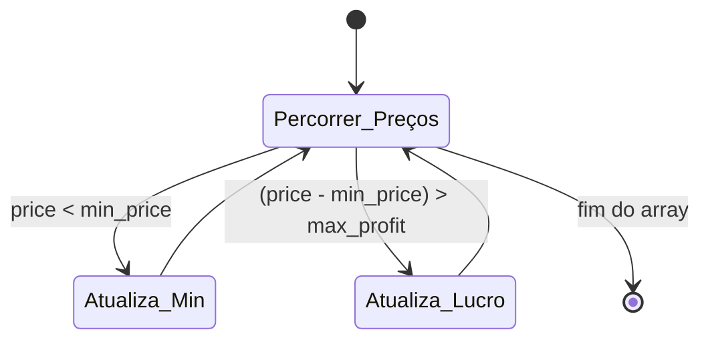
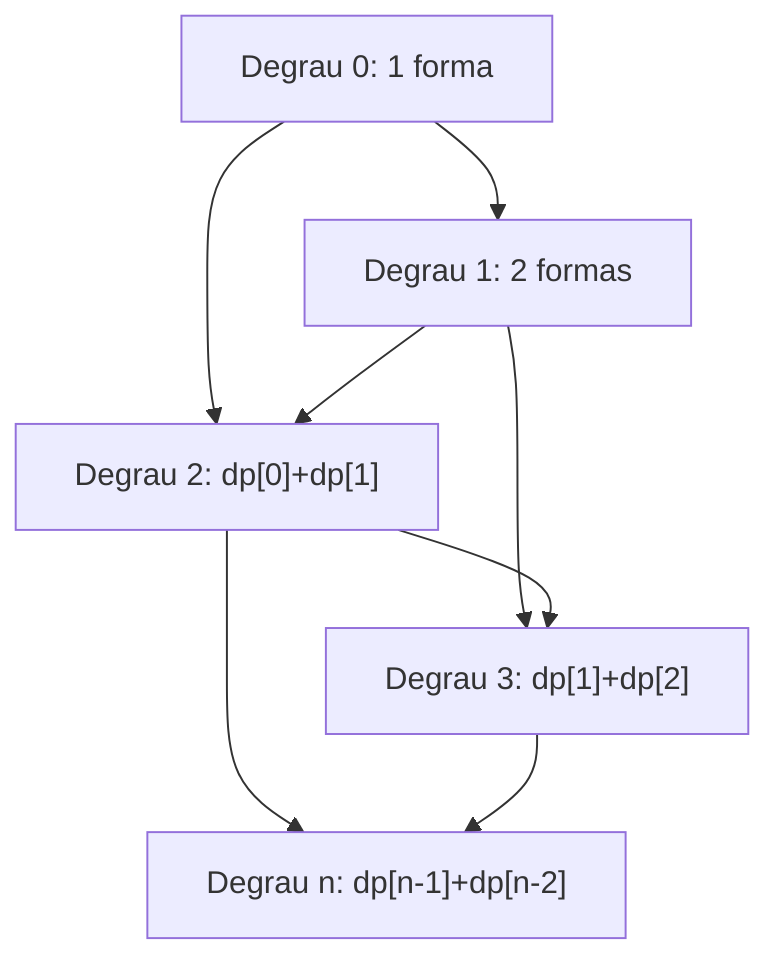
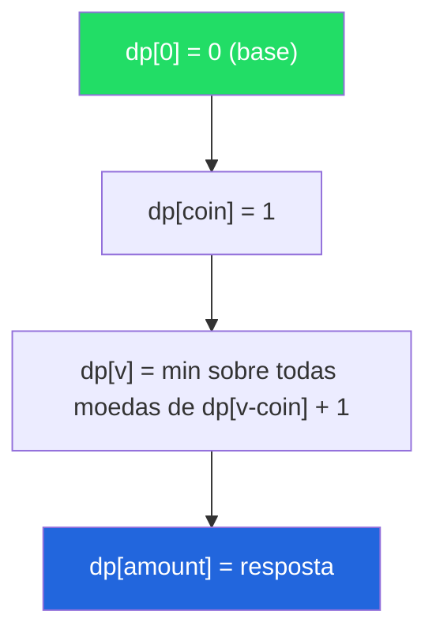
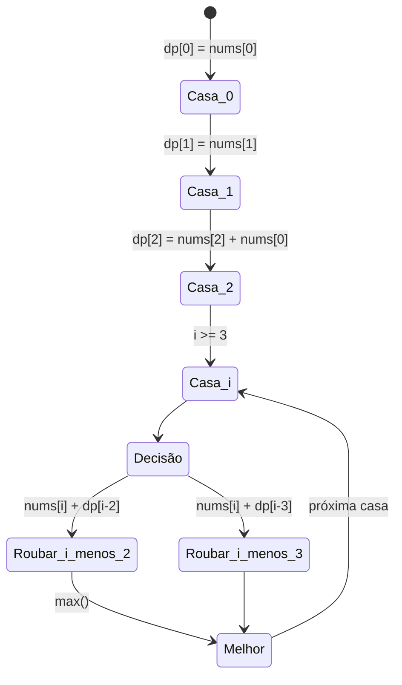
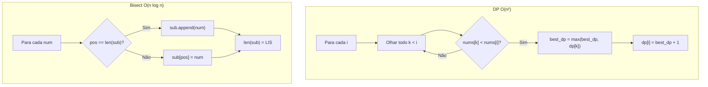
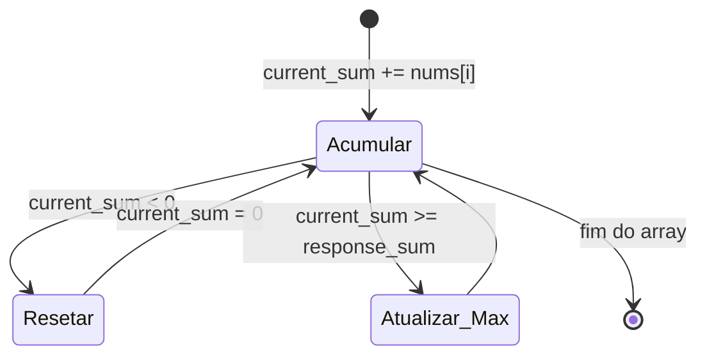
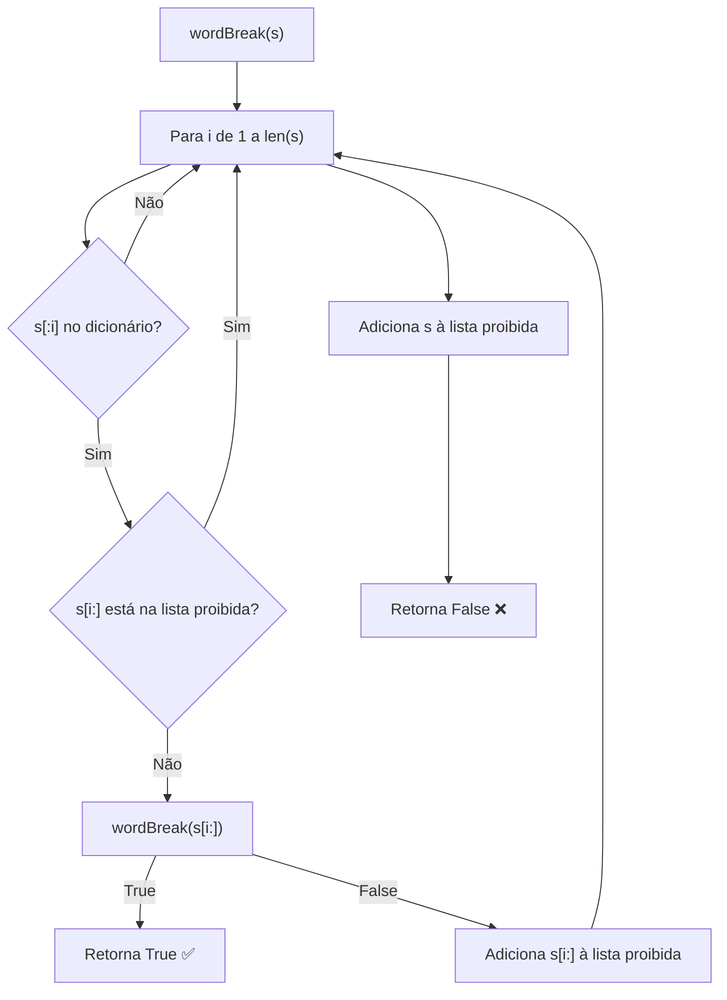

# 🧩 Dynamic Programming — Cheat Sheet de Flashcards

---

### 📌 Best Time to Buy and Sell Stock (`best_time_buy_sell_stock.py`)
* **LeetCode:** [#121 — Easy](https://leetcode.com/problems/best-time-to-buy-and-sell-stock/) | **Tópicos:** Array, Dynamic Programming
* **Enunciado completo:** Você recebe um array `prices` onde `prices[i]` é o preço de uma determinada ação no `i`-ésimo dia. Você quer maximizar seu lucro escolhendo **um único dia** para comprar uma ação e **um dia diferente no futuro** para vendê-la. Retorne o **lucro máximo** que você pode obter com essa transação. Se não for possível obter nenhum lucro, retorne `0`.
  - **Exemplo 1:** `prices = [7,1,5,3,6,4]` → Compra no dia 2 (preço 1), vende no dia 5 (preço 6) → lucro = **5**. Note que comprar no dia 2 e vender no dia 1 não é permitido porque a compra deve ocorrer antes da venda.
  - **Exemplo 2:** `prices = [7,6,4,3,1]` → Preços só caem, nenhuma transação lucrativa → retorna **0**.
  - **Restrições:** `1 <= prices.length <= 10⁵` · `0 <= prices[i] <= 10⁴`.
* **💡 Sacada (O Pulo do Gato):**
> Mantenha o menor preço visto até agora (`min_price`) e, a cada passo, calcule o delta `price - min_price`. O maior delta encontrado é o lucro máximo. Só uma passada linear resolve.
* **🧠 Modelo Mental:**

* **Complexidade esperada:** ⏱️ Tempo $O(n)$ | 💾 Espaço $O(1)$.
* **Edge cases (Casos de Borda):**
  - Array com preços apenas decrescentes → lucro é 0 (nunca vale a pena vender).
  - Array com um único elemento → lucro é 0.
* **Core snippet:**
```python
max_profit = 0
min_price = prices[0]
for price in prices:
    min_price = min(min_price, price)
    max_profit = max(price - min_price, max_profit)
return max_profit
```

---

### 📌 Climbing Stairs (`climbing_stairs.py`)
* **LeetCode:** [#70 — Easy](https://leetcode.com/problems/climbing-stairs/) | **Tópicos:** Math, Dynamic Programming, Memoization
* **Enunciado completo:** Você está subindo uma escada. São necessários `n` degraus para chegar ao topo. A cada vez, você pode subir **1 degrau** ou **2 degraus**. De quantas **formas distintas** você consegue escalar até o topo? A ideia central é que, para alcançar o degrau `n`, você obrigatoriamente veio do degrau `n-1` (com um passo de 1) ou do degrau `n-2` (com um passo de 2), formando a recorrência clássica de Fibonacci.
  - **Exemplo 1:** `n = 2` → 2 formas: (1+1) ou (2) → retorna **2**.
  - **Exemplo 2:** `n = 3` → 3 formas: (1+1+1), (1+2), (2+1) → retorna **3**.
  - **Restrições:** `1 <= n <= 45`.
* **💡 Sacada (O Pulo do Gato):**
> É exatamente a sequência de Fibonacci. Para chegar ao andar `i`, você veio do andar `i-1` (1 passo) ou do `i-2` (2 passos). Basta somar os dois anteriores: `dp[i] = dp[i-1] + dp[i-2]`.
* **🧠 Modelo Mental:**

* **Complexidade esperada:** ⏱️ Tempo $O(n)$ | 💾 Espaço $O(n)$ (otimizável para $O(1)$ com duas variáveis).
* **Edge cases (Casos de Borda):**
  - `n = 1` → 1 forma.
  - `n = 2` → 2 formas.
* **Core snippet:**
```python
response = []
for i in range(0, n):
    if i == 0:
        response.append(1)
    elif i == 1:
        response.append(2)
    else:
        response.append(response[i-1] + response[i-2])
return response[-1]
```

---

### 📌 Coin Change (`coin-change.py`)
* **LeetCode:** [#322 — Medium](https://leetcode.com/problems/coin-change/) | **Tópicos:** Array, Dynamic Programming, Breadth-First Search
* **Enunciado completo:** Você recebe um array de inteiros `coins` representando moedas de diferentes denominações e um inteiro `amount` representando um valor total em dinheiro. Retorne o **menor número de moedas** que você precisa para compor exatamente esse valor. Se esse valor não puder ser composto por nenhuma combinação das moedas, retorne `-1`. Você pode assumir que possui uma quantidade **infinita** de cada tipo de moeda. Este é um problema clássico do tipo **Unbounded Knapsack** — para cada valor de 1 até `amount`, calculamos o ótimo aproveitando subproblemas já resolvidos.
  - **Exemplo 1:** `coins = [1,2,5]`, `amount = 11` → 5+5+1 = 11 → retorna **3** moedas.
  - **Exemplo 2:** `coins = [2]`, `amount = 3` → impossível formar 3 com moedas de 2 → retorna **-1**.
  - **Exemplo 3:** `coins = [1]`, `amount = 0` → valor já atingido sem usar moedas → retorna **0**.
  - **Restrições:** `1 <= coins.length <= 12` · `1 <= coins[i] <= 2³¹ - 1` · `0 <= amount <= 10⁴`.
* **💡 Sacada (O Pulo do Gato):**
> Construa um array `dp` onde `dp[v]` é a quantidade mínima de moedas para formar o valor `v`. Para cada valor, tente todas as moedas: se `dp[v - coin]` já foi resolvido, então `dp[v] = min(dp[v], dp[v - coin] + 1)`. Valores impossíveis ficam como `-1`.
* **🧠 Modelo Mental:**

* **Complexidade esperada:** ⏱️ Tempo $O(amount \times |coins|)$ | 💾 Espaço $O(amount)$.
* **Edge cases (Casos de Borda):**
  - `amount = 0` → retorna 0 imediatamente.
  - Nenhuma combinação de moedas atinge o valor → retorna -1 (`dp[-1]` permanece -1).
  - Moedas maiores que o valor → são ignoradas via `continue`.
* **Core snippet:**
```python
dp = [-1 for _ in range(amount + 1)]
for value in range(amount + 1):
    for coin in coins:
        if coin > value:
            continue
        elif coin == value:
            dp[value] = 1
        elif coin < value and dp[value - coin] > 0:
            if dp[value] == -1:
                dp[value] = 1 + dp[value - coin]
            else:
                dp[value] = min(dp[value], dp[value - coin] + 1)
return dp[-1]
```

---

### 📌 House Robber (`house_robbing.py`)
* **LeetCode:** [#198 — Medium](https://leetcode.com/problems/house-robber/) | **Tópicos:** Array, Dynamic Programming
* **Enunciado completo:** Você é um ladrão profissional planejando roubar casas ao longo de uma rua. Cada casa possui uma certa quantia de dinheiro escondida. A única restrição que impede você de roubar todas é que **casas adjacentes possuem sistemas de segurança conectados** — eles irão contatar a polícia automaticamente se **duas casas vizinhas** forem arrombadas na mesma noite. Dado um array de inteiros `nums` representando a quantia de dinheiro em cada casa, retorne o **valor máximo** que você pode roubar esta noite **sem acionar nenhum alarme**.
  - **Exemplo 1:** `nums = [1,2,3,1]` → Rouba casa 1 ($1) + casa 3 ($3) = **$4**.
  - **Exemplo 2:** `nums = [2,7,9,3,1]` → Rouba casa 1 ($2) + casa 3 ($9) + casa 5 ($1) = **$12**.
  - **Restrições:** `1 <= nums.length <= 100` · `0 <= nums[i] <= 400`.
* **💡 Sacada (O Pulo do Gato):**
> Para a casa `i`, o máximo é `max(nums[i] + dp[i-2], nums[i] + dp[i-3])`. Você pula uma ou duas casas para trás. Pular 4+ casas nunca é ótimo, pois seria melhor dividir essa sequência de saltos.
* **🧠 Modelo Mental:**

* **Complexidade esperada:** ⏱️ Tempo $O(n)$ | 💾 Espaço $O(n)$.
* **Edge cases (Casos de Borda):**
  - Array com 1 casa → retorna o valor dela.
  - Array com 2 casas → retorna o maior entre as duas.
  - Tratamento especial dos 3 primeiros índices para evitar out of bounds.
* **Core snippet:**
```python
response = [0 for _ in range(len(nums))]
response[0] = nums[0]
if nums_size > 1:
    response[1] = nums[1]
if nums_size > 2:
    response[2] = nums[2] + nums[0]
max_val = max(response)
for i in range(3, len(nums)):
    response[i] = max(nums[i] + response[i-2], nums[i] + response[i-3])
    max_val = max(max_val, response[i])
return max_val
```

---

### 📌 Longest Increasing Subsequence (`longest-increasing-subsequence.py`)
* **LeetCode:** [#300 — Medium](https://leetcode.com/problems/longest-increasing-subsequence/) | **Tópicos:** Array, Binary Search, Dynamic Programming
* **Enunciado completo:** Dado um array de inteiros `nums`, retorne o comprimento da **maior subsequência estritamente crescente** (LIS — *Longest Increasing Subsequence*). Uma **subsequência** é uma sequência que pode ser derivada do array original deletando alguns (ou nenhum) elementos **sem alterar a ordem relativa** dos elementos restantes. Por exemplo, `[3,6,2,7]` é uma subsequência de `[0,3,1,6,2,2,7]`. Note que a subsequência deve ser **estritamente crescente** — elementos iguais consecutivos não contam. Pode haver múltiplas combinações de LIS válidas; você só precisa retornar o **comprimento**. **Follow-up:** Você consegue resolver em $O(n \log n)$?
  - **Exemplo 1:** `nums = [10,9,2,5,3,7,101,18]` → A LIS é `[2,3,7,101]` → retorna **4**.
  - **Exemplo 2:** `nums = [0,1,0,3,2,3]` → A LIS é `[0,1,2,3]` → retorna **4**.
  - **Exemplo 3:** `nums = [7,7,7,7,7,7,7]` → Todos iguais, nenhuma subsequência crescente → retorna **1**.
  - **Restrições:** `1 <= nums.length <= 2500` · `-10⁴ <= nums[i] <= 10⁴`.
* **💡 Sacada (O Pulo do Gato):**
> **Solução DP O(n²):** `dp[i]` guarda o tamanho da melhor LIS terminando em `i`. Para calcular `dp[i]`, olhe todos os `k < i` onde `nums[k] < nums[i]` e pegue o maior `dp[k] + 1`.
> **Solução ótima O(n log n):** Use `bisect_left` para manter uma lista `sub` onde substituímos candidatos menores. Se o número é maior que todos, cresce a lista; senão, substituímos.
* **🧠 Modelo Mental:**

* **Complexidade esperada:** ⏱️ Tempo $O(n^2)$ (DP) / $O(n \log n)$ (Bisect) | 💾 Espaço $O(n)$.
* **Edge cases (Casos de Borda):**
  - Array com todos os elementos iguais → LIS = 1.
  - Array já ordenado → LIS = n.
  - Array com um único elemento → LIS = 1.
* **Core snippet:**
```python
# Solução DP O(n²)
dp = [0 for _ in range(len(nums))]
dp[0] = 1
for i in range(1, len(nums)):
    best_dp = 0
    for k in range(i):
        if nums[k] < nums[i]:
            best_dp = max(best_dp, dp[k])
    dp[i] = best_dp + 1
return max(dp)
```

---

### 📌 Maximum Subarray (`maximum_subarray.py`)
* **LeetCode:** [#53 — Medium](https://leetcode.com/problems/maximum-subarray/) | **Tópicos:** Array, Divide and Conquer, Dynamic Programming
* **Enunciado completo:** Dado um array de inteiros `nums`, encontre o **subarray contíguo** (contendo pelo menos um elemento) que possua a **maior soma** e retorne essa soma. Um **subarray** é uma parte contígua do array (diferente de subsequência, que pode pular elementos). Este é o clássico problema resolvido pelo **Algoritmo de Kadane**. **Follow-up:** Se você já descobriu a solução $O(n)$, tente implementar outra solução usando a abordagem de **dividir e conquistar** (divide and conquer).
  - **Exemplo 1:** `nums = [-2,1,-3,4,-1,2,1,-5,4]` → O subarray `[4,-1,2,1]` tem a maior soma → retorna **6**.
  - **Exemplo 2:** `nums = [1]` → Único elemento → retorna **1**.
  - **Exemplo 3:** `nums = [5,4,-1,7,8]` → O array inteiro é o melhor subarray → retorna **23**.
  - **Restrições:** `1 <= nums.length <= 10⁵` · `-10⁴ <= nums[i] <= 10⁴`.
* **💡 Sacada (O Pulo do Gato):**
> Mantenha uma soma corrente (`current_sum`). Se ela ficar negativa, descarte tudo e recomece do zero — carregar uma soma negativa só piora. A cada passo, atualize a melhor soma vista. Caso especial: se todos os números forem negativos, o maior elemento é a resposta.
* **🧠 Modelo Mental:**

* **Complexidade esperada:** ⏱️ Tempo $O(n)$ | 💾 Espaço $O(1)$.
* **Edge cases (Casos de Borda):**
  - Todos os números negativos → a lógica do Kadane zera a soma, mas o `max(nums)` no final captura o maior negativo.
  - Array com um único elemento → retorna ele.
* **Core snippet:**
```python
current_sum = 0
response_sum = 0
for i in range(len(nums)):
    current_sum += nums[i]
    if current_sum < 0:
        current_sum = 0
    if current_sum >= response_sum:
        response_sum = current_sum
max_value = max(nums)
if max_value < 0:
    response_sum = max_value
return response_sum
```

---

### 📌 Word Break (`word-break.py`)
* **LeetCode:** [#139 — Medium](https://leetcode.com/problems/word-break/) | **Tópicos:** Array, Hash Table, String, Dynamic Programming, Trie, Memoization
* **Enunciado completo:** Dada uma string `s` e uma lista de strings `wordDict` (dicionário), determine se `s` pode ser **segmentada** em uma sequência separada por espaços de uma ou mais palavras presentes no dicionário. A mesma palavra do dicionário pode ser **reutilizada múltiplas vezes** na segmentação. Note que as palavras e a string contêm apenas letras minúsculas do alfabeto inglês, e todas as strings no dicionário são **únicas**. O desafio central é decidir onde "cortar" a string — um prefixo válido pode levar a um sufixo impossível, então é preciso explorar todas as possibilidades de forma inteligente (DP ou backtracking com memoização).
  - **Exemplo 1:** `s = "leetcode"`, `wordDict = ["leet","code"]` → "leet" + "code" → retorna **true**.
  - **Exemplo 2:** `s = "applepenapple"`, `wordDict = ["apple","pen"]` → "apple" + "pen" + "apple" → retorna **true**. Note que a palavra "apple" foi reutilizada.
  - **Exemplo 3:** `s = "catsandog"`, `wordDict = ["cats","dog","sand","and","cat"]` → Nenhuma segmentação válida cobre a string inteira → retorna **false**.
  - **Restrições:** `1 <= s.length <= 300` · `1 <= wordDict.length <= 1000` · `1 <= wordDict[i].length <= 20` · `s` e `wordDict[i]` contêm apenas letras minúsculas · Todas as strings em `wordDict` são únicas.
* **💡 Sacada (O Pulo do Gato):**
> Recursão com memoização (backtracking + pruning). Para cada prefixo de `s` que existe no dicionário, chame recursivamente a função para o sufixo restante. Mantenha uma lista de sufixos que já se sabe que não levam a uma solução (`dont_exist_list`) para podar ramos desnecessários.
* **🧠 Modelo Mental:**

* **Complexidade esperada:** ⏱️ Tempo $O(n^2 \times m)$ com memoização (onde $m$ é o tamanho do dicionário) | 💾 Espaço $O(n)$.
* **Edge cases (Casos de Borda):**
  - String vazia → retorna `True` (caso base).
  - Nenhuma segmentação válida → retorna `False` após explorar todas as combinações.
  - Palavras no dicionário que são prefixos umas das outras (ex: "cat" e "cats").
* **Core snippet:**
```python
def verify_word_in_dict(self, s, wordDict):
    if s == "":
        return True
    for i in range(1, len(s) + 1):
        if s[:i] in wordDict:
            if not self.is_suffix(s[i:]):
                response = self.verify_word_in_dict(s[i:], wordDict)
                if response:
                    return response
    self.dont_exist_list.append(s)
    return False
```
