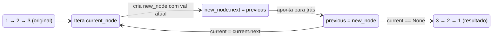
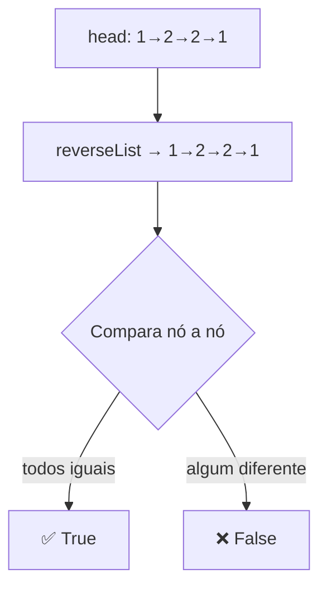
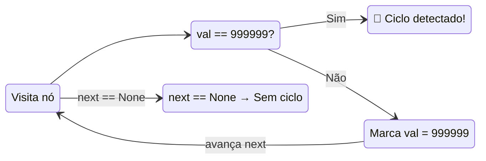
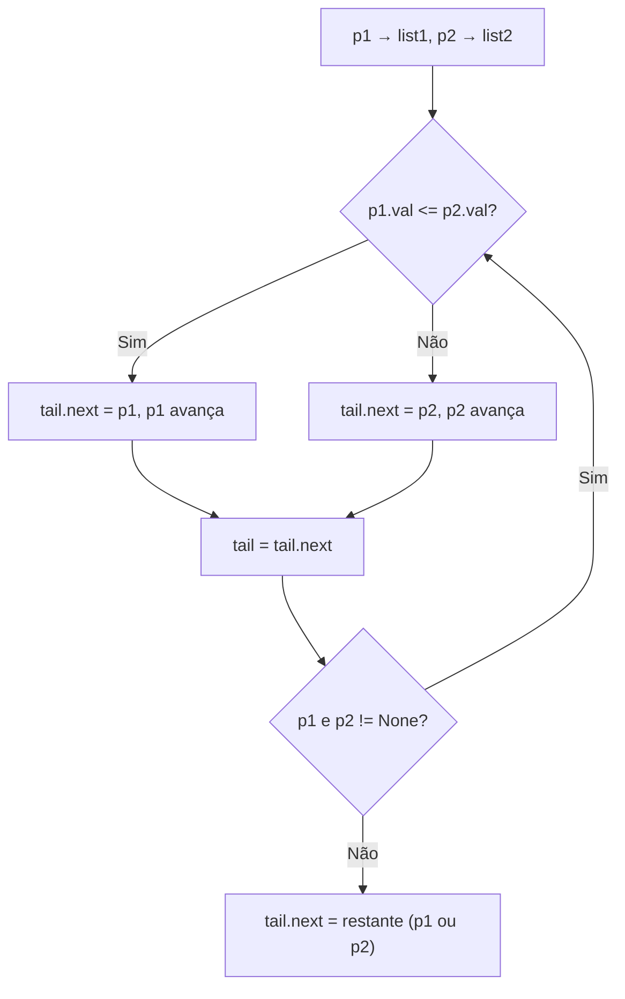
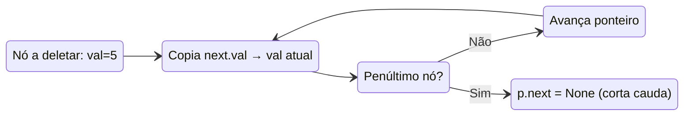
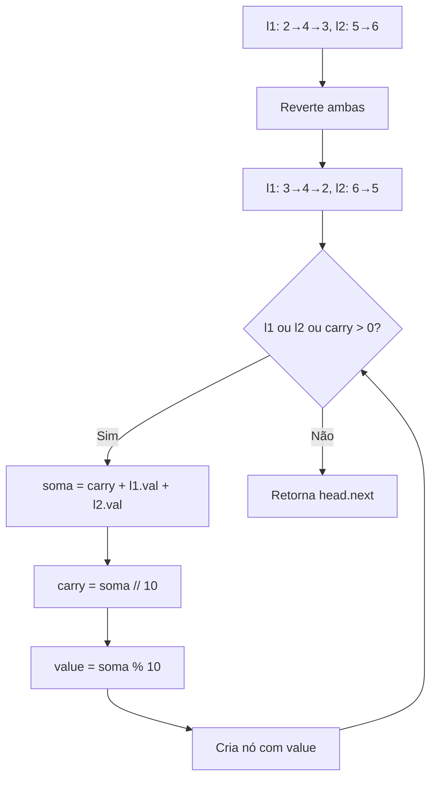

# 🔗 Linked List — Cheat Sheet de Flashcards

---

### 📌 Reverse Linked List (`reverse_linked_list.py`)
* **LeetCode:** [206. Reverse Linked List](https://leetcode.com/problems/reverse-linked-list/) — **Easy** (Acceptance Rate: ~80%)
* **Tópicos:** `Linked List`, `Recursion`
* **Descrição completa:** Dada a cabeça (`head`) de uma singly linked list, inverta a lista inteira e retorne a cabeça da lista invertida. Cada nó contém um valor inteiro e um ponteiro `next` para o próximo nó; o objetivo é inverter a direção de **todos** os ponteiros de forma que o último nó se torne o primeiro e vice-versa. A lista pode estar vazia (0 nós), ter um único nó, ou milhares de nós.
  - **Exemplo 1:** `head = [1,2,3,4,5]` → `[5,4,3,2,1]`
  - **Exemplo 2:** `head = [1,2]` → `[2,1]`
  - **Exemplo 3:** `head = []` → `[]`
  - **Constraints:** O número de nós está no intervalo `[0, 5000]`. `-5000 <= Node.val <= 5000`.
  - **Follow-up:** Uma linked list pode ser invertida iterativamente ou recursivamente. Você consegue implementar ambas?
* **💡 Sacada (O Pulo do Gato):**
  > Iterativamente, crie um novo nó para cada elemento e aponte o `.next` dele para o nó anterior (dummy → previous). A cada passo, o `previous_node` se torna o nó recém-criado, construindo a lista ao contrário.
* **🧠 Modelo Mental:**

* **Complexidade esperada:** ⏱️ Tempo $O(n)$ | 💾 Espaço $O(n)$ (cria novos nós).
* **Edge cases (Casos de Borda):**
  - Lista vazia (`head == None`): retorna `None` diretamente.
  - Lista com um único elemento: retorna o próprio nó sem entrar no loop.
* **Core snippet:**
```python
def reverseList(self, head):
    if head is None:
        return None
    previous_node = ListNode(head.val)
    current_node = head.next
    while current_node is not None:
        new_node = ListNode(current_node.val)
        new_node.next = previous_node
        previous_node = new_node
        current_node = current_node.next
    return previous_node
```

---

### 📌 Palindrome Linked List (`palindrome_linked_list.py`)
* **LeetCode:** [234. Palindrome Linked List](https://leetcode.com/problems/palindrome-linked-list/) — **Easy** (Acceptance Rate: ~57%)
* **Tópicos:** `Linked List`, `Two Pointers`, `Stack`, `Recursion`
* **Descrição completa:** Dada a cabeça (`head`) de uma singly linked list, retorne `true` se a sequência de valores da lista formar um **palíndromo** (ou seja, lê-se exatamente igual de frente para trás e de trás para frente), ou `false` caso contrário. Por exemplo, `[1,2,2,1]` é palíndromo pois a leitura reversa é idêntica; já `[1,2]` não é. Cada nó contém um único dígito (0–9).
  - **Exemplo 1:** `head = [1,2,2,1]` → `true`
  - **Exemplo 2:** `head = [1,2]` → `false`
  - **Constraints:** O número de nós está no intervalo `[1, 10⁵]`. `0 <= Node.val <= 9`.
  - **Follow-up:** Você consegue resolver em tempo $O(n)$ e espaço $O(1)$? (Dica: encontre o meio com slow/fast pointer, inverta a segunda metade in-place e compare.)
* **💡 Sacada (O Pulo do Gato):**
  > Inverta a lista inteira (criando uma cópia reversa) e depois compare nó a nó com a lista original. Se todos os valores baterem, é palíndromo.
* **🧠 Modelo Mental:**

* **Complexidade esperada:** ⏱️ Tempo $O(n)$ | 💾 Espaço $O(n)$ (cópia reversa).
* **Edge cases (Casos de Borda):**
  - Lista com 1 elemento: é palíndromo por definição.
  - Lista vazia: retorna `True` (não entra no while).
* **Core snippet:**
```python
def isPalindrome(self, head):
    reversed_head = self.reverseList(head)
    while head is not None:
        if reversed_head.val != head.val:
            return False
        reversed_head = reversed_head.next
        head = head.next
    return True
```

---

### 📌 Linked List Cycle (`linked_list_cycle.py`)
* **LeetCode:** [141. Linked List Cycle](https://leetcode.com/problems/linked-list-cycle/) — **Easy** (Acceptance Rate: ~49%)
* **Tópicos:** `Hash Table`, `Linked List`, `Two Pointers`
* **Descrição completa:** Dada a cabeça (`head`) de uma linked list, determine se ela contém um **ciclo**. Um ciclo existe quando algum nó da lista pode ser alcançado novamente ao seguir continuamente o ponteiro `next` — ou seja, a cauda da lista aponta de volta para um nó anterior em vez de apontar para `None`. Internamente, `pos` indica o índice (0-indexed) do nó ao qual a cauda se conecta; se `pos = -1`, não há ciclo. **Importante:** `pos` **não** é passado como parâmetro da função — ele existe apenas para construir o caso de teste. Você deve detectar o ciclo apenas navegando pela lista.
  - **Exemplo 1:** `head = [3,2,0,-4], pos = 1` → `true` (a cauda `-4` conecta de volta ao nó de índice 1, cujo valor é `2`, formando o ciclo `2 → 0 → -4 → 2 → ...`).
  - **Exemplo 2:** `head = [1,2], pos = 0` → `true` (a cauda `2` conecta de volta ao nó de índice 0, valor `1`).
  - **Exemplo 3:** `head = [1], pos = -1` → `false` (nó único sem ciclo).
  - **Constraints:** O número de nós está no intervalo `[0, 10⁴]`. `-10⁵ <= Node.val <= 10⁵`. `pos` é `-1` ou um índice válido na lista.
  - **Follow-up:** Você consegue resolver usando $O(1)$ de memória? (Dica: algoritmo de Floyd — tortoise and hare / slow & fast pointer.)
* **💡 Sacada (O Pulo do Gato):**
  > Abordagem "bruta mas funcional": percorra a lista marcando cada nó visitado com um valor sentinela (999999). Se encontrar um nó já marcado, existe ciclo. Técnica destrutiva, mas simples de implementar.
* **🧠 Modelo Mental:**

* **Complexidade esperada:** ⏱️ Tempo $O(n)$ | 💾 Espaço $O(1)$ (modifica in-place).
* **Edge cases (Casos de Borda):**
  - Lista vazia: retorna `False` (não entra no while).
  - Lista sem ciclo: percorre até o fim e retorna `False`.
  - Valor 999999 legítimo na lista: colisão com a sentinela — abordagem Floyd (fast/slow pointer) seria mais robusta.
* **Core snippet:**
```python
def hasCycle(self, head):
    work_pointer = head
    while work_pointer is not None:
        if work_pointer.val == 999999:
            return True
        else:
            work_pointer.val = 999999
        work_pointer = work_pointer.next
    return False
```

---

### 📌 Merge Two Sorted Lists (`merge_two_sorted_lists.py`)
* **LeetCode:** [21. Merge Two Sorted Lists](https://leetcode.com/problems/merge-two-sorted-lists/) — **Easy** (Acceptance Rate: ~63%)
* **Tópicos:** `Linked List`, `Recursion`
* **Descrição completa:** Você recebe as cabeças de duas linked lists **já ordenadas** em ordem não-decrescente (`list1` e `list2`). Mescle essas duas listas em **uma única lista ordenada**. A lista resultante deve ser formada re-arranjando (splicing) os ponteiros `next` dos nós das duas listas originais — ou seja, sem criar novos nós, apenas reconectando os existentes. Retorne a cabeça da lista mesclada. As listas podem ter tamanhos diferentes, e qualquer uma delas (ou ambas) pode estar vazia.
  - **Exemplo 1:** `list1 = [1,2,4], list2 = [1,3,4]` → `[1,1,2,3,4,4]`
  - **Exemplo 2:** `list1 = [], list2 = []` → `[]`
  - **Exemplo 3:** `list1 = [], list2 = [0]` → `[0]`
  - **Constraints:** O número de nós em cada lista está no intervalo `[0, 50]`. `-100 <= Node.val <= 100`. Ambas as listas estão ordenadas em ordem não-decrescente.
* **💡 Sacada (O Pulo do Gato):**
  > Use dois ponteiros (`p1`, `p2`) percorrendo cada lista. A cada passo, conecte o menor valor ao `tail` da lista resultado. Quando uma lista acabar, conecte o restante da outra diretamente. Lembre-se: `p1` é apenas um apontador — mudar `p1` não altera `list1`, mas mudar `p1.next` sim.
* **🧠 Modelo Mental:**

* **Complexidade esperada:** ⏱️ Tempo $O(n + m)$ | 💾 Espaço $O(1)$ (reutiliza nós).
* **Edge cases (Casos de Borda):**
  - Ambas as listas vazias: retorna `None`.
  - Uma lista vazia: retorna a outra diretamente.
  - Listas de tamanhos diferentes: o `while` para quando a menor acaba e o restante é anexado.
* **Core snippet:**
```python
def mergeTwoLists(self, list1, list2):
    if list1 is None: return list2
    if list2 is None: return list1
    p1, p2 = list1, list2
    if p1.val <= p2.val:
        head = list1; p1 = p1.next
    else:
        head = list2; p2 = p2.next
    tail = head
    while p1 is not None and p2 is not None:
        if p1.val <= p2.val:
            tail.next = p1; p1 = p1.next
        else:
            tail.next = p2; p2 = p2.next
        tail = tail.next
    tail.next = p1 if p1 else p2
    return head
```

---

### 📌 Delete Node in a Linked List (`delete_node_linked_list.py`)
* **LeetCode:** [237. Delete Node in a Linked List](https://leetcode.com/problems/delete-node-in-a-linked-list/) — **Medium** (Acceptance Rate: ~83%)
* **Tópicos:** `Linked List`
* **Descrição completa:** Existe uma singly linked list `head` e queremos deletar um nó `node` dela. Porém, você **não recebe** acesso ao primeiro nó (`head`) — recebe **apenas** uma referência direta ao nó que deve ser deletado. Todos os valores na lista são **únicos**, e é garantido que o nó dado **nunca** é o último nó (tail). "Deletar" o nó significa que: (1) o valor daquele nó não deve mais existir na lista, (2) o número total de nós deve diminuir em 1, (3) todos os valores antes do nó deletado devem permanecer na mesma ordem, e (4) todos os valores depois do nó deletado devem permanecer na mesma ordem. O desafio central é: como remover um nó sem ter acesso ao nó anterior?
  - **Exemplo 1:** `head = [4,5,1,9], node = 5` → `[4,1,9]` (o nó com valor 5 é removido).
  - **Exemplo 2:** `head = [4,5,1,9], node = 1` → `[4,5,9]` (o nó com valor 1 é removido).
  - **Constraints:** O número de nós está no intervalo `[2, 1000]`. `-1000 <= Node.val <= 1000`. O valor de cada nó na lista é **único**. O nó a ser deletado **está** na lista e **não** é o nó tail.
* **💡 Sacada (O Pulo do Gato):**
  > Sem acesso ao nó anterior, a "magia" é copiar o valor do próximo nó para o atual (`p.val = p.next.val`), efetivamente "empurrando" valores para frente. Quando chegar no penúltimo nó, corte a cauda (`p.next = None`).
* **🧠 Modelo Mental:**

* **Complexidade esperada:** ⏱️ Tempo $O(n)$ | 💾 Espaço $O(1)$.
* **Edge cases (Casos de Borda):**
  - O nó a deletar é o penúltimo: uma única cópia + corte.
  - O nó a deletar nunca é o último (garantido pelo problema).
* **Core snippet:**
```python
def deleteNode(self, node):
    p = node
    while p.next is not None:
        p.val = p.next.val
        if p.next.next is None:
            p.next = None
            break
        p = p.next
```

---

### 📌 Add Two Numbers (`add_two_numbers.py`)
* **LeetCode:** [2. Add Two Numbers](https://leetcode.com/problems/add-two-numbers/) — **Medium** (Acceptance Rate: ~48%)
* **Tópicos:** `Linked List`, `Math`, `Recursion`
* **Descrição completa:** Você recebe duas linked lists **não-vazias** representando dois inteiros não-negativos. Os dígitos estão armazenados em **ordem reversa** — ou seja, o primeiro nó (head) contém o dígito **menos significativo** (unidade), o segundo nó contém a dezena, e assim por diante. Cada nó contém um único dígito (0–9). Some os dois números representados pelas listas e retorne a soma como uma **nova linked list** na mesma ordem reversa. É garantido que nenhum dos números possui zeros à esquerda (exceto o próprio número 0). As listas podem ter tamanhos diferentes — nesse caso, considere dígitos faltantes como 0. Se a soma gerar carry no final, um nó extra deve ser criado.
  - **Exemplo 1:** `l1 = [2,4,3], l2 = [5,6,4]` → `[7,0,8]` — Explicação: 342 + 465 = 807.
  - **Exemplo 2:** `l1 = [0], l2 = [0]` → `[0]`
  - **Exemplo 3:** `l1 = [9,9,9,9,9,9,9], l2 = [9,9,9,9]` → `[8,9,9,9,0,0,0,1]` — Explicação: 9999999 + 9999 = 10009998.
  - **Constraints:** O número de nós em cada lista está no intervalo `[1, 100]`. `0 <= Node.val <= 9`. É garantido que a lista representa um número sem zeros à esquerda.
* **💡 Sacada (O Pulo do Gato):**
  > Inverta ambas as listas para facilitar a soma dígito a dígito (do menos significativo ao mais significativo). Percorra ambas simultaneamente, somando valores + carry. Use `carry = result // 10` e `value = result % 10` para lidar com o "vai um".
* **🧠 Modelo Mental:**

* **Complexidade esperada:** ⏱️ Tempo $O(\max(n, m))$ | 💾 Espaço $O(\max(n, m))$.
* **Edge cases (Casos de Borda):**
  - Listas de tamanhos diferentes: usa `0` quando uma lista já acabou.
  - Carry no final: o `while` continua enquanto `carry > 0`, gerando dígito extra se necessário.
  - Uma das listas vazia: funciona naturalmente pois `l1.val if l1 else 0`.
* **Core snippet:**
```python
def addTwoNumbers(self, l1, l2):
    l1 = self.revert_linked_list(l1)
    l2 = self.revert_linked_list(l2)
    carry = 0
    head = ListNode()
    previous_node = head
    while l1 or l2 or carry > 0:
        first = l1.val if l1 else 0
        second = l2.val if l2 else 0
        result = carry + first + second
        carry = result // 10
        current = ListNode(result % 10)
        previous_node.next = current
        previous_node = current
        l1 = l1.next if l1 else None
        l2 = l2.next if l2 else None
    return head.next
```
