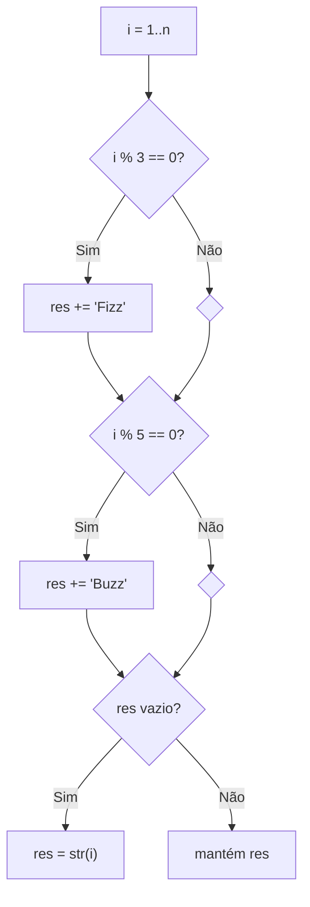
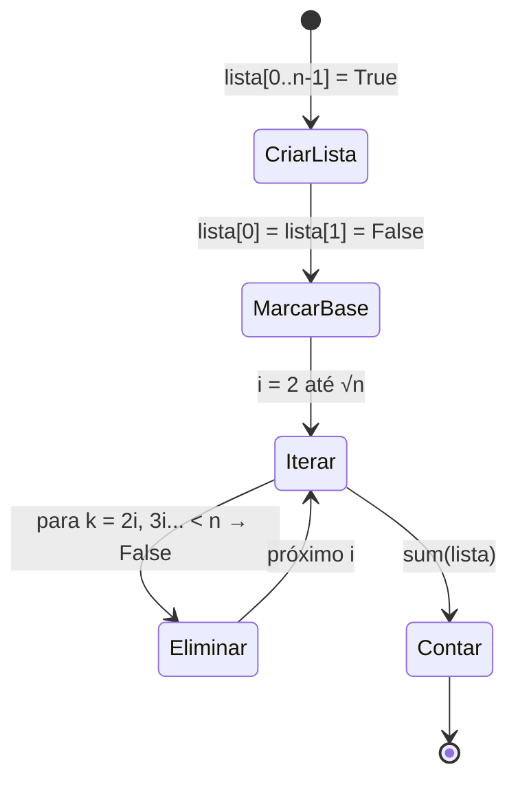
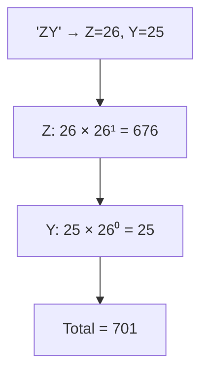
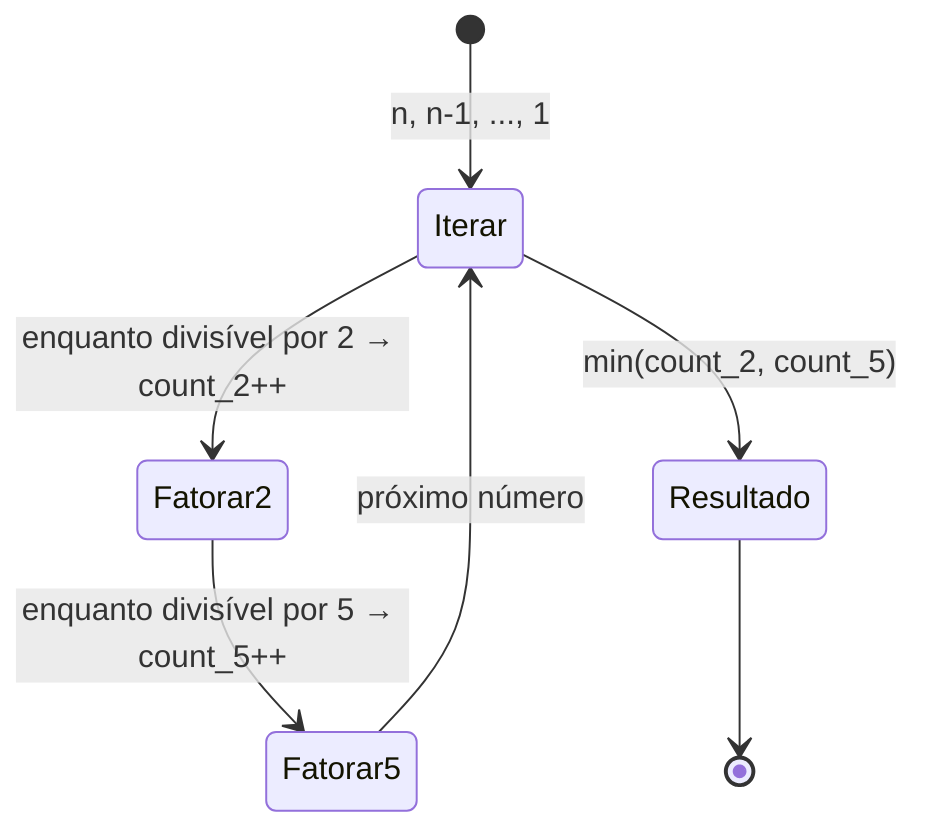
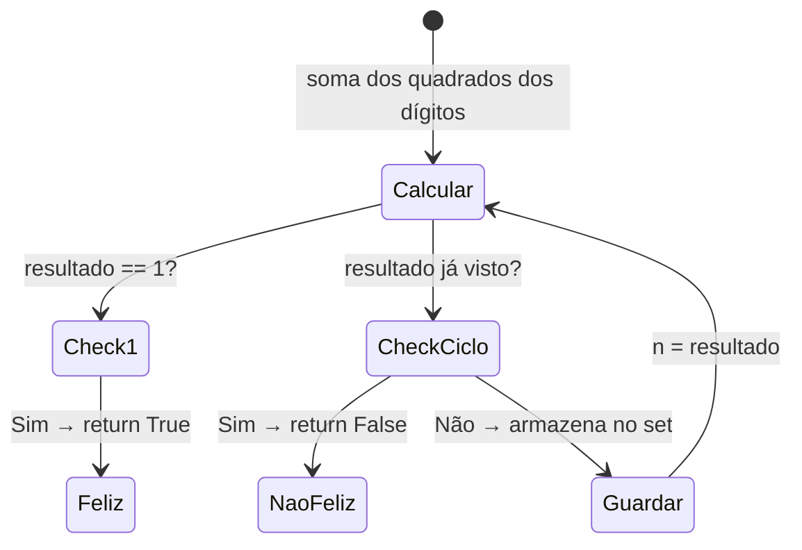
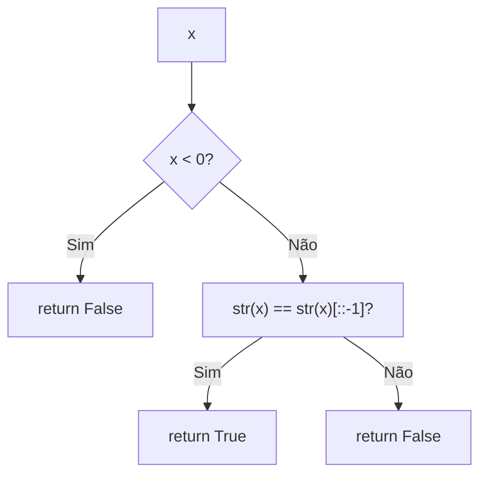
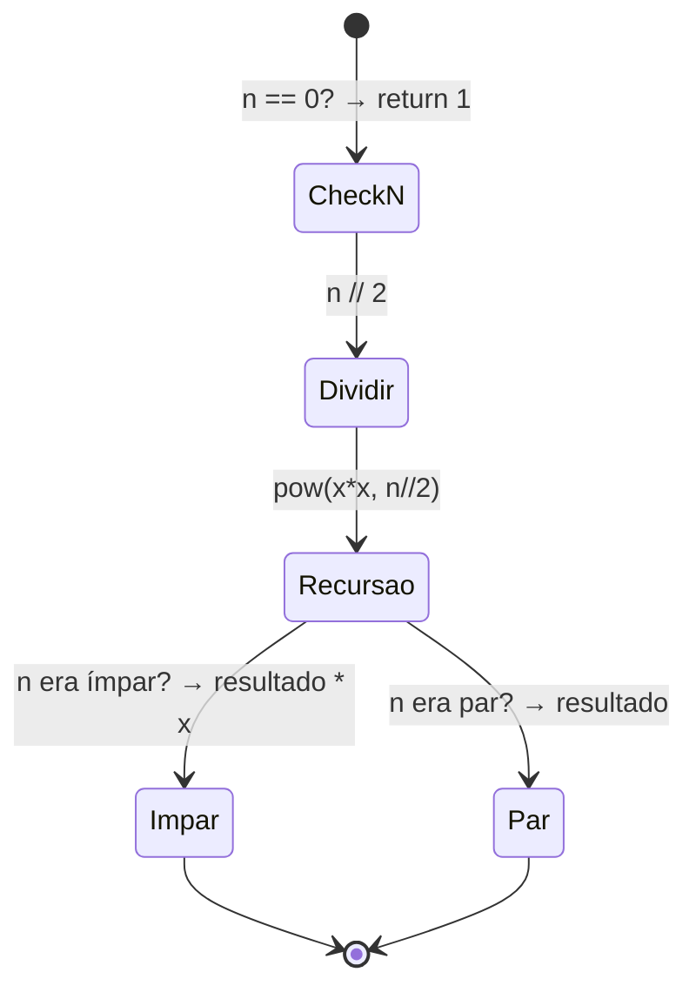
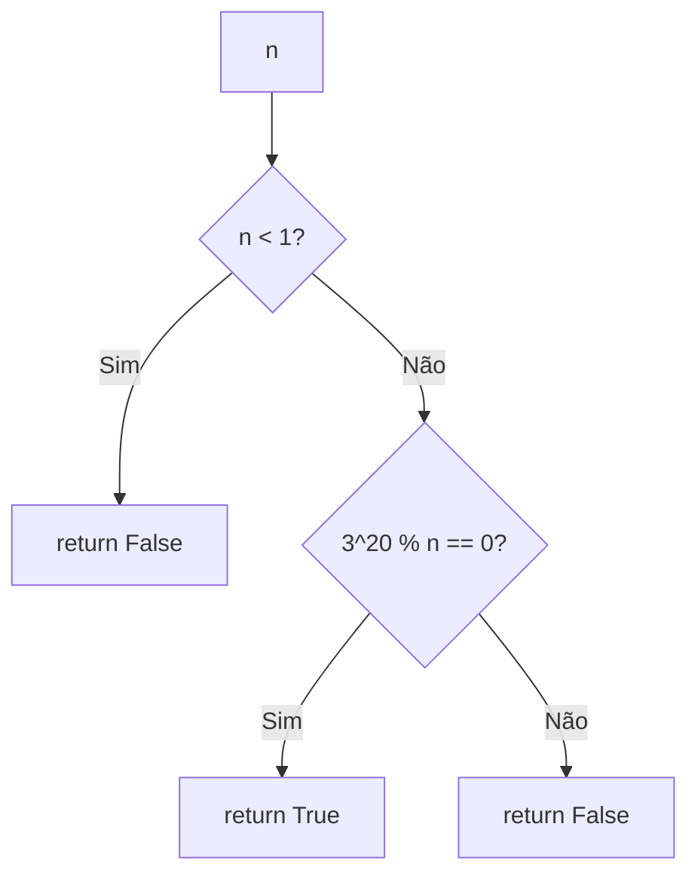
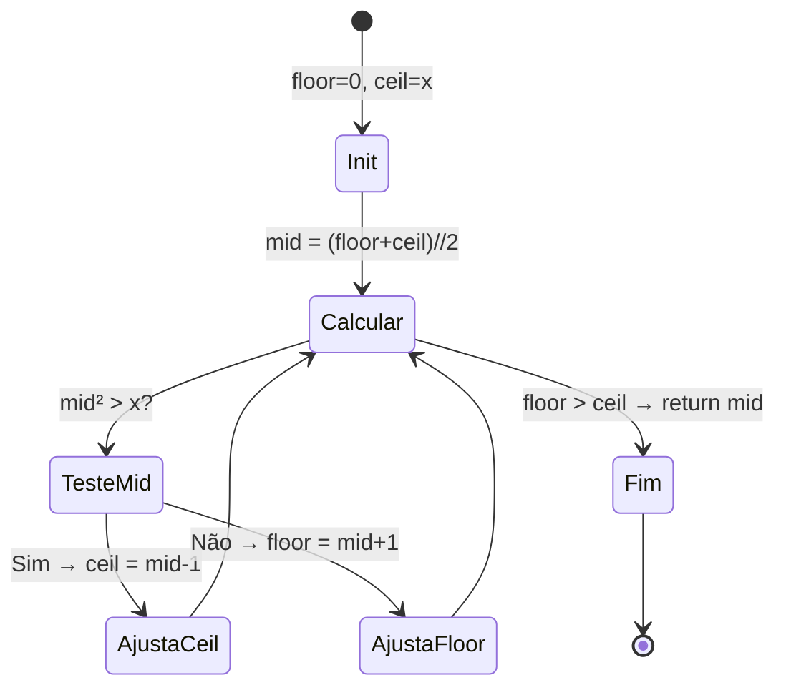

# 🧮 Math — Cheat Sheet de Flashcards

---

### 📌 412. Fizz Buzz (`FizzBuzz.py`) — Easy
* **Descrição do problema:** Escreva um programa que gere a representação em string dos números de `1` a `n`. Porém, para múltiplos de 3, retorne `"Fizz"` em vez do número; para múltiplos de 5, retorne `"Buzz"`; e para múltiplos de **ambos** 3 e 5, retorne `"FizzBuzz"`. Retorne a resposta como um array de strings `answer` (1-indexado), onde `answer[i]` é a representação do número `i`.
* **Exemplos:**
  * `n = 3` → `["1", "2", "Fizz"]`
  * `n = 5` → `["1", "2", "Fizz", "4", "Buzz"]`
  * `n = 15` → `["1", "2", "Fizz", "4", "Buzz", "Fizz", "7", "8", "Fizz", "Buzz", "11", "Fizz", "13", "14", "FizzBuzz"]`
* **Restrições:** `1 <= n <= 10⁴`.
* **Tags:** Math, String, Simulation.
* **Empresas:** Adobe, Amazon, Apple, Capital One, Cisco, Facebook, Google, IBM, LinkedIn, Microsoft, Oracle, Salesforce, Spotify.
* **💡 Sacada (O Pulo do Gato):**
  > Não use `elif`. Concatene as strings independentemente para cada condição (`%3` e `%5`). Isso cobre o caso "FizzBuzz" naturalmente sem precisar de um check separado.
* **🧠 Modelo Mental:**

* **Complexidade esperada:** ⏱️ Tempo $O(n)$ | 💾 Espaço $O(n)$.
* **Edge cases (Casos de Borda):** `n = 1` retorna `["1"]`. Múltiplos de 15 devem retornar `"FizzBuzz"`, não apenas `"Fizz"` ou `"Buzz"`.
* **Core snippet:**
```python
def fizzBuzz(self, n: int) -> List[str]:
    response = ["" for _ in range(n)]
    for i in range(1, n + 1):
        if i % 3 == 0:
            response[i-1] += "Fizz"
        if i % 5 == 0:
            response[i-1] += "Buzz"
        if i % 5 != 0 and i % 3 != 0:
            response[i-1] += str(i)
    return response
```

---

### 📌 204. Count Primes (`count_primes.py`) — Medium
* **Descrição do problema:** Dado um inteiro não-negativo `n`, conte a quantidade de números primos que são **estritamente menores** que `n`. Um número primo é aquele maior que 1 que não possui divisores além de 1 e ele mesmo. A dica do problema sugere que verificar cada inteiro individualmente é ineficiente — utilize o **Crivo de Eratóstenes** para eliminar rapidamente os não-primos.
* **Exemplos:**
  * `n = 10` → `4` (os primos menores que 10 são 2, 3, 5, 7)
  * `n = 0` → `0`
  * `n = 1` → `0`
* **Restrições:** `0 <= n <= 5 × 10⁶`.
* **Tags:** Array, Math, Enumeration, Number Theory.
* **Empresas:** Adobe, Amazon, Apple, Bloomberg, Capital One, Google, Microsoft, Oracle, Yahoo, Yandex.
* **💡 Sacada (O Pulo do Gato):**
  > **Crivo de Eratóstenes.** Só precisamos testar até a raiz quadrada de `n` porque se não encontramos nenhum fator até lá, o número é primo. Se houvesse um fator maior que `√n`, obrigatoriamente existiria um fator menor que `√n` já encontrado.
* **🧠 Modelo Mental:**

* **Complexidade esperada:** ⏱️ Tempo $O(n \log \log n)$ | 💾 Espaço $O(n)$.
* **Edge cases (Casos de Borda):** `n <= 2` não tem primos (0 e 1 não são primos). O crivo marca `0` e `1` como `False` antes de iterar.
* **Core snippet:**
```python
def countPrimes(self, n: int) -> int:
    n = max(n, 2)
    prime_list = [True for _ in range(n)]
    prime_list[0] = prime_list[1] = False
    for i in range(2, int(n**0.5) + 1):
        for k in range(2 * i, n, i):
            prime_list[k] = False
    return sum(prime_list)
```

---

### 📌 171. Excel Sheet Column Number (`excel_sheet_column.py`) — Easy
* **Descrição do problema:** Dada uma string `columnTitle` representando o título de uma coluna como aparece numa planilha Excel, retorne o número correspondente da coluna. O mapeamento segue o padrão: `A → 1`, `B → 2`, `C → 3`, ..., `Z → 26`, `AA → 27`, `AB → 28`, ... Essencialmente, trata-se de converter um número em **base 26** (onde A=1 até Z=26) para base 10. Os títulos vão de `"A"` até `"FXSHRXW"`.
* **Exemplos:**
  * `"A"` → `1`
  * `"AB"` → `28`
  * `"ZY"` → `701`
* **Restrições:** `1 <= columnTitle.length <= 7`. A string contém apenas letras maiúsculas de `A` a `Z`.
* **Tags:** Math, String.
* **Empresas:** Alation, Amazon, Bloomberg, Flipkart, Google, Microsoft, Uber.
* **💡 Sacada (O Pulo do Gato):**
  > É um sistema numérico de base 26 onde `A=1, B=2, ..., Z=26`. Percorra da esquerda para a direita, calculando `valor_letra * 26^posição` (posição decresce). Use `ord(c) - ord('A') + 1` para converter caractere em valor.
* **🧠 Modelo Mental:**

* **Complexidade esperada:** ⏱️ Tempo $O(k)$ onde $k$ é o comprimento da string | 💾 Espaço $O(1)$.
* **Edge cases (Casos de Borda):** Coluna de uma única letra (`"A"` = 1). Strings longas como `"AAA"` funcionam por ser base 26 pura.
* **Core snippet:**
```python
def titleToNumber(self, columnTitle: str) -> int:
    count = 0
    size = len(columnTitle)
    for idx_letter in range(size):
        power = size - idx_letter - 1
        letter_value = ord(columnTitle[idx_letter]) - ord('A') + 1
        count += 26 ** power * letter_value
    return count
```

---

### 📌 172. Factorial Trailing Zeroes (`factorial-trailing-zeroes.py`) — Medium
* **Descrição do problema:** Dado um inteiro `n`, retorne a quantidade de **zeros à direita** (trailing zeroes) em `n!` (fatorial de `n`). Cada zero final é produzido por um fator 10, e `10 = 2 × 5`. Como fatores de 2 são sempre mais abundantes que fatores de 5 num fatorial, basta contar quantas vezes o fator 5 aparece na decomposição de `n!`. Números como 25 contribuem com dois fatores de 5, 125 com três, etc. **Nota:** a solução deve ter complexidade de tempo **logarítmica**.
* **Exemplos:**
  * `n = 3` → `0` (3! = 6, sem zeros à direita)
  * `n = 5` → `1` (5! = 120, um zero à direita)
  * `n = 0` → `0`
* **Restrições:** `0 <= n <= 10⁴`.
* **Follow-up:** Resolva em $O(\log n)$ dividindo `n` por potências de 5 sucessivamente: `n/5 + n/25 + n/125 + ...`
* **Tags:** Math.
* **Empresas:** Adobe, Bloomberg, Microsoft.
* **💡 Sacada (O Pulo do Gato):**
  > Para formar um zero final precisamos de um par `(2, 5)` na fatoração. Como fatores de 2 sempre são mais abundantes, basta contar quantos fatores de 5 existem. A solução implementada faz a fatoração completa contando ambos 2 e 5, e retorna o mínimo. Uma abordagem mais eficiente seria apenas dividir `n` por potências de 5.
* **🧠 Modelo Mental:**

* **Complexidade esperada:** ⏱️ Tempo $O(n \log n)$ | 💾 Espaço $O(1)$.
* **Edge cases (Casos de Borda):** `n = 0` → fatorial é 1, sem zeros (retorna 0). `n = 5` → `120`, retorna 1. Números como 25 contribuem com dois fatores de 5.
* **Core snippet:**
```python
def trailingZeroes(self, n: int) -> int:
    count_2 = 0
    count_5 = 0
    for current_number in range(n, 0, -1):
        while current_number % 2 == 0:
            current_number = current_number // 2
            count_2 += 1
        while current_number % 5 == 0:
            current_number = current_number // 5
            count_5 += 1
    return min(count_2, count_5)
```

---

### 📌 202. Happy Number (`happy_number.py`) — Easy
* **Descrição do problema:** Escreva um algoritmo para determinar se um número `n` é um **número feliz** (*happy number*). O processo funciona assim: comece com qualquer inteiro positivo, substitua o número pela **soma dos quadrados de seus dígitos**, e repita o processo. Se eventualmente o resultado chegar a `1`, o número é feliz (e ficará em 1 para sempre). Se o processo entrar em um **ciclo infinito** que nunca inclui `1`, o número não é feliz. Retorne `true` se `n` é feliz, `false` caso contrário.
* **Exemplos:**
  * `n = 19` → `true` (1² + 9² = 82 → 8² + 2² = 68 → 6² + 8² = 100 → 1² + 0² + 0² = **1**)
  * `n = 2` → `false` (entra em ciclo: 4 → 16 → 37 → 58 → 89 → 145 → 42 → 20 → 4 → ...)
* **Restrições:** `1 <= n <= 2³¹ - 1`.
* **Tags:** Hash Table, Math, Two Pointers.
* **Empresas:** Adobe, Airbnb, Amazon, Apple, Bloomberg, Evernote, Facebook, Google, Microsoft, Pinterest, Twitter, Uber.
* **💡 Sacada (O Pulo do Gato):**
  > O problema diz que o processo pode entrar em ciclo. Usamos um dicionário/set para guardar resultados já vistos. Se um resultado se repete, há ciclo e o número não é feliz. Usa `% 10` para extrair dígitos e `// 10` para removê-los.
* **🧠 Modelo Mental:**

* **Complexidade esperada:** ⏱️ Tempo $O(k)$ onde $k$ é o número de iterações até ciclo ou 1 | 💾 Espaço $O(k)$.
* **Edge cases (Casos de Borda):** `n = 1` retorna `True` imediatamente. Números de um único dígito: 1 e 7 são felizes. Números negativos não se aplicam.
* **Core snippet:**
```python
def isHappy(self, n: int) -> bool:
    results = {}
    while n != 1:
        temp = n
        result = 0
        while temp != 0:
            result += (temp % 10) ** 2
            temp = temp // 10
        if result in results:
            return False
        results[result] = 0
        n = result
    return True
```

---

### 📌 9. Palindrome Number (`palindrome_number.py`) — Easy
* **Descrição do problema:** Dado um inteiro `x`, determine se ele é um **palíndromo**. Um inteiro é palíndromo quando a sua representação decimal lê-se igual da esquerda para a direita e da direita para a esquerda. Números **negativos** nunca são palíndromos pois, lidos ao contrário, o sinal `-` ficaria no final (ex.: `-121` lido ao contrário seria `121-`). Números terminados em `0` (exceto `0` em si) também não são palíndromos (ex.: `10` lido ao contrário seria `01`).
* **Exemplos:**
  * `x = 121` → `true`
  * `x = -121` → `false` (ao contrário seria "121-")
  * `x = 10` → `false` (ao contrário seria "01")
* **Restrições:** `-2³¹ <= x <= 2³¹ - 1`.
* **Follow-up:** Consegue resolver sem converter o inteiro para string?
* **Tags:** Math.
* **Empresas:** Adobe, Amazon, Apple, Bloomberg, Facebook, Goldman Sachs, Google, Microsoft, Oracle, Yahoo.
* **💡 Sacada (O Pulo do Gato):**
  > Números negativos nunca são palíndromos (pelo sinal `-`). Para positivos, basta converter para string e comparar com o reverso usando slicing `[::-1]`.
* **🧠 Modelo Mental:**

* **Complexidade esperada:** ⏱️ Tempo $O(d)$ onde $d$ é o número de dígitos | 💾 Espaço $O(d)$ (pela string).
* **Edge cases (Casos de Borda):** Negativos retornam `False`. `x = 0` é palíndromo. Números de um dígito são sempre palíndromos.
* **Core snippet:**
```python
def isPalindrome(self, x: int) -> bool:
    if x < 0:
        return False
    return str(x) == str(x)[::-1]
```

---

### 📌 50. Pow(x, n) (`pow.py`) — Medium
* **Descrição do problema:** Implemente a função `pow(x, n)`, que calcula `x` elevado à potência `n` (ou seja, $x^n$). Não é permitido usar funções ou operadores de exponenciação embutidos. A função deve lidar com expoentes **negativos** (retornando $1/x^{|n|}$), expoente **zero** (retornando `1`), e ser eficiente o suficiente para expoentes muito grandes (até $2^{31}$). O `n` é um inteiro de 32 bits com sinal.
* **Exemplos:**
  * `x = 2.00000, n = 10` → `1024.00000`
  * `x = 2.10000, n = 3` → `9.26100`
  * `x = 2.00000, n = -2` → `0.25000` ($2^{-2} = 1/2^2 = 1/4 = 0.25$)
* **Restrições:** `-100.0 < x < 100.0`. `-2³¹ <= n <= 2³¹ - 1`. `n` é um inteiro. Ou `x` não é zero, ou `n > 0`. `-10⁴ <= xⁿ <= 10⁴`.
* **Tags:** Math, Recursion.
* **Empresas:** Adobe, Amazon, Apple, Asana, Bloomberg, Facebook, Goldman Sachs, Google, LinkedIn, Microsoft, Morgan Stanley, Oracle, Uber, Walmart Labs.
* **💡 Sacada (O Pulo do Gato):**
  > **Exponenciação rápida (fast power).** Em vez de multiplicar `x` por si mesmo `n` vezes ($O(n)$), dividimos `n` pela metade a cada passo: `pow(x*x, n//2)`. Se `n` é ímpar, multiplicamos por `x` extra. Para `n < 0`, calculamos `pow(1/x, |n|)`. Isso dá $O(\log n)$.
* **🧠 Modelo Mental:**

* **Complexidade esperada:** ⏱️ Tempo $O(\log n)$ | 💾 Espaço $O(\log n)$ (pilha de recursão).
* **Edge cases (Casos de Borda):** `n = 0` → retorna 1. `n < 0` → inverte a base para `1/x` e usa `|n|`. `x = 0` com `n > 0` → 0.
* **Core snippet:**
```python
def pow(self, x, n) -> float:
    if n == 0:
        return 1
    odd = n % 2 == 1
    n = n // 2
    response = self.pow(x * x, n)
    if odd:
        response = response * x
    return response

def myPow(self, x: float, n: int) -> float:
    if n == 0:
        return 1
    elif n > 0:
        return self.pow(x, n)
    else:
        return self.pow(1/x, abs(n))
```

---

### 📌 326. Power of Three (`power_of_three.py`) — Easy
* **Descrição do problema:** Dado um inteiro `n`, escreva uma função que determine se ele é uma **potência de 3**. Ou seja, verifique se existe um inteiro `x >= 0` tal que `n == 3ˣ`. Note que potências de 3 são sempre positivas (1, 3, 9, 27, 81, 243, ...), então qualquer `n <= 0` não pode ser potência de 3.
* **Exemplos:**
  * `n = 27` → `true` ($3^3 = 27$)
  * `n = 0` → `false`
  * `n = 9` → `true` ($3^2 = 9$)
  * `n = 45` → `false`
  * `n = -1` → `false`
* **Restrições:** `-2³¹ <= n <= 2³¹ - 1`.
* **Follow-up:** Consegue resolver sem usar loops ou recursão?
* **Tags:** Math, Recursion.
* **Empresas:** Apple, Goldman Sachs, Google, Hulu.
* **💡 Sacada (O Pulo do Gato):**
  > **Truque matemático.** A maior potência de 3 que cabe num inteiro de 32 bits é $3^{20} = 3486784401$. Se `n` é potência de 3, então $3^{20}$ é divisível por `n` (`3486784401 % n == 0`). Isso dá $O(1)$ sem loops.
* **🧠 Modelo Mental:**

* **Complexidade esperada:** ⏱️ Tempo $O(1)$ | 💾 Espaço $O(1)$.
* **Edge cases (Casos de Borda):** `n <= 0` retorna `False` (potências de 3 são sempre positivas). `n = 1` retorna `True` ($3^0 = 1$).
* **Core snippet:**
```python
def isPowerOfThree(self, n: int) -> bool:
    if n < 1:
        return False
    return 3486784401 % n == 0
```

---

### 📌 69. Sqrt(x) (`sqrt.py`) — Easy
* **Descrição do problema:** Implemente `int sqrt(int x)`. Calcule e retorne a **raiz quadrada inteira** de `x`, onde `x` é garantidamente um inteiro não-negativo. Como o tipo de retorno é inteiro, as casas decimais são **truncadas** e apenas a parte inteira do resultado é retornada. Você **não pode** usar funções ou operadores de exponenciação embutidos (como `x**0.5` ou `pow(x, 0.5)`).
* **Exemplos:**
  * `x = 4` → `2`
  * `x = 8` → `2` (a raiz quadrada de 8 é 2.82842..., truncando a parte decimal retorna 2)
* **Restrições:** `0 <= x <= 2³¹ - 1`.
* **Tags:** Math, Binary Search.
* **Empresas:** Amazon, Apple, Bloomberg, Facebook, Google, LinkedIn, Lyft, Microsoft, Qualtrics, Uber, Wayfair.
* **💡 Sacada (O Pulo do Gato):**
  > **Busca binária.** O espaço de busca é `[0, x]`. A cada iteração, testamos o ponto médio: se `mid² > x`, descartamos a metade superior; senão, a metade inferior. O resultado final é o maior inteiro cujo quadrado não excede `x`.
* **🧠 Modelo Mental:**

* **Complexidade esperada:** ⏱️ Tempo $O(\log x)$ | 💾 Espaço $O(1)$.
* **Edge cases (Casos de Borda):** `x = 0` → retorna 0. `x = 1` → retorna 1. Números grandes onde `mid*mid` pode causar overflow em outras linguagens (em Python não há overflow de inteiros).
* **Core snippet:**
```python
def mySqrt(self, x: int) -> int:
    ceil = x
    floor = 0
    value = (ceil + floor) // 2
    while floor <= ceil:
        if value * value > x:
            ceil = value - 1
        else:
            floor = value + 1
        value = (ceil + floor) // 2
    return value
```
