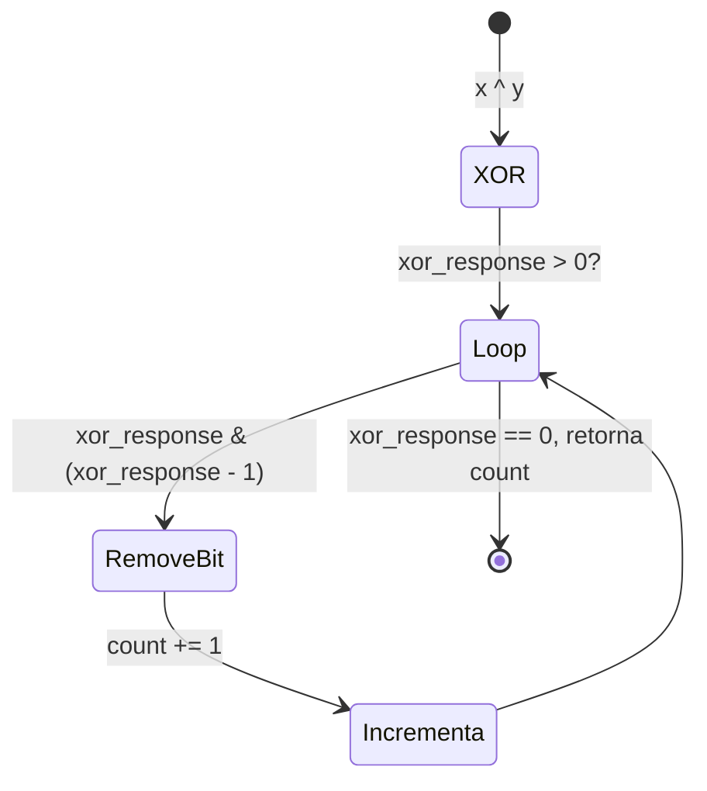
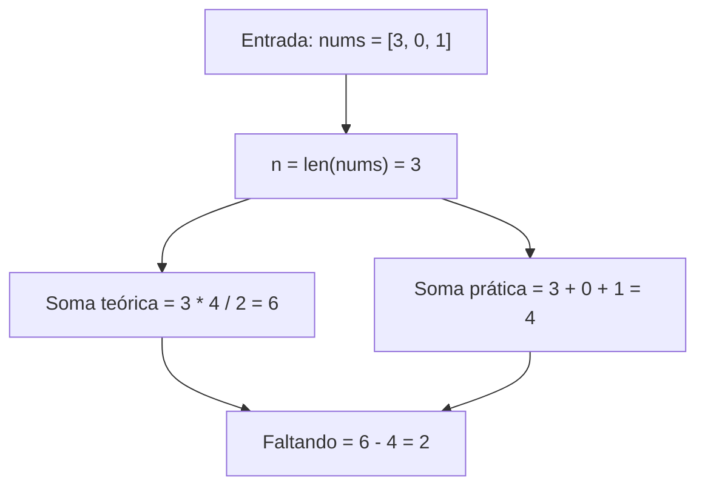
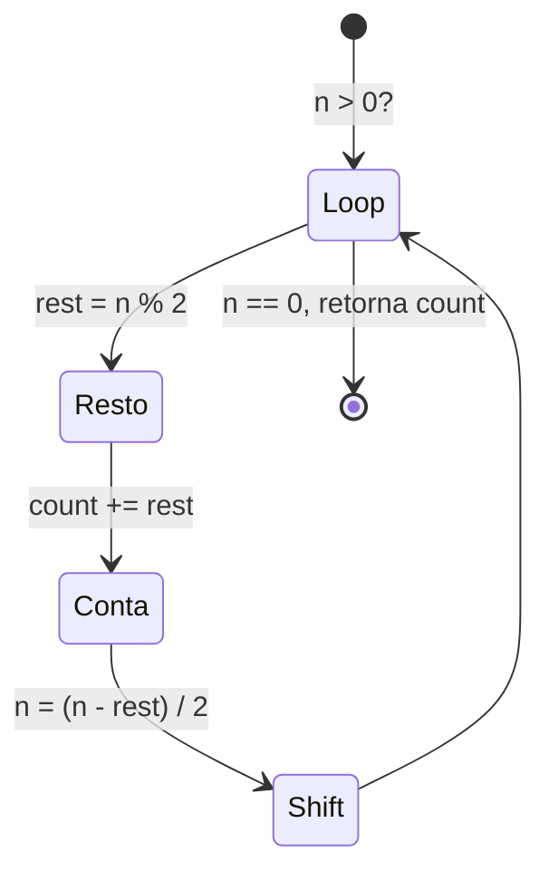
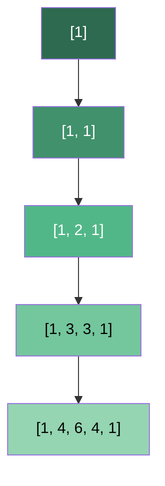
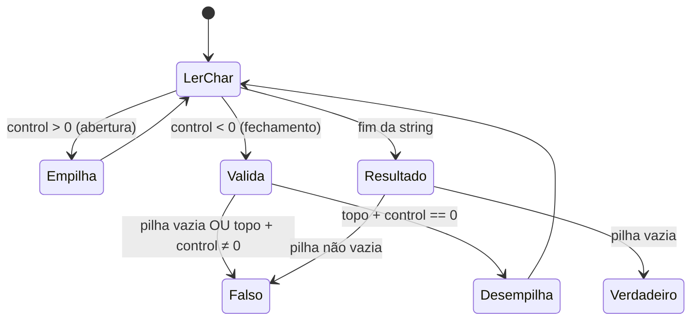

# 📚 Others - Cheat Sheet de Flashcards

---

### 📌 Hamming Distance (`hamming_Distance.py`)
* **LeetCode:** [#461 — Easy](https://leetcode.com/problems/hamming-distance/) | Tópicos: Bit Manipulation
* **Descrição breve:** A distância de Hamming entre dois inteiros é o número de posições em que os bits correspondentes são diferentes. Dados dois inteiros `x` e `y`, retorne a distância de Hamming entre eles.
* **Constraints:** `0 <= x, y <= 2³¹ - 1`
* **Exemplos:**
  - `x = 1, y = 4` → Saída: `2` (em binário: `0001` vs `0100`, diferem em 2 posições)
  - `x = 3, y = 1` → Saída: `1`
* **Problema relacionado:** Equivalente ao LeetCode #2220 (Minimum Bit Flips to Convert Number).
* **💡 Sacada (O Pulo do Gato):**
> Primeiro, aplica-se XOR (`x ^ y`) para isolar apenas os bits que diferem. Depois, conta-se quantos bits `1` sobraram usando o truque de Brian Kernighan: `n & (n - 1)` remove o bit `1` menos significativo a cada iteração. A cada remoção, incrementa-se o contador.
* **🧠 Modelo Mental:**

* **Complexidade esperada:** ⏱️ Tempo $O(k)$ onde $k$ é o número de bits `1` no XOR | 💾 Espaço $O(1)$.
* **Edge cases (Casos de Borda):**
  - `x == y`: XOR resulta 0, retorna 0 imediatamente.
  - Um dos valores é 0: a distância é o número de bits `1` do outro valor.
* **Core snippet:**
```python
xor_response = x ^ y
count = 0
while xor_response > 0:
    xor_response = xor_response & (xor_response - 1)
    count += 1
return count
```

---

### 📌 Missing Number (`missing_number.py`)
* **LeetCode:** [#268 — Easy](https://leetcode.com/problems/missing-number/) | Tópicos: Array, Math, Bit Manipulation
* **Descrição breve:** Dado um array `nums` contendo `n` números distintos no intervalo `[0, n]`, retorne o único número nesse intervalo que está faltando no array.
* **Constraints:** `n == nums.length` · `1 <= n <= 10⁴` · `0 <= nums[i] <= n` · Todos os valores são únicos.
* **Exemplos:**
  - `nums = [3, 0, 1]` → Saída: `2` (intervalo [0,3], falta o 2)
  - `nums = [0, 1]` → Saída: `2` (intervalo [0,2], falta o 2)
  - `nums = [9,6,4,2,3,5,7,0,1]` → Saída: `8` (intervalo [0,9], falta o 8)
* **Follow-up:** Você consegue implementar uma solução com complexidade $O(1)$ de espaço extra e $O(n)$ de tempo?
* **💡 Sacada (O Pulo do Gato):**
> Sabendo que a soma teórica de `0` a `n` é `n * (n + 1) / 2`, basta calcular a soma real do array e subtrair da teórica. A diferença é o número ausente. Sem necessidade de ordenação ou hashset.
* **🧠 Modelo Mental:**

* **Complexidade esperada:** ⏱️ Tempo $O(n)$ | 💾 Espaço $O(1)$.
* **Edge cases (Casos de Borda):**
  - Array com um único elemento `[0]`: falta o 1. `[1]`: falta o 0.
  - O número que falta é o próprio `n` (último do intervalo).
* **Core snippet:**
```python
n = len(nums)
theorical_sum = n * (n + 1) // 2
practical_sum = sum(nums)
return theorical_sum - practical_sum
```

---

### 📌 Number of 1 Bits (`number_of_one_bits.py`)
* **LeetCode:** [#191 — Easy](https://leetcode.com/problems/number-of-1-bits/) | Tópicos: Bit Manipulation, Divide and Conquer
* **Descrição breve:** Escreva uma função que receba a representação binária de um inteiro sem sinal e retorne o número de bits setados (bits `1`) que ele possui — valor também conhecido como _Hamming Weight_.
* **Constraints:** A entrada é um inteiro de 32 bits sem sinal, com valores entre `1` e `2³¹ - 1`.
* **Exemplos:**
  - `n = 11` (binário: `1011`) → Saída: `3`
  - `n = 128` (binário: `10000000`) → Saída: `1`
  - `n = 2147483645` (binário: `1111...101`, 31 bits) → Saída: `30`
* **Follow-up:** Se essa função for chamada muitas vezes, como você a otimizaria?
* **💡 Sacada (O Pulo do Gato):**
> Usa o algoritmo clássico de divisões sucessivas por 2. A cada iteração, o resto da divisão por 2 indica se o bit menos significativo é `1`. Soma-se o resto ao contador, subtrai o resto e divide por 2 para processar o próximo bit.
* **🧠 Modelo Mental:**

* **Complexidade esperada:** ⏱️ Tempo $O(\log n)$ (número de bits) | 💾 Espaço $O(1)$.
* **Edge cases (Casos de Borda):**
  - `n = 0`: o loop não executa, retorna 0.
  - `n` com todos os 32 bits setados (ex: 2³¹ - 1): processa todos os bits corretamente.
* **Core snippet:**
```python
count = 0
while n > 0:
    rest = n % 2
    count += rest
    n -= rest
    n = n // 2
return count
```

---

### 📌 Pascal's Triangle (`pascal_triangule.py`)
* **LeetCode:** [#118 — Easy](https://leetcode.com/problems/pascals-triangle/) | Tópicos: Array, Dynamic Programming
* **Descrição breve:** Dado um inteiro `numRows`, retorne as primeiras `numRows` linhas do Triângulo de Pascal. No Triângulo de Pascal, cada número é a soma dos dois números diretamente acima dele.
* **Constraints:** `1 <= numRows <= 30`
* **Exemplos:**
  - `numRows = 5` → Saída: `[[1],[1,1],[1,2,1],[1,3,3,1],[1,4,6,4,1]]`
  - `numRows = 1` → Saída: `[[1]]`
* **💡 Sacada (O Pulo do Gato):**
> Construção iterativa, linha a linha. Cada nova linha começa e termina com `1`. Os elementos do meio são calculados somando pares adjacentes da linha anterior (`row[idx] + row[idx + 1]`). Basta manter referência à última linha gerada.
* **🧠 Modelo Mental:**

* **Complexidade esperada:** ⏱️ Tempo $O(n^2)$ | 💾 Espaço $O(n^2)$ (armazenar todas as linhas).
* **Edge cases (Casos de Borda):**
  - `numRows = 1`: retorna `[[1]]` diretamente (o loop não executa).
  - O loop interno (`range(len(row)-1)`) não executa quando a linha anterior tem apenas 1 elemento.
* **Core snippet:**
```python
response = [[1]]
for _ in range(numRows - 1):
    row = response[-1]
    new_row = [1]
    for idx in range(len(row) - 1):
        new_row.append(row[idx] + row[idx + 1])
    new_row.append(1)
    response.append(new_row)
return response
```

---

### 📌 Valid Parentheses (`valid_parentheses.py`)
* **LeetCode:** [#20 — Easy](https://leetcode.com/problems/valid-parentheses/) | Tópicos: String, Stack
* **Descrição breve:** Dada uma string `s` contendo apenas os caracteres `'('`, `')'`, `'{'`, `'}'`, `'['` e `']'`, determine se a string de entrada é válida. Uma string é válida se: (1) cada abertura é fechada pelo mesmo tipo de colchete; (2) as aberturas são fechadas na ordem correta; (3) cada fechamento tem uma abertura correspondente do mesmo tipo.
* **Constraints:** `1 <= s.length <= 10⁴` · `s` consiste apenas de parênteses `()[]{}`.
* **Exemplos:**
  - `s = "()"` → Saída: `true`
  - `s = "()[]{}"` → Saída: `true`
  - `s = "(]"` → Saída: `false`
* **💡 Sacada (O Pulo do Gato):**
> Usa uma pilha (stack). Mapeia cada tipo de abertura para um valor positivo (1, 2, 3) e cada fechamento para o negativo correspondente (-1, -2, -3). Aberturas são empilhadas livremente. Para fechar, o topo da pilha somado ao valor de fechamento deve ser 0 — garantindo que fecha o mesmo tipo que abriu.
* **🧠 Modelo Mental:**

* **Complexidade esperada:** ⏱️ Tempo $O(n)$ | 💾 Espaço $O(n)$ (pilha no pior caso).
* **Edge cases (Casos de Borda):**
  - String vazia: retorna `True` (pilha permanece vazia).
  - Apenas fechamentos (ex: `])`): pilha vazia ao tentar fechar, retorna `False`.
  - Intercalados incorretamente (ex: `([)]`): soma com topo não zera, retorna `False`.
* **Core snippet:**
```python
stack = []
size = 0
for idx, value in enumerate(s):
    control = 0
    match value:
        case '(': control = 1
        case '[': control = 2
        case '{': control = 3
        case ')': control = -1
        case ']': control = -2
        case '}': control = -3
    if control > 0:
        stack.append(control)
        size += 1
    elif control < 0:
        if size == 0:
            return False
        if stack[-1] + control != 0:
            return False
        else:
            stack.pop()
            size -= 1
return size == 0
```
