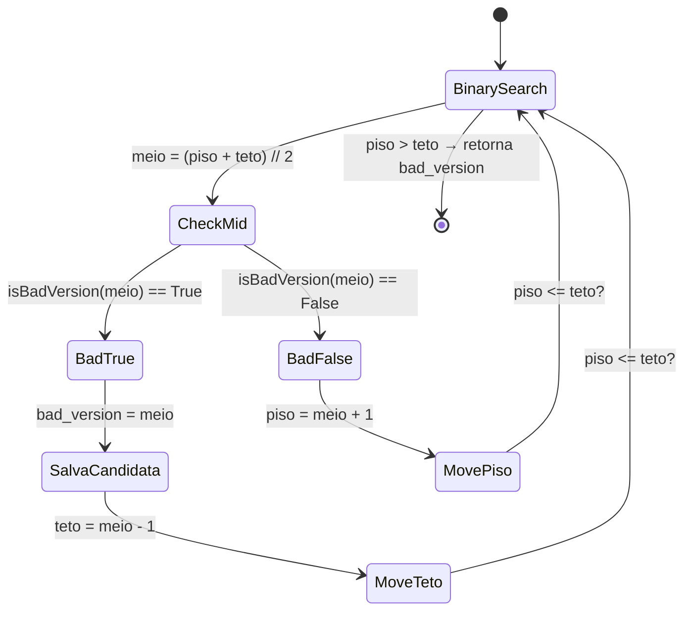
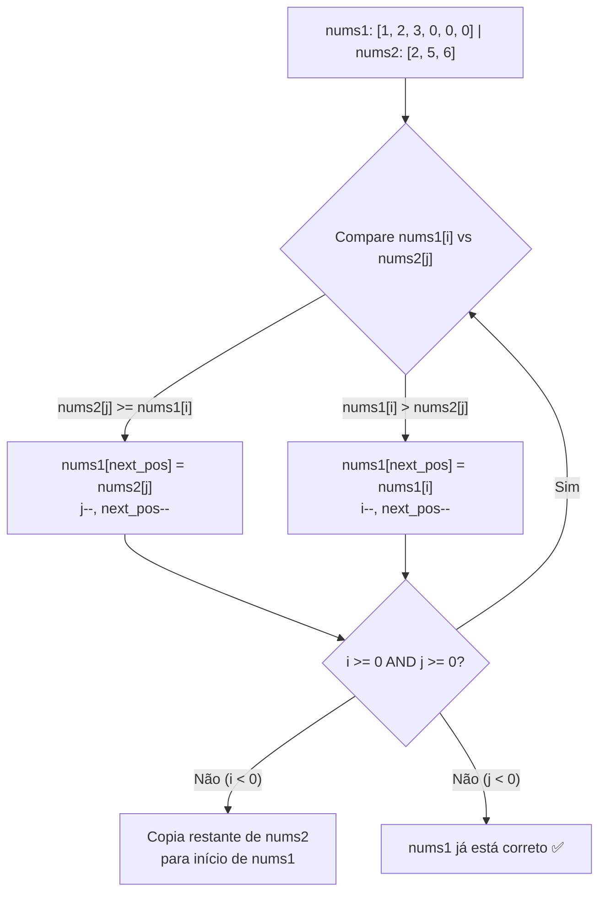

# 🔍 Sorting & Searching — Cheat Sheet de Flashcards

---

### 📌 278. First Bad Version (`is_bad_version.py`) — Easy
* **Descrição breve:** Você é um gerente de produto liderando uma equipe que desenvolve um novo produto. Infelizmente, a versão mais recente falhou no teste de qualidade. Como cada versão é desenvolvida com base na anterior, **todas as versões após uma versão defeituosa também são defeituosas**. Dado `n` versões `[1, 2, ..., n]`, você quer descobrir a primeira versão defeituosa (que causa a falha de todas as seguintes). Você tem acesso a uma API `bool isBadVersion(version)` que retorna se a versão é defeituosa. Implemente uma função que encontre a **primeira versão defeituosa**, **minimizando o número de chamadas à API**.
* **Exemplos:**
  - `n = 5, bad = 4` → Saída: `4`. Explicação: `isBadVersion(3) → false`, `isBadVersion(5) → true`, `isBadVersion(4) → true` → 4 é a primeira versão defeituosa.
  - `n = 1, bad = 1` → Saída: `1`.
* **Constraints:**
  - `1 <= bad <= n <= 2³¹ - 1`
* **Tags:** Binary Search, Interactive
* **💡 Sacada (O Pulo do Gato):**
  > Binary Search clássico. Se `meio` é "bad", a resposta está à esquerda (inclusive `meio`), então salva `meio` como candidato e continua buscando à esquerda. Se não é "bad", a resposta está à direita. A variável `bad_version` guarda o melhor candidato encontrado até o momento.
* **🧠 Modelo Mental:**

* **Complexidade esperada:** ⏱️ Tempo $O(\log n)$ | 💾 Espaço $O(1)$.
* **Edge cases (Casos de Borda):**
  - `n = 1` → a única versão é a resposta (testado diretamente).
  - Primeira versão já é "bad" → o loop empurra `teto` até 0 e `bad_version` permanece 1.
  - Última versão é a primeira "bad" → `piso` sobe até `n` e `bad_version` é setado na última iteração.
* **Core snippet:**
```python
def firstBadVersion(self, n: int) -> int:
    teto = n
    piso = 1
    bad_version = teto
    while teto >= piso:
        meio = (teto + piso) // 2
        if isBadVersion(meio):
            teto = meio - 1
            bad_version = meio
        else:
            piso = meio + 1
    return bad_version
```

---

### 📌 88. Merge Sorted Array (`merge_sorted_array.py`) — Easy
* **Descrição breve:** Dados dois arrays de inteiros `nums1` e `nums2`, ambos ordenados em **ordem não-decrescente**, e dois inteiros `m` e `n` representando o número de elementos em `nums1` e `nums2` respectivamente, mescle `nums1` e `nums2` em um **único array ordenado em ordem não-decrescente**. O array final **não deve ser retornado** pela função — deve ser armazenado **dentro de `nums1`**. Para acomodar isso, `nums1` tem tamanho `m + n`, onde os primeiros `m` elementos são os que devem ser mesclados e os últimos `n` elementos são `0` e devem ser ignorados. `nums2` tem tamanho `n`.
* **Exemplos:**
  - `nums1 = [1,2,3,0,0,0], m = 3, nums2 = [2,5,6], n = 3` → Saída: `[1,2,2,3,5,6]`. Os arrays mesclados são `[1,2,3]` e `[2,5,6]`.
  - `nums1 = [1], m = 1, nums2 = [], n = 0` → Saída: `[1]`. Os arrays mesclados são `[1]` e `[]`.
  - `nums1 = [0], m = 0, nums2 = [1], n = 1` → Saída: `[1]`. Como `m = 0`, não há elementos em `nums1`. O `0` existe apenas para garantir espaço para o resultado.
* **Constraints:**
  - `nums1.length == m + n`
  - `nums2.length == n`
  - `0 <= m, n <= 200`
  - `1 <= m + n <= 200`
  - `-10⁹ <= nums1[i], nums2[j] <= 10⁹`
* **Follow-up:** Você consegue criar um algoritmo que rode em tempo `O(m + n)`?
* **Tags:** Array, Two Pointers, Sorting
* **💡 Sacada (O Pulo do Gato):**
  > Preencher de trás para frente! Usando três ponteiros — `i` no fim dos dados válidos de `nums1`, `j` no fim de `nums2` e `next_pos` no fim total de `nums1` — você sempre coloca o maior elemento na posição correta sem sobrescrever dados ainda não processados. Se `nums1` se esgota antes, basta copiar o restante de `nums2` nas posições iniciais.
* **🧠 Modelo Mental:**

* **Complexidade esperada:** ⏱️ Tempo $O(m + n)$ | 💾 Espaço $O(1)$.
* **Edge cases (Casos de Borda):**
  - `nums2` vazio (`n = 0`) → nada a fazer, `nums1` já está correto.
  - `nums1` sem elementos válidos (`m = 0`) → apenas copia `nums2` inteiro.
  - Todos os elementos de `nums2` são menores que os de `nums1` → o loop consome `nums1` primeiro, depois o `for` final copia `nums2` para o início.
* **Core snippet:**
```python
def merge(self, nums1: list[int], m: int, nums2: list[int], n: int) -> None:
    i = m - 1
    j = n - 1
    next_pos = len(nums1) - 1
    while i >= 0 and j >= 0:
        if nums1[i] <= nums2[j]:
            nums1[next_pos] = nums2[j]
            next_pos -= 1
            j -= 1
        else:
            nums1[next_pos] = nums1[i]
            next_pos -= 1
            i -= 1
    if i <= 0:
        for k in range(j + 1):
            nums1[k] = nums2[k]
```
