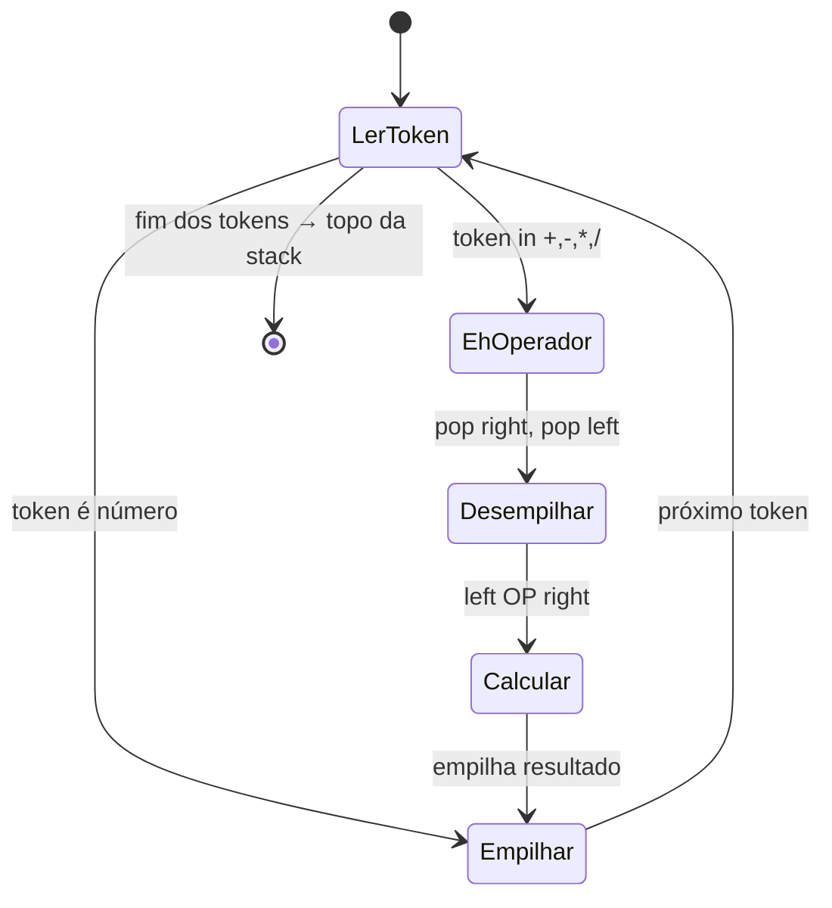
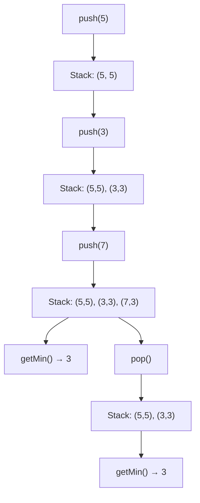
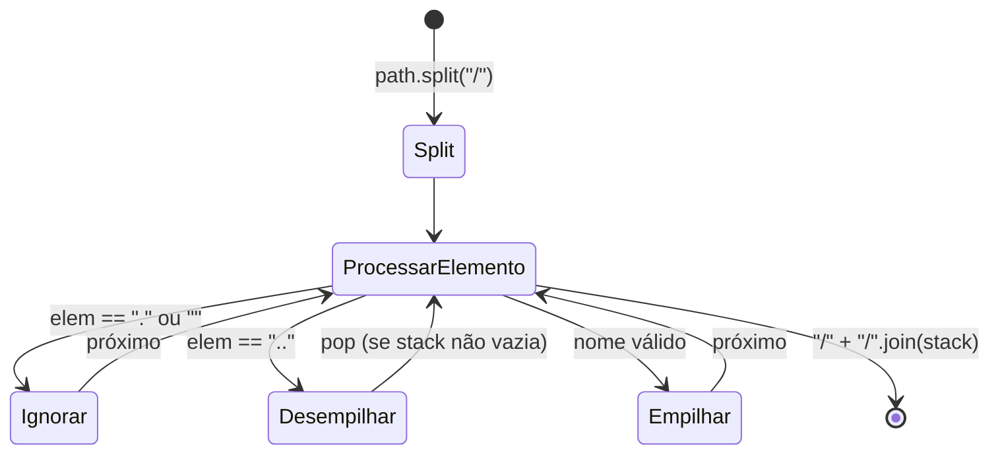

# 🗂️ Stack — Cheat Sheet de Revisão

---

### 📌 Evaluate Reverse Polish Notation (`evaluate-reverse-polish-notation.py`)
* **LeetCode:** [150. Evaluate Reverse Polish Notation](https://leetcode.com/problems/evaluate-reverse-polish-notation/) — **Medium**
* **Descrição do problema:** Você recebe um array de strings `tokens` que representa uma expressão aritmética em **Notação Polonesa Reversa (RPN)**. Avalie a expressão e retorne um inteiro com o resultado. Os operadores válidos são `+`, `-`, `*` e `/`. Cada operando pode ser um inteiro ou o resultado de outra operação. A divisão entre dois inteiros deve **truncar em direção a zero** (e não fazer floor). A entrada sempre forma uma expressão RPN válida, não haverá divisão por zero, e o resultado sempre cabe em um inteiro de 32 bits. Constraints: `1 <= tokens.length <= 10⁴`, cada token é um operador ou um inteiro no intervalo `[-200, 200]`.
  - **Exemplo 1:** `tokens = ["2","1","+","3","*"]` → Saída: `9` — Explicação: `((2 + 1) * 3) = 9`
  - **Exemplo 2:** `tokens = ["4","13","5","/","+"]` → Saída: `6` — Explicação: `(4 + (13 / 5)) = 6`
  - **Exemplo 3:** `tokens = ["10","6","9","3","+","-11","*","/","*","17","+","5","+"]` → Saída: `22`
* **💡 Sacada (O Pulo do Gato):**
  > Em RPN, os operandos vêm antes dos operadores. Basta usar uma stack: ao encontrar um número, empilha; ao encontrar um operador, desempilha os dois últimos (respeitando a ordem `left` e `right`), aplica a operação e empilha o resultado. **Cuidado especial com a divisão inteira em Python:** `//` trunca para baixo (floor division), mas o LeetCode espera truncamento em direção a zero. A correção é: se o resultado for negativo e houver resto, soma 1.
* **🧠 Modelo Mental:**

* **Complexidade esperada:** ⏱️ Tempo $O(n)$ | 💾 Espaço $O(n)$
* **Edge cases (Casos de Borda):**
  - Divisão com truncamento para zero (ex: `6 / -132` deve dar `0`, não `-1`). Tratado pelo ajuste `+1` quando o resultado é negativo e há resto.
  - Expressão com um único número: a stack retorna diretamente o valor.
* **Core snippet:**
```python
def evalRPN(self, tokens: List[str]) -> int:
    stack = []
    for token in tokens:
        if token == '+':
            right, left = int(stack.pop()), int(stack.pop())
            stack.append(left + right)
        elif token == '-':
            right, left = int(stack.pop()), int(stack.pop())
            stack.append(left - right)
        elif token == '*':
            right, left = int(stack.pop()), int(stack.pop())
            stack.append(left * right)
        elif token == '/':
            right, left = int(stack.pop()), int(stack.pop())
            stack.append(left // right)
            if stack[-1] < 0 and left % right != 0:
                stack[-1] += 1
        else:
            stack.append(token)
    return int(stack[-1])
```

---

### 📌 Min Stack (`min_stack.py`)
* **LeetCode:** [155. Min Stack](https://leetcode.com/problems/min-stack/) — **Medium**
* **Descrição do problema:** Projete uma stack que suporte as operações `push`, `pop`, `top` e recuperar o elemento mínimo, **todas em tempo O(1)**. Implemente a classe `MinStack` com os seguintes métodos: `MinStack()` inicializa o objeto; `void push(int val)` empilha `val`; `void pop()` remove o elemento do topo; `int top()` retorna o elemento do topo; `int getMin()` retorna o menor elemento da stack. Constraints: `-2³¹ <= val <= 2³¹ - 1`, no máximo `3 × 10⁴` chamadas serão feitas, e `pop`, `top` e `getMin` sempre serão chamados em stacks não vazias.
  - **Exemplo:** `["MinStack","push","push","push","getMin","pop","top","getMin"]` com args `[[],[-2],[0],[-3],[],[],[],[]]` → Saída: `[null,null,null,null,-3,null,0,-2]` — Explicação: Após empilhar -2, 0 e -3, o mínimo é -3. Após `pop()` (remove -3), o topo é 0 e o mínimo volta a ser -2.
* **💡 Sacada (O Pulo do Gato):**
  > Armazene cada elemento como uma **tupla `(valor, mínimo_atual)`**. A cada `push`, calcula-se o novo mínimo comparando o valor atual com o mínimo do topo. Assim, `getMin()` é simplesmente consultar o segundo elemento da tupla no topo da stack. No `pop`, o mínimo é restaurado automaticamente pela tupla do novo topo.
* **🧠 Modelo Mental:**

* **Complexidade esperada:** ⏱️ Tempo $O(1)$ por operação | 💾 Espaço $O(n)$
* **Edge cases (Casos de Borda):**
  - `pop` até a stack ficar vazia: o `min_value` é resetado para `None`.
  - Múltiplos valores iguais ao mínimo empilhados: cada tupla carrega seu próprio snapshot do mínimo, então desempilhar um deles não corrompe o estado.
* **Core snippet:**
```python
class MinStack:
    def __init__(self):
        self.stack = []
        self.min_value = None

    def push(self, val: int) -> None:
        if self.min_value is None or val < self.min_value:
            self.min_value = val
        self.stack.append((val, self.min_value))

    def pop(self) -> None:
        self.stack.pop()
        if self.stack:
            self.min_value = self.stack[-1][1]
        else:
            self.min_value = None

    def top(self) -> int:
        return self.stack[-1][0]

    def getMin(self) -> int:
        return self.stack[-1][1]
```

---

### 📌 Simplify Path (`simplify_path.py`)
* **LeetCode:** [71. Simplify Path](https://leetcode.com/problems/simplify-path/) — **Medium**
* **Descrição do problema:** Você recebe um caminho absoluto para um sistema de arquivos Unix (sempre começa com `'/'`). Sua tarefa é transformá-lo no **caminho canônico simplificado**. As regras do sistema Unix são: `'.'` representa o diretório atual; `'..'` representa o diretório pai; múltiplas barras consecutivas (`'//'`, `'///'`) são tratadas como uma única `'/'`; qualquer sequência de pontos diferente de `.` e `..` (como `'...'`, `'....'`) é um nome válido de diretório. O caminho canônico deve: começar com `'/'`, separar diretórios com exatamente uma `'/'`, não terminar com `'/'` (exceto a raiz), e não conter `.` ou `..`. Constraints: `1 <= path.length <= 3000`, `path` consiste de letras, dígitos, `.`, `/` ou `_`.
  - **Exemplo 1:** `path = "/home/"` → Saída: `"/home"` — A barra final é removida.
  - **Exemplo 2:** `path = "/home//foo/"` → Saída: `"/home/foo"` — Barras consecutivas viram uma só.
  - **Exemplo 3:** `path = "/home/user/Documents/../Pictures"` → Saída: `"/home/user/Pictures"` — `..` sobe um diretório.
  - **Exemplo 4:** `path = "/../"` → Saída: `"/"` — Não é possível subir além da raiz.
  - **Exemplo 5:** `path = "/.../a/../b/c/../d/./"` → Saída: `"/.../b/d"` — `...` é um nome válido de diretório.
* **💡 Sacada (O Pulo do Gato):**
  > Faça `split('/')` no path e use uma **lista como pilha**: `..` desempilha (volta um diretório), `.` e strings vazias (barras duplas) são ignorados, e qualquer outro nome é empilhado. No final, junte tudo com `'/'` e prefixe com `'/'`. Uma lista em Python **é** uma pilha (`append`/`pop`).
* **🧠 Modelo Mental:**

* **Complexidade esperada:** ⏱️ Tempo $O(n)$ | 💾 Espaço $O(n)$
* **Edge cases (Casos de Borda):**
  - `..` no diretório raiz: não desempilha (a stack já está vazia, simplesmente ignora).
  - Barras consecutivas (`//`): o `split('/')` gera strings vazias que são corretamente ignoradas.
  - Nomes com pontos como `...` são tratados como nomes de diretório válidos (não são `.` nem `..`).
* **Core snippet:**
```python
def simplifyPath(self, path: str) -> str:
    path = path.split('/')
    stack = []
    for element in path:
        if element == '..':
            if stack:
                stack.pop()
        elif element == '.' or element == '':
            continue
        else:
            stack.append(element)
    return '/' + '/'.join(stack)
```
