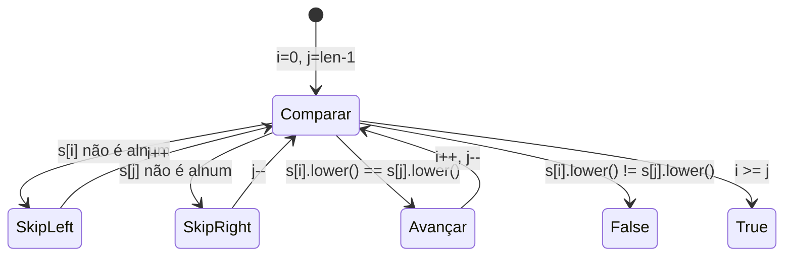
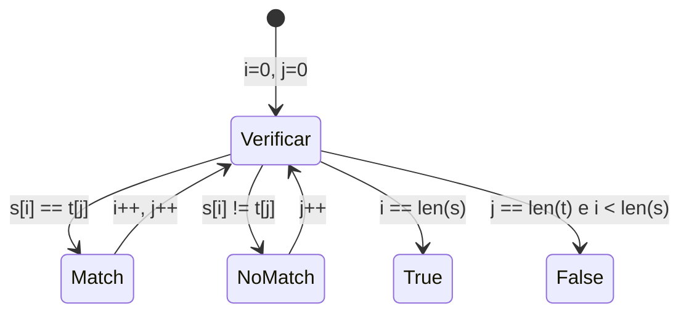
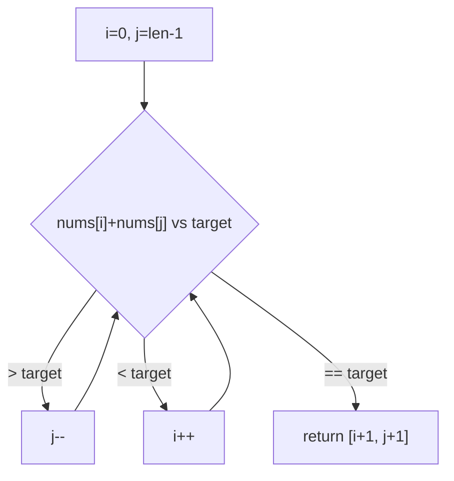
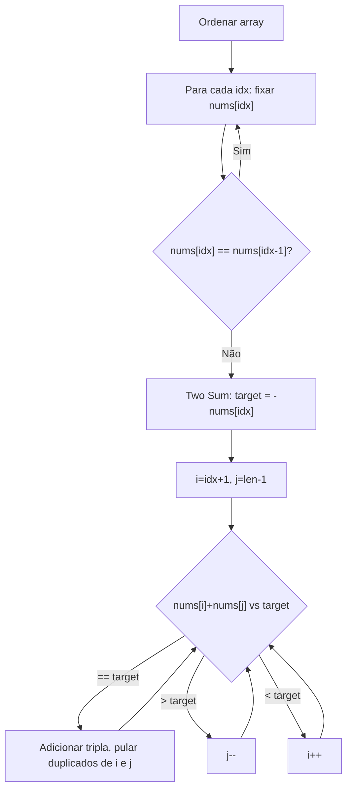
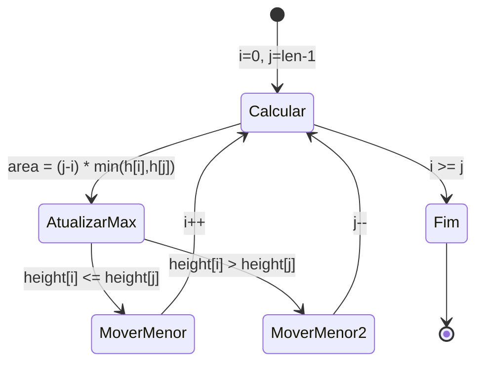

# 🎯 Two Pointers — Cheat Sheet de Revisão

---

### 📌 Valid Palindrome (`is_palindrome.py`) — [LeetCode #125](https://leetcode.com/problems/valid-palindrome/) · Easy
* **Enunciado oficial:** Uma frase é um **palíndromo** se, após converter todas as letras maiúsculas em minúsculas e remover todos os caracteres não-alfanuméricos, ela se lê da mesma forma de frente para trás e de trás para frente. Caracteres alfanuméricos incluem letras e números. Dada uma string `s`, retorne `true` se ela é um palíndromo, ou `false` caso contrário.
  - **Input:** Uma string `s` composta apenas de caracteres ASCII imprimíveis (pode conter letras, dígitos, espaços, pontuação, etc.).
  - **Output:** `True` se, após remover tudo que não é alfanumérico e converter para minúsculas, a string lida de frente para trás é igual à lida de trás para frente; `False` caso contrário.
  - **Restrições:** `1 <= s.length <= 2 * 10^5`. A string consiste apenas de caracteres ASCII imprimíveis.
  - **Exemplos:**
    - `s = "A man, a plan, a canal: Panama"` → `true` (filtrado: `"amanaplanacanalpanama"`, que é palíndromo)
    - `s = "race a car"` → `false` (filtrado: `"raceacar"`, que não é palíndromo)
    - `s = " "` → `true` (filtrado: `""`, string vazia é considerada palíndromo)
  - **Intuição:** Em vez de criar uma nova string filtrada (custo $O(n)$ de espaço), usamos dois ponteiros que "pulam" os caracteres inválidos in-place.
* **💡 Sacada (O Pulo do Gato):**
> Dois ponteiros nas extremidades (`i` no início, `j` no final) caminhando para o centro. Quando um ponteiro aponta para um caractere não alfanumérico, simplesmente pula (`continue`) sem mover o outro ponteiro. Compara `s[i].lower()` com `s[j].lower()` para ignorar casing.
* **🧠 Modelo Mental:**

* **Complexidade esperada:** ⏱️ Tempo $O(n)$ | 💾 Espaço $O(1)$.
* **Edge cases (Casos de Borda):**
  - String com apenas caracteres especiais (ex: `",.!"`): retorna `True` (ponteiros se cruzam sem comparar nada).
  - String com 1 caractere: imediatamente `True`.
  - Mix de maiúsculas/minúsculas: tratado pelo `.lower()`.
* **Core snippet:**
```python
def isPalindrome(self, s: str) -> bool:
    i, j = 0, len(s) - 1
    while i < j:
        if not s[i].isalnum():
            i += 1
            continue
        if not s[j].isalnum():
            j -= 1
            continue
        if s[i].lower() != s[j].lower():
            return False
        i += 1
        j -= 1
    return True
```

---

### 📌 Is Subsequence (`is_subsequence.py`) — [LeetCode #392](https://leetcode.com/problems/is-subsequence/) · Easy
* **Enunciado oficial:** Dadas duas strings `s` e `t`, retorne `true` se `s` é uma **subsequência** de `t`, ou `false` caso contrário. Uma subsequência de uma string é uma nova string formada a partir da string original ao deletar alguns (ou nenhum) caracteres **sem alterar a ordem relativa** dos caracteres restantes (por exemplo, `"ace"` é uma subsequência de `"abcde"`, mas `"aec"` não é).
  - **Input:** Duas strings `s` e `t` compostas apenas de letras minúsculas do alfabeto inglês.
  - **Output:** `True` se `s` é subsequência de `t`; `False` caso contrário.
  - **Restrições:** `0 <= s.length <= 100`, `0 <= t.length <= 10^4`. Ambas contêm apenas letras minúsculas do alfabeto inglês.
  - **Exemplos:**
    - `s = "abc"`, `t = "ahbgdc"` → `true` (os caracteres `a`, `b`, `c` aparecem em `t` nessa ordem)
    - `s = "axc"`, `t = "ahbgdc"` → `false` (o caractere `x` não é encontrado entre `a` e `c` em `t`)
  - **Follow-up:** Suponha que existam muitas strings `s` de entrada (digamos `s1, s2, ..., sk` onde `k >= 10^9`) e você queira verificar uma por uma se `t` contém cada uma como subsequência. Como você mudaria seu código? *(Dica: pré-processar `t` com um mapa de posições por caractere + binary search)*
  - **Intuição:** A abordagem gulosa funciona: a cada caractere de `t`, verificamos se ele "consome" o próximo caractere esperado de `s`. Um ponteiro em `s` só avança quando há match, enquanto o ponteiro em `t` avança sempre.
* **💡 Sacada (O Pulo do Gato):**
> Dois ponteiros independentes: `i` percorre `s` e `j` percorre `t`. O ponteiro `i` só avança quando `s[i] == t[j]` (encontrou um match). O ponteiro `j` avança sempre. Se `i` chegar ao fim de `s`, todos os caracteres foram encontrados em ordem.
* **🧠 Modelo Mental:**

* **Complexidade esperada:** ⏱️ Tempo $O(n)$ onde $n = len(t)$ | 💾 Espaço $O(1)$.
* **Edge cases (Casos de Borda):**
  - `s` vazio: sempre `True` (string vazia é subsequência de qualquer string).
  - `t` menor que `s`: imediatamente `False` (não há caracteres suficientes).
  - `s == t`: retorna `True`.
* **Core snippet:**
```python
def isSubsequence(self, s: str, t: str) -> bool:
    i, j = 0, 0
    while i < len(s) and j < len(t):
        if s[i] == t[j]:
            i += 1
        j += 1
    return i == len(s)
```

---

### 📌 Two Sum II - Input Array Is Sorted (`two_sum_already_sorted.py`) — [LeetCode #167](https://leetcode.com/problems/two-sum-ii-input-array-is-sorted/) · Medium
* **Enunciado oficial:** Dado um array de inteiros `numbers` **indexado a partir de 1** que já está **ordenado em ordem não-decrescente**, encontre dois números tais que a soma deles seja igual a um número `target` específico. Sejam esses dois números `numbers[index1]` e `numbers[index2]` onde `1 <= index1 < index2 <= numbers.length`. Retorne os índices dos dois números `index1` e `index2`, cada um incrementado em um, como um array de inteiros `[index1, index2]` de comprimento 2. Os testes são gerados de modo que exista **exatamente uma solução**. Você não pode usar o mesmo elemento duas vezes. Sua solução deve usar apenas **espaço extra constante**.
  - **Input:** Um array ordenado `numbers` e um inteiro `target`.
  - **Output:** Um array `[index1, index2]` com `index1 < index2`, ambos 1-indexed.
  - **Restrições:** `2 <= numbers.length <= 3 * 10^4`, `-1000 <= numbers[i] <= 1000`, `-1000 <= target <= 1000`. `numbers` está ordenado em ordem não-decrescente. Garantido exatamente **uma solução**.
  - **Exemplos:**
    - `numbers = [2,7,11,15]`, `target = 9` → `[1,2]` (a soma de 2 e 7 é 9; portanto index1=1, index2=2)
    - `numbers = [2,3,4]`, `target = 6` → `[1,3]` (a soma de 2 e 4 é 6; portanto index1=1, index2=3)
    - `numbers = [-1,0]`, `target = -1` → `[1,2]` (a soma de -1 e 0 é -1; portanto index1=1, index2=2)
  - **Intuição:** Como o array já está ordenado, dois ponteiros convergindo das extremidades exploram todas as combinações relevantes em $O(n)$, sem necessidade de hash map. A restrição de espaço constante torna a abordagem com hash map inválida.
* **💡 Sacada (O Pulo do Gato):**
> Ponteiros nas extremidades do array ordenado. Se a soma é maior que o target, diminui `j` (precisa de um valor menor). Se é menor, aumenta `i` (precisa de um valor maior). A ordenação garante convergência.
* **🧠 Modelo Mental:**

* **Complexidade esperada:** ⏱️ Tempo $O(n)$ | 💾 Espaço $O(1)$.
* **Edge cases (Casos de Borda):**
  - Garantido ter exatamente uma solução (conforme enunciado).
  - Índices são 1-indexed no retorno.
* **Core snippet:**
```python
def twoSum(self, numbers: List[int], target: int) -> List[int]:
    i, j = 0, len(numbers) - 1
    while i < j:
        if numbers[i] + numbers[j] > target:
            j -= 1
        elif numbers[i] + numbers[j] < target:
            i += 1
        else:
            return [1 + i, 1 + j]
```

---

### 📌 3Sum (`three_sum.py`) — [LeetCode #15](https://leetcode.com/problems/3sum/) · Medium
* **Enunciado oficial:** Dado um array de inteiros `nums`, retorne todas as triplas `[nums[i], nums[j], nums[k]]` tais que `i != j`, `i != k` e `j != k`, e `nums[i] + nums[j] + nums[k] == 0`. Note que o conjunto de soluções **não deve conter triplas duplicadas**.
  - **Input:** Um array de inteiros `nums`.
  - **Output:** Uma lista de listas com todas as triplas únicas que somam zero.
  - **Restrições:** `3 <= nums.length <= 3000`, `-10^5 <= nums[i] <= 10^5`.
  - **Exemplos:**
    - `nums = [-1,0,1,2,-1,-4]` → `[[-1,-1,2],[-1,0,1]]` (as triplas distintas que somam zero)
    - `nums = [0,1,1]` → `[]` (a única tripla possível `[0,1,1]` soma 2, não 0)
    - `nums = [0,0,0]` → `[[0,0,0]]` (a única tripla possível soma 0)
  - **Intuição:** Ordenar o array transforma o problema em uma série de Two Sum com dois ponteiros. O desafio principal é evitar triplas duplicadas: pula-se o elemento fixo quando ele repete, e pula-se ponteiros internos quando seus valores repetem após um match.
* **💡 Sacada (O Pulo do Gato):**
> Ordenar o array e reduzir o problema a múltiplos Two Sum. Para cada elemento `nums[idx]`, buscar pares que somem `-nums[idx]` no subarray à direita usando dois ponteiros. Para evitar triplas duplicadas: (1) pular o elemento fixo se for igual ao anterior, e (2) dentro do Two Sum, pular ponteiros que apontem para valores repetidos após encontrar um match.
* **🧠 Modelo Mental:**

* **Complexidade esperada:** ⏱️ Tempo $O(n^2)$ | 💾 Espaço $O(n)$ (para o sort e resultado).
* **Edge cases (Casos de Borda):**
  - Arrays com muitos elementos duplicados: tratado pelos skips de duplicatas no loop externo e no Two Sum interno.
  - Array com menos de 3 elementos: nenhuma tripla possível.
  - Todos os elementos iguais a zero: `[0, 0, 0]` é a única tripla válida.
* **Core snippet:**
```python
def threeSum(self, nums: List[int]) -> List[List[int]]:
    nums.sort()
    response = []
    for idx in range(len(nums) - 1):
        if idx > 0 and nums[idx] == nums[idx - 1]:
            continue
        # Two Sum com two pointers
        target = -nums[idx]
        i, j = idx + 1, len(nums) - 1
        while i < j:
            if nums[i] + nums[j] == target:
                response.append([nums[idx], nums[i], nums[j]])
                i += 1
                while i < j and nums[i] == nums[i - 1]:
                    i += 1
                j -= 1
                while i < j and nums[j] == nums[j + 1]:
                    j -= 1
            elif nums[i] + nums[j] > target:
                j -= 1
            else:
                i += 1
    return response
```

---

### 📌 Container With Most Water (`two_containers.py`) — [LeetCode #11](https://leetcode.com/problems/container-with-most-water/) · Medium
* **Enunciado oficial:** Você recebe um array de inteiros `height` de comprimento `n`. Existem `n` linhas verticais desenhadas de modo que os dois pontos extremos da `i`-ésima linha estão nas coordenadas `(i, 0)` e `(i, height[i])`. Encontre duas linhas que, juntas com o eixo x, formam um contêiner que armazena a **maior quantidade de água**. Retorne a área máxima de água que o contêiner pode armazenar. Nota: você **não pode inclinar** o contêiner.
  - **Input:** Um array de inteiros `height` representando as alturas das linhas verticais.
  - **Output:** Um inteiro representando a área máxima de água que o contêiner pode armazenar.
  - **Restrições:** `n == height.length`, `2 <= n <= 10^5`, `0 <= height[i] <= 10^4`.
  - **Exemplos:**
    - `height = [1,8,6,2,5,4,8,3,7]` → `49` (as linhas nos índices 1 (altura 8) e 8 (altura 7) formam o contêiner máximo: `min(8,7) × (8-1) = 7 × 7 = 49`)
    - `height = [1,1]` → `1` (única combinação possível: `min(1,1) × (1-0) = 1`)
  - **Intuição:** A área é `largura × min(altura_esq, altura_dir)`. Começando com largura máxima (ponteiros nas extremidades), a cada passo movemos o ponteiro do lado **mais baixo** — mover o mais alto nunca aumentaria a área pois a altura continua limitada pelo menor.
* **💡 Sacada (O Pulo do Gato):**
> Ponteiros nas extremidades maximizam a largura inicial. A cada passo, mover o ponteiro do lado **menor** (quem limita a altura do contêiner), pois mover o lado maior nunca melhora a área — a altura já está limitada pelo menor e a largura diminui.
* **🧠 Modelo Mental:**

* **Complexidade esperada:** ⏱️ Tempo $O(n)$ | 💾 Espaço $O(1)$.
* **Edge cases (Casos de Borda):**
  - Todas as alturas iguais: qualquer par extremo dá a maior área (largura máxima).
  - Array com 2 elementos: única combinação possível.
  - Alturas decrescentes ou crescentes: ponteiros convergem naturalmente.
* **Core snippet:**
```python
def maxArea(self, height: List[int]) -> int:
    max_area = 0
    i, j = 0, len(height) - 1
    while i < j:
        w = j - i
        h = min(height[i], height[j])
        max_area = max(w * h, max_area)
        if height[i] > height[j]:
            j -= 1
        else:
            i += 1
    return max_area
```
