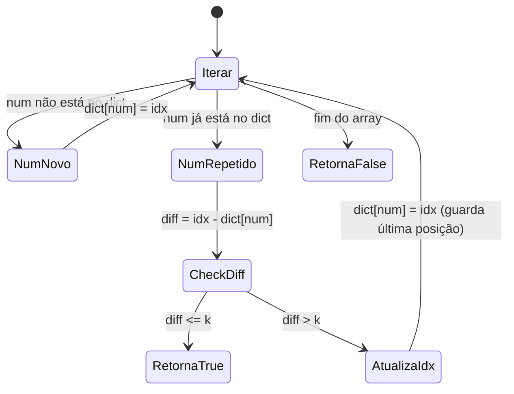
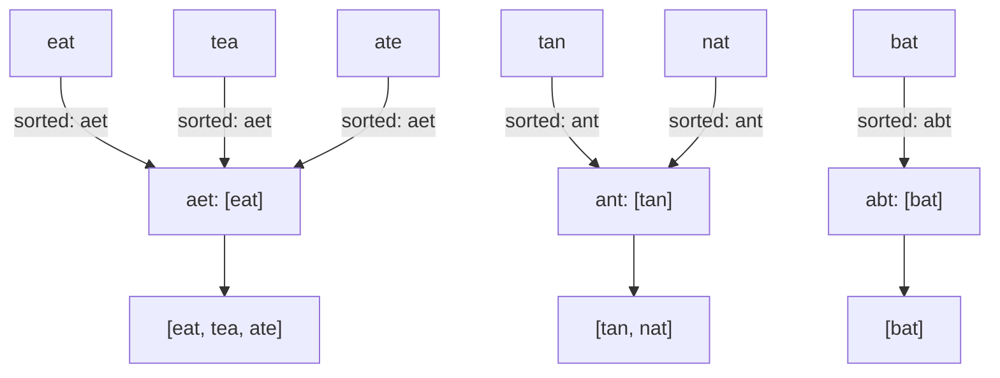

### 📌 Contains Duplicate II (`contains_duplicate.py`)
* **Descrição breve:** *(LeetCode #219 — Easy)* Dado um array de inteiros `nums` e um inteiro `k`, retornar `true` se existem dois índices **distintos** `i` e `j` no array tal que `nums[i] == nums[j]` e `abs(i - j) <= k`.
* **Enunciado detalhado:** O problema pede para verificar se há algum par de elementos duplicados no array cuja distância entre suas posições seja no máximo `k`. Diferente do "Contains Duplicate" clássico (que só pergunta se há duplicata), aqui a duplicata precisa estar **próxima o suficiente** — a diferença absoluta entre os índices não pode exceder `k`. Por exemplo, para `nums = [1,2,3,1]` e `k = 3`, a resposta é `True` porque o valor `1` aparece nos índices `0` e `3`, e `|3 - 0| = 3 <= 3`. Já para `nums = [1,2,3,1,2,3]` e `k = 2`, a resposta é `False` — embora haja duplicatas, nenhuma par está a uma distância `<= 2`. O uso de um hash map (valor → último índice visto) é a abordagem natural para resolvê-lo em tempo linear.
* **Exemplos:**
  - `nums = [1,2,3,1], k = 3` → `true` (valor `1` nos índices 0 e 3, distância = 3)
  - `nums = [1,0,1,1], k = 1` → `true` (valor `1` nos índices 2 e 3, distância = 1)
  - `nums = [1,2,3,1,2,3], k = 2` → `false` (nenhuma duplicata com distância ≤ 2)
* **Restrições:** `1 <= nums.length <= 10⁵` · `-10⁹ <= nums[i] <= 10⁹` · `0 <= k <= 10⁵`
* **Tópicos:** Array, Hash Table, Sliding Window
* **💡 Sacada (O Pulo do Gato):**
> Usar um dicionário para mapear cada número ao seu **último índice** visto. Ao encontrar um número repetido, basta comparar o índice atual com o anterior armazenado. Se a diferença for `<= k`, retorna `True`; caso contrário, atualiza o índice para o atual (guarda a última posição), pois qualquer índice anterior seria ainda mais distante de futuros encontros.
* **🧠 Modelo Mental:**

* **Complexidade esperada:** ⏱️ Tempo $O(n)$ | 💾 Espaço $O(n)$.
* **Edge cases (Casos de Borda):**
  - **Array sem duplicatas:** o dicionário nunca encontra colisão, retorna `False`.
  - **`k = 0`:** só retorna `True` se existirem duplicatas no mesmo índice (impossível), logo sempre `False`.
  - **Múltiplas ocorrências do mesmo número:** ao atualizar sempre para o último índice, garante que a menor distância possível é testada contra o próximo encontro.
* **Core snippet:**
```python
def containsNearbyDuplicate(self, nums: List[int], k: int) -> bool:
    dict_compare = {}
    for idx, num in enumerate(nums):
        if num not in dict_compare:
            dict_compare[num] = idx
        else:
            diff = idx - dict_compare[num]
            if diff <= k:
                return True
            else:
                dict_compare[num] = idx
    return False
```

---

### 📌 Group Anagrams (`group_anagrams.py`)
* **Descrição breve:** *(LeetCode #49 — Medium)* Dado um array de strings `strs`, agrupar os **anagramas** juntos. A resposta pode ser retornada em qualquer ordem. Um anagrama é uma palavra ou frase formada pelo rearranjo das letras de outra palavra ou frase, usando todas as letras originais exatamente uma vez.
* **Enunciado detalhado:** O problema pede para receber uma lista de strings e devolver uma lista de listas, onde cada sublista contém todas as strings que são anagramas entre si. Duas strings são anagramas se possuem exatamente os mesmos caracteres com as mesmas frequências — por exemplo, `"eat"`, `"tea"` e `"ate"` são todas anagramas entre si. A ordem dos grupos na saída e a ordem dos elementos dentro de cada grupo não importam. O desafio central é encontrar uma **chave canônica** que identifique de forma única cada grupo de anagramas — a abordagem mais comum é ordenar cada string e usar o resultado como chave de um dicionário, agrupando todas as palavras que compartilham a mesma assinatura ordenada. Uma alternativa é usar a contagem de frequência de caracteres como tupla-chave.
* **Exemplos:**
  - `strs = ["eat","tea","tan","ate","nat","bat"]` → `[["bat"],["nat","tan"],["ate","eat","tea"]]`
  - `strs = [""]` → `[[""]]`
  - `strs = ["a"]` → `[["a"]]`
* **Restrições:** `1 <= strs.length <= 10⁴` · `0 <= strs[i].length <= 100` · `strs[i]` contém apenas letras minúsculas do inglês (`a-z`)
* **Tópicos:** Array, Hash Table, String, Sorting
* **💡 Sacada (O Pulo do Gato):**
> Duas palavras são anagramas se, quando **ordenadas**, produzem a mesma string. Usar a versão ordenada da palavra como **chave do dicionário** (`Ordenado: [desordenado]`). Cada chave mapeia para a lista de palavras originais que compartilham aquela mesma assinatura ordenada.
* **🧠 Modelo Mental:**

* **Complexidade esperada:** ⏱️ Tempo $O(n \cdot m \log m)$ onde `n` = número de strings e `m` = comprimento máximo de uma string | 💾 Espaço $O(n \cdot m)$.
* **Edge cases (Casos de Borda):**
  - **Lista com string vazia `[""]`:** `sorted("")` retorna `""`, funciona normalmente como chave do dict.
  - **Strings de um único caractere:** cada uma é seu próprio anagrama (a menos que sejam iguais).
  - **Todas as strings iguais:** todas agrupadas sob a mesma chave.
* **Core snippet:**
```python
def groupAnagrams(self, strs: List[str]) -> List[List[str]]:
    response = {}
    for word in strs:
        sorted_word = ''.join(sorted(word))
        if sorted_word not in response:
            response[sorted_word] = []
        response[sorted_word].append(word)
    return list(response.values())
```
