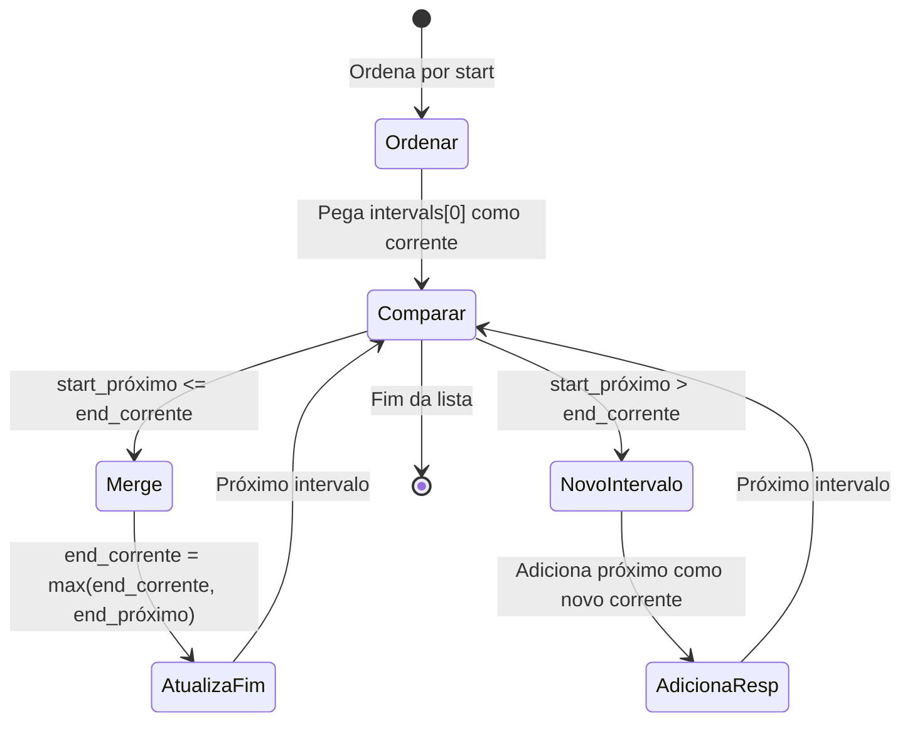
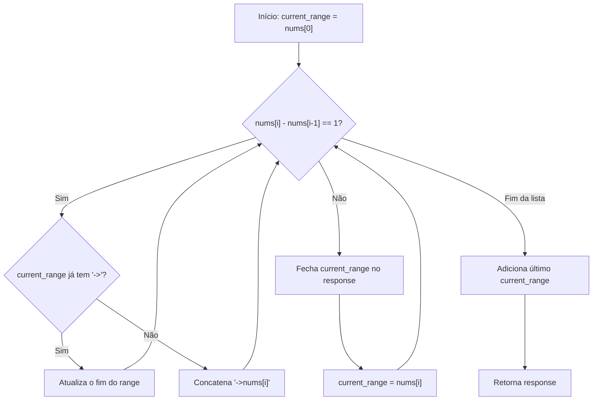

# 🗂️ Intervals — Cheat Sheet de Revisão

---

### 📌 Merge Intervals (`merge_intervals.py`) — [LeetCode 56](https://leetcode.com/problems/merge-intervals/) | Dificuldade: **Medium**
* **Descrição:** Dado um array de intervalos `intervals` onde `intervals[i] = [startᵢ, endᵢ]`, mesclar todos os intervalos que se sobrepõem e retornar um array de intervalos **não-sobrepostos** que cobrem todos os intervalos da entrada. O objetivo é produzir o **menor número possível** de intervalos no resultado. Dois intervalos `[a, b]` e `[c, d]` se sobrepõem se `c ≤ b` (considerando que estão ordenados por início). Endpoints que se "tocam" (ex: `[1,4]` e `[4,5]`) também contam como overlap. Os intervalos de entrada **não** vêm necessariamente ordenados, então a ordenação faz parte da solução.
  - **Exemplo 1:** `intervals = [[1,3],[2,6],[8,10],[15,18]]` → `[[1,6],[8,10],[15,18]]` — `[1,3]` e `[2,6]` se sobrepõem, formando `[1,6]`.
  - **Exemplo 2:** `intervals = [[1,4],[4,5]]` → `[[1,5]]` — intervalos que se "tocam" (`end == start`) também são considerados sobrepostos.
  - **Exemplo 3:** `intervals = [[2,3],[4,5],[6,7],[8,9],[1,10]]` → `[[1,10]]` — um intervalo grande pode englobar todos os outros.
  - **Constraints:** `1 ≤ intervals.length ≤ 10⁴`, `intervals[i].length == 2`, `0 ≤ startᵢ ≤ endᵢ ≤ 10⁴`. Os intervalos **não** vêm necessariamente ordenados.
  - **Tags:** Array, Sorting.
  - **Frequência:** Problema clássico e muito pedido em entrevistas de empresas como Amazon, Google, Microsoft, Facebook, LinkedIn, Apple e Adobe.
* **💡 Sacada (O Pulo do Gato):**
> Ordene os intervalos pelo início (`key=lambda x: x[0]`). Depois, itere mantendo um "intervalo corrente" (o último do resultado). Se o início do próximo intervalo é ≤ o fim do corrente, há overlap — basta atualizar o fim com o `max` dos dois. Caso contrário, o intervalo corrente está fechado e um novo começa. A ordenação garante que, se não houver overlap, nenhum intervalo futuro vai sobrepor também.
* **🧠 Modelo Mental:**

* **Complexidade esperada:** ⏱️ Tempo $O(n \log n)$ (sorting) | 💾 Espaço $O(n)$ (resultado).
* **Edge cases (Casos de Borda):**
  - Um único intervalo → retorna ele mesmo.
  - Todos os intervalos se sobrepõem → retorna um único intervalo merged.
  - Intervalos já ordenados e sem overlap → retorna a lista original.
  - Intervalo contido dentro de outro (ex: `[1,10]` e `[2,3]`) → o `max` no fim garante que o maior fim prevalece.
* **Core snippet:**
```python
def merge(self, intervals: List[List[int]]) -> List[List[int]]:
    intervals = sorted(intervals, key=lambda x: x[0])
    response = [intervals[0]]
    for idx in range(1, len(intervals)):
        if intervals[idx][0] <= response[-1][1]:
            response[-1][1] = max(intervals[idx][1], response[-1][1])
        else:
            response.append(intervals[idx])
    return response
```

---

### 📌 Summary Ranges (`summary_ranges.py`) — [LeetCode 228](https://leetcode.com/problems/summary-ranges/) | Dificuldade: **Easy**
* **Descrição:** Dado um array de inteiros `nums` que é **ordenado em ordem crescente e sem duplicatas**, retornar a **menor lista ordenada de ranges** que cubra exatamente todos os números do array. Cada elemento do array deve ser coberto por **exatamente um** range, e os ranges não devem incluir números ausentes do array. O formato de saída é: `"a->b"` quando o range contém mais de um número (representando todos os inteiros de `a` até `b` inclusive), ou apenas `"a"` quando o range contém um único número isolado. Essencialmente, o problema pede para identificar todas as subsequências consecutivas no array e representá-las de forma compacta.
  - **Exemplo 1:** `nums = [0,1,2,4,5,7]` → `["0->2","4->5","7"]` — `0,1,2` são consecutivos formando `"0->2"`, `4,5` formam `"4->5"`, e `7` fica isolado.
  - **Exemplo 2:** `nums = [0,2,3,4,6,8,9]` → `["0","2->4","6","8->9"]` — gaps entre `0` e `2`, entre `4` e `6`, e entre `6` e `8` separam os ranges.
  - **Exemplo 3:** `nums = []` → `[]` — array vazio retorna lista vazia.
  - **Constraints:** `0 ≤ nums.length ≤ 20`, `-2³¹ ≤ nums[i] ≤ 2³¹ - 1`, todos os valores são **únicos** e o array está **ordenado em ordem crescente**.
  - **Tags:** Array.
  - **Observação:** O tamanho máximo do array é muito pequeno (≤ 20), então qualquer abordagem funciona em termos de performance. O desafio está mais na lógica de formatação da saída.
* **💡 Sacada (O Pulo do Gato):**
> Mantenha uma string `current_range` representando o range sendo construído. Enquanto os números forem consecutivos (`nums[i] - nums[i-1] == 1`), expanda o range atualizando o final. Quando a sequência quebra, feche o range atual, adicione-o ao resultado e inicie um novo. A checagem de `->` na string determina se já é um range ou um número isolado.
* **🧠 Modelo Mental:**

* **Complexidade esperada:** ⏱️ Tempo $O(n)$ | 💾 Espaço $O(n)$ (resultado).
* **Edge cases (Casos de Borda):**
  - Array vazio → retorna `[]` (tratado explicitamente no início).
  - Array com um único elemento → retorna `["a"]`.
  - Todos consecutivos → retorna um único range `"a->z"`.
  - Nenhum consecutivo → retorna cada número como range individual.
* **Core snippet:**
```python
def summaryRanges(self, nums: List[int]) -> List[str]:
    if len(nums) == 0:
        return []
    response = []
    current_range = f"{nums[0]}"
    for idx in range(1, len(nums)):
        if nums[idx] - nums[idx-1] == 1:
            if '>' in current_range:
                range_list = current_range.split('->')
                range_list[-1] = str(nums[idx])
                current_range = '->'.join(range_list)
            else:
                current_range += f"->{str(nums[idx])}"
        else:
            response.append(current_range)
            current_range = f"{nums[idx]}"
    response.append(current_range)
    return response
```
