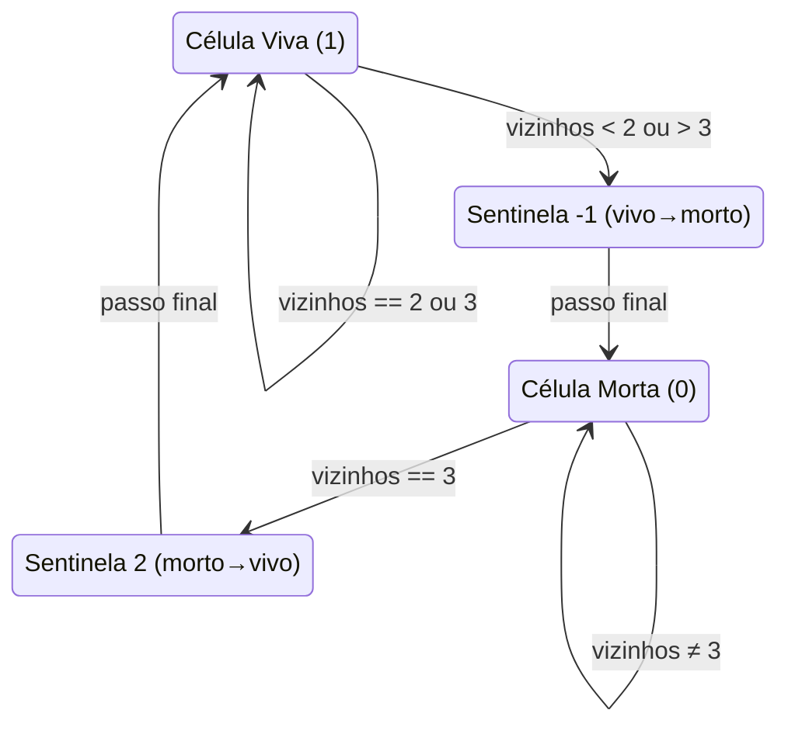
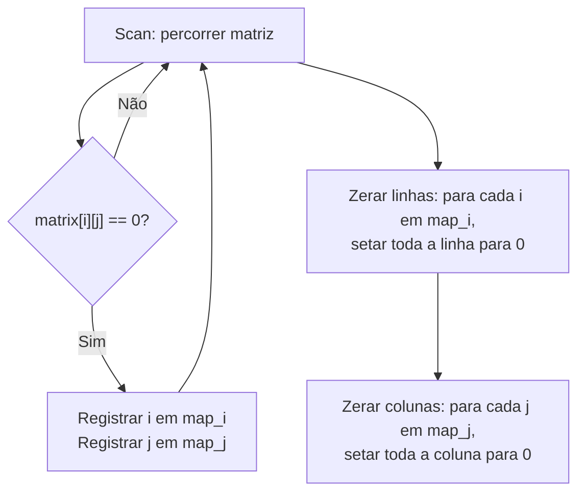
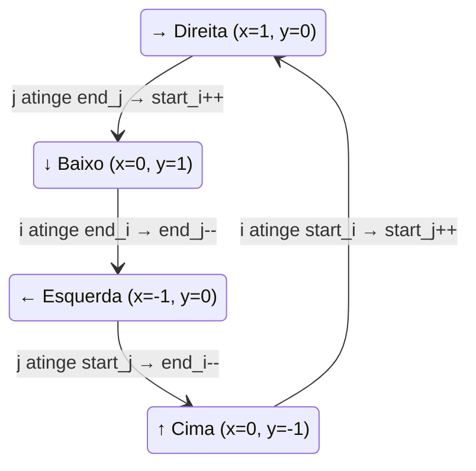

# 🧮 Matrix — Cheat Sheet de Revisão

---

### 📌 Game of Life (`game_of_life.py`) — [LeetCode 289](https://leetcode.com/problems/game-of-life/) | Dificuldade: **Medium** | Tópicos: **Array, Matrix, Simulation**
* **Descrição do problema:** O [Jogo da Vida](https://en.wikipedia.org/wiki/Conway%27s_Game_of_Life) é um **autômato celular** criado pelo matemático John Horton Conway em 1970. É um jogo de "zero jogadores" — dado um estado inicial, a evolução é inteiramente determinada pelas regras, sem nenhuma interação posterior. Dada uma matriz `m x n` (o "tabuleiro") onde cada célula vale `1` (viva) ou `0` (morta), compute o **próximo estado** (próxima geração) do tabuleiro aplicando as 4 regras abaixo **simultaneamente** a todas as células. A atualização deve ser feita **in-place** (sem criar uma cópia da matriz).

  **Regras do Jogo da Vida:**
  1. Célula **viva** com **< 2** vizinhos vivos → **morre** (sub-população / underpopulation).
  2. Célula **viva** com **2 ou 3** vizinhos vivos → **sobrevive** para a próxima geração.
  3. Célula **viva** com **> 3** vizinhos vivos → **morre** (superpopulação / overpopulation).
  4. Célula **morta** com **exatamente 3** vizinhos vivos → **nasce** (reprodução).

  Cada célula interage com seus **8 vizinhos** (horizontal, vertical e diagonal). Todas as transições ocorrem ao mesmo tempo — o próximo estado de uma célula não deve influenciar o cálculo do próximo estado das demais.

  **Constraints:**
  - `m == board.length`
  - `n == board[i].length`
  - `1 <= m, n <= 25`
  - `board[i][j]` é `0` ou `1`

  **Follow-up:**
  - É possível resolver in-place garantindo atualização simultânea?
  - E se o tabuleiro fosse **infinito**, como lidar com células vivas que atingem a borda do array?

  **Exemplos:**
  ```
  Exemplo 1:
  Entrada: board = [[0,1,0],      Saída: board = [[0,0,0],
                    [0,0,1],                       [1,0,1],
                    [1,1,1],                       [0,1,1],
                    [0,0,0]]                       [0,1,0]]

  Exemplo 2:
  Entrada: board = [[1,1],        Saída: board = [[1,1],
                    [1,0]]                         [1,1]]
  ```
* **💡 Sacada (O Pulo do Gato):**
  > Usar valores sentinela para codificar **dois estados ao mesmo tempo** (estado atual + próximo estado) em uma única célula. `-1` = estava vivo, vai morrer; `2` = estava morto, vai viver. Assim, ao contar vizinhos vivos, basta checar `abs(valor) == 1` para saber quem **era** vivo originalmente, sem precisar de uma cópia da matriz.
* **🧠 Modelo Mental:**

* **Complexidade esperada:** ⏱️ Tempo $O(m \times n)$ | 💾 Espaço $O(1)$ (in-place com sentinelas).
* **Edge cases (Casos de Borda):**
  - Células nos cantos/bordas possuem menos de 8 vizinhos — tratado com `max(0, i-1)` e `min(m, i+2)` para limitar o range.
  - Matriz 1×1 — a célula não tem vizinhos, logo se estiver viva, morre (0 vizinhos < 2).
* **Core snippet:**
```python
def gameOfLife(self, board):
    m, n = len(board), len(board[0])
    for i in range(m):
        for j in range(n):
            side_count = self.count_cells(i, j, m, n, board)
            if board[i][j] == 1 and (side_count < 2 or side_count > 3):
                board[i][j] = -1
            elif board[i][j] == 0 and side_count == 3:
                board[i][j] = 2
    for i in range(m):
        for j in range(n):
            if board[i][j] == 2:
                board[i][j] = 1
            elif board[i][j] == -1:
                board[i][j] = 0
```

---

### 📌 Set Matrix Zeroes (`set_matrix_zeroes.py`) — [LeetCode 73](https://leetcode.com/problems/set-matrix-zeroes/) | Dificuldade: **Medium** | Tópicos: **Array, Hash Table, Matrix**
* **Descrição do problema:** Dada uma matriz `m x n` de inteiros, se qualquer elemento `matrix[i][j]` for `0`, **toda a linha `i`** e **toda a coluna `j`** devem ser preenchidas com `0`. A modificação deve ser feita **in-place**, sem usar uma matriz auxiliar completa.

  O desafio central é evitar a **propagação em cascata**: ao zerar uma posição durante a varredura, aquele novo zero não deve ser tratado como um zero original e causar mais linhas/colunas a serem zeradas indevidamente. Por isso, é necessário primeiro **identificar** todas as posições originais com zero e só depois **aplicar** as modificações.

  **Constraints:**
  - `m == matrix.length`
  - `n == matrix[0].length`
  - `1 <= m, n <= 200`
  - $-2^{31}$ `<= matrix[i][j] <=` $2^{31} - 1$

  **Follow-up (3 níveis de otimização):**
  - Uma solução direta usa $O(m \times n)$ de espaço extra — isso é subótimo.
  - Uma melhoria simples usa $O(m + n)$ (guardar quais linhas e colunas devem ser zeradas).
  - Você consegue fazer com $O(1)$ de espaço? (Dica: usar a **primeira linha** e **primeira coluna** da própria matriz como "flags", com uma variável extra para resolver a sobreposição em `matrix[0][0]`.)

  **Exemplos:**
  ```
  Exemplo 1:
  Entrada: matrix = [[1,1,1],      Saída: matrix = [[1,0,1],
                     [1,0,1],                       [0,0,0],
                     [1,1,1]]                       [1,0,1]]

  Exemplo 2:
  Entrada: matrix = [[0,1,2,0],    Saída: matrix = [[0,0,0,0],
                     [3,4,5,2],                      [0,4,5,0],
                     [1,3,1,5]]                      [0,3,1,0]]
  ```
* **💡 Sacada (O Pulo do Gato):**
  > Primeiro fazer um **scan completo** mapeando em dicionários quais linhas e quais colunas contêm zeros. Depois, em dois passes separados, zerar todas as linhas mapeadas e todas as colunas mapeadas. Isso evita o problema de "zerar em cascata" — onde um zero recém-colocado faria zerar mais linhas/colunas indevidamente.
* **🧠 Modelo Mental:**

* **Complexidade esperada:** ⏱️ Tempo $O(m \times n)$ | 💾 Espaço $O(m + n)$ (dicionários de linhas e colunas).
* **Edge cases (Casos de Borda):**
  - Matriz sem nenhum zero — os dicionários ficam vazios, nada é modificado.
  - Matriz inteira de zeros — todas as linhas e colunas são mapeadas e tudo permanece zero.
  - Múltiplos zeros na mesma linha/coluna — o dicionário naturalmente deduplica.
* **Core snippet:**
```python
def setZeroes(self, matrix):
    map_i, map_j = {}, {}
    for i in range(len(matrix)):
        for j in range(len(matrix[0])):
            if matrix[i][j] == 0:
                map_i[i] = True
                map_j[j] = True
    for row_idx in map_i:
        for col in range(len(matrix[0])):
            matrix[row_idx][col] = 0
    for col_idx in map_j:
        for row in range(len(matrix)):
            matrix[row][col_idx] = 0
```

---

### 📌 Spiral Matrix (`spiral_matrix.py`) — [LeetCode 54](https://leetcode.com/problems/spiral-matrix/) | Dificuldade: **Medium** | Tópicos: **Array, Matrix, Simulation**
* **Descrição do problema:** Dada uma matriz `m x n` de inteiros, retornar uma lista contendo **todos os seus elementos** na ordem de percurso em **espiral no sentido horário**, começando pelo canto superior esquerdo.

  O percurso segue o padrão: **→ direita** ao longo da linha superior, **↓ baixo** pela coluna direita, **← esquerda** ao longo da linha inferior, **↑ cima** pela coluna esquerda, e então repete para a camada interna seguinte até visitar todos os elementos. É essencialmente um problema de **simulação** — "descascar" a matriz camada por camada, de fora para dentro.

  **Constraints:**
  - `m == matrix.length`
  - `n == matrix[i].length`
  - `1 <= m, n <= 10`
  - `-100 <= matrix[i][j] <= 100`

  **Problemas relacionados:** [Spiral Matrix II](https://leetcode.com/problems/spiral-matrix-ii/) (Medium), [Spiral Matrix III](https://leetcode.com/problems/spiral-matrix-iii/) (Medium), [Spiral Matrix IV](https://leetcode.com/problems/spiral-matrix-iv/) (Medium)

  **Exemplos:**
  ```
  Exemplo 1:
  Entrada: matrix = [[1,2,3],       Saída: [1,2,3,6,9,8,7,4,5]
                     [4,5,6],
                     [7,8,9]]

  Percurso visual (3x3):
  1 → 2 → 3
            ↓
  4 → 5   6
  ↑       ↓
  7 ← 8 ← 9

  Exemplo 2:
  Entrada: matrix = [[1,2,3,4],     Saída: [1,2,3,4,8,12,11,10,9,5,6,7]
                     [5,6,7,8],
                     [9,10,11,12]]
  ```
* **💡 Sacada (O Pulo do Gato):**
  > Manter **quatro fronteiras** (`start_i`, `end_i`, `start_j`, `end_j`) que vão se contraindo a cada volta completa da espiral. Usar variáveis de **direção** (`x_direction`, `y_direction`) para controlar o sentido do percurso: ao bater em uma fronteira, girar 90° no sentido horário e encolher a fronteira correspondente.
* **🧠 Modelo Mental:**

* **Complexidade esperada:** ⏱️ Tempo $O(m \times n)$ | 💾 Espaço $O(1)$ (excluindo o array de saída).
* **Edge cases (Casos de Borda):**
  - Matriz com uma única linha ou coluna — a espiral se reduz a um percurso linear.
  - Matriz 1×1 — retorna o único elemento.
  - Matriz não-quadrada (ex: 3×4) — as fronteiras se fecham de forma assimétrica, tratado pela condição `while start_i <= end_i and start_j <= end_j`.
* **Core snippet:**
```python
def spiralOrder(self, matrix):
    start_i, end_i = 0, len(matrix) - 1
    start_j, end_j = 0, len(matrix[0]) - 1
    i, j = 0, 0
    response = []
    x_direction, y_direction = 1, 0
    while start_i <= end_i and start_j <= end_j:
        response.append(matrix[i][j])
        if x_direction == 1 and j == end_j:
            x_direction, y_direction = 0, 1
            start_i += 1
        elif y_direction == 1 and i == end_i:
            x_direction, y_direction = -1, 0
            end_j -= 1
        elif x_direction == -1 and j == start_j:
            x_direction, y_direction = 0, -1
            end_i -= 1
        elif y_direction == -1 and i == start_i:
            x_direction, y_direction = 1, 0
            start_j += 1
        i, j = i + y_direction, j + x_direction
    return response
```
