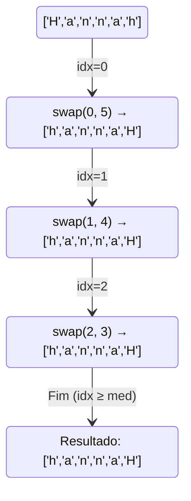
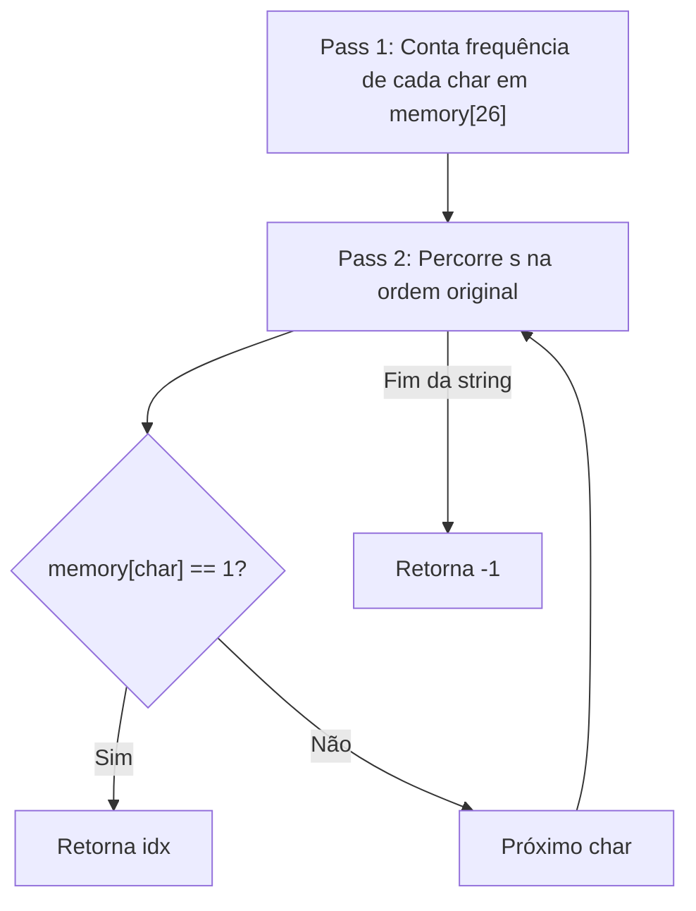
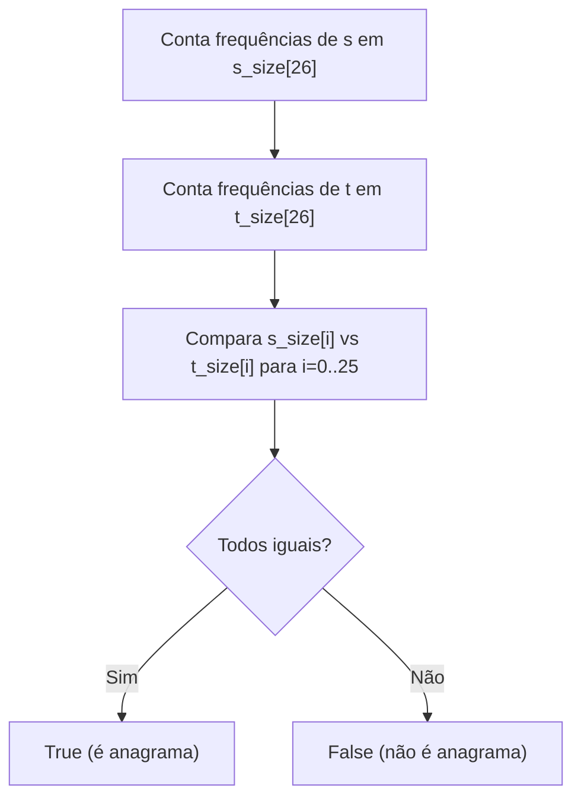
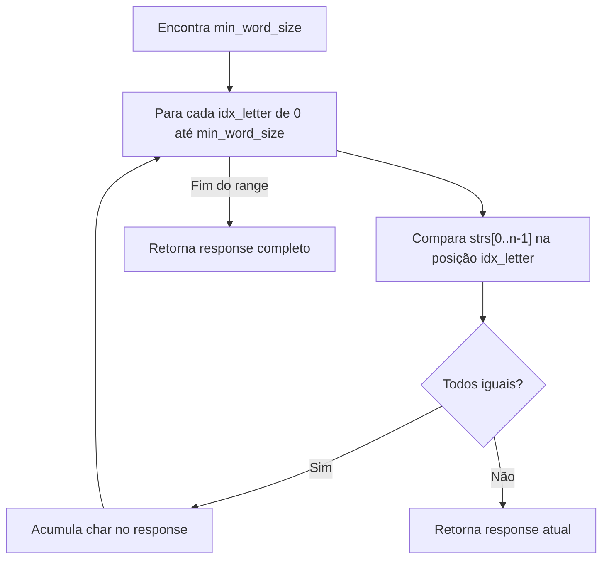
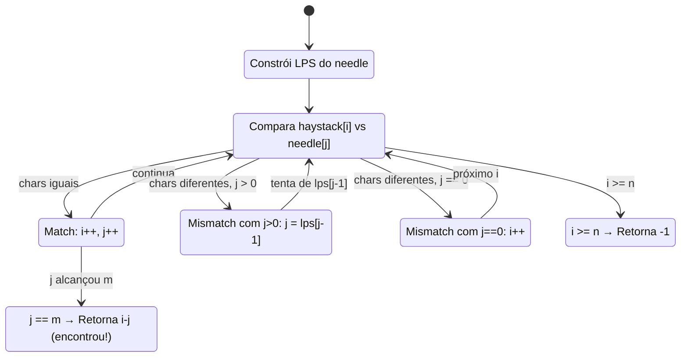
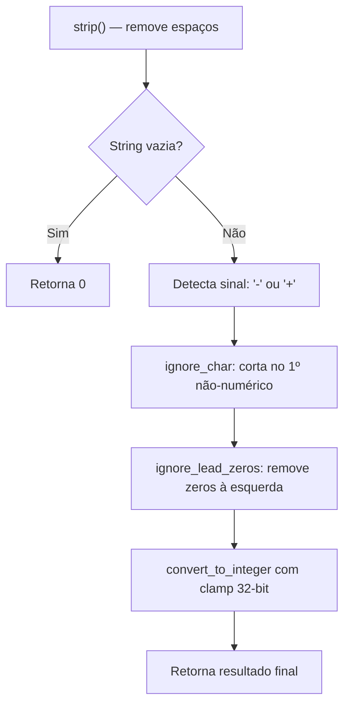

# 🧵 Strings — Cheat Sheet de Revisão

---

### 📌 Reverse String (`reverse_string.py`) — [LeetCode 344](https://leetcode.com/problems/reverse-string/) (Easy)
* **Enunciado:** Escreva uma função que inverta uma string. A entrada é dada como um **array de caracteres** `s`. Você deve fazer isso **modificando o array in-place**, com uso de memória extra $O(1)$.
* **Exemplos:**
  * `s = ["h","e","l","l","o"]` → `["o","l","l","e","h"]`
  * `s = ["H","a","n","n","a","h"]` → `["h","a","n","n","a","H"]`
* **Constraints:** `1 <= s.length <= 10⁵`; `s[i]` é um caractere ASCII imprimível.
* **Tópicos:** Two Pointers, String
* **💡 Sacada (O Pulo do Gato):**
> Técnica clássica de **dois ponteiros convergentes**. Um ponteiro começa no início e outro no fim; a cada passo, troca os elementos e ambos caminham em direção ao centro. Só precisa iterar até a metade do array.
* **🧠 Modelo Mental:**

* **Complexidade esperada:** ⏱️ Tempo $O(n)$ | 💾 Espaço $O(1)$.
* **Edge cases (Casos de Borda):** String com 1 caractere (nenhuma troca necessária); string vazia (loop não executa).
* **Core snippet:**
```python
def reverseString(self, s: list[str]) -> None:
    size = len(s)
    med_size = size // 2
    for idx in range(med_size):
        temp = s[idx]
        s[idx] = s[size - idx - 1]
        s[size - idx - 1] = temp
```

---

### 📌 First Unique Character in a String (`first_unique_char.py`) — [LeetCode 387](https://leetcode.com/problems/first-unique-character-in-a-string/) (Easy)
* **Enunciado:** Dada uma string `s`, encontre o **primeiro caractere que não se repete** e retorne seu **índice**. Se nenhum caractere único existir, retorne `-1`.
* **Exemplos:**
  * `s = "leetcode"` → `0` (o `'l'` é o primeiro caractere único)
  * `s = "loveleetcode"` → `2` (o `'v'` é o primeiro caractere único)
  * `s = "aabb"` → `-1` (todos os caracteres se repetem)
* **Constraints:** `1 <= s.length <= 10⁵`; `s` consiste apenas de letras minúsculas do alfabeto inglês.
* **Tópicos:** Hash Table, String, Queue, Counting
* **💡 Sacada (O Pulo do Gato):**
> Usar um **vetor de frequência de tamanho fixo (26)** para contar ocorrências de cada letra. Depois, percorrer a string original novamente e retornar o índice do primeiro caractere com contagem 1. Duas passagens lineares, espaço constante.
* **🧠 Modelo Mental:**

* **Complexidade esperada:** ⏱️ Tempo $O(n)$ | 💾 Espaço $O(1)$ (vetor fixo de 26).
* **Edge cases (Casos de Borda):** Todos os caracteres repetem (retorna `-1`); string com um único caractere (retorna `0`).
* **Core snippet:**
```python
def firstUniqChar(self, s: str) -> int:
    memory = [0 for _ in range(26)]
    for letter in s:
        memory[ord(letter) - ord('a')] += 1
    for idx, letter in enumerate(s):
        if memory[ord(letter) - ord('a')] == 1:
            return idx
    return -1
```

---

### 📌 Valid Anagram (`valid_anagram.py`) — [LeetCode 242](https://leetcode.com/problems/valid-anagram/) (Easy)
* **Enunciado:** Dadas duas strings `s` e `t`, retorne `true` se `t` for um **anagrama** de `s`, e `false` caso contrário. Um anagrama é uma palavra formada reorganizando as letras de outra, usando **todas** as letras originais **exatamente uma vez**.
* **Exemplos:**
  * `s = "anagram", t = "nagaram"` → `true`
  * `s = "rat", t = "car"` → `false`
* **Constraints:** `1 <= s.length, t.length <= 5 × 10⁴`; `s` e `t` consistem apenas de letras minúsculas do alfabeto inglês.
* **Follow-up:** E se as entradas contiverem caracteres Unicode? Como você adaptaria sua solução?
* **Tópicos:** Hash Table, String, Sorting
* **💡 Sacada (O Pulo do Gato):**
> Criar **dois vetores de frequência de 26 posições**, um para cada string. Comparar elemento a elemento. Se todos forem iguais, é anagrama. A alternativa de ordenar custa $O(n \log n)$; esta abordagem é $O(n)$.
* **🧠 Modelo Mental:**

* **Complexidade esperada:** ⏱️ Tempo $O(n)$ | 💾 Espaço $O(1)$ (dois vetores fixos de 26).
* **Edge cases (Casos de Borda):** Strings de tamanhos diferentes (poderiam ser verificadas antecipadamente para retornar `False` direto); strings vazias (ambas vazias → `True`).
* **Core snippet:**
```python
def isAnagram(self, s: str, t: str) -> bool:
    t_size = [0 for _ in range(26)]
    s_size = [0 for _ in range(26)]
    for letter in s:
        s_size[ord(letter) - ord('a')] += 1
    for letter in t:
        t_size[ord(letter) - ord('a')] += 1
    for s, t in zip(s_size, t_size):
        if s != t:
            return False
    return True
```

---

### 📌 Longest Common Prefix (`longest_common_prefix.py`) — [LeetCode 14](https://leetcode.com/problems/longest-common-prefix/) (Easy)
* **Enunciado:** Escreva uma função para encontrar a **string de maior prefixo comum** entre um array de strings. Se não houver prefixo comum, retorne uma string vazia `""`.
* **Exemplos:**
  * `strs = ["flower","flow","flight"]` → `"fl"`
  * `strs = ["dog","racecar","car"]` → `""` (não há prefixo comum)
* **Constraints:** `1 <= strs.length <= 200`; `0 <= strs[i].length <= 200`; `strs[i]` consiste apenas de letras minúsculas do alfabeto inglês.
* **Tópicos:** String, Trie
* **💡 Sacada (O Pulo do Gato):**
> Comparação **vertical coluna a coluna**. Para cada posição de caractere (limitada pelo tamanho da menor palavra), compara o caractere de todas as strings. Se alguma divergir, retorna o prefixo acumulado até o momento. Simples e eficiente.
* **🧠 Modelo Mental:**

* **Complexidade esperada:** ⏱️ Tempo $O(S)$ onde $S$ = soma de todos os caracteres | 💾 Espaço $O(1)$ (excluindo saída).
* **Edge cases (Casos de Borda):** Array com uma única string (ela própria é o prefixo); alguma string vazia (prefixo é `""`); nenhum caractere em comum (retorna `""` imediatamente).
* **Core snippet:**
```python
def longestCommonPrefix(self, strs: List[str]) -> str:
    response = ""
    min_word_size = min(map(lambda x: len(x), strs))
    for idx_letter in range(min_word_size):
        for idx_word in range(len(strs) - 1):
            if strs[idx_word][idx_letter] != strs[idx_word + 1][idx_letter]:
                return response
        response += strs[0][idx_letter]
    return response
```

---

### 📌 Find the Index of the First Occurrence in a String — KMP (`str_str.py`) — [LeetCode 28](https://leetcode.com/problems/find-the-index-of-the-first-occurrence-in-a-string/) (Easy)
* **Enunciado:** Dadas duas strings `needle` e `haystack`, retorne o **índice da primeira ocorrência** de `needle` em `haystack`, ou `-1` se `needle` não fizer parte de `haystack`. Implementado aqui com o algoritmo **KMP (Knuth-Morris-Pratt)**.
* **Exemplos:**
  * `haystack = "sadbutsad", needle = "sad"` → `0` (`"sad"` ocorre nos índices 0 e 6; a primeira ocorrência é no índice 0)
  * `haystack = "leetcode", needle = "leeto"` → `-1` (`"leeto"` não ocorre em `"leetcode"`)
* **Constraints:** `1 <= haystack.length, needle.length <= 10⁴`; ambas as strings consistem apenas de caracteres minúsculos do alfabeto inglês.
* **Tópicos:** Two Pointers, String, String Matching
* **💡 Sacada (O Pulo do Gato):**
> O KMP constrói a tabela **LPS (Longest Prefix which is also Suffix)** do padrão. Quando há um _mismatch_, ao invés de voltar `j` para `0`, volta para `lps[j-1]` — reaproveitando o que já foi comparado. Isso elimina comparações redundantes e garante $O(n+m)$.
* **🧠 Modelo Mental:**

* **Complexidade esperada:** ⏱️ Tempo $O(n + m)$ | 💾 Espaço $O(m)$ (tabela LPS).
* **Edge cases (Casos de Borda):** `needle` vazio (retorna `0`); `needle` maior que `haystack` (retorna `-1`); padrão com muitos prefixos repetidos (é onde o KMP brilha vs. força bruta).
* **Core snippet:**
```python
def get_lps(self, pattern: str) -> list[int]:
    n = len(pattern)
    lps = [0] * n
    j = 0
    i = 1
    while i < n:
        if pattern[i] == pattern[j]:
            j += 1
            lps[i] = j
            i += 1
        else:
            if j != 0:
                j = lps[j - 1]
            else:
                lps[i] = 0
                i += 1
    return lps

def strStr(self, haystack: str, needle: str) -> int:
    m = len(needle)
    j = 0
    n = len(haystack)
    i = 0
    lps = self.get_lps(needle)
    while i < n:
        if needle[j] == haystack[i]:
            i += 1
            j += 1
        if j == m:
            return i - j
        elif i < n and needle[j] != haystack[i]:
            if j != 0:
                j = lps[j - 1]
            else:
                i += 1
    return -1
```

---

### 📌 String to Integer — atoi (`string_to_integer.py`) — [LeetCode 8](https://leetcode.com/problems/string-to-integer-atoi/) (Medium)
* **Enunciado:** Implemente a função `myAtoi(string s)` que converte uma string em um **inteiro de 32 bits com sinal**. O algoritmo segue estas etapas:
  1. **Espaços em branco:** Ignore qualquer espaço em branco no início.
  2. **Sinal:** Verifique se o próximo caractere é `'-'` ou `'+'` para determinar o sinal (assume positivo se nenhum estiver presente).
  3. **Conversão:** Leia dígitos, pulando zeros à esquerda, até encontrar um caractere não-numérico ou o fim da string. Retorne `0` se nenhum dígito for lido.
  4. **Clamping:** Restrinja o resultado ao intervalo de inteiro com sinal de 32 bits: $[-2^{31},\ 2^{31} - 1]$, ou seja, `[-2147483648, 2147483647]`.
* **Exemplos:**
  * `s = "42"` → `42`
  * `s = " -042"` → `-42`
  * `s = "1337c0d3"` → `1337` (para no caractere não-numérico `'c'`)
  * `s = "0-1"` → `0` (para no `'-'` que não é dígito)
  * `s = "words and 987"` → `0` (primeiro caractere não é dígito nem sinal)
* **Constraints:** `0 <= s.length <= 200`; `s` consiste de letras inglesas (maiúsculas e minúsculas), dígitos (`0-9`), espaço (`' '`), mais (`'+'`), menos (`'-'`) e ponto (`'.'`).
* **Tópicos:** String
* **💡 Sacada (O Pulo do Gato):**
> É um problema de **parsing com máquina de estados implícita**: strip espaços → detecta sinal → ignora caracteres não numéricos → ignora zeros à esquerda → converte para inteiro com clamp em $[-2^{31}, 2^{31}-1]$. A chave é tratar cada etapa separadamente em funções auxiliares. Atenção especial aos inúmeros edge cases listados no comentário do código.
* **🧠 Modelo Mental:**

* **Complexidade esperada:** ⏱️ Tempo $O(n)$ | 💾 Espaço $O(n)$ (slicing de strings).
* **Edge cases (Casos de Borda):** `"+1"`, `"-42a"`, `"+-1"`, `"-"`, `""`, `"000003"`, `"abcoi"`, `"123 abc"`, `"abc 123"` — todos tratados pelas funções auxiliares. Overflow clamped para limites de 32-bit.
* **Core snippet:**
```python
def myAtoi(self, s: str) -> int:
    s = s.strip()
    if s == '':
        return 0
    is_minus = self.is_minus(s)
    has_positive = self.has_positive_sign(s)
    if is_minus or has_positive:
        s = s[1:]
    s = self.ignore_char(s)
    s = self.ignore_lead_zeros(s)
    return self.convert_to_integer(s, is_minus)
```
