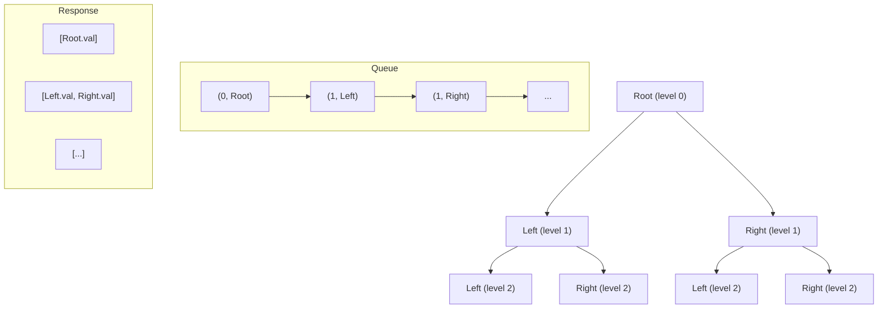
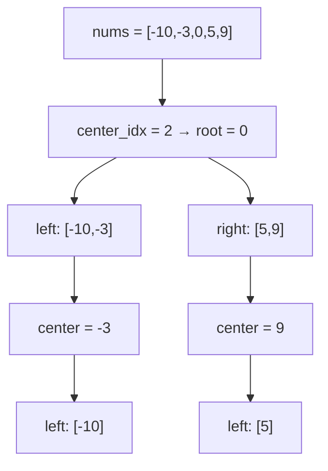
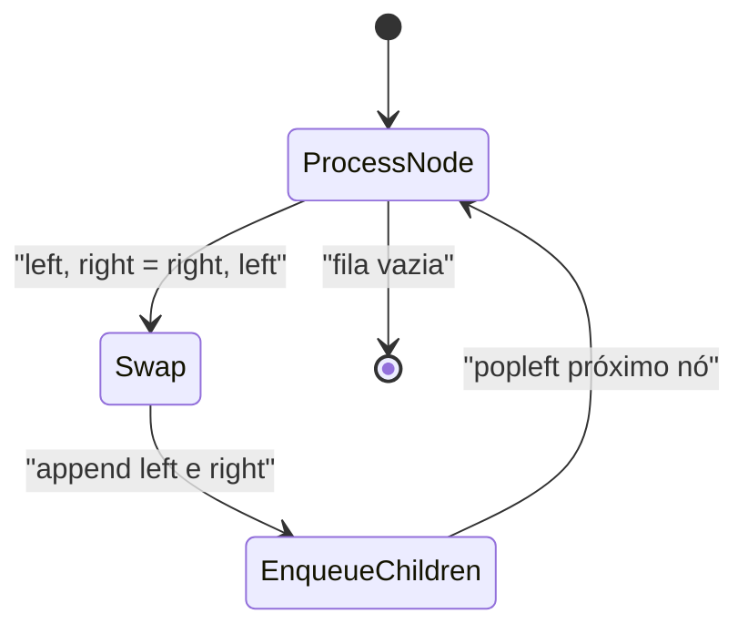
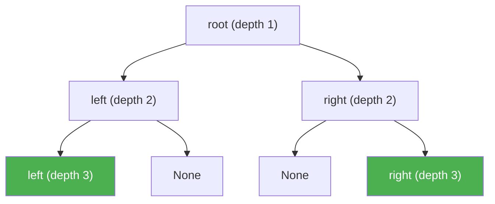
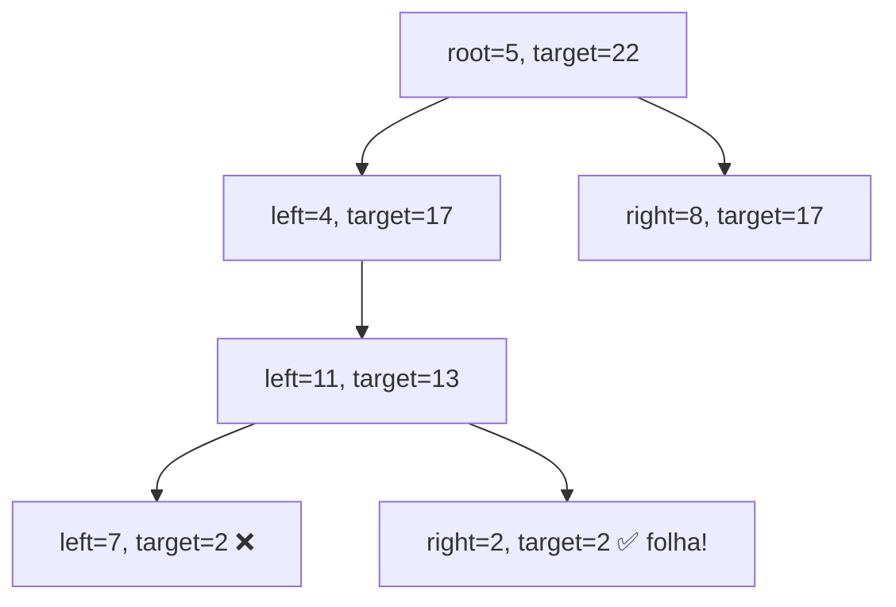
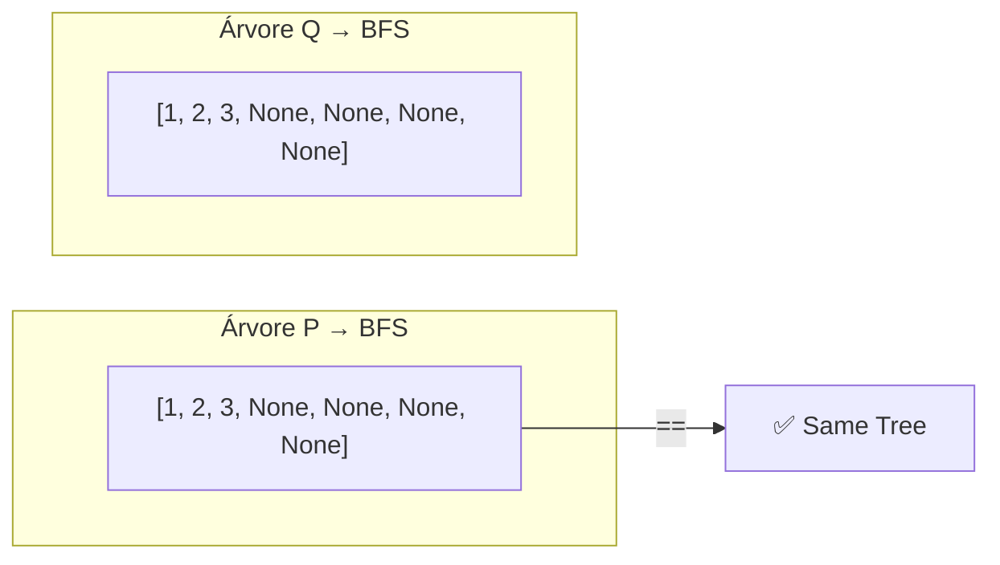
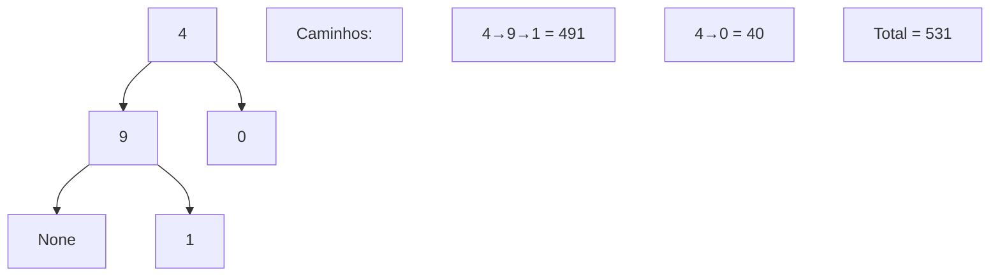
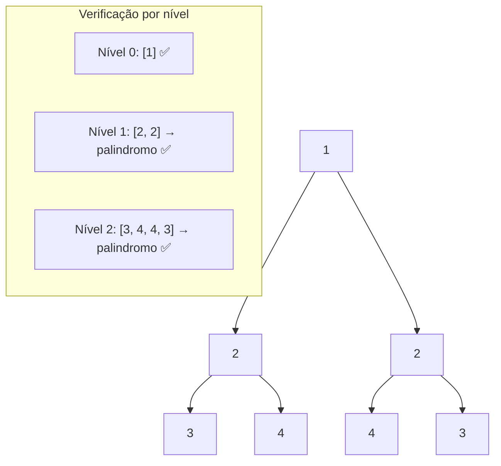
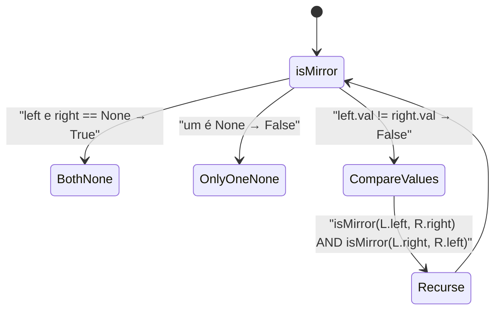
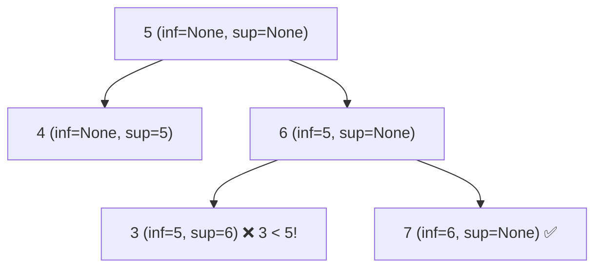

# 🌳 Trees — Cheat Sheet de Flashcards

---

### 📌 102. Binary Tree Level Order Traversal (`Binary_Tree_Level_Order_Traversal.py`) — Medium
* **Enunciado oficial:** Dada a raiz (`root`) de uma árvore binária, retorne a travessia em ordem de nível (*level order traversal*) dos valores de seus nós — ou seja, da esquerda para a direita, nível por nível, agrupando os valores em sublistas.
* **Exemplos:**
  - `Input: root = [3,9,20,null,null,15,7]` → `Output: [[3],[9,20],[15,7]]` — a raiz 3 está no nível 0, os nós 9 e 20 no nível 1, e 15 e 7 no nível 2.
  - `Input: root = [1]` → `Output: [[1]]` — árvore com um único nó retorna uma lista com uma sublista.
  - `Input: root = []` → `Output: []` — árvore vazia retorna lista vazia.
* **Restrições:** O número de nós está no intervalo `[0, 2000]`. `-1000 <= Node.val <= 1000`.
* **Contexto:** Este é um padrão clássico de BFS em árvores, muito cobrado em entrevistas pois serve de base para variações como zigzag traversal, right side view e average of levels. Tópicos: Tree, Breadth-First Search, Binary Tree.
* **💡 Sacada (O Pulo do Gato):**
  > Usar BFS com uma fila (`deque`) onde cada elemento é uma tupla `(level, node)`. Ao processar cada nó, comparamos o `level` com o tamanho da lista de resposta: se `len(response) == level`, criamos uma nova sublista; caso contrário, adicionamos ao último nível existente.
* **🧠 Modelo Mental:**

* **Complexidade esperada:** ⏱️ Tempo $O(n)$ | 💾 Espaço $O(n)$
* **Edge cases (Casos de Borda):** Árvore vazia (`root == None`) — retorna lista vazia. Árvore com um único nó — retorna `[[val]]`.
* **Core snippet:**
```python
def levelOrder(self, root):
    response = []
    if root is None:
        return response
    queue = deque([(0, root)])
    while queue:
        level, current_node = queue.popleft()
        if current_node.left:
            queue.append((level + 1, current_node.left))
        if current_node.right:
            queue.append((level + 1, current_node.right))
        if len(response) == level:
            response.append([current_node.val])
        else:
            response[-1].append(current_node.val)
    return response
```

---

### 📌 108. Convert Sorted Array to Binary Search Tree (`convert_sorted_array.py`) — Easy
* **Enunciado oficial:** Dado um array de inteiros `nums` ordenado em ordem estritamente crescente, converta-o em uma árvore binária de busca (**BST**) **balanceada em altura**. Uma BST balanceada em altura é aquela em que a diferença de profundidade entre as sub-árvores esquerda e direita de **qualquer** nó é no máximo 1.
* **Exemplos:**
  - `Input: nums = [-10,-3,0,5,9]` → `Output: [0,-3,9,-10,null,5]` — o elemento central 0 vira a raiz, -3 e 9 são filhos, -10 e 5 são netos. Outras respostas válidas são aceitas (e.g. `[0,-10,5,null,-3,null,9]`).
  - `Input: nums = [1,3]` → `Output: [3,1]` ou `[1,null,3]` — ambas são BSTs balanceadas válidas.
* **Restrições:** `1 <= nums.length <= 10⁴`. `-10⁴ <= nums[i] <= 10⁴`. `nums` está ordenado em ordem estritamente crescente.
* **Contexto:** O problema é fundamental para entender a relação entre arrays ordenados e BSTs, e aparece como sub-rotina em reconstrução de árvores balanceadas. Tópicos: Array, Divide and Conquer, Tree, Binary Search Tree, Binary Tree.
* **💡 Sacada (O Pulo do Gato):**
  > Dividir e conquistar: o elemento central do array vira a raiz, garantindo que metade dos elementos fique à esquerda e metade à direita, mantendo a árvore balanceada. Aplicar recursivamente para as sub-arrays esquerda e direita.
* **🧠 Modelo Mental:**

* **Complexidade esperada:** ⏱️ Tempo $O(n)$ | 💾 Espaço $O(\log n)$ (pilha de recursão)
* **Edge cases (Casos de Borda):** Array vazio — retorna `None`. Array com 1 elemento — retorna nó folha. A divisão inteira `//` garante o centro correto para arrays de tamanho par.
* **Core snippet:**
```python
def sortedArrayToBST(self, nums):
    if len(nums) == 0:
        return None
    if len(nums) == 1:
        return TreeNode(nums[0])
    center_idx = len(nums) // 2
    center_node = TreeNode(nums[center_idx])
    center_node.right = self.sortedArrayToBST(nums[center_idx + 1:])
    center_node.left = self.sortedArrayToBST(nums[:center_idx])
    return center_node
```

---

### 📌 226. Invert Binary Tree (`invert_binary_tree.py`) — Easy
* **Enunciado oficial:** Dada a raiz (`root`) de uma árvore binária, inverta a árvore e retorne sua raiz. Inverter significa trocar recursivamente todos os filhos esquerdos com os direitos em cada nó, produzindo a imagem espelhada da árvore original.
* **Exemplos:**
  - `Input: root = [4,2,7,1,3,6,9]` → `Output: [4,7,2,9,6,3,1]` — cada par de filhos é trocado em todos os níveis.
  - `Input: root = [2,1,3]` → `Output: [2,3,1]` — os filhos 1 e 3 são trocados.
  - `Input: root = []` → `Output: []` — árvore vazia permanece vazia.
* **Restrições:** O número de nós está no intervalo `[0, 100]`. `-100 <= Node.val <= 100`.
* **Contexto:** Um dos problemas mais clássicos e introdutórios de manipulação de árvores, famoso por ser simples mas revelador sobre o domínio de recursão/BFS. Tópicos: Tree, Depth-First Search, Breadth-First Search, Binary Tree.
* **💡 Sacada (O Pulo do Gato):**
  > Usar BFS com uma fila. Para cada nó, basta trocar `node.left` e `node.right` com um swap direto em Python. O truque é que, ao fazer o swap antes de enfileirar os filhos, a árvore é invertida nível a nível.
* **🧠 Modelo Mental:**

* **Complexidade esperada:** ⏱️ Tempo $O(n)$ | 💾 Espaço $O(n)$
* **Edge cases (Casos de Borda):** Nó `None` é tratado com `continue`, evitando erro ao acessar filhos de nós nulos. Árvore vazia retorna `None`.
* **Core snippet:**
```python
def invertTree(self, root):
    queue = deque([root])
    while queue:
        node = queue.popleft()
        if node is None:
            continue
        node.left, node.right = node.right, node.left
        queue.append(node.left)
        queue.append(node.right)
    return root
```

---

### 📌 104. Maximum Depth of Binary Tree (`max_binary_tree.py`) — Easy
* **Enunciado oficial:** Dada a raiz (`root`) de uma árvore binária, retorne sua **profundidade máxima**. A profundidade máxima de uma árvore binária é o número de nós ao longo do caminho mais longo da raiz até o nó folha mais distante.
* **Exemplos:**
  - `Input: root = [3,9,20,null,null,15,7]` → `Output: 3` — o caminho mais longo é 3→20→15 (ou 3→20→7), com 3 nós.
  - `Input: root = [1,null,2]` → `Output: 2` — caminho 1→2 tem profundidade 2.
  - `Input: root = []` → `Output: 0` — árvore vazia tem profundidade 0.
  - `Input: root = [0]` → `Output: 1` — nó único tem profundidade 1.
* **Restrições:** O número de nós está no intervalo `[0, 10⁴]`. `-100 <= Node.val <= 100`.
* **Contexto:** Problema introdutório essencial de travessia de árvores (DFS ou BFS), frequentemente usado como aquecimento em entrevistas. Tópicos: Tree, Depth-First Search, Breadth-First Search, Binary Tree.
* **💡 Sacada (O Pulo do Gato):**
  > Busca em profundidade (DFS) incrementando um contador de `current_depth` a cada nível. Atualizar `max_depth` sempre que a profundidade atual superar o máximo registrado.
* **🧠 Modelo Mental:**

* **Complexidade esperada:** ⏱️ Tempo $O(n)$ | 💾 Espaço $O(h)$ onde $h$ é a altura da árvore (pilha de recursão)
* **Edge cases (Casos de Borda):** Árvore vazia (`root == None`) — `dfs` retorna imediatamente e `max_depth` permanece 0. Árvore linear (todos os nós em um lado) resulta em profundidade $n$.
* **Core snippet:**
```python
def dfs(self, root, current_depth):
    if root is None:
        return
    current_depth += 1
    if current_depth > self.max_depth:
        self.max_depth = current_depth
    self.dfs(root.left, current_depth)
    self.dfs(root.right, current_depth)

def maxDepth(self, root):
    self.max_depth = 0
    self.dfs(root, 0)
    return self.max_depth
```

---

### 📌 112. Path Sum (`path_sum.py`) — Easy
* **Enunciado oficial:** Dada a raiz (`root`) de uma árvore binária e um inteiro `targetSum`, retorne `true` se a árvore possui um caminho da raiz até uma folha (*root-to-leaf path*) cuja soma de todos os valores ao longo do caminho seja exatamente igual a `targetSum`. Um **nó folha** é aquele que não possui filhos.
* **Exemplos:**
  - `Input: root = [5,4,8,11,null,13,4,7,2,null,null,null,1], targetSum = 22` → `Output: true` — o caminho `5→4→11→2` soma exatamente 22.
  - `Input: root = [1,2,3], targetSum = 5` → `Output: false` — os caminhos são `1→2` (soma 3) e `1→3` (soma 4), nenhum soma 5.
  - `Input: root = [], targetSum = 0` → `Output: false` — árvore vazia não possui nenhum caminho raiz-folha.
* **Restrições:** O número de nós está no intervalo `[0, 5000]`. `-1000 <= Node.val <= 1000`. `-1000 <= targetSum <= 1000`.
* **Contexto:** O problema testa a habilidade de propagar estado (soma acumulada) em travessias recursivas de árvore. Tópicos: Tree, Depth-First Search, Breadth-First Search, Binary Tree.
* **💡 Sacada (O Pulo do Gato):**
  > Subtrair o valor do nó atual de `targetSum` à medida que desce a árvore. Ao chegar em uma folha, basta verificar se `targetSum == root.val`. O problema se reduz recursivamente a: "existe um caminho na sub-árvore esquerda OU direita com soma `targetSum - root.val`?"
* **🧠 Modelo Mental:**

* **Complexidade esperada:** ⏱️ Tempo $O(n)$ | 💾 Espaço $O(h)$ (pilha de recursão)
* **Edge cases (Casos de Borda):** Árvore vazia — retorna `False`. Nó com apenas um filho: não é folha, deve continuar descendo. `targetSum == 0` com árvore vazia retorna `False`.
* **Core snippet:**
```python
def hasPathSum(self, root, targetSum):
    if root is None:
        return False
    if root.left is None and root.right is None:
        return targetSum == root.val
    return self.hasPathSum(root.left, targetSum - root.val) or \
           self.hasPathSum(root.right, targetSum - root.val)
```

---

### 📌 100. Same Tree (`same_tree.py`) — Easy
* **Enunciado oficial:** Dadas as raízes de duas árvores binárias `p` e `q`, escreva uma função para verificar se elas são iguais ou não. Duas árvores binárias são consideradas **iguais** se forem **estruturalmente idênticas** e os nós correspondentes tiverem o **mesmo valor**.
* **Exemplos:**
  - `Input: p = [1,2,3], q = [1,2,3]` → `Output: true` — mesma estrutura e mesmos valores em todas as posições.
  - `Input: p = [1,2], q = [1,null,2]` → `Output: false` — estrutura diferente: em `p` o 2 é filho esquerdo, em `q` é filho direito.
  - `Input: p = [1,2,1], q = [1,1,2]` → `Output: false` — mesma estrutura, mas valores diferentes nas posições correspondentes.
* **Restrições:** O número de nós em ambas as árvores está no intervalo `[0, 100]`. `-10⁴ <= Node.val <= 10⁴`.
* **Contexto:** O problema serve como base para entender comparação recursiva de árvores, sendo sub-rotina de problemas como Symmetric Tree e Subtree of Another Tree. Tópicos: Tree, Depth-First Search, Breadth-First Search, Binary Tree.
* **💡 Sacada (O Pulo do Gato):**
  > Serializar ambas as árvores usando BFS em listas (incluindo `None` para nós ausentes) e comparar as duas listas elemento por elemento. Se as listas forem iguais, as árvores são idênticas.
* **🧠 Modelo Mental:**

* **Complexidade esperada:** ⏱️ Tempo $O(n)$ | 💾 Espaço $O(n)$
* **Edge cases (Casos de Borda):** Árvores com tamanhos diferentes são detectadas pela comparação de tamanhos das listas. Nós `None` são incluídos na serialização para distinguir estruturas como `[1, 2]` vs `[1, None, 2]`.
* **Core snippet:**
```python
def isSameTree(self, p, q):
    def serialize(root):
        result = []
        queue = deque([root])
        while queue:
            node = queue.popleft()
            if node is None:
                result.append(None)
                continue
            result.append(node.val)
            queue.append(node.left)
            queue.append(node.right)
        return result
    return serialize(p) == serialize(q)
```

---

### 📌 129. Sum Root to Leaf Numbers (`sum_root_leaf_numbers.py`) — Medium
* **Enunciado oficial:** Dada a raiz (`root`) de uma árvore binária contendo **apenas dígitos de 0 a 9**, cada caminho da raiz até uma folha representa um número inteiro. Por exemplo, o caminho `1→2→3` representa o número 123. Retorne a **soma total** de todos os números representados por caminhos raiz-até-folha. Um nó folha é aquele que não possui filhos.
* **Exemplos:**
  - `Input: root = [1,2,3]` → `Output: 25` — caminhos: `1→2` = 12, `1→3` = 13. Soma = 12 + 13 = 25.
  - `Input: root = [4,9,0,5,1]` → `Output: 1026` — caminhos: `4→9→5` = 495, `4→9→1` = 491, `4→0` = 40. Soma = 495 + 491 + 40 = 1026.
* **Restrições:** O número de nós está no intervalo `[1, 1000]`. `0 <= Node.val <= 9`. A profundidade da árvore não excederá 10. A resposta cabe em um inteiro de 32 bits.
* **Contexto:** O problema exercita DFS com acúmulo de estado ao longo do caminho, um padrão recorrente em entrevistas. Tópicos: Tree, Depth-First Search, Binary Tree.
* **💡 Sacada (O Pulo do Gato):**
  > DFS carregando o `path` (lista de valores) acumulado. Ao chegar em uma folha, converter a lista de dígitos no número correspondente usando potências de 10 e somar ao total global.
* **🧠 Modelo Mental:**

* **Complexidade esperada:** ⏱️ Tempo $O(n \cdot h)$ | 💾 Espaço $O(h)$ (pilha de recursão + cópias do path)
* **Edge cases (Casos de Borda):** Nó com apenas um filho — continua recursão apenas pelo filho existente, sem tratar como folha. Path é copiado antes de descer para evitar mutação compartilhada.
* **Core snippet:**
```python
def get_sum(self, root, path):
    if root.left is None and root.right is None:
        count = 0
        for idx in range(len(path) - 1, -1, -1):
            count += path[idx] * 10 ** (len(path) - idx - 1)
        self.total += count
        return
    if root.left:
        self.get_sum(root.left, path + [root.left.val])
    if root.right:
        self.get_sum(root.right, path + [root.right.val])

def sumNumbers(self, root):
    self.total = 0
    self.get_sum(root, [root.val])
    return self.total
```

---

### 📌 101. Symmetric Tree — Iterative (`symetric_Tree_iterative.py`) — Easy
* **Enunciado oficial:** Dada a raiz (`root`) de uma árvore binária, verifique se ela é um **espelho de si mesma** — ou seja, simétrica em torno do seu eixo central.
* **Exemplos:**
  - `Input: root = [1,2,2,3,4,4,3]` → `Output: true` — a árvore é simétrica: o nível 1 tem [2,2] e o nível 2 tem [3,4,4,3], ambos palíndromos.
  - `Input: root = [1,2,2,null,3,null,3]` → `Output: false` — não é simétrica: o nível 2 é [null,3,null,3], que não é palíndromo considerando posições.
* **Restrições:** O número de nós está no intervalo `[1, 1000]`. `-100 <= Node.val <= 100`.
* **Contexto:** Esta versão resolve o problema de forma **iterativa** usando BFS nível a nível e verificando se cada nível é um palíndromo. Demonstra como evitar recursão para problemas de simetria. Tópicos: Tree, Depth-First Search, Breadth-First Search, Binary Tree.
* **💡 Sacada (O Pulo do Gato):**
  > BFS nível a nível, armazenando os valores de cada nível (incluindo `None`). Antes de iniciar um novo nível, verificar se o nível anterior é um palíndromo — isto é, comparar o primeiro com o último, o segundo com o penúltimo, etc. Se algum nível não for palíndromo, a árvore não é simétrica.
* **🧠 Modelo Mental:**

* **Complexidade esperada:** ⏱️ Tempo $O(n)$ | 💾 Espaço $O(n)$
* **Edge cases (Casos de Borda):** Árvore vazia retorna `True`. Nós `None` são representados como `None` na lista do nível para garantir que a posição estrutural seja verificada, não apenas os valores.
* **Core snippet:**
```python
def isSymmetric(self, root):
    response = []
    if root is None:
        return True
    queue = deque([(0, root)])
    while queue:
        level, current_node = queue.popleft()
        if current_node is not None:
            queue.append((level + 1, current_node.left))
            queue.append((level + 1, current_node.right))
        val = current_node.val if current_node else None
        if len(response) == level:
            if response:
                i, j = 0, len(response[-1]) - 1
                while i < j:
                    if response[-1][i] != response[-1][j]:
                        return False
                    i += 1; j -= 1
            response.append([val])
        else:
            response[-1].append(val)
    return True
```

---

### 📌 101. Symmetric Tree — Recursive (`symetric_tree_recursive.py`) — Easy
* **Enunciado oficial:** Mesmo problema (#101): dada a raiz de uma árvore binária, verifique se ela é um espelho de si mesma (simétrica em torno do centro). Mesmos exemplos e restrições acima.
* **Contexto:** Esta versão usa uma abordagem **recursiva** elegante com a função auxiliar `isMirror` que compara diretamente nós espelhados. É a solução mais idiomática e limpa, frequentemente preferida em entrevistas por sua clareza e concisão.
* **💡 Sacada (O Pulo do Gato):**
  > Criar uma função auxiliar `isMirror(left, right)` que compara dois nós espelhados. Dois nós são espelhos se têm o mesmo valor E `left.left` é espelho de `right.right` E `left.right` é espelho de `right.left`. Base: ambos `None` → `True`; apenas um `None` → `False`.
* **🧠 Modelo Mental:**

* **Complexidade esperada:** ⏱️ Tempo $O(n)$ | 💾 Espaço $O(h)$ (pilha de recursão)
* **Edge cases (Casos de Borda):** Raiz nula retorna `True`. Quando apenas um dos lados é `None`, retorna `False`. Comparação cruzada `left.left↔right.right` garante verificação de espelhamento, não apenas igualdade.
* **Core snippet:**
```python
def isMirror(self, left, right):
    if left is None and right is None:
        return True
    if left is None or right is None or left.val != right.val:
        return False
    return self.isMirror(left.left, right.right) and \
           self.isMirror(left.right, right.left)

def isSymmetric(self, root):
    if root is None:
        return True
    return self.isMirror(root.left, root.right)
```

---

### 📌 98. Validate Binary Search Tree (`validate_binary_search_tree.py`) — Medium
* **Enunciado oficial:** Dada a raiz (`root`) de uma árvore binária, determine se ela é uma **BST (Binary Search Tree) válida**. Uma BST válida é definida assim: (1) A sub-árvore **esquerda** de um nó contém apenas nós com chaves **menores que** a chave do nó. (2) A sub-árvore **direita** contém apenas nós com chaves **maiores que** a chave do nó. (3) Tanto a sub-árvore esquerda quanto a direita devem também ser BSTs válidas.
* **Exemplos:**
  - `Input: root = [2,1,3]` → `Output: true` — 1 < 2 < 3, BST válida.
  - `Input: root = [5,1,4,null,null,3,6]` → `Output: false` — o nó 4 é filho direito de 5, mas 4 < 5. Além disso, o nó 3 está na sub-árvore direita de 5 mas 3 < 5.
* **Restrições:** O número de nós está no intervalo `[1, 10⁴]`. `-2³¹ <= Node.val <= 2³¹ - 1`.
* **Contexto:** Problema clássico que testa se o candidato entende a propriedade **global** (e não apenas local) de uma BST — não basta verificar apenas os filhos diretos, é preciso propagar limites. Tópicos: Tree, Depth-First Search, Binary Search Tree, Binary Tree.
* **💡 Sacada (O Pulo do Gato):**
  > Não basta verificar apenas o filho direto — é preciso propagar limites (inferior e superior). Ao descer para a **esquerda**, o valor atual se torna o novo **limite superior**. Ao descer para a **direita**, o valor atual se torna o novo **limite inferior**. Se o nó violar qualquer limite, a árvore é inválida.
* **🧠 Modelo Mental:**

* **Complexidade esperada:** ⏱️ Tempo $O(n)$ | 💾 Espaço $O(h)$ (pilha de recursão)
* **Edge cases (Casos de Borda):** Valores iguais entre pai e filho são considerados inválidos (usa `>=` e `<=` nas comparações). Limites `None` representam "sem restrição" (primeira chamada). Árvore com nó único é sempre válida.
* **Core snippet:**
```python
def get_valid_bst(self, root, inferior_limit, superior_limit):
    if root is None:
        return
    if (root.right and root.right.val <= root.val) or \
       (root.left and root.left.val >= root.val):
        self.valid_bst = False
    if (superior_limit is not None and root.val >= superior_limit) or \
       (inferior_limit is not None and root.val <= inferior_limit):
        self.valid_bst = False
    self.get_valid_bst(root.left, inferior_limit, root.val)
    self.get_valid_bst(root.right, root.val, superior_limit)

def isValidBST(self, root):
    self.valid_bst = True
    self.get_valid_bst(root, None, None)
    return self.valid_bst
```
